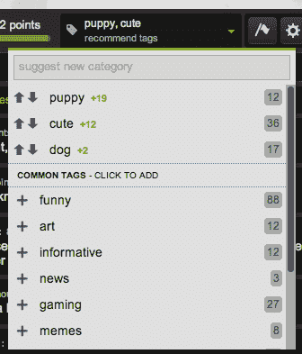

# 内幕:Imgur 透露重新设计，宣布会议计划

> 原文：<http://observer.com/2014/07/inside-look-imgur-reveals-redesign-announces-plans-for-a-convention/?utm_source=wanqu.co&utm_campaign=Wanqu+Daily&utm_medium=website>

Imgur’s Sarah Schaaf, IRL. (Photo via Imgur)

Imgur 正处于一个转折点。

这个最初为 Reddit 用户提供照片存储的网站，在短短五年内成长为一个蓬勃发展的社区，流量几乎是其实际母网站的两倍，每月浏览量达到 50 亿次。

但是在技术领域，一个经过验证的模型并不总是足够的。该网站今天早上首次推出了重新设计。他们还在计划一系列面对面的活动和会议，这都要归功于最近注入的 4000 万美元风险投资资金。很明显，Imgur 正在努力成为 Instagram 或 Twitter 级别的社交媒体主食。

随着他们开始扩大业务范围，Imgur 面临着熟悉的挑战，即必须在发展公司的同时保持给他们带来成功的古怪身份。Imgur 背后的团队知道，如果他们想在规模越来越大的时候保持他们紧密团结的社区，他们需要提供的不仅仅是一堆迷因和一个向上投票按钮。

为了实现这一目标，他们必须平衡社区的突发奇想和业务需求，并希望这两者能够共存。

* * *

几周前，Imgur 创始人艾伦·沙夫(Alan Schaaf)来到镇上，他接受了 Betabeat 的采访，向我们展示了新 Imgur 的定制之旅。新的外观比旧的网站要干净一点，旧的网站已经有五年的历史了，没有太大的变化。

该网站整体看起来更整洁，但最大的调整是添加了标签。在重新设计之前，所有的图片都放在一个巨大的海洋中，当天最受欢迎的内容放在头版，作为 lulzberg 的提示。

现在，您可以标记图像，将内容自定义分类到图库和个人过滤器中。例如，如果你是《权力的游戏》的粉丝，你可以创建一个图库，展示任何带有“权力的游戏”、“GoT”、“John Snow”、“你什么都不知道”等标签的内容。

“我们试图给所有这些病毒图片添加一些组织，这样你就可以深入到你想看的图片，跳过其余的，”沙夫说。

标签和过滤器可以让网站对个人用户更有用，而不会把他们分成像脸书小组或子编辑这样的子社区。

[

<noscript></noscript>](https://nyobetabeat.files.wordpress.com/2014/05/screen-shot-2014-07-17-at-7-41-41-am.png) 

Even tags are either upvoted and downvoted. (Screengrab via Imgur)

沙夫先生说，“我们只是想要一个像我们一直拥有的那样有凝聚力的大社区，所以标记只是查看同一个大池的不同方式。”。“你可以专注于猫，但猫的东西仍然在所有其他内容中存活和呼吸。”

毕竟，沙夫先生最不想做的事情就是通过将社区分裂成不同的派别来扰乱社区。为了确保重新设计能让用户满意，他慢慢地建立了新网站，与大约 1 万名铁杆用户一起测试设计，收集反馈，进行调整并完善新功能。

而且，他第一次走出硅谷，来到他的人民中间，听听他们在说什么。Imgur 一直是一个有社区的网站，但只是在过去的几个月里，Imgur 才在全国范围内为该社区举办活动。

“我们知道 Imgur 在规模上是巨大的，但不认为 Imgur 是一个在过去几年里走了这么远的社区，”Imgur 特别倡议负责人 Tim Hwang 告诉 Betabeat。“聚会表明他们欣赏我们，但也是未来的一个迹象。”

那么接下来会发生什么？Imgur 团队希望参加一个大型会议，但直到 12 月份才会准备好细节，尽管他们声称这将是“互联网社区从未做过的事情”。

但是，甚至在 Imgur 团队出现之前，他们的用户已经见面多年，使用直接消息、[脸书团体](https://www.facebook.com/groups/ImguriansUnited/)，甚至[建立完全独立的网站](https://socialsavanna.com)来保持联系。有时，当 Imgurians 人瞥见他们默认的领导人 Sarah Schaaf 时，这些现实生活中的聚会就有了回报。

第一次正式的 Imgur 聚会是在休斯顿大厅，纽约市的啤酒花园，在那里他们庆祝他们对双关语和 lolcats 的热爱。他们中的几个人挤在一边，窃窃私语，并指向房间另一边的卷发韦斯特考斯特。所有的注意力都集中在沙夫身上。

[

<noscript></noscript>](https://nyobetabeat.files.wordpress.com/2014/05/screen-shot-2014-07-17-at-8-05-32-am.png) 

在休斯顿音乐厅，萨拉·沙夫在第一次正式的 Imgur Meetup 上踢回来。(图片 via Imgur)

T9】

“这有点奇怪，就像一个名人时刻，”沙夫女士在纽约时告诉 Betabeat。“但这种感觉会逐渐消失，人们会说‘啊，你是我们中的一员，你很正常。’"

沙夫女士是标志性的(至少对 Imgur 用户来说)“莎拉”，该网站的社区主任。沙夫女士一直是 Imgur 的公众形象，处理数百万人的问题和关切。所以当她出现时，人们会停下来盯着她看也就不足为奇了。

* * *

沙夫女士是艾伦·沙夫的姐姐。当沙夫先生创建 Imgur 时，他独自经营这个网站，当他的弟弟需要建议时，他的妹妹总是在后台。

当沙夫注意到照片的评论区正在形成一个社区时，他叫他的妹妹来担任社区管理员的正式角色。她是一个自然的选择——她有一种 Imgur 的身份感，她有社交媒体的诀窍，而且她一直都在沙夫先生身边。

所以在 2012 年，沙夫女士成为了社区主任，也是 Imgur 的第一名员工，那是在网站开始运营三年之后。从那时起，她从一个大姐姐变成了创始人，变成了一个数百万人社区的大姐姐。她浏览画廊，查看评论，测量用户氛围的温度。

“我只是一张脸，或者一个你可以去找人说话的地方。我只是想让 Imgur 人性化一点，”她说。

但在过去的几个月里，沙夫意识到还需要更多。在评估了 Imgur 的未来后，他开始找人来建立 Imgur 的合作关系和活动。这就是黄先生加入 Imgur 团队的时候，他曾经是 ROFLcon 的联合创始人。

在这家主要由工程师和广告销售人员组成的小公司中，作为面向用户的团队，沙夫和黄先生并肩站在一起，看着庞大的 Imgur 社区，问自己下一个大问题:

我们该拿这些人怎么办？

毕竟，这听起来有些做作，但是“Imgurians”是一个特殊的物种。他们勇敢、积极、支持，并且都是关于 lulz 的。Imgurians 人喜欢猫，不太可能的浪漫，他们自己和爸爸的幽默——双关语几乎总是最受欢迎的评论。

一些互联网社区可能是致命的——任何看过 YouTube 评论的人都可以证明这一点。就连诞生了 Imgur 的社区 Reddit 也因对女性怀有敌意而声名狼藉。但其他论坛和新闻网站评论区特有的愤世嫉俗和尖刻，要么在 Imgur 上消失了，要么被埋没了。Imgurians 人自我监督，否决仇恨者，关注社区的福祉。

| 

* * *

**[绝配](http://betabeat.com/2014/04/imgur-gets-40-million-investment-from-andreessen-horowitz/)**艾伦·沙夫一手创办了 Imgur，并在 5 年时间里保持盈利，没有从投资者那里拿走一分钱。点击此处阅读更多内容安德森·霍洛维茨如何说服 Imgur 接受 4000 万美元。

* * *

 |  |

“人们会发帖说，‘哦，我注意到这个特定用户对每个人都很消极，我只是想让你们知道你们很棒，不要听他们的，’”沙夫女士说。“然后这上了头版，每个人都喜欢‘耶，我们都很棒，那个人*糟透了*’"

每一天，爱情故事和个人成功的故事都混杂在头版的坏运气 Brians 和可爱的动物 gif 中。那些经历了艰难的一周的 Imgurians 人(T1)或经历了重大职业转变的 T2 人(T3)可以站在大众面前，找到源源不断的支持。

但让所有这些快乐如此令人惊讶的是，Imgur 是一个民主国家。没有一组优先用户，很少的审查，除了数以百万计的人投票赞成或反对之外，没有任何东西来监管什么会上升到顶部。或者说，在很大程度上，上升到顶端的是一些互联网上最令人振奋的材料。

“这是规模上的美好，”黄先生说。

所有这些积极因素都会让人上瘾 Imgur 四分之一的流量来自于访问该网站超过 200 次的人，尽管该网站是为了成为一个走走停停的图像转储场而建立的，但几乎 10%的访问持续时间超过半小时。在这个时代，很少有人会先访问网站的主页，再访问它的个人内容，而访问 Imgur 主页的人平均会获得惊人的 44 次额外点击。

但随着规模的扩大，让他们的平台成为一个繁荣的企业的压力也随之而来。经过五年的盈利后， [Imgur 接受了 4000 万美元的风投资金](http://betabeat.com/2014/04/imgur-gets-40-million-investment-from-andreessen-horowitz/)，这意味着它有义务达到这样的规模并实现可观的利润。

新的标签功能正好符合新的使命:Imgur 运行一些轻度广告，但营销人员喜欢针对特定的人口统计数据。例如，向网飞这样的人出售广告空间要比试图出售一个模糊的头版广告位置容易得多。

没有一个网络社区喜欢变化，一个网络社区最不喜欢的变化往往是突然涌入的广告。但是黄先生知道，如果你足够长时间地倾听，社区会让你确切地知道他们想要什么。

* * *

在应用程序的生命中，总有一天，用户群会做意想不到的事情，用你构建的工具做你从未想过要做的事情。

看看 Instagram 就知道了，它最初是一个美化丑陋的手机照片的工具，后来当分享变得流行时，它就建立起了社交功能。或者 Tumblr 最初是如何为博客而建的，后来重新博客的流行使它更像是一个个人剪贴簿和聚合器。

因此，Imgur 的社区团队正在寻找这种“绿灯”——社区使用 Imgur 的工具来展示他们如何希望 Imgur 成为的时刻。

[

<noscript></noscript>](https://nyobetabeat.files.wordpress.com/2014/05/screen-shot-2014-07-17-at-8-07-48-am.png) 

黄蒂姆有建设社区的经验——我们知道他的聘用意味着一场即将到来的大会，但他们只是刚刚证实了这一点。(图片 via Imgur)

T11】

当一名 Imgurian 使用 gallery 功能时，一个大“绿灯”出现了，该功能是为了让用户可以在一个页面上展示几张照片，从而使[成为乌克兰起义的指南](https://imgur.com/gallery/lxkbH)。从那以后，Imgurians [也使用图库功能](http://imgur.com/gallery/bbHPC)来创建食谱综述、生活黑客教程、日常锻炼和时尚指南。

“看到网站从仅仅是有趣的东西，变成拥有重要、严肃的内容，标志着这个社区正在成熟，”黄先生说。

但是 Imgur 团队不想成为一个新闻中心，也不想加入一些功能来迫使他们的社区更多地依赖于新闻和信息。他们已经看到其他网站试图在这个过程中捣乱并疏远用户——看看 Instagram，它一直试图模仿 Snapchat 的蟋蟀声，或者脸书如何在每次更新他们的功能时产生集体嘲笑。

“哲学是采取非常轻的接触，”黄先生说。"弄清楚社区需要什么，并在那里提供帮助."

到目前为止，Imgur 团队很幸运，没有在用户中引发骚乱，但期望这个羽翼未丰的社区成长和成熟，同时保持其年轻、充满活力、积极的品牌完好无损，这似乎有点天真。Imgur 团队只是想向世界展示他们的社区是多么不可思议，而不会变得衰老丑陋。

“一旦人们成为社区的一部分，人们就会意识到 Imgur 不仅仅是模因，”沙夫女士说，“还有很多层面。”

“尽管我会说有趣的猫非常棒，”黄先生说。

沙夫女士说:“哦，有趣的猫永远都很有趣。