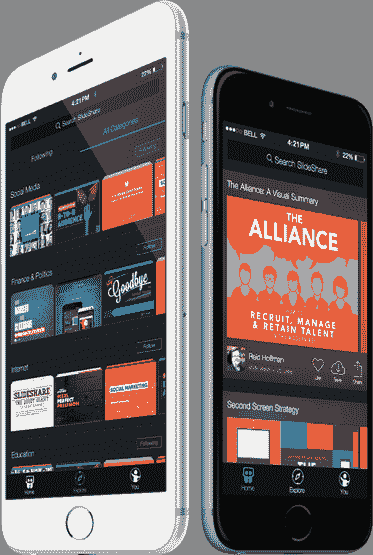

# 我们在 SlideShare | LinkedIn Engineering 的 Swift 体验

> 原文：<https://engineering.linkedin.com/ios/our-swift-experience-slideshare?utm_source=wanqu.co&utm_campaign=Wanqu+Daily&utm_medium=website>

# 介绍

去年秋天，SlideShare 发布了其 1.0 版本的 [SlideShare iOS 应用](https://lnkd.in/ssios)，这是应用商店中少数几个完全由 Swift 构建的应用之一。这部分是由于 Swift 1.0 的发布日期巧合，但使用 Swift 对我们来说是有意义的。这种语言一发布，我们就花了所有的时间阅读所有可用的资料，并尝试使用这种语言。当决定我们是否将 Swift 用于我们的 iOS 应用程序时，新的语言功能和更简洁的语法非常有吸引力，所以我们决定冒险一试。

我们已经在之前的文章中分享了我们对 Swift 和 iOS 功能的总体体验。本文从技术角度更深入地介绍了 Swift 语言的细节，以及我们在开发 [SlideShare iOS 应用](https://lnkd.in/ssios)期间使用 Swift 语言的经验。

# 为什么是 Swift？

我们决定使用 Swift，因为它具有丰富的语法、函数式编程特性以及对安全性的关注。Objective-C 互操作性对我们的决定非常重要，因为我们知道我们希望利用内部 LinkedIn 框架和用 Objective-C 编写的第三方开源代码。通读苹果的书: *[使用 Swift With Cocoa 和 Objective-C](https://developer.apple.com/library/ios/documentation/Swift/Conceptual/BuildingCocoaApps/index.html#//apple_ref/doc/uid/TP40014216-CH2-XID_0)* 后，我们觉得使用这些库将轻而易举。

在 SlideShare，我们快速迭代，所以快速变化的语言对我们来说不是问题。在发布前的两周时间里，我们甚至让我们的 Android 团队成员来帮忙。SlideShare 提倡每个开发人员成为多面手，因此所有开发人员都有使用 Ruby web 应用程序的经验。凭借他们在构建移动应用程序和 Ruby web 应用程序方面的经验，他们仅用几天的平台经验就能在 Swift 中编写功能代码。由于 Swift 与 Ruby 等脚本语言的相似性，它们更容易上手。

# 到底有多快？

我们用 Swift 编写了整个应用程序，只有少数例外。

1.  我们用 Objective-C 编写了一个定制的`UICollectionViewFlowLayout`子类，因为它必须用 Objective-C 编写，以便在当时用于故事板或 xib。
2.  我们用 CocoaPods 引入的开源库
3.  LinkedIn 内部库
4.  Objective-C 中的一个内部核心数据接口，我们用它来高效地线程化核心数据。我们计划在有时间的时候把它转换成 Swift。

# 与 Objective-C 互操作

与 Objective-C 的互操作相当容易。只要给你的桥接头文件添加一个新的头文件，你就可以*大部分*准备好了。当我们与 Objective-C 代码交互时，有两个主要的难点。首先，在处理`NSDictionary`对象时，您失去了 Swift 静态类型的好处。即使您的字典只是一个键是字符串、值是字符串的字典，您仍然需要将它作为一个快速字典来使用，它可以是`[String : AnyObject]`或`[NSObject : AnyObject]` [*1*](#footnote1) 。

第二个潜在的难点是使用 Objective-C 或 C 创建的枚举。如果代码不使用 Apple 提供的`NS_ENUM`或`NS_OPTIONS`宏，Swift 将不会将其转换为正确的 Swift 枚举。但是，如果您使用所提供的宏，Swift 会将它们转换成适当的 Swift 枚举，并使用我们非常喜欢的所有语法糖。由于这些问题，我们需要派生出脸书 SDK，并更改他们的代码，对每个枚举使用`NS_ENUM`，这样我们就可以在 Swift 中正确使用它。

# 早期采用的问题

正如我所说的，我们在测试版 1 的第一天就开始使用 Swift。不用说，处理 SourceKit 的不断崩溃是非常痛苦的，但是这里有一些我们遇到的更具体的问题。一些问题仍然存在。

1.  编译器运行缓慢且占用大量 CPU 资源。在我的 13 英寸 Macbook Pro Retina 上，双核 i7 的功能不够强大，无法快速编译。我的同事拥有配备四核 i7 的 15 英寸机型，他们玩得更开心。不管是哪种，编的时候粉丝声音都挺大的。
2.  当 SourceKit 崩溃时，语法高亮经常会中断。随着每个测试版的推出，这个问题变得越来越好，但在 6.1.1 中似乎又退步了。这似乎经常发生在使用懒惰属性 [*2*](#footnote2) 的时候。
3.  实时语法检查需要一段时间，所以你必须更多地依赖于更频繁地构建，这很慢。
4.  每次新版本的 Xcode 问世，我们都必须重构部分代码以更新语法。重构的时间通常很少:大约半天。不幸的是， [Xcode](https://developer.apple.com/xcode/) 中的重构选项目前还不支持 Swift。然而，对于版本 1.2，有一个对 Swift 1.2 的重构选项，效果相当好。
5.  有几次你会写一些不能编译的东西，它会使整个 IDE 崩溃，有时甚至会使你的整个计算机崩溃。这主要发生在早期的测试版中，但这很令人沮丧，因为我们对这种语言还很陌生，必须在没有任何错误消息的情况下找出错误。

# 你曾经因为斯威夫特遇到过拦网的问题吗？

没有。我们从未遇到过任何我们花了半天多时间解决的问题或错误，结果却是 Swift 的问题。如果 Swift 中有一个 bug，代码要么不能编译，要么使编译器或 [Xcode](https://developer.apple.com/xcode/) 崩溃。在应用程序投入生产后，我们只遇到过一次崩溃，这似乎是 Swift 的一个错误，这种情况不常发生。我在苹果开发者论坛上给[发了这个问题](https://devforums.apple.com/message/1059220#1059220)。

# Swift 语法和功能

## 句法

对于熟悉 Ruby 或 Python 等脚本语言的开发人员来说，Swift 语法非常容易理解。甚至我们的设计师也觉得在 Swift [*3*](#footnote3) 中改变参数很舒服。语法非常简单，它摆脱了 Objective-C 或 C++等语言中的所有弊端。这方面的一个很好的例子是 Objective-C 块语法对 Swift 闭包:

https://gist.github.com/drumnkyle/c2fd8d7c58380e0a91a4.js

在编写 Swift 时，我从来没有真正发现自己在为不同的语言特性查找语法，因为语法非常自然且易于理解。处理大量的嵌套选项有时会有点麻烦，但是代码仍然非常易读。

## 无商标消费品

泛型是一个有用的特性，我们在创建可以处理多种类型的实用方法时使用过。我们发现它们有助于生成类型安全的泛型代码，我们可以在许多情况下重用这些代码。尽管我们已经使用了很多泛型，但我仍然觉得我们没有充分发挥它们的潜力。将来我们会研究更多使用泛型重构代码的方法。

## 运算符重载

运算符重载是一个激烈争论的话题。我们还没有重载一个操作符或者创建自己的操作符。然而，我有 C++的背景，所以我肯定看到了操作符重载的优点，并且我认为它在某些时候会对我们有用。但是，由于代码可读性的问题，我没有看到我们创建许多自定义操作符。在编写 Objective-C 代码时，我曾多次希望我有操作符重载，所以现在我很高兴有了这种能力。当使用自定义类型时，运算符重载应该允许更一致、更简洁的代码。

# 安全功能

## 选项

正确和安全地使用选项使我们能够消除应用程序中的一整类崩溃。

## If 语句需要大括号

这是一个简单的特性，但是我们发现这是一个非常重要的特性，它消除了一整类潜在的错误。许多开发人员有试图使代码紧凑的习惯，这个特性确保了不会由于这个习惯而引入 bug。

## 初始化

(苹果公司的)Swift book 有相当大的一部分超过了初始化。你一定要花时间通读几遍这本书的那一部分，以便清楚地理解它。在初始化是否应该如此具体和复杂的问题上，我们内部有一些分歧，但我们发现它可以防止错误，这些错误可能是由于不正确的初始化或其他开发人员试图将初始化器添加到其他人编写的类中而发生的。

添加失败的初始化器非常重要，这也是 Swift 1.0 中初始化所缺少的。到目前为止，我们对这些功能的体验是有限的，因为该功能是最近才发布的。不幸的是，它似乎没有被完全冲走。我们将对它们进行更多的试验，并尝试用它们来完全取代所需的类方法，因为初始化可能会因输入而失败。

## Switch 语句

Swift 中的 Switch 语句比 C++或 Java 等其他语言更强大，也更安全。默认情况下，switch 语句中的 cases 不会失败，这是一个简单且更安全的特性。Swift 还要求通过特定案例或违约来捕获所有案例。如果不处理每种情况，您将会遇到编译错误。这是帮助开发人员确保没有未定义行为的另一个重大变化。由于这些变化和一些特性，如模式匹配，我们在大多数情况下更喜欢使用 switch 语句，而不是 if/else 语句。你可以在我们的 [Swift 风格指南](https://github.com/SlideShareInc/swift-style-guide)中看到更多。

## 静态打字

对所有内容进行静态类型化消除了由于假设某个数据类型在一个集合中而产生的问题。

## 安全铸造

在 Swift 中进行强制转换时，开发人员有两种选择:开发人员可以使用`as`关键字强制转换为特定类型。如果强制转换失败，因为指定的类型不是正在转换的类型的后代，应用程序将崩溃。开发人员可以选择添加一个`?`到 as 中，以便让语句返回一个`Optional`，如果不能进行强制转换，那么这个`?`将是`nil`。为了避免这些崩溃，我们要求在代码中使用`as?`。

## 访问控制

在 Objective-C 中，基本上可以使用技术让开发人员知道什么是私有的，比如在实现文件的类扩展中声明私有方法和变量。另一方面，Swift 使用`public`、`private`和`internal`关键字使访问控制实际上是可执行的。这是一个很好的安全特性，因为它不允许不恰当的使用或子类化你的类。类似地，`final`关键字可以用来禁止某些方法的子类化。

# 语言的缺点

## 闭包中的单行 Return 语句

当您有一个实际的单行闭包时，这个特性很好，但是当您有一些返回您不关心的值时，它会引起问题。为了解决由此导致的问题，您需要添加一个空白回车或用另一种方法解决它。我们发现总是需要 return 关键字会更好，更一致。这一问题在实践中的一个例子如下:

https://gist.github.com/drumnkyle/403660367045a1fd6048.js

使用可选的链接方法添加。一个对象或方法实际上会返回值，因此，闭包中单行 return 语句的特性，使得编译器推断有返回值而不是 Void like 是必需的。因此，我们添加了一个 nothing 返回来修复编译问题。

## 缺少一些有用的动态特性

我们没有发现我们错过了太多 Objective-C 的动态特性，但是有一个特别明显。当编写一些核心数据`NSManagedObject`子类的帮助方法时，我们找不到一种方法来定义一个具有自身返回类型的类中的方法，如果在子类的上下文中调用，该方法将返回子类的类型。这是受《魔法记录》中实现的一些类别的启发。实际上，这只是让您在调用方法时不必强制转换到正确的子类，这其实没什么大不了的。我的编码尝试如下:

https://gist.github.com/drumnkyle/eb9a36aac5f186cd76c7.js

## 参数命名

函数、方法和初始化器中使用参数名的方式是混乱和不统一的。在一个方法中，你可以为你的参数取一个外部名字，或者从参数的顺序中暗示出来(如在 C/C++中)。如果他们能保持一致就好了，但是现在，你已经习惯了。如果它第一次没有做到你想要的，你在前面加一个外部名称或者一个#号。更多信息请看我的要点:

https://gist.github.com/drumnkyle/1ed7ac767e9f9a50d2f6.js

# 结束语

我们发现在 Swift 中编写新的 SlideShare iOS 应用程序的体验总体上非常成功。LinkedIn 和 SlideShare 愿意冒险使用一种全新的语言进行开发，这很好，我们相信收益远远超过了成本。请随时直接在 [Twitter](https://www.twitter.com/drumnkyle) 或 [LinkedIn](http://www.linkedin.com/in/kyledsherman) 上联系我，并立即查看 [SlideShare iOS 应用程序](https://lnkd.in/ssios)！

## 脚注

 对于`NSDictionary`必须使用`[String : AnyObject]`或`[NSObject : AnyObject]`的原因是密钥必须是可散列的。Swift `String`和`NSObject`都实现了`Hashable`协议。如果你创建了自己的类型或者扩展了另一个类型，并且想把它作为字典中的一个键，你必须实现`Hashable`协议。

我们将会发表另一篇关于开发者与设计师合作的文章。