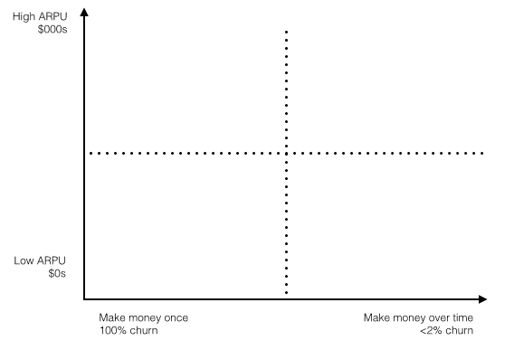
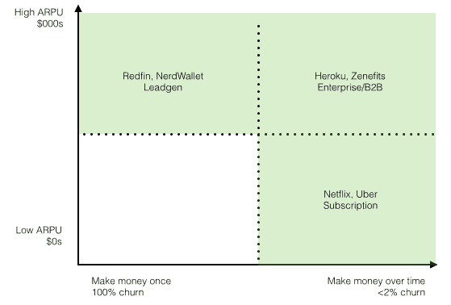

# 为什么投资者不资助安德鲁森的约会

> 原文：<http://andrewchen.co/why-investors-dont-fund-dating/?utm_source=wanqu.co&utm_campaign=Wanqu+Daily&utm_medium=website>

[T2】](http://andrewchen.co/wp-content/uploads/2015/05/40_2665847b.jpg)

我一直在听播客[初创公司](http://gimletmedia.com/show/startup/episodes/)的精彩第二季，它深入了解了 YCombinator 初创公司[约会圈](https://www.datingring.com/) (NYT 报道[此处](http://www.nytimes.com/2015/04/23/business/smallbusiness/start-up-blends-old-fashioned-matchmaking-and-algorithms.html))。剧集都很棒。他们谈论了许多重要的话题，但我对约会产品的筹款有一些具体的评论**。**

这里有一个简单的事实:获得主流硅谷投资者资助的约会产品超级困难，即使这是 20 多岁的企业家最喜欢的创业类别。有一大批天使/基金断然拒绝投资约会类别，就像许多人拒绝投资游戏、硬件、赌博等一样。也许他们会为像 CoffeeMeetsBagel(我是顾问)或 Tinder 这样的突破破例，但总的来说，约会应用吸引人们的兴趣是一场艰苦的战斗。这里是[一些数据](https://www.cbinsights.com/blog/dating-startup-venture-capital-funding/)关于一些已经提高的约会 cos。

显然，任何一个在约会领域创建新公司的人都应该试着理解这个领域的投资者偏见。这篇文章也是对前一篇关于运营的文章的补充，作者是 HowAboutWe 联合创始人 Aaron Schildkrout，现在在优步，他也写了自己的经历。

以下是投资者不约会的原因:

*   内置搅拌器
*   约会是有保质期的
*   付费获取渠道价格昂贵
*   一个城市接一个城市的扩张糟透了
*   很难退出
*   与投资者的人口不匹配

我们来分解一下。

**内置客户流失** 客户流失很糟糕，你的约会产品越好，你的客户就会流失越多。每一个被搅动的顾客都是一个新的顾客，你必须获得这个新的顾客才能回到平衡。当你看到网飞或 Hulu 等成功的订阅服务时，你可能会发现每月的流失率为 2-5%,你可以通过以下方式计算每年的流失率:

> **年流失率= 1-(1-churn_rate)^12**
> 2%月流失率= 1-(1-0.02)^12 = 21%年流失率
> 10%月流失率= 1-(1-0.1)^12 = 70%年流失率

如果你有 70%的年流失率，你必须有一个每年替换几乎整个客户群的策略，加上一堆百分点来推动顶线增长。你可以想象为什么成功的 SaaS 上市公司试图将他们的月流失率保持在 2%以下。

那么，约会产品的流失率是怎样的呢？我听说每月高达 20-30%的数字。让我们计算一下:

20%的月流失率= 1-(1-0.2)^12 = 93%的年流失率

你没看错。这意味着在每月 20%的流失率下，很难留住你现有的客户，更不用说用足够多的新客户来填补漏斗顶端的业务增长了。吓人。

对于大多数订阅产品，你对产品改进得越多，你的客户流失就越少。有了约会产品，你在传递约会和匹配方面做得越好，他们就变得越多！正如你可能想象的那样，这产生了错误的动机。像 Tinder 这样专注于休闲约会的产品可能会摆脱这种困境，但约会产品通常都有不可避免的内在波动。

约会是小众的，有保质期的
所有这些变动都因约会市场在任何特定时间都是小众的这一事实而变得尤为复杂。类似于买车，为你的学生贷款再融资，或者搬进一所新房子，现实是作为一个单身的人“在市场上”寻找其他人有一个有限的时间窗口。另一种说法是约会和购物一样有“意图”，尤其是当你谈论付费订阅服务的时候。这限制了市场规模，也限制了你可以用来了解这些消费者的营销渠道的类型。

一个类似的挑战是，这些产品不像 Skype 或脸书那样具有“社会性”。虽然这种耻辱很快就过去了，但这并不像消费者想注册一个约会网站，然后邀请他们的朋友和家人加入他们的网站。在这种情况下，它更类似于金融或健康产品，需要一些隐私。

同样，新一代移动约会产品解决这一问题的方法之一是，它们是免费的，而且更注重休闲约会。这两个因素向更广泛的受众开放了市场，减少了流失，并为病毒式增长创造了机会。

**付费获取渠道昂贵**
约会产品历来依靠付费获取渠道来建立客户群，其他订阅产品一般也是如此。为了实现投资回报，你必须计算你的客户获取成本(CAC)与你的终身价值(LTV ),并确保你赚了足够的钱来支持营销和运营。在 SaaS，你会试图获得 3 倍的 CAC:LTV 比率，但这为公司带来了一些利润——一家约会初创公司可能会让它更接近金属，以获得最初的增长。

以下是购买客户产品的几种情况:

*   一次赚很多钱(例如:汽车/保险/贷款/抵押贷款)
*   长时间赚点小钱(存储、流媒体音乐等。)
*   先赚点小钱，然后长时间增加收入(SaaS)

这是一个形象化的例子:

[T2】](http://andrewchen.co/wp-content/uploads/2015/05/77kthIJwcPC_a1LFuUoDcA6x3oy9mNP7r7CIh23guQ4.png)

当你开始填写这张图表时，你可以看到一些事情:

[T2】](http://andrewchen.co/wp-content/uploads/2015/05/Re5F75xIToCuGtpvgpYdQBO8gfIL0uQikuX4UhLn-k.png)

首先，你会观察到，当然“理想”的情况可能看起来像一个超低流失率的企业，同时从每个客户那里产生大量的收入。然而，市场规模可能比其他市场小得多。风险投资家 Christoph Janz 是 Zendesk 的初始投资者，他写了一篇关于这个主题的文章，名为[打造 1 亿美元企业的五种方式](http://christophjanz.blogspot.com/2014/10/five-ways-to-build-100-million-business.html)，其中谈到了市场规模是一个问题。

但是回到约会——它去哪里了？问题是，它与价格低于 50 美元/月的消费者订阅产品有一些相同的经济性，但同时，超高的客户流失率看起来像是一次性产品。很难建立一个高 LTV，因此付费频道变得棘手。

同样，这是新的手机约会应用程序擅长的领域。他们有能力利用有机的病毒/口碑安装，由于其消息传递功能而具有超强的粘性，免费安装意味着无限的广告支出回报(ROAS)。与此同时，他们对非正式约会的关注降低了流失率，他们可以通过微交易赚钱。这是一种更有吸引力的不同模式。

一个城市接一个城市的扩张糟透了
约会产品本质上依赖于当地市场，启动一系列市场非常困难，而且成本高昂。人们愿意旅行相见，但也只有这么多。而且需要有正确的男女参与者组合(或者任何有意义的排列)。为了实现这一目标，每个城市都需要像按需服务一样快速发展，这也是本地扩张成本高昂且不可扩展的原因之一。

这就是为什么我们经常看到约会产品不断地在一个城市举行一系列不可扩展的活动/聚会/等等来让事情进行下去。直到有了口碑，有了足够多的人来产生高质量的体验，市场才会变得糟糕。但是进展缓慢。

与年长的已婚投资者的人口不匹配
约会解决了一个对 18-35 岁未婚者来说最普遍、最尖锐的问题。大多数能开支票的投资者(相对于合伙人)年龄较大，已婚，有孩子。通常他们几十年来都不需要和任何人约会，除非你说的是阿什莉·麦迪森。鉴于这种人口统计学上的不匹配，让投资者投入时间真正理解一种约会产品优于另一种产品的细微差别要困难得多。这不仅是约会的问题，也是女性时尚或瞄准国际市场的创业公司的问题。这很棘手，投资者往往宁愿坐下来等待吸引力，而不是投资于一个产品的优点，他们愿意在其他类别中这样做。(感谢我的朋友[杰森·克劳福德](http://twitter.com/jasoncrawford)补充这一点)

**难以退出**
最后，我们看到约会产品往往最终被 IAC 拥有。他们拥有 [Match，OKCupid，Tinder，HowAboutWe，以及其他](http://iac.com/brands)。他们在本地和约会方面有丰富的经验，并且财大气粗，能够从该类别中榨取利润。相比之下，我们看到最近像 Zoosk [这样的约会公司撤回了他们的 IPO 计划](http://www.cnbc.com/id/102667812)。我没有任何内部消息，但我肯定这是因为客户流失率高，渠道退化，很难取代失去的客户。

最终，缺乏退场可能更多是投资者对约会不感兴趣的结果，而不是原因。毕竟，考虑到上述挑战，很难维持稳定的客户群，更不用说年复一年地持续增长了。

最后一点:投资者模式匹配是懒惰的，而且经常很糟糕。谷歌不是第一个搜索引擎，也不清楚这个类别是不是一个好的投资。很多失败。脸书和 Whatsapp 也是如此。但胜出的投资者能够看到这些新公司的具体特征，而不是看类别，并打赌他们会找到答案。这在约会中也是很有可能的，我希望在这一领域工作的每个人都能明白这一点。

**更新**:修正了一些数学，感谢黑客新闻评论者。

**PS. Get new updates/analysis on tech and startups**

我写一份高质量的每周时事通讯，报道硅谷发生的事情，关注创业、营销和移动领域。

在本网站链接的“内容”(包括帖子、播客、视频)中或在社交媒体和其他平台(统称为“内容分发渠道”)中发表的观点是我自己的，并不是 AH Capital Management、l . l . c .(“a16z”)或其各自附属公司的观点。AH 资本管理公司是一家在证券交易委员会注册的投资顾问公司。注册为投资顾问并不意味着任何特殊技能或培训。这些帖子不针对任何投资者或潜在投资者，也不构成出售或购买任何证券的要约，不得用于或依赖于评估任何投资的价值。

内容不应被解释为或以任何方式依赖于投资、法律、税务或其他建议。您应该向您自己的顾问咨询有关任何投资的法律、商业、税务和其他相关事宜。这些材料中表达的任何预测、估计、预测、目标、前景和/或观点可能会在不通知的情况下发生变化，并且可能与他人表达的观点不同或相反。此处提供的任何图表仅供参考，在做出任何投资决策时不应依赖。此处包含的某些信息来自第三方来源。虽然这些信息来自据信可靠的来源，但我并未独立核实这些信息，也未对这些信息的持久准确性或其在特定情况下的适当性做出任何陈述。该内容仅在所示日期有效。

在任何情况下，本网站或相关内容分销渠道上提供的任何帖子或其他信息都不应被解释为 a16z 人员发起、讨论或提及的任何集合投资工具中的任何证券或权益的购买或销售要约。也不应被理解为提供投资咨询服务的要约；投资 a16z 管理的集合投资工具的要约将单独提出，并且仅通过特定集合投资工具的保密要约文件提出，这些文件应完整阅读，并且仅提供给符合联邦证券法规定的特定资格的人。这些投资者被定义为合格投资者和合格购买者，通常被认为有能力评估潜在投资和财务事项的优点和风险。不能保证 a16z 的投资目标会实现或投资策略会成功。对 a16z 管理的投资工具的任何投资都包含很高的风险，包括损失全部投资金额的风险。提及、提及或描述的任何投资或投资组合公司并不代表 a16z 管理的所有投资工具，也不能保证这些投资将会盈利，也不能保证将来进行的其他投资会有类似的特征或结果。a16z 管理的基金所做的投资清单可在 https://a16z.com/investments/.获得。该清单不包括发行人未允许 a16z 公开披露的投资以及对公开交易的数字资产的未宣布投资。Andreessen Horowitz 投资、集合投资工具或投资策略的过去结果不一定代表未来结果。请参见[https://a16z.com/disclosures](https://a16z.com/disclosures)了解更多重要信息。