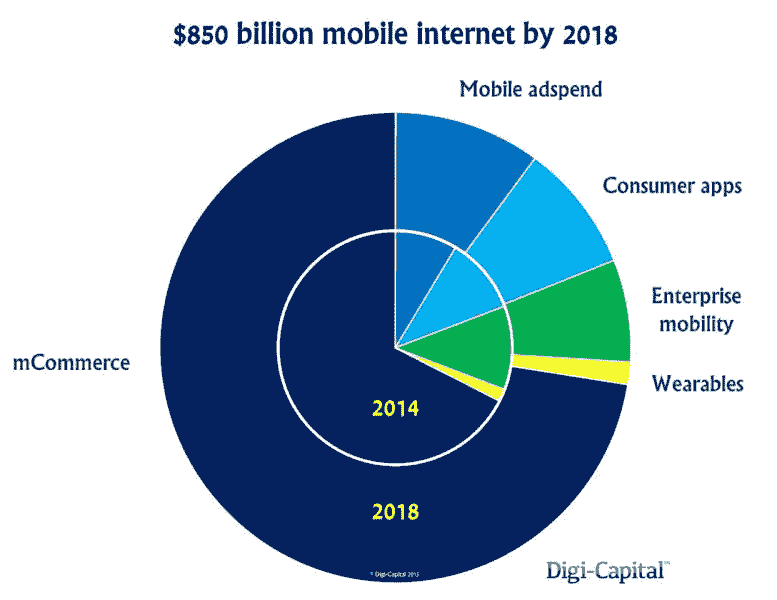
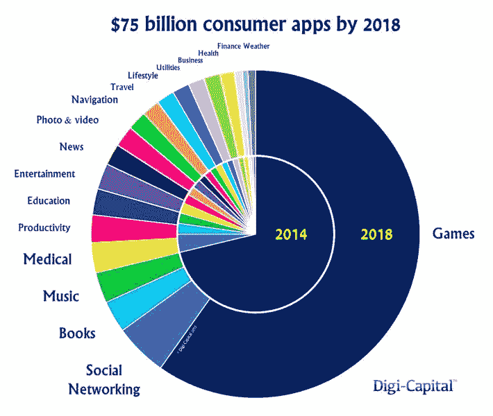

# Digi-Capital | VentureBeat 称，到 2018 年，移动网络市场的规模将增长两倍，达到 8500 亿美元

> 原文：<http://venturebeat.com/2015/05/26/mobile-web-market-will-triple-in-size-to-850b-by-2018-says-digi-capital/?utm_source=wanqu.co&utm_campaign=Wanqu+Daily&utm_medium=website>

你错过了明年 2022 年 GamesBeat 峰会的一个环节吗？所有会议现在都可以在我们的点播库中观看。[点击这里开始观看](https://attendees.bizzabo.com/412979/agenda?date=1666742400000)。

* * *

到 2018 年，移动电话和移动网络将分别以每年 10%和 5%的速度增长，但移动网络服务将继续疯狂增长。

为美国、欧洲和亚洲的移动应用和服务公司提供咨询的 Digi-Capital ，现在[预测](http://www.digi-capital.com/reports/#mobile-internet-review)移动服务将增长近三倍，从去年的 3000 亿美元增长到 2018 年的 8500 亿美元。

Digi-Capital 表示，移动商务是增长的关键驱动力，这就是为什么去年在该领域投资的 410 亿美元中有一半以上流向了移动商务相关行业。

[

<noscript></noscript>](https://venturebeat.com/wp-content/uploads/2015/05/myRCEk3qphYmARepIT6PsoOLkTxN0cnocD4I4BOSklM.jpeg?strip=all) 

该公司还认为，到 2018 年，移动广告将超越应用内购买，在收入层级中从第三位升至第二位，“因为应用开发商重新平衡了他们的商业模式，以捕捉新的机会。”

例如，去年移动广告的收入落后于应用内购买和付费应用，但脸书和其他公司已经开始改变有利于广告的平衡。Digi-Capital 在新报告中表示，到 2018 年，移动广告支出可能超过 850 亿美元。

消费者应用收入将从 2014 年的约 300 亿美元增长到 2018 年的 750 亿美元。

去年，游戏占全球应用收入的四分之三左右，但到 2018 年，游戏占收入的比例将会下降。Digi-Capital 表示，作为服务出售的订阅应用程序也补充了主流免费应用程序的应用内购买模式。

[

<noscript></noscript>](https://venturebeat.com/wp-content/uploads/2015/05/VFe83Pu41iCq8RHqu9UYy2HeQqVBLkVCGkQvjXBRdl4.jpeg?strip=all) 

报告称，企业移动应用和服务将继续增长，尽管没有消费市场那么快。

该报告称，“移动互联网只有八年历史，但它比 20 年前的原始网络更迅速、更彻底地扰乱了市场。”“尽管票房排行榜相对成熟，但市场其他部分的快速增长和变化意味着仍有很大空间。”

**VentureBeat 的使命**是成为技术决策者获取变革性企业技术知识和进行交易的数字城市广场。[发现我们的简报。](https://info.venturebeat.com/website-preference-center.html)