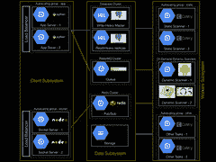

# Appknox 架构-从 AWS 转换到 Google 云-高可扩展性-

> 原文：<http://highscalability.com/blog/2015/5/25/appknox-architecture-making-the-switch-from-aws-to-the-googl.html?utm_source=wanqu.co&utm_campaign=Wanqu+Daily&utm_medium=website>

*这是 Appknox 全栈& DevOps 工程师 [dhilipsiva](http://dhilipsiva.com/) 的客座博文。*

[Appknox](https://www.appknox.com/) 帮助检测和修复移动应用中的安全漏洞。保护你的应用就像提交你的商店链接一样简单。我们会上传您的应用，扫描安全漏洞，并报告结果。

我们的堆栈值得注意的是:

*   **模块化设计**。我们模块化了很多东西，以至于我们把前端和后端分离了。这种架构有很多优点，我们将在后面的文章中讨论。
*   **从 AWS 切换到 Google Cloud** 。我们使我们的代码在很大程度上独立于供应商，因此我们能够轻松地从 AWS 转换到 Google Cloud。

## 主要语言

1.  Python &后端的 Shell
2.  CoffeeScript 和更少的前端

## 我们的堆栈

1.  姜戈
2.  Postgres(从 MySQL 迁移而来)
3.  兔子 q
4.  芹菜
5.  雷迪斯
6.  Memcached
7.  光泽面
8.  Nginx
9.  余烬
10.  谷歌计算
11.  谷歌云存储

## 建筑

[T2】](https://github.com/dhilipsiva/dhilipsiva.github.io/blob/sourimg/architecture-at-appknox.jpg)

### 它是如何工作的？

我们的后端架构由 3 个子系统组成:客户端、数据和工作人员。

### 客户端子系统

客户端子系统由两个不同的负载平衡、自动扩展的应用和套接字服务器组成。这是所有用户交互发生的地方。我们非常注意不要在这里有任何阻塞调用，以确保尽可能低的延迟。

**应用服务器**:每个应用服务器都是一个单独的计算单元，装载了 Nginx 和 Django-gunicorn 服务器，由 supervisord 管理。这里满足用户的要求。当用户提交他们的应用程序的 url 时，我们将其提交到 RabbitMQ `download`队列，并立即让用户知道 URL 已经提交。在上传任何应用程序的情况下，从服务器获取签名的 url。浏览器使用这个签名的 url 将数据直接上传到 S3，并在完成后通知应用服务器。

**Socket server** :每个 Socket server 都是一个单独的计算单元，装载了 Nginx 和一个节点(socket-io)服务器。此服务器使用 Redis 作为其适配器。当然，这是用于实时更新的。

### 数据子系统

该系统用于数据存储、排队和发布/订阅。这也是去耦架构的原因。

**数据库集群**:我们使用 Postgres。不言而喻，它由一个写操作繁重的母版和几个读操作繁重的副本组成。

RabbitMQ :我们芹菜工人的经纪人。我们对不同的工人有不同的队列。主要是`download`、`validate`、`upload`、`analyse`、`report`、`mail`和`bot`。web 服务器将数据放入队列，芹菜工人拾取并运行它。

Redis :它充当 socket-io 服务器的适配器。当我们想要通知用户来自我们任何一个工人的更新时，我们将它发布到 Redis，Redis 将通过 Socket.IO 通知所有用户。

### 工人子系统

这是所有起重工作的地方。所有工人从 RabbitMQ 获得任务，并通过 Redis 向用户发布更新。

**静态扫描器**:这是一个自动缩放的计算单元组。每个单位由 4-5 名芹菜工组成。每个芹菜工人一次扫描一个应用程序。

**其他任务**:这是一个自动缩放的计算单元组。每个单元由 4-5 名芹菜工人组成，他们执行各种任务，如从商店下载应用程序、生成报告 pdf、上传报告 pdf、发送电子邮件等。

**动态扫描**:这是平台特有的。每个 android 动态扫描器都是一个随需应变的计算实例，具有 Android 模拟器(带有 SDK)和一个捕获数据的脚本。这个模拟器显示在浏览器的画布上，供用户进行交互。每个 iOS 扫描器都位于一个托管的 Mac-Mini 场中，该场中有支持 iOS 平台的脚本和模拟器。

## 选择堆栈的原因

我们选择了 **Python** ，因为我们用来扫描应用程序的主要库都在 Python 中。此外，我们热爱 python 胜过我们所知道的任何其他语言。

我们选择 **Django** 是因为它支持模块化。

我们认为这是目前最棒的前端框架。是的，学习曲线比任何其他的都陡峭，但是一旦你爬上了那座陡峭的山，你绝对会爱上 ember。它非常固执己见。所以只要你坚持它的惯例，你就可以写得更少，做得更多。

最初，我们选择 MySQL 是因为它是事实上的。甲骨文收购 Sun Microsystems(MySQL 的母公司)后，MySQL 变得停滞不前。我想我们都预料到了。所以我们使用了由社区维护的 Maria db(MySQL 的一个分支)。后来，我们需要一点持久的键值存储，Postgres 提供了现成的存储。它与 Python 配合得非常好。我们使用 UUIDs 作为主键，这是 Postgres 中的一种本地数据类型。此外，`uuis-ossp`模块提供了在数据库级别生成和操作 UUIDs 的函数，而不是在应用程序级别创建它们，后者成本更高。所以我们换成了 Postgres。

其余的都是事实。任务队列的 RabbitMQ。**芹菜**进行任务管理。 **Redis** 为发布/订阅。 **Memcached & Varnish** 用于缓存。

## 不尽如人意的事情

其中一件不尽如人意的事情就是**缩放插座**。我们最初使用的是 Django-socket.io。我们意识到这无法扩展到多台服务器。所以我们把它写成一个独立的节点模块。我们使用了支持 Redis-adapter 的节点 socket-io 库。客户端连接到节点的套接字服务器。所以我们现在从我们的 python 代码发布到 Redis。节点只会将通知推送到客户端。这可以独立于作为客户机的 JSON 端点的应用服务器进行扩展。

## 关于我们堆栈的值得注意的东西

我们喜欢**模块化设计**。到目前为止，我们已经把东西模块化了，以至于我们把前端和后端分离了。是的，你没看错。所有的 HTML、CoffeeScript 和更少的代码都是独立于后端开发的。前端开发不需要运行服务器。在开发过程中，我们依赖前端夹具来获取虚假数据。

我们的**后端命名为** **夏洛克**。我们检测移动应用中的安全漏洞。所以这个名字似乎很贴切。夏洛克很聪明。

我们的**前端被命名为艾琳**。记得艾琳·阿德勒吗？她很漂亮，色彩丰富，并告诉我们的用户什么是错的。

我们的**管理员名叫哈德森**。记得哈德森太太吗？夏洛克的女房东？想到这些，我们应该给可怜的华生医生一个角色。也许我们会的。

所以夏洛克不提供任何 HTML/CSS/JS 文件。我重复一遍，它**不服务于任何单一的静态文件/ HTML 文件**。夏洛克和艾琳都是独立开发的。两者都有单独的部署过程。两者都有自己的测试用例。我们将夏洛克部署到**计算实例**，将艾琳部署到**谷歌云存储**。

这种架构的优势在于:

1.  前端团队可以**独立于后端**工作，而不会互相影响。
2.  像在服务器上渲染页面这样的繁重工作被从服务器上移除。
3.  我们可以**开源前端代码**。让雇佣前端人员变得容易。只要让他们修复回购中的一个 bug，他们就被录用了。毕竟，前端代码可以被任何人阅读，即使你不开源它，对不对？

## 我们的部署流程

代码是从`master`分公司自动部署的**。我们遵循 Vincent Driessen 的 Git 分支模型。Jenkins 构建提交到`develop`分支。如果它成功了，我们做另一个手动测试，只是为了确保和合并与`master`分支，它得到自动部署。**

## 最初使用 AWS。我们决定使用谷歌云有三个原因。

1.  我们喜欢基于**“项目”的方法来管理不同应用的资源**。它使得访问基础设施更加实用。由于我们的“动态扫描”功能的复杂性，它使识别实例变得更加容易。
2.  它有一份很棒的文档，当我们受到打击时，它有谷歌工程师一对一的私人帮助。
3.  我们获得了一些重要的谷歌积分，这有助于我们在早期阶段削减成本。

我总是远离 IaaS 提供商提供的特殊服务。例如，我们没有使用亚马逊 RDS 或 SQS。配置我们自己的数据库服务器、RabbitMQ 和 Redis 实例。这样做的原因是——这些服务相对较慢(也更贵),并且您的产品依赖于供应商。我们将所有这些抽象为独立于供应商的。我们忘记提取的一个东西是存储。

我们直接消耗了 S3。当我们试图迁移到谷歌云时，这只是一个小小的收获。因此，当我们决定迁移到谷歌存储时，我们抽象了存储层，并遵循谷歌[存储迁移文档](https://cloud.google.com/storage/docs/migrating)。一切都很好。现在，代码库可以托管在 Google Cloud 和 AWS 上，无需更改代码。当然，您必须更改配置。但不是代码。