# 丹·格罗弗|中国移动应用用户界面趋势

> 原文：<http://dangrover.com/blog/2014/12/01/chinese-mobile-app-ui-trends.html?utm_source=wanqu.co&utm_campaign=Wanqu+Daily&utm_medium=website>

今年夏天，我收拾好所有的东西，从旧金山搬到中国广州工作。通过一系列不太可能的巧合(我记不清了)，我成为了微信的产品经理，这是一款在中国很受欢迎的即时通讯应用。

搬到一个新的国家意味着学习如何以不同的方式做很多事情:说一门新的语言，吃饭，购物，四处走动。几个月后，我惊讶地发现自己已经适应了这个起初看起来完全陌生的地方。

这也适用于我的数字生活。我已经把我所有的应用程序都换成了这里使用的应用程序，这既是出于我对科技行业的浓厚兴趣，也是为了尽可能“本土化”。从那以后，我也同样对那里需要的适应视而不见。

有一天，为了好玩，我开始在笔记本上写一个清单，列出这里的应用程序和我在美国习惯使用和创建的应用程序之间的所有不同之处。当我完成的时候，我惊讶于这个列表有多长，所以把它充实到一个帖子里似乎是合适的。

#### 目录

1.  [输入困难](#input)
2.  [不确定徽章](#badges)
3.  [围墙花园、入口、平台](#portals)
4.  [账户和登录屏幕](#accounts)
5.  [作为通用用户界面聊天](#chatasui)
6.  [买东西](#buying)
7.  [位置，位置，位置](#location)
8.  [一切都可以下载](#downloads)
9.  [一言以蔽之](#moments)
10.  [杂记](#misc)
11.  [脚注](#footnotes)

#### 输入困难

##### 拼音模糊匹配

这里的人们使用各种各样的方法来输入汉字:从拼音到手写，再到笔画键盘，甚至还有模仿老式手机数字键盘的方法。一个人喜欢的方法似乎很大程度上取决于他成长的时代和地区，尽管拼音似乎是最受欢迎的。

然而，这里的网站和应用程序不需要使用这些。他们会很乐意*接受拉丁字符*作为搜索词，并将其解析为中文结果——独立于你的操作系统。他们甚至使用试探法来解释错别字和同音字。一旦你习惯了，操作系统和大多数其他应用程序都不是这样工作的，这很烦人。

[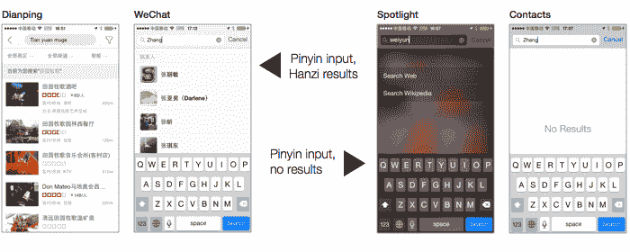T2】](/img/content/chineseapps/pinyin@2x.png)

虽然应用程序已经竭尽全力处理各种各样的中文输入，但毫不奇怪，它们很少实现良好的英语模糊匹配(<cite>例如</cite> [词干](http://en.wikipedia.org/wiki/Stemming)， [soundex](http://en.wikipedia.org/wiki/Soundex) ，优雅地处理变音符号、标点和大写)。

##### 语音信息，语音搜索，语音代理

如果可以完全避免打字，为什么还要让打字更流畅呢？

聊天应用(尤其是微信)中的语音消息在这里很受欢迎。它们省去了打字的麻烦，对于那些对电脑不太熟练的老一代人来说是天赐之物，更不用说对各种输入汉字的方法记忆了。

就我个人而言，当我收到语音信息时，我总是感到有点不方便，因为我必须停下手头的工作去听(而不是浏览)。我也对语音回复感到尴尬，尤其是在公共场合(因为害怕成为[“蓝牙耳机男”](http://vimeo.com/album/10213))。

但这里的人们显然没有同样的感觉，因为很容易看到许多人在公共场所发送语音信息。典型的姿势是用拇指按下“录音”按钮的同时，以一个小角度将话筒放在嘴边。

语音搜索在各种应用中也得到广泛支持。在最近的一次采访中，百度的吴恩达指出他们 10%的搜索是通过语音输入完成的。

[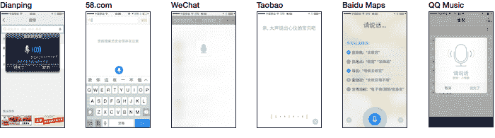T2】](/img/content/chineseapps/voice@2x.png)

##### 二维码代表一切

在我出发之前，我在旧金山进行了用户研究访谈，以收集对美国用户习惯和偏好的见解。在每次采访中，我都会给受试者看一个二维码，然后问他们这是什么。

“难道不是吗，就像你拍了一张照片，它就把你带到了一个神秘网站一名女大学生嘲笑道。另一个人说他们给其中一个人拍了照片(用相机应用程序)，没有明显效果，并且再也没有尝试过。“我想他们是为了优惠券什么的”，一些人猜测道，经常补充说他们有点担心这会对他们的手机造成什么影响。我录下了这些令人困惑的反应，给我的同事看，以进一步强调二维码从未在美国流行的观点。

正如你所猜测的，中国人对他们来说并不陌生。QR 码印在大多数广告、宣传册、餐厅菜单、名片、优惠券上，甚至印在火车座位和洗手间隔间门的背面:

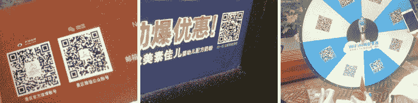

大多数应用程序都内置了自己的二维码阅读器功能。你发现印在东西上的代码有时只在一个应用程序中有效，所以往往会有一排微信、微博和其他应用程序的二维码。正如人们所料，它们包含 URL，但如果在外部阅读器中扫描，并不总是可以深度链接到应用程序的 URL。

正如我稍后将描述的，这些代码用于一切，是的，营销网站，但也用于一些有用的事情，如将你在现实生活中遇到的人添加到你的联系人，支付东西，以及登录网站。

[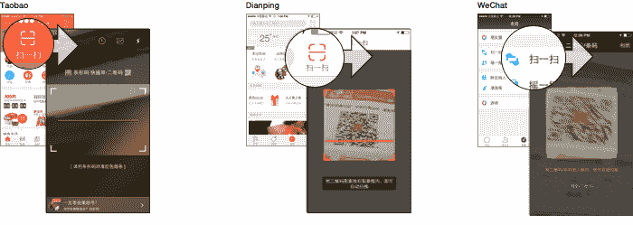T3】](/img/content/chineseapps/qrcode-scanners@2x.png)

#### 不确定的徽章

中国的应用程序大量采用了一种被称为“不确定徽章”的 UI 元素。iOS 上的原生 UI 控件是不可能的，我也没见过美国应用程序使用它们。

这些只是你习惯的标准红色徽章，但没有编号。它们用在应用程序菜单层级的每一点，层叠式，以底部标签结束。如果你有一段时间没有打开应用程序，你会发现不止几个屏幕上有这些亮片。

[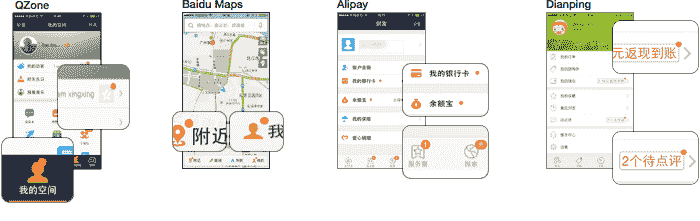T2】](/img/content/chineseapps/badges@2x.png)

不确定的徽章表明:

**答:新内容已经被加载到这里**，在标记的 UI 元素下面的某个地方。它表示新项目不需要用户进行任何操作，或者确切的数量并不重要。这用于社交媒体新闻源以及电影、音乐或电子商务应用程序上的新项目流

b .有了一项新功能。当你找到它的时候，它会有一个红色的“新”/”新“在它旁边。

c .用户关闭或抑制了应用程序的部分通知。例如，一个人可以在微信中静音聊天，当有新消息发送到聊天中时，它会用一个不确定的标记取代其编号标记。

应用程序采用编号和不确定的徽章。如果一个 UI 元素有显示两种类型的子元素，则编号的元素优先，并显示在父元素上。

我觉得这是一种必然的发明，因为更复杂的菜单层次需要深思熟虑的方法来引导用户深入其中。这也增加了许多应用程序的上瘾性，在这种情况下，这么多编号的徽章就摆在你面前。

有趣的事实:在 QQ 中，你可以拖动任何带编号的徽章(但不能拖动不确定的徽章)，它会脱离其父 UI 元素，消失在一缕青烟中。

#### 有围墙的花园、入口、平台

Richard Gabriel 的 [<cite>“越差越好”</cite>](http://www.jwz.org/doc/worse-is-better.html) 的兴起，现在是一篇经典文章，是第一个区分软件设计上两种对立观点的文章:

贝尔实验室开发的 UNIX 和 C 就是“越差越好”方法的例子。它倾向于小型的、有些粗糙的、可互操作的工具的集合。然后是“正确的事情”/“越好越好”的方法，由麻省理工学院开发的 Common Lisp、Scheme 和 Emacs 举例说明。这种方法产生了更大、更全面、整体的问题解决方案。

美国应用程序的最新趋势是[将应用程序分成“星座”](http://avc.com/2014/05/app-constellations/)越来越专注和极简的任务驱动应用程序，向“越差越好”的学校致敬。但是这里的应用程序却被拖向了相反的方向。

每个应用程序都积累了越来越多看似与其表面目的无关的功能——有时巧妙整合，有时随意捆绑——我只能想象这些功能是为了让每个应用程序留住眼球，并融入更多用户的日常习惯。

我想到了几个例子:

*   微信是 WhatsApp 的 vim 的 emacs。除了发信息，它还可以进行视频通话，有新闻订阅，有支付服务的钱包，功能更像 Evernote 的收藏夹功能，一个游戏中心(内置游戏)，一个基于位置的寻人功能，一个沙扎姆-宋立科匹配服务，以及根据[扎温斯基定律](http://en.wikipedia.org/wiki/Jamie_Zawinski#Zawinski.27s_law_of_software_envelopment)，一个邮件客户端。其官方账户平台(稍后描述)甚至提供了一个层来[允许硬件设备使用该应用与服务进行通信](http://technode.com/2014/11/02/tencent-showcases-wechat-hardware/)，而不是要求定制应用。

*   百度地图有天气预报、可选的“查找我的朋友”功能、旅游指南、购买各种东西的完整“钱包”模式。腾讯地图让你发送有声明信片。两家都有二维码阅读器和必须的 Groupon 式本地优惠。

*   曾经类似 Twitter 的微博做得更多。它的“发布”按钮实际上允许一个人发布多达 10 种不同类型的内容，从博客条目到餐馆评论。它也增加了钱包功能。

*   虽然包罗万象、像雅虎一样的“门户”主页在 21 世纪初的某个时候在美国消亡了，但它们在像新浪、、163.com、T4、腾讯和腾讯这样的网站上已经存在了很长时间。虽然“普通的”应用程序都有类似门户的特性，但实际的门户网站都有自己的应用程序，而且看起来足够流行。

“发现”是新的汉堡菜单

美国的应用程序已经标准化了一些方式来分组它们不可归类的零碎东西(如设置和帮助)。通常它们在最右边的“更多”标签下(有一个椭圆图标)，在可怕的[汉堡菜单](http://gizmodo.com/who-designed-the-iconic-hamburger-icon-1555438787)下，或者，在脸书的例子中，在“更多”标签下有一个汉堡菜单图标。

中国的应用程序有时也会这样做，使用“更多”(gèng duū，“更甚”)。但更多的时候，它们在第二个或第三个底部标签中，标有“发现”(fāxiàn，《发现》)。“发现”菜单包含了不断变化的有趣的、不太必要的额外功能，这些功能增强了应用程序的核心功能。选择的图标通常是指南针。

[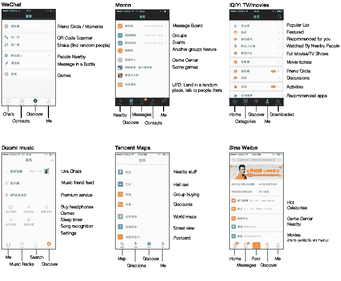T2】](/img/content/chineseapps/discover@2x.png)

许多应用商店

许多应用程序都有一个屏幕，提示下载其他应用程序——通常是游戏，但也经常有其他应用程序。有时这些屏幕链接到 iOS 应用商店，其他时候用 [OTA 安装](http://developer.apple.com/library/ios/#featuredarticles/FA_Wireless_Enterprise_App_Distribution/Introduction/Introduction.html)绕过应用商店。使用这种方法的整个第三方应用程序商店也在一些流行的应用程序中进行推广。

在 Android 上，有超过 10 个大的应用商店，发布一个应用需要在每个商店列出并更新它。甚至在 iOS 上，也有可供选择的商店——我看到一家叫做[的商店的广告苹果助手](http://www.kuaiyong.com/) (Apple Helper)，需要安装自定预置描述文件才能使用。Cydia 也仍然很受欢迎，因为越狱的 iPhones 比比皆是。

[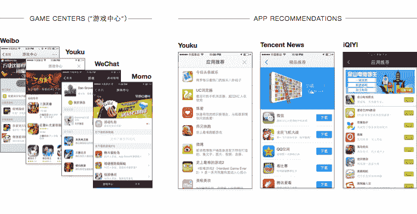T2】](/img/content/chineseapps/appstores@2x.png)

#### 账户和登录屏幕

##### 密码上的电话号码和令牌

美国的网站和应用通常允许两种登录方式:1)传统的电子邮件和密码；2)通过脸书或谷歌进行第三方认证。

当然，这些天来，我们也习惯于在消息应用程序和脸书推出的任何衍生社交应用程序中确认我们的电话号码。你输入你的号码，然后通过短信收到一个确认码。

但在这里，所有的应用程序都提供这种类型的电话号码注册/登录(如果不喜欢的话)。这个*也适用于网站*，甚至是没有 app 的网站。

##### 二维码登录

许多网站还允许用户通过扫描网站应用程序中的二维码登录。二维码中有一个即将到期的会话标识符，一旦被移动应用程序读取，就会将该浏览器会话与登录的帐户相关联。

当您不希望用户使用实际的键盘输入密码时，这是理想的选择。有人告诉我，在过去，许多人在网吧等地方的公共电脑上使用在线服务，这些地方可能受到键盘记录程序和间谍软件的困扰。

##### 第三方登录

许多应用确实也通过微信、QQ、新浪微博或有时通过人人网提供第三方认证。在手机上，它会切换到相应的应用程序。在网站上，你可以选择传统登录或使用第三方服务的移动应用扫描二维码。

[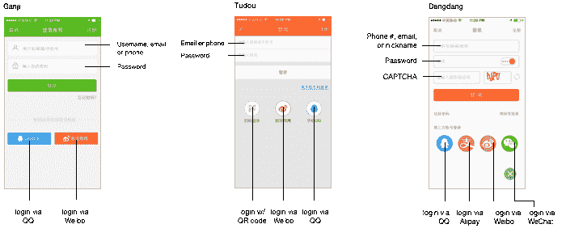T2】](/img/content/chineseapps/logins@2x.png)

##### 更多安全措施

银行网站(以及支付宝)需要一个特殊的浏览器插件来实现自己的密码字段。我的银行甚至给了我一个 u 盘，里面有某种加密密钥。除了藏起来，我不知道该怎么办。

通常，登录屏幕需要完成一个 <abbr>[验证码](http://en.wikipedia.org/wiki/CAPTCHA)</abbr> ，这比美国的应用程序和网站要一致得多，美国的应用程序和网站通常只在注册表格上使用它们。有些手机应用甚至有。

#### 作为通用用户界面聊天

##### 官方账户

微信普及了品牌和公众人物“官方账号”的概念。它们有点像昔日的 IRC 和 AIM 机器人——想想 [SmarterChild](http://en.wikipedia.org/wiki/SmarterChild) ,但适用于银行、电话公司、博客、[医院](http://www.forbes.com/sites/jlim/2014/06/16/wechat-is-being-trialed-to-make-hospitals-more-efficient-in-china/)、商场和政府机构。许多原本拥有本地应用或移动网站的机构选择了官方账户。

你可以发送任何类型的信息(文本、图像、语音等)，它们会自动回复，或者发送给某个地方的人。该界面与和朋友聊天的界面完全相同，除了一点不同:它在底部有菜单，有账户主要功能的快捷方式(尽管它可以切换到正常的文本字段)。

除此之外，您可以在普通聊天中使用的所有功能都在这里提供。微信甚至[将语音信息(之前提到的)自动转录成文本](http://technode.com/2013/12/03/wechat-launched-voice-open-platform-and-speech-recognition-sdk/)，然后将它们传递给运行该账户的第三方服务器。

官方账户也可以向用户推送新闻更新。每个媒体都有一个，使得这些账户所在的屏幕对许多用户来说更像是一个 RSS 阅读器。

[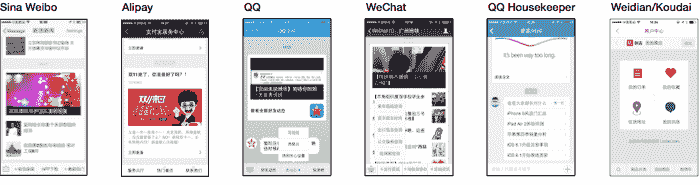T2】](/img/content/chineseapps/oas@2x.png)

这种模式的成功导致许多应用程序以不同的方式使用聊天风格的用户界面。新浪微博自然会在自己的官方账户中使用它，QQ 也是如此。但也可以在很多其他 app 的“客服中心”区找到)。一家名为 [Grata](http://grata.co) 的初创公司甚至出售这种可以放入任何应用程序的白标版本。

应用程序开发者并没有抓住一些洞察力，认为一个熟悉的聊天风格的用户界面是有意义的。他们实际上*复制了整个 UI* ，锁、股票和桶，一直到底部三个标签菜单的布局和推送给订户的“富媒体”新闻消息。

##### 表情符号和贴纸

在表情符号被大规模采用之前，大多数西方应用程序中的表情符号都是传统文字表情符号的直接图形等价物[，大概有 15 个左右被普遍使用。](http://en.wikipedia.org/wiki/List_of_emoticons)

但在这里，QQ 早就为图形表情设定了标准。它的 80 多个图标非常具有表现力和多功能性，甚至与表情符号相比也是如此。该系列中的图标从基本的情绪到更奇怪的如、和——每一个都有合适的时间和地点！

任何提供聊天功能的应用程序如果不复制它们都是失职，事实上 QQ 的表情符号被带到了微信，并被许多其他应用程序“借用”。

包括更大的动画贴纸也是必须的——尽管，与我的预期相反，亚洲人似乎并不比美国人更迷恋贴纸。

#### 买东西

由于与中资银行合作的复杂性，中国的网上支付起步有点艰难。这里的网站并不只是记录信用卡号码，而是要求用户从大约 30 家银行中选择他们的银行，并填写表格绑定账户。显然，每家银行都提供自己独特的集成点，每个网站都必须支持。这很快被抽象为第三方支付解决方案，如财付通和支付宝，被这里的网站广泛采用。

##### 单点登录移动支付

现在，许多移动应用程序可以与你的银行账户链接，并作为其他应用程序的中介，让你摆脱在另一个应用程序中繁琐的绑定过程。

我唯一一次在美国应用程序中看到这种情况是在我能够使用 Venmo 在 Hotel Tonight 上支付酒店房间的时候。我被困在一个机场，很高兴看到这是一个选项，我当时就预订了房间，而不是仔细阅读其他可能需要我输入信用卡信息的选项。

但是在这里，这个不用说了。关键的区别在于，用户不必下载一些奇怪的额外钱包/支付应用程序——钱包内置于他们已经拥有的应用程序中。

##### 每个应用都有一个钱包

围绕支付的管理功能被组织到一个中央屏幕中，通常称为钱包(qiánāo，“钱包”)。此外，这些屏幕上有按钮:

1.  **在应用程序的其他地方购买自然会出现的东西**(例如，在本地优惠应用程序中购买优惠)。
2.  **在现实生活中购物**通过扫描销售点显示的二维码。反之亦然——你也可以让你的手机显示一个二维码，然后由销售点的摄像头读取(速度稍快)。
3.  **向朋友**付款，通常称为红包(hóngbāo，中国用来送礼的传统红包)。
4.  **买与任何事情都无关的东西**。例如，大多数具有这一功能的应用程序都提供机票、彩票、电影票、一种类似优步的打车服务(例如 Dididache)、一种为预付费手机服务充值的方式，以及一种支付公共事业账单的方式。腾讯的应用程序有迷你版的 JD.com(合作伙伴电子商务网站)，以及购买 QQ 的方式币，他们的虚拟货币。

大多数带有钱包的应用程序使用非常相似的布局，有三列彩色图标，通常代表相同的功能集合。甚至我实际银行的应用程序也有这样的屏幕，允许你用余额买东西。
T3】

[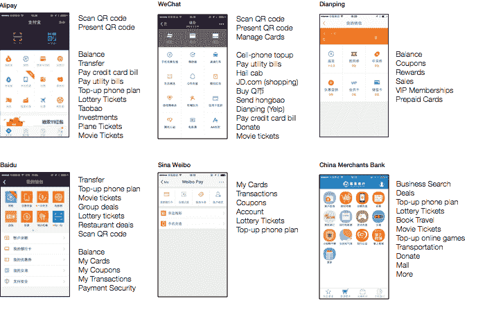T2】](/img/content/chineseapps/app-wallets@2x.png)

##### 伙计，相信我，我有盾牌，好吗？

任何涉及金钱的应用程序都在承诺交易安全方面付出了巨大的努力。他们通常有一个“安全中心”屏幕，在某个地方使用一个巨大的盾牌图标。当然，美国电子商务网站在 21 世纪初之前也做过类似的事情(还记得“黑客安全吗？”)，而今天更巧妙地做出这样的承诺。

也有一些流行的应用程序被认为可以让你的手机运行得更快，释放内存，使它更安全，也许还能摆脱毒蛇。从表面上看，它们让人想起那些在恶意软件问题最严重的时候为 Windows XP 开发的产品。当然，这种应用在你的手机上没有用，但是——你要知道这是真的——他们有很大的保护罩。

[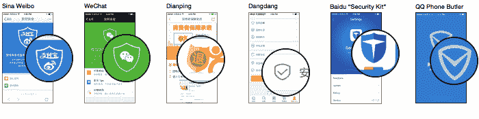T2】](/img/content/chineseapps/shields@2x.png)

#### 位置，位置，位置

这里的应用程序从不羞于请求许可来检索你的位置，当你足够努力地寻找时，它们通常会找到一些使用它的方法——无论是自动填充“选择你的城市”下拉列表，显示天气，还是填充“本地优惠”屏幕。

许多应用程序还让你与附近的陌生人联系，这在这里一点也不令人毛骨悚然。这种想法已经在美国的 Highlight 和 Skout 等应用程序中尝试过，但它们从未获得该类别在美国所获得的主流成功。这可能是由于不同的文化态度，或者是人口密度和城市化的简单函数。但这是一个被广泛使用和实施的想法。

##### 作为独立的类别

陌陌是一款专门为此打造的应用，月活跃用户超过 6000 万，T2 已经申请 IPO。它可以让您认识附近的人，还可以查找活动、讨论、游戏等等。[威居](http://www.iweju.com/)和[比邻](https://itunes.apple.com/cn/app/bi-lin-zhi-da-gei-mo-sheng/id625009752?mt=8)也是这一类别的竞争者。

##### 内置于日常应用中

除了这些独立应用程序的流行，更值得注意的是，每一个正常的，看起来更实用的应用程序也包括这样的功能。

微信和 QQ 是两个最受欢迎的即时通讯应用，它们有一个“附近的人”功能，给你一个你附近的人的简单列表，通常还能让你浏览他们发布到他们的新闻订阅的照片。当然，这是选择加入——你出现在附近的人的名单上，并且由于你自己看着名单，在几个小时内可以联系到你。

与 Twitter 不同，微博可以让你看到你附近的帖子，以及受欢迎的账户和群组。主要的音乐、电影和电视应用程序甚至会向你展示你周围的人在看什么、听什么。

同样值得注意的是百度地图的“热图”，这是一个实时更新的逐块人口密度地图，通过汇总传输到服务器的所有用户位置来创建。

我感觉，如果美国主流应用程序添加了这些功能——即使是小心谨慎的实现——它也会立即成为晚间新闻广播中的恐怖故事和某个利益集团在博客世界中的愤怒抨击的素材。

[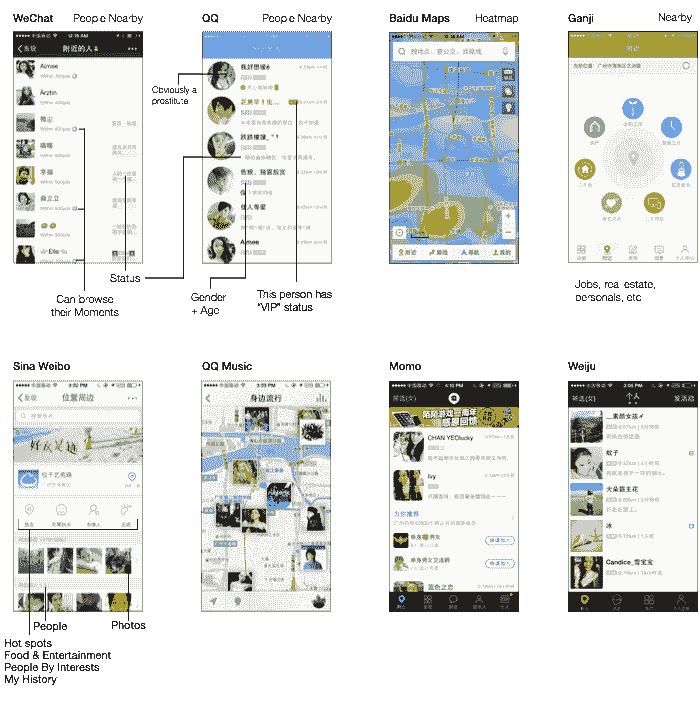T2】](/img/content/chineseapps/location@2x.png)

#### 任何东西都可以下载

每一个以任何媒体为中心的应用程序都允许你下载离线消费的东西。这包括音乐应用(QQ 音乐、米朵、百度音乐等)和电视/电影应用(爱奇艺、PPTV、腾讯视频、百度视频)。在任何地铁上，你肯定会看到至少有十几个人心不在焉，在通勤期间赶着看他们的节目，这是我在美国从未见过的，可能是因为用户可以在这里下载节目。

主要的新闻应用程序也可以让你阅读数百篇文章，以供日后阅读。每个主要的地图应用程序都允许你存储你所在城市甚至整个国家的离线地图。百度樊沂和有道等英汉翻译应用紧随其后，允许用户下载一组训练数据，用于更快(但更粗糙)的离线机器翻译。

包含这一功能的应用程序在其营销中极力吹捧它。当你下载一部电影或一首歌曲时，你通常可以选择质量设置，并被告知使用了多少数据和存储空间，精确到 KB，在这种情况下，美国应用程序会将其缩小到进度条或完全忽略它。通常，他们也会给你一个总磁盘使用情况的图表。

#### 关于瞬间的一句话

值得打破一般趋势来呼吁特别关注微信的“时刻”或“朋友圈”功能的设计。

当我第一次看到它的时候，似乎有人匆忙地用胶带把一个脸书新闻源粘贴到应用程序上，并在上面贴上了 Picassa 图标。但是在我使用它的过程中，我发现它有一个惊人的原创性和颠覆性的特点。事实上，这是脸书的新闻源所没有的:

**不过滤** —你所有朋友的帖子都在这里，没有过滤或重新排序。如果你的一个朋友很讨厌，你可以把他们从 feed 中去掉，但这是一个要么全有要么全无的交易。

**更亲密**——当你喜欢或评论朋友的帖子时，只有他们和任何*共同的*朋友可以看到——而不是像在脸书上一样*双方的所有*朋友。这意味着只有帖子的作者才知道有多少人喜欢或评论了他们的帖子。这降低了用户参与好友帖子的自制力。

**没有公司/新闻** —当你关注一个公司或新闻网站的官方账户时，他们会在一个单独的区域推送他们的更新，而不是在你的新闻订阅上。虽然朋友可以将这些账户的内容转发到 Moments，但这需要一些深思熟虑的行动。

**没有自动发布** —第三方应用程序可以发布到 Moments，但每次都必须由用户发起，切换到微信，并手动确认发布。

没有游戏——腾讯从 Zynga 风格的社交媒体游戏中赚了很多钱。然而，他们很明智地将这个活动放到了应用程序的“游戏中心”部分，可以安全地忽略。

**没有照片过滤器** -虽然许多类型的内容都可以发布到 Moments，但它偏向于照片。Moments 还积极避免 Instagram 风格的过滤器，试图让帖子快速、自然、原始。

由于这些设计决定，以及它被缝进父应用程序的方式，这里的人们比任何其他人都更沉迷于检查这个提要。从发信息到查看反馈，从评论到参与，再到返回，这是一个快速流畅的动作，人们每天都要做无数次。

#### 杂记

##### 辅助触摸

我见过的所有 iPhone 用户中，可能有一半打开了[“辅助触摸”选项](http://support.apple.com/en-us/HT202658)，这使得一个浮动按钮一直出现在你的屏幕上。这个按钮除了令人讨厌之外，还模仿硬件的“home”按钮，以及多点触摸手势，供因残疾而无法操作的用户使用。

没有人能给我一个直截了当的答案，为什么他们，一个有两只手和一整套运动神经元的人，能够实现这种模糊的可及性设置。答案从通过不磨损物理 home 键来保护他们在手机上的投资，到无聊时玩它只是为了好玩。

##### 可爱的吉祥物

我看到很多可爱的吉祥物，经常出现在加载和错误屏幕上。

[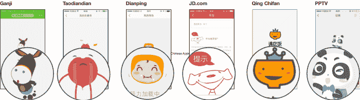](/img/content/chineseapps/mascots@2x.png)
T4】

一些应用程序包括快速跟踪当地污染水平的方法。

[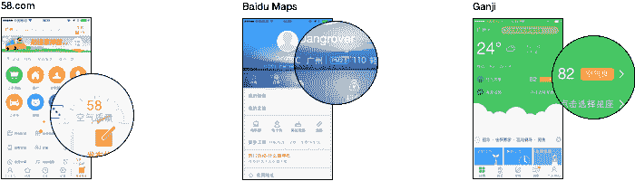](/img/content/chineseapps/pollution@2x.png) 

##### 广告闪屏

相当多的应用程序在启动时会全屏显示广告。你不必等待它们加载——它们通常会在后台预加载，甚至会被嵌入到应用程序中。有时它们是应用程序内可供购买的内容/项目，或者是特殊活动或促销。其他时候它们是不相关的，就像你在广告牌或地铁上看到的那种广告。

[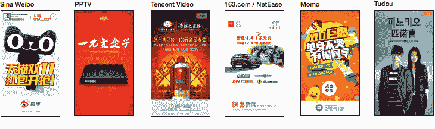T2】](/img/content/chineseapps/splash-ads@2x.png)

##### 主题化

很明显有一种趋势，主流应用程序会提供主题化/皮肤化的方法。我似乎想不出我在 iOS 上使用的任何一个美国应用程序有这个功能。

[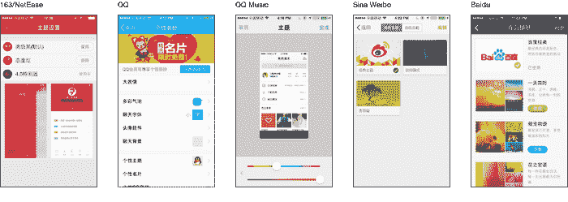T2】](/img/content/chineseapps/theming@2x.png)

##### 安卓 ROMS

在一个谷歌无论如何都会被屏蔽的地方，人们不会从 Nexus 设备提供的纯白、纯粹的谷歌体验中获得太多价值，手机上的操作系统分布在这里和其他地方一样糟糕。为了填补这一空白，一些替代的 Android 操作系统发行版已经出现，包括小米的 MiUI、阿里巴巴的 YunOS、T4 的 Smartisan 和 T5。

它们都很精致，有自己的原创 UI 想法，但我没有足够的时间用我的 Android 设备做完整的笔记(也许是未来帖子的主题)。我强烈推荐观看 Smartisan 的发布会(英文字幕)，如果只是为了娱乐的话。

##### 承认

感谢[雷](http://rayps.com/)、[安德鲁](https://twitter.com/andrew_schorr)、AppSocial.ly 的[亚历克斯、扎克熊、](https://appsocial.ly/)[安德鲁巴德尔](http://andrewbadr.com/)对本文的修改。

