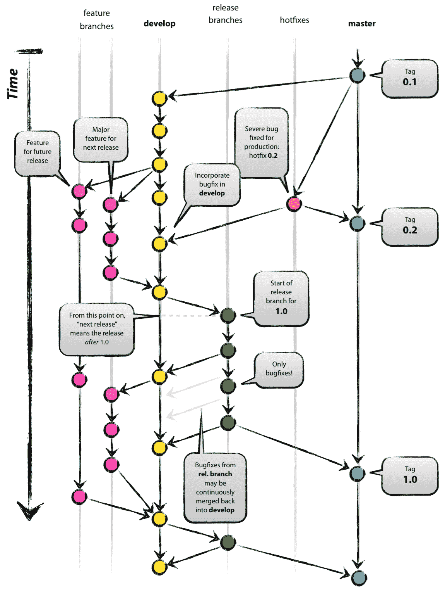
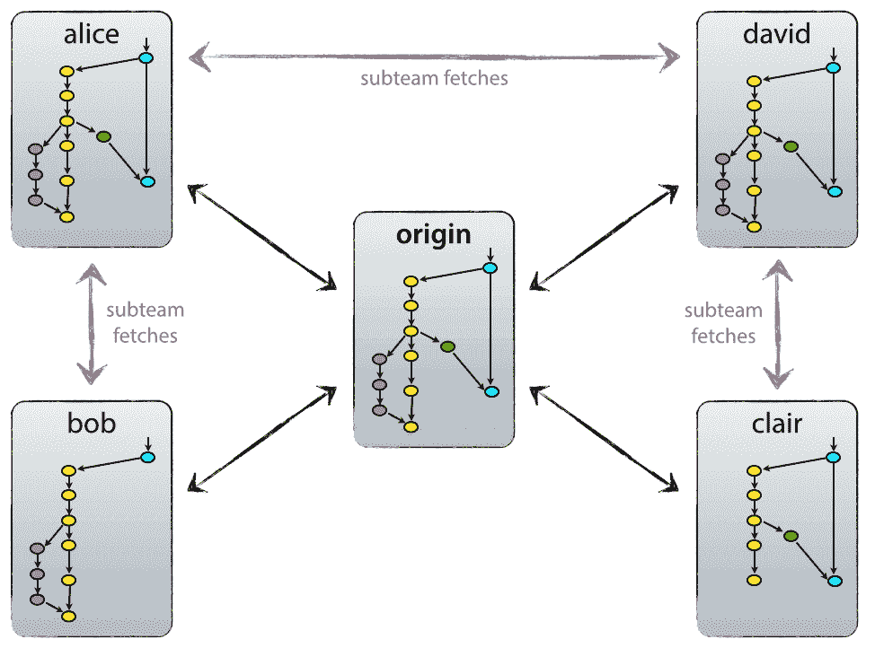
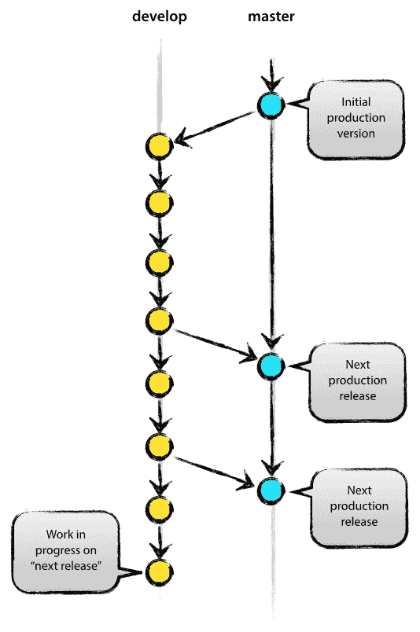
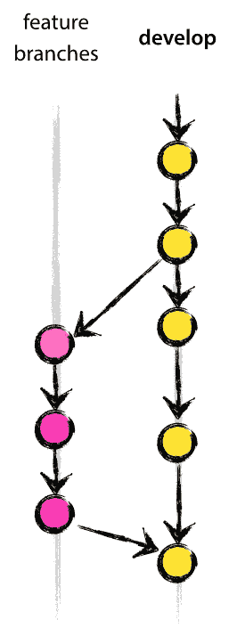
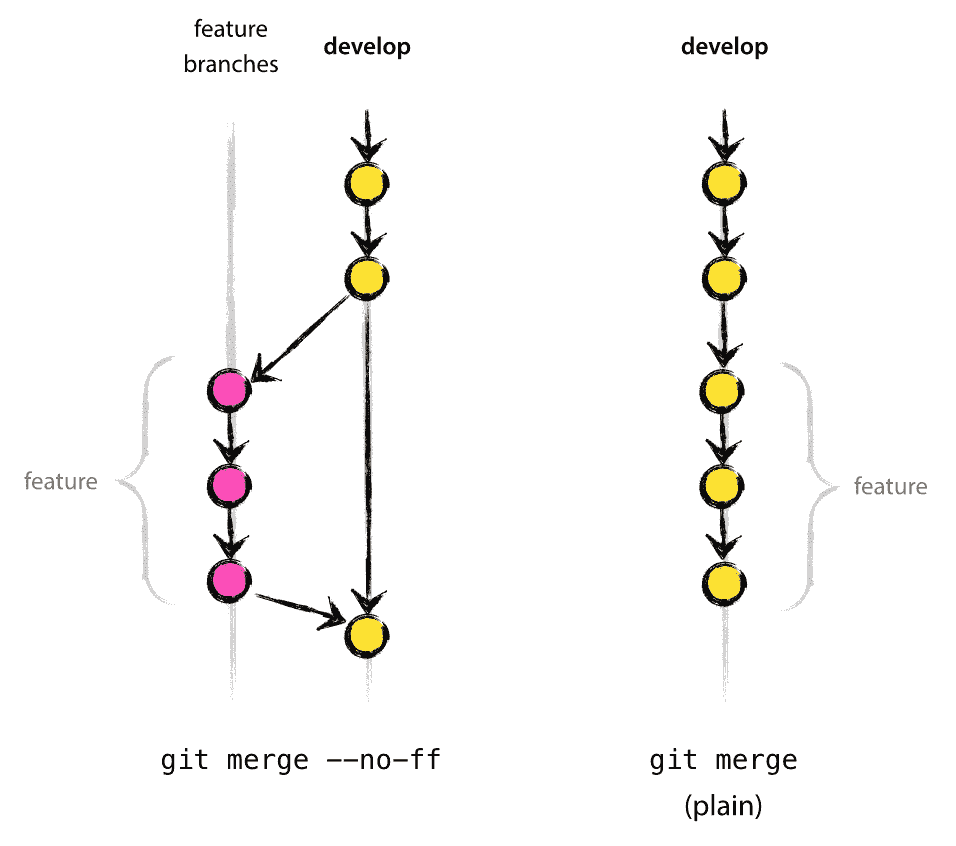
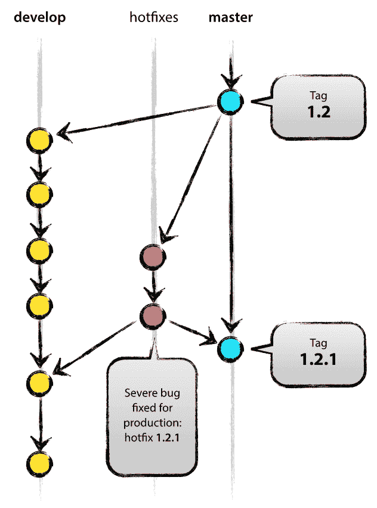

# 一个成功的 Git 分支模型 nvie.com

> 原文：<http://nvie.com/posts/a-successful-git-branching-model/?utm_source=wanqu.co&utm_campaign=Wanqu+Daily&utm_medium=website>

> ### 反思笔记<small>(2020 年 3 月 5 日)</small>
> 
> 这个模型是在 10 多年前的 2010 年构思的，当时 Git 刚刚诞生不久。在这 10 年中，git-flow(本文中展示的分支模型)在许多软件团队中变得非常流行，以至于人们开始将其视为某种标准——但不幸的是，也将其视为教条或灵丹妙药。
> 
> 在这 10 年中，Git 本身已经席卷了整个世界，用 Git 开发的最受欢迎的软件类型正在更多地转向 web 应用——至少在我的过滤器泡沫中是这样。Web 应用程序通常是连续交付的，而不是回滚的，并且您不必支持在野外运行的软件的多个版本。
> 
> 这不是我 10 年前写这篇博文时想到的那类软件。如果你的团队正在进行软件的持续交付，我会建议采用一个更简单的工作流程(比如 [GitHub flow](https://guides.github.com/introduction/flow/) )，而不是试图把 git-flow 硬塞进你的团队。
> 
> 然而，如果您正在构建明确版本化的软件，或者如果您需要在野外支持软件的多个版本，那么 git-flow 可能仍然像过去 10 年一样适合您的团队。既然如此，请继续读下去。
> 
> 总之，永远记住，灵丹妙药是不存在的。考虑你自己的背景。不要憎恨。自己决定吧。

在这篇文章中，我介绍了大约一年前我为自己的一些项目(包括工作和私人项目)引入的开发模型，这个模型被证明是非常成功的。我一直想把它写下来，但是我从来没有真正找到时间去彻底地写，直到现在。我不会谈论任何项目的细节，仅仅是关于分支策略和发布管理。



## 你为什么要走？[t1](#why-git)

关于 Git 相对于集中式源代码控制系统的优缺点的详细讨论，请参见[网站](http://git.or.cz/gitwiki/GitSvnComparsion)。那里正在进行大量的火焰战争。作为一名开发人员，我更喜欢 Git，而不是当今所有的工具。Git 真正改变了开发人员思考合并和分支的方式。从我来的经典 CVS/Subversion 世界来看，合并/分支一直被认为有点可怕(“当心合并冲突，它们会咬你！”)和一些你偶尔才会做的事情。

但是使用 Git，这些操作非常便宜和简单，它们被认为是你日常工作流程的核心部分之一。比如在 CVS/Subversion [书籍](http://svnbook.red-bean.com)中，分支和合并首先在后面的章节中讨论(针对高级用户)，而在 [every](http://book.git-scm.com) [Git](http://pragprog.com/titles/tsgit/pragmatic-version-control-using-git) [书籍](http://github.com/progit/progit)中，已经在第三章(基础)中涉及到了。

由于其简单性和重复性，分支和合并不再是可怕的事情。版本控制工具应该比其他任何工具都更有助于分支/合并。

工具说得够多了，让我们进入开发模型。我将在这里展示的模型本质上只不过是每个团队成员都必须遵循的一组过程，以便实现一个受管理的软件开发过程。

## 分散但集中[](#decentralized-but-centralized)

我们使用的存储库设置与这种分支模型配合得很好，是一个中央“真实”存储库。请注意，只有*认为*是中央回购(因为 Git 是 DVCS，所以在技术层面上没有中央回购这回事)。我们将这个回购称为`origin`，因为所有 Git 用户都熟悉这个名称。



每个开发者拉和推原点。但是除了集中的推拉关系之外，每个开发人员也可以从其他同事那里拉变更来组成子团队。例如，在过早地将正在进行的工作推向`origin`之前，与两个或更多的开发人员合作开发一个大的新特性可能是有用的。在上图中，有 Alice 和 Bob、Alice 和 David 以及 Clair 和 David 的子团队。

从技术上讲，这意味着 Alice 定义了一个 Git remote，名为`bob`，指向 Bob 的存储库，反之亦然。

## 主分支[](#the-main-branches)



核心上，开发模型很大程度上受到了现有模型的启发。中央回购拥有两个无限期的主要分支:

每个 Git 用户都应该熟悉位于`origin`的`master`分支。与`master`分支平行，还有一个分支叫做`develop`。

我们认为`origin/master`是主分支，其中`HEAD`的源代码总是反映*生产就绪*状态。

我们认为`origin/develop`是主要分支，其中`HEAD`的源代码总是反映下一个版本的最新开发变更的状态。有些人称之为“整合分支”。这是构建任何自动每夜构建的地方。

当`develop`分支中的源代码达到一个稳定点并准备好发布时，所有的变更应该以某种方式合并回`master`中，然后用发布号标记。这是如何详细完成的将在后面讨论。

因此，每次当变更被合并回`master`时，根据定义，这就是一个新的生产发布*。我们倾向于在这方面非常严格，所以理论上，我们可以使用 Git hook 脚本来自动构建我们的软件，并在每次`master`提交时将软件部署到我们的生产服务器上。*

## 支持分支[](#supporting-branches)

除了主分支`master`和`develop`之外，我们的开发模型使用各种支持分支来帮助团队成员之间的并行开发，简化功能跟踪，为产品发布做准备，并帮助快速修复实际生产问题。与主枝不同，这些分枝的寿命总是有限的，因为它们最终会被除去。

我们可以使用的不同类型的分支有:

*   特征分支
*   释放分支
*   修补程序分支

这些分支中的每一个都有特定的目的，并且被严格的规则所约束，例如哪些分支可以是它们的起始分支，哪些分支必须是它们的合并目标。我们将在一分钟内浏览它们。

从技术角度来看，这些分支绝不是“特殊的”。分支类型是根据我们如何使用它们来分类的。它们当然是普通的旧 Git 分支。

### 特征分支[](#feature-branches)



May branch off from:

`develop`

Must merge back into:

`develop`

Branch naming convention:

anything except `master`, `develop`, `release-*`, or `hotfix-*`

特性分支(或者有时称为主题分支)用于为即将到来的或者遥远的未来版本开发新的特性。当开始一个特性的开发时，这个特性将被合并到的目标版本在那时可能是未知的。特性分支的本质是，只要特性还在开发中，它就存在，但最终会被合并回`develop`(明确地将新特性添加到即将发布的版本中)或被丢弃(以防令人失望的实验)。

特性分支通常只存在于开发者回购协议中，而不存在于`origin`中。

#### 创建特征分支[](#creating-a-feature-branch)

当开始一个新特性的工作时，从`develop`分支分出。

```
$ git checkout -b myfeature develop
Switched to a new branch "myfeature"

```

#### 在开发 [](#incorporating-a-finished-feature-on-develop) 中加入已完成的特征

已完成的特性可能会合并到`develop`分支中，以明确地将它们添加到即将发布的版本中:

```
$ git checkout develop
Switched to branch 'develop'
$ git merge --no-ff myfeature
Updating ea1b82a..05e9557
(Summary of changes)
$ git branch -d myfeature
Deleted branch myfeature (was 05e9557).
$ git push origin develop

```

`--no-ff`标志使得合并总是创建一个新的提交对象，即使合并可以通过快进来执行。这避免了丢失关于特征分支的历史存在的信息，并且将一起添加了该特征的所有提交分组在一起。比较:



在后一种情况下，不可能从 Git 历史记录中看到哪个提交对象一起实现了一个特性——您必须手动读取所有日志消息。在后一种情况下，恢复整个特性(即一组提交)确实令人头疼，但是如果使用了`--no-ff`标志，这是很容易做到的。

是的，它会多创建一些(空的)提交对象，但是收益远大于代价。

### 发布分支[](#release-branches)

May branch off from:

`develop`

Must merge back into:

`develop` and `master`

Branch naming convention:

`release-*`

发布分支支持新的产品发布的准备。他们允许最后一分钟打点的 I 和交叉 t。此外，它们允许小的 bug 修复和为发布准备元数据(版本号、构建日期等)。).通过在一个发布分支上完成所有这些工作，`develop`分支被清理出来以接收下一个大发布的特性。

从`develop`中分支出一个新发布分支的关键时刻是开发(几乎)反映新发布的期望状态的时候。至少所有面向待构建版本的特性必须在此时合并到`develop`中。面向未来版本的所有特性可能都不会——它们必须等到发布分支分支之后。

正是在一个发布分支的开始，即将到来的发布被分配一个版本号——而不是更早。直到那时，`develop`分支反映了“下一个版本”的变化，但是直到发布分支开始之前，还不清楚“下一个版本”最终会变成 0.3 还是 1.0。这个决定是在发布分支开始时做出的，并由项目的版本号碰撞规则来执行。

#### 创建发布分支[](#creating-a-release-branch)

发布分支是从`develop`分支创建的。例如，假设版本 1.1.5 是当前的生产版本，我们即将推出一个大版本。`develop`的状态为“下一个版本”做好了准备，我们已经决定这将成为版本 1.2(而不是 1.1.6 或 2.0)。所以我们分出一个分支，给发布分支一个反映新版本号的名字:

```
$ git checkout -b release-1.2 develop
Switched to a new branch "release-1.2"
$ ./bump-version.sh 1.2
Files modified successfully, version bumped to 1.2.
$ git commit -a -m "Bumped version number to 1.2"
[release-1.2 74d9424] Bumped version number to 1.2
1 files changed, 1 insertions(+), 1 deletions(-)

```

在创建一个新的分支并切换到它之后，我们删除版本号。这里，`bump-version.sh`是一个虚构的 shell 脚本，它修改工作副本中的一些文件以反映新版本。(这当然可以是手动更改——要点是某些文件会发生更改。)然后，提交碰撞的版本号。

这个新的分支可能会在那里存在一段时间，直到发布可以明确推出。在此期间，bug 修复可能会应用在这个分支中(而不是在`develop`分支中)。这里严格禁止添加大的新特性。它们必须合并到`develop`中，因此，等待下一个大版本。

#### 完成一个发布分支[](#finishing-a-release-branch)

当发布分支的状态准备好成为真正的发布时，需要执行一些动作。首先，发布分支被合并到`master`(因为`master`上的每一次提交都是一个新的发布*，定义为*，记住)。接下来，`master`上提交必须被标记，以便将来引用这个历史版本。最后，在发布分支上所做的更改需要合并回`develop`，这样将来的发布也包含这些 bug 修复。

Git 中的前两步:

```
$ git checkout master
Switched to branch 'master'
$ git merge --no-ff release-1.2
Merge made by recursive.
(Summary of changes)
$ git tag -a 1.2

```

发布现在完成了，并被标记以供将来参考。

> **编辑:**你可能还想使用`-s`或`-u <key>`标志来加密地签署你的标签。

为了保留发布分支中所做的更改，我们需要将它们合并回`develop`中。在 Git 中:

```
$ git checkout develop
Switched to branch 'develop'
$ git merge --no-ff release-1.2
Merge made by recursive.
(Summary of changes)

```

这一步很可能导致合并冲突(甚至可能，因为我们已经改变了版本号)。如果是，修复它并提交。

现在我们真的完成了，发布分支可能会被删除，因为我们不再需要它了:

```
$ git branch -d release-1.2
Deleted branch release-1.2 (was ff452fe).

```

### 热修复分支[](#hotfix-branches)



May branch off from:

`master`

Must merge back into:

`develop` and `master`

Branch naming convention:

`hotfix-*`

热修复分支非常类似于发布分支，因为它们也是为新的产品发布做准备，尽管没有计划。它们产生于对实时产品版本的不良状态立即采取行动的必要性。当必须立即解决生产版本中的关键错误时，可以从标记生产版本的主分支上的相应标记中分支出热修复分支。

本质是团队成员(在`develop`分支上)的工作可以继续，而另一个人正在准备快速的生产修复。

#### 创建热修复分支[](#creating-the-hotfix-branch)

热修复分支是从`master`分支创建的。例如，假设版本 1.2 是当前运行的产品版本，由于一个严重的 bug 而导致问题。但是`develop`上的变化还不稳定。然后，我们可以分出一个修补程序分支，开始修复问题:

```
$ git checkout -b hotfix-1.2.1 master
Switched to a new branch "hotfix-1.2.1"
$ ./bump-version.sh 1.2.1
Files modified successfully, version bumped to 1.2.1.
$ git commit -a -m "Bumped version number to 1.2.1"
[hotfix-1.2.1 41e61bb] Bumped version number to 1.2.1
1 files changed, 1 insertions(+), 1 deletions(-)

```

分支后别忘了撞版本号！

然后，修复 bug，并在一个或多个单独的提交中提交修复。

```
$ git commit -m "Fixed severe production problem"
[hotfix-1.2.1 abbe5d6] Fixed severe production problem
5 files changed, 32 insertions(+), 17 deletions(-)

```

#### 完成一个热修复分支[](#finishing-a-hotfix-branch)

完成后，该 bugfix 需要合并回`master`中，但也需要合并回`develop`中，以确保该 bugfix 也包含在下一个版本中。这完全类似于发布分支是如何完成的。

首先，更新`master`并标记发布。

```
$ git checkout master
Switched to branch 'master'
$ git merge --no-ff hotfix-1.2.1
Merge made by recursive.
(Summary of changes)
$ git tag -a 1.2.1

```

> **编辑:**你可能还想使用`-s`或`-u <key>`标志来加密地签署你的标签。

接下来，也在`develop`中包含错误修复:

```
$ git checkout develop
Switched to branch 'develop'
$ git merge --no-ff hotfix-1.2.1
Merge made by recursive.
(Summary of changes)

```

这里规则的一个例外是，**当一个发布分支当前存在时，热修复变更需要合并到那个发布分支中，而不是`develop`** 。当发布分支结束时，将 bugfix 合并到发布分支最终会导致 bugfix 也被合并到`develop`中。(如果在`develop`的工作立即需要这个 bugfix 并且不能等待发布分支完成，你可以安全地将这个 bugfix 合并到`develop`中。)

最后，删除临时分支:

```
$ git branch -d hotfix-1.2.1
Deleted branch hotfix-1.2.1 (was abbe5d6).

```

## 摘要[](#summary)

虽然这种分支模型没有什么真正令人震惊的新东西，但是这篇文章开头的“大图”在我们的项目中非常有用。它形成了一个优雅的心智模型，易于理解，并允许团队成员对分支和发布过程有一个共同的理解。

此处提供了该图的高质量 PDF 版本。去吧，挂在墙上，随时快速查阅。

**更新:**对于任何请求它的人:这是主图图像的 [gitflow-model.src.key](http://github.com/downloads/nvie/gitflow/Git-branching-model-src.key.zip) (苹果 Keynote)。

[](/files/Git-branching-model.pdf)
【Git-branching-model.pdf】T4

## 本博客上的其他帖子