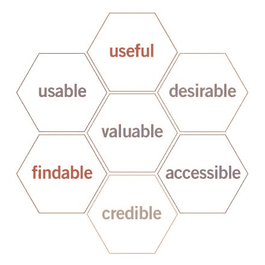
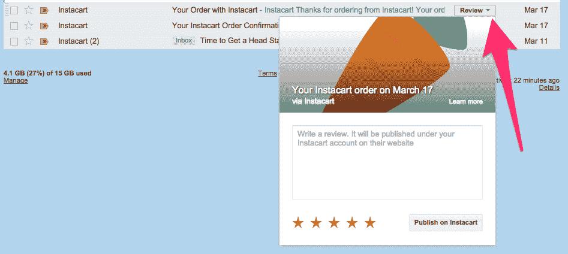
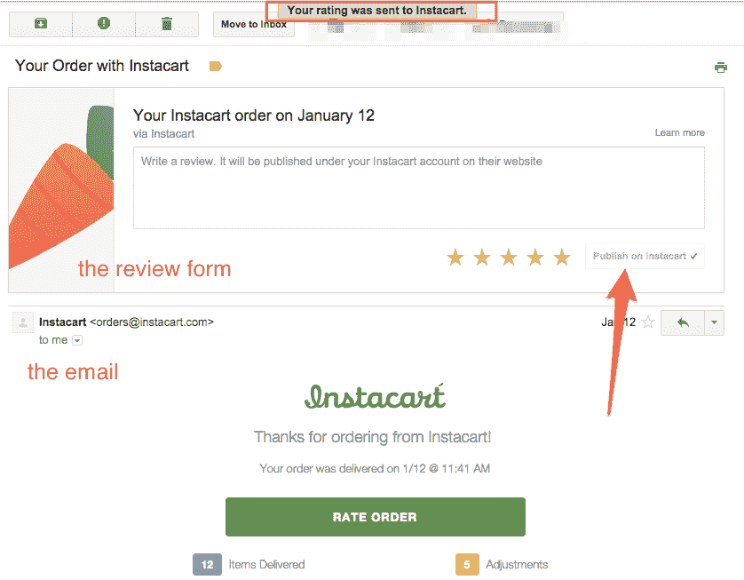

# 电子邮件是用户体验- Customer.io

> 原文：<http://customer.io/blog/email-whole-user-experience.html?utm_source=wanqu.co&utm_campaign=Wanqu+Daily&utm_medium=website>

人们总是愿意相信他们的创造本身就说明了一切。

由于这种*梦想的领域*“建立它，他们就会来”的心态(加上对被视为垃圾邮件的非理性恐惧)，在建立一个产品所投入的思想和投资与关于它的电子邮件所投入的如此之少之间经常存在惊人的脱节。

然而，电子邮件是你产品的一部分。从注册到用户生命周期中每隔一个[的时刻](http://customer.io/blog/lifecycle-email-guide.html)，电子邮件就像一种及时但不同步的粘合剂，将你和客户在他们的地盘上连接起来。

“不要错误地认为关于你产品的电子邮件不是产品的一部分，”云软件协会主席 Sunir Shah 警告说。"最重要的电子邮件是产品体验的一部分."

## 电子邮件也是用户体验

认为你的产品如此之好，这本身就说明了这是一种以自我为中心的狭隘观点。

这种对客户观点的忽视——他们有自己的生活，他们的世界并不围绕你的产品旋转——导致了把电子邮件通信当作商业插件而不是元素。你的世界不应该只围绕你产品的一点一滴旋转。“该产品不仅仅是网络应用或移动应用。这是最终用户完成目标所需的整个流程，”Sunir 解释道。

想想彼得·莫维尔著名的[用户体验蜂巢](http://semanticstudios.com/user_experience_design/)，它展示了用户体验的哪些方面实际上帮助人们完成他们的目标。你会发现，所有类型的电子邮件都可以在每个蜂窝单元中产生重大影响:

<noscript></noscript>

*   **有用**:你的产品最终有用吗？你在帮助人们完成某件事或朝着某个目标前进吗？
*   **可用**:你的产品好用吗？
*   **合意**:你的产品建立情感亲和力了吗？讨人喜欢吗？
*   你的产品容易导航吗？
*   **无障碍** : Morville 定义了关于残疾人的无障碍，还有其他[无障碍考虑](http://www.paznow.com/ucd/)，如语言障碍、压力水平、安全感和低自信。
*   **可信**:你的产品建立信任了吗？
*   **有价值的**:你的产品能传递价值并推进使命吗？

你所有的电子邮件都应该服务于一个明确的目的，不仅仅是推动用户做你希望他们做的事情，而是推动他们的用户体验向前发展。然后，它们在你的业务中扮演着极其强大和重要的角色——弥合你的产品中的 UX 差距，解决基本日常生活中的 UX，忙碌的人不会记得回到你的网站或应用程序。

## 对抗分散的客户体验

客户与您的产品或服务的接触超越了设备或网站的界限，无论是计算退款、在实时聊天中获得紧急问题的答案、跟踪在线订购的包裹，还是阅读有用的案例研究或博客帖子。这就是"[整体客户体验](http://conversionxl.com/think-about-customer-experience-not-just-conversion-optimization/)"当你看到这种更全面的观点时，Peep Laja 说，“**每一次顾客体验都是你的关键时刻。**

电子邮件不仅仅是您的网站或应用程序的未充分利用的返程票，它们还是改善您的客户的整体体验的机会，从通过有用的入职电子邮件和简讯进行教学，到通过摘要电子邮件等提供有价值的见解。

电子邮件已经变得更像是一个明确的界面，让人们不用离开收件箱就可以完成相关的操作。例如，在 [Gmail](https://developers.google.com/gmail/markup/) 中，你可以执行确认订阅、回复活动以及向队列添加项目等任务。

Instacart 提供了一个很好的整体客户体验的例子，这种体验建立在用户不会(也不应该)粘着他们的网站或应用的理解之上。他们使用各种信息(电子邮件、短信，甚至电话)来构建整个体验，目的不仅仅是运送杂货，而是让互动流对客户最有意义。否则，他们可能会把食品杂货递送变成和等待有线电视员一样令人沮丧的事情。

下单后，Instacart 会发送以下电子邮件:

*   **您的 Instacart 订单确认**(订单和交付详情，更新订单的能力)
*   **Instacart 送货提醒**(当送货未设置为当天时特别有用)
*   Instacart 正在路上！(预计到达时间——很高兴知道，因为我应该回家拿我的杂货了！)
*   **您在 Instacart 上的订单**(提供订单摘要和最终的总费用)

请注意本次互动中的最后一封电子邮件。收件箱里有一个“查看”按钮。点击它，你就可以发送评论和评级，而不用离开收件箱，甚至不用打开电子邮件。

<noscript>T3】</noscript>

如果您打开此电子邮件查看您的订单，您仍然可以在不离开电子邮件客户端的情况下发布评论:

<noscript>T3】</noscript>

当你的冰箱里有新鲜的食物时，你想回到网站留下评论的可能性是最低的。通过将电子邮件融入整个用户旅程，Instacart 能够为客户和企业带来快乐。

* * *

如果每封电子邮件都是改善用户体验的机会，那么你就不得不[在每次沟通中始终考虑客户的具体背景和情况。这是又一颗巨大的钉子钉在令人讨厌的、音盲的批量发送信息的棺材上。](http://customer.io/blog/personalized-emails-for-successful-campaigns.html)

然而，根据 Econsultancy 的一项调查，即使在今天，也只有 20%的营销人员使用基于网络活动的行为营销。这是一个很大的空间来给你的客户带来惊喜、愉悦和帮助，并在一方面是无线电静默方法，另一方面是喷雾和垃圾邮件的海洋中脱颖而出。

仅仅有你的产品还不足以获得成功。人们是否体验到同理心、服务和价值——无论是在你的应用内部还是外部——将决定你的定义。

<small>*标题图片:[克里斯贝克特/Flickr](https://www.flickr.com/photos/62558594@N00/14703730507/)*T5】</small>