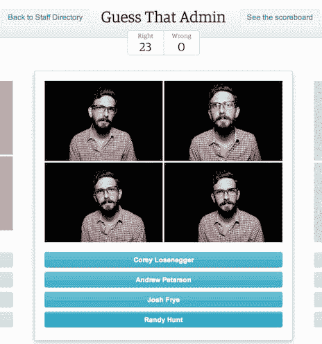
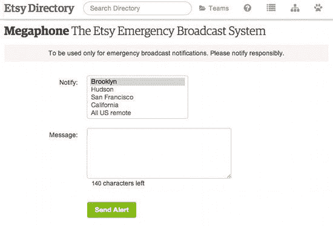
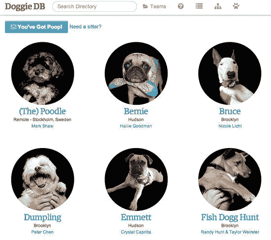

# Etsy 工程|员工数据库文化黑客

> 原文：<https://codeascraft.com/2013/05/31/culture-hacking-with-a-staff-database/?utm_source=wanqu.co&utm_campaign=Wanqu+Daily&utm_medium=website>

当你的初创公司只有你和猫的时候，你公司的沟通问题很大程度上在于，当你让猫离开你的键盘时，它听不听。扩大到少数人，你仍然知道每个人，他们在做什么，他们在哪里，以及当你需要他们的时候如何找到他们。随着规模的进一步扩大，沟通变得越来越复杂。然后大自然向你扔来一场飓风，你真的需要知道每个人都平安无事，而且要迅速有效地做到这一点。

我们试图用一个开放的、可访问的员工数据库来解决“谁”的问题。

## 释放您的员工数据

大多数公司都会有某种形式的人力资源系统，里面有各种有用的信息，但其中大部分都是私人的和机密的，并被锁起来(这样做是正确的)。我们需要的是更基本的东西:这个人是谁？他们长什么样？他们在哪里？他们是做什么的？我如何与他们取得联系？

但是，因为我们将人力资源数据和“安全”数据重新发布到数据库中，所以员工目录数据完全在我们的掌握之中。我们不受制于人力资源信息系统的设计者认为人们应该看什么。如果我们需要的改变了，我们可以适应。

更好的是，因为这些数据与我们的常规网站数据在同一个生态系统中，任何知道如何为 etsy.com 做点什么的人也可以用我们的员工数据做点什么，而不需要特别的额外知识。让黑客攻击变得容易(不足为奇)会导致更多的黑客攻击，而更多的黑客攻击会让有用的和意想不到的工具突然出现，帮助你更好地扩展，而不需要任何特定的中央规划。

## 你是谁？

在这个数据库的基础上建立一个“员工目录”是显而易见的。我们有一个，很棒。它与我们其他基于网络的内部支持工具共存，所有人都可以轻松使用。对于一个愉快地超越了邓巴的数字 T1 的组织来说，帮助我们为公司中的名人保持一种“外部大脑”是至关重要的。(这是一个持续的问题，因为我们[仍在招聘](https://careers.etsy.com/global/en)。)

延伸一下，在过去的黑客周期间，我们一群人制作了一个游戏，给你一张某人的照片，以及他们是谁的多种选择。除了分数跟踪和排行榜，我们还让人们热情地了解公司里的每个人。(这对于一些人来说太容易了，所以我们很快开发了一种模式，在这种模式下，你必须输入正确的名字——这种游戏相当于在走廊上遇见他们。)

## 平滑小突起和大突起

黑客不一定要复杂才有用。在目录中添加一个“你有邮件”按钮，简化了对办公室收到的物理邮件进行分类的过程，这意味着人们不必定期去查看邮件室。能够解决像这样的小问题会让你感觉办公室运转良好。

它们甚至不必是有用的永久特性——一次性查询也可能很有价值。有一次，我需要找出我的哪些同事在 Etsy 上卖古董，以便对一个新功能做一些研究。我本可以给每个人发电子邮件并希望得到回复，但是我可以从目录中提取员工商店的列表，然后从列表中提取它们的列表，并精确地计算出谁出售了 vintage。

## 你还好吗？

在飓风桑迪期间，我们希望能够进行点名，以确保我们的同事安然无恙，这是对数据的一种更为紧急和即兴的使用。将数据、姓名、位置、电话号码和团队导出到 CSV 并导入到 Google Docs 中是很简单的事情，然后我们有了一个共享文档，可以跟踪每个人的情况。

与此同时，我们希望每个人都能够轻松地将每个人的联系方式输入到他们的手机中，以防我们需要快速联系到他人。谷歌和维基百科的一些快速检查产生了 vCard 规范，虽然不是最先进的，但 3.0 版本的非常适合快速入侵。(当然，更新的版本也很好，但是 3.0 满足了我在黑客方面投入的时间和精力。)

在完整的规范中有很多很多字段，但是确定我们关心的主要字段是一项非常重要的工作:姓名、电子邮件、电话号码和组织。我们碰巧还有一个 Skype nicks 字段，所以我继续添加了这个字段。(员工自愿在我们的员工数据库中输入他们的电话号码，vcard 只能在员工目录中访问，因此我们认为这些 vcard 是可以接受的。黑客入侵公司数据时，您应该始终考虑公司的数据来源和文化，以及信息安全问题。)

此外，我们在[关于我们](https://www.etsy.com/team)页面上有许多员工的照片，所以我做了一些快速的工作来添加一张我们有照片的地方。(vCard 规范允许您将照片嵌入为 base64 编码的字符串。)没什么复杂的，只需几分钟就能实现，但它为卡片增添了一份精美的光泽。

我们可以为部门和团队、整个组织、新员工等生成 vCards 集。，以便更轻松地管理您的联系人。

## 也许打电话给我

我们做的最后一个受飓风启发的黑客是一个紧急广播系统，以便我们可以通过短信快速更新员工关于快速变化的事件或紧急警报(如计划外的办公室关闭)。我们已经有了一个 [Twilio](http://www.twilio.com/) 帐户，以及可以使用它的 PHP 库，因此所需要的只是验证电话号码以确保它们是有效的美国号码，并提供一点代码来按位置过滤目录(例如，如果布鲁克林办公室关门了，我们只希望向布鲁克林人发送短信),实际发送只是向 Twilio REST API 发送一个合适的请求。该实现还包括大量的错误记录和报告等，因为知道没有提醒谁也很重要。

未来的工作可能包括扩展该系统以接受答复，这样我们就可以快速完成大量的点名工作，并能够集中精力寻找和帮助那些需要帮助的人。

## 当人力资源系统走向没落

我们的人员目录的数据库模式的一个显著特征是“人”列。办公室狗包是办公室文化中足够重要和固有的一部分，有必要将它们纳入数据库。过去的黑客周看到了一个完整的 Doggie DB 黑客扩展，让你更好地了解包。从表面上看，这似乎微不足道，但那是因为你不必按“你有便便”按钮…

所有这些攻击(a)都很容易，(b)在我们开始员工数据库项目时都没有预料到，以及(c)帮助我们发展业务并保证我们同事的安全和消息灵通。抓住你公司的数据，看看你能做什么。

你可以在推特上关注伊恩，地址是 [@indec](http://twitter.com/indec) 。