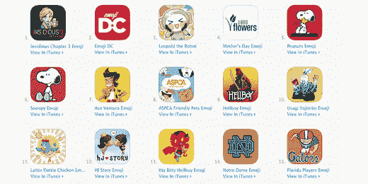

# 成功的移动应用创业者的 9 个日常习惯

> 原文：<http://thenextweb.com/entrepreneur/2015/06/02/9-daily-habits-of-successful-mobile-app-entrepreneurs/?utm_source=wanqu.co&utm_campaign=Wanqu+Daily&utm_medium=website>

在采访了 300 多名应用创业者后，我发现成功人士和幸存者之间有一些共同的特质。

是的，应用商店很拥挤。是的，有一些人靠应用程序勉强谋生。是的，淘金热的日子已经过去了。然而，新的成功故事不断涌现。为什么他们能够获得成功，而有那么多人只能勉强生存？

我收集了移动应用领域一些最成功的企业家的最佳日常习惯。

### #1:研究应用商店

晴空应用公司的本尼·沙维每天早上至少花 30 分钟研究应用商店。

他首先研究自己的应用程序，看看它们的表现如何，然后转向应用程序商店的评论，看看客户对他们的应用程序的感觉是否有任何变化。当新版本发布时，他会一天看几次客户评论。

[

<noscript></noscript>](https://thenextweb.com/wp-content/blogs.dir/1/files/2015/01/Appstore.jpg) 

每天研究应用商店的另一个原因是发现趋势。看看免费、付费和票房排行榜，看看最成功的应用程序做对了什么，以及如何改进。

这也将帮助你更好地了解 App Store 算法是如何工作的。

### #2:从可怕的应用程序中学习

不要只研究排名靠前的应用，你也应该下载排名靠后的应用，看看它们哪里做错了。

马修·霍尔， [Klick Tock](http://www.klicktock.com/) 的创始人和病毒式轰动 [Crossy Road](http://crossyroad.com/) 的创造者，曾经下载所有最新的应用程序(甚至是坏的),并预测哪些会成为苹果的特色。他痴迷于研究各种类型的游戏，从最恐怖的到最令人惊奇的。

[

<noscript></noscript>](https://thenextweb.com/wp-content/blogs.dir/1/files/2015/05/Swyft-Emoji-Keyboards-AppStore.jpg) 

通过研究优秀和糟糕的应用程序，他能够发现区分应用程序的主题、设计趋势和游戏机制。几个星期后，他能够准确地预测哪些游戏会被苹果公司采用，哪些游戏永远不会出现。

### #3:正确管理远程团队

与大多数企业相比，移动应用初创公司更倾向于依赖分布式团队——保加利亚的设计师、印度的开发者、菲律宾的客户支持。作为一家刚刚起步的初创公司，管理这些远程资源可能非常困难。

AppMakr 的首席执行官杰伊·夏皮罗依靠 15five.com 的 T2 从他的整个远程团队那里获得每周的事实和情感更新。在管理一个远程团队时，企业家需要了解人的因素是如何发展的，并且它不会阻碍业务的进程。

### #4:回复支持电话和电子邮件(即使是作为首席执行官)

前苹果软件工程师、现在的 Masslight 创始人丹尼尔·艾布拉姆斯每天都花时间亲自回复用户的支持电话或电子邮件。

[

<noscript></noscript>](https://thenextweb.com/wp-content/blogs.dir/1/files/2013/07/customer-service.jpg) 

他说，“当人们从首席执行官那里得到即时回应时，他们总是感到惊喜。”这个习惯有助于他保持关注，并继续确保他们的应用程序让人们开心，并鼓励更多的使用。

### #5:消费一些鼓舞人心的东西

“每天，我都会沉浸在至少一篇关于改变世界的技术的励志读物或讲座中，这些技术有可能影响十亿人。”David Gorodyansky 说， [AnchorFree](http://www.anchorfree.com) 的首席执行官和联合创始人， [Hotspot Shield](http://www.hotspotshield.com) 应用程序的开发者。

企业家的生活有许多起起落落，但通过阅读励志书籍或听 TED 演讲，你可以保持清醒的头脑，不要让高点变得太高，低点变得太低。

### #6:把一切都写下来

CallerSmart 的创始人布莱恩·克雷恩说:“最大的日常习惯就是把所有事情都写下来。”从大公司的目标到产品路线图，再到应用内的内容，把一切都写下来，这样你团队中的每个人都能理解公司的方向，并保持一致。

保持一个企业维基是管理你的团队的一个很好的方法，尤其是当他们分布在世界各地的时候。

[

<noscript></noscript>](https://thenextweb.com/wp-content/blogs.dir/1/files/2015/04/writing2.jpg) 

### #7:对数据进行基准测试

BeFunky 的创始人泰京·塔塔尔通过谷歌分析查看每日和每周的变化，并通过使用 T2 App Annie 查看 BeFunky 的商店排名和用户评论进行关联。

基准测试和跟踪趋势对于确保业务朝着正确的方向发展至关重要。每天分析你的分析可以让你看到趋势，并在需要改变时迅速行动。

### #8:零收件箱

前孩之宝(Hasbro)和 Leapfrog 高管南希·麦金太尔(Nancy MacIntyre)离开了企业界，创办了 [Fingerprint](http://fingerprintplay.com) ，她现在有 30 名员工和合作伙伴，如三星、迪士尼、Astro 等。

导致她成功的一个日常习惯是早上 7 点查看邮件，并尝试回复所有邮件。它启动了她的一天，并帮助她保持员工和合作伙伴的正轨。

### #9:记日记

在过去的两年半时间里， [Apple Sliced，](http://applesliced.com/)的创始人兼首席执行官马特·卡夫(Matt Kraft)每天早上都利用[的第一天](https://itunes.apple.com/us/app/day-one-journal-notes-diary/id421706526?mt=8)私下记录他作为一名企业家的进步。

[

<noscript></noscript>](https://thenextweb.com/wp-content/blogs.dir/1/files/2015/05/writing-product-story.jpeg) 

“这些页面仅供我阅读，很少重读。相反，我把写日记作为一种治疗方式，作为一种让我以全新的状态开始每一天的方式。除此之外，作为一个非写作者，养成每天写作的习惯非常有用。马特·克拉夫特说。

这里有 9 个技巧来推广你的应用程序

**阅读下一篇:** *[伟大网页设计师的 7 个习惯](https://thenextweb.com/news/7-habits-of-great-web-designers)*

*图片来源:[Shutterstock](http://shutterstock.com)T3】*