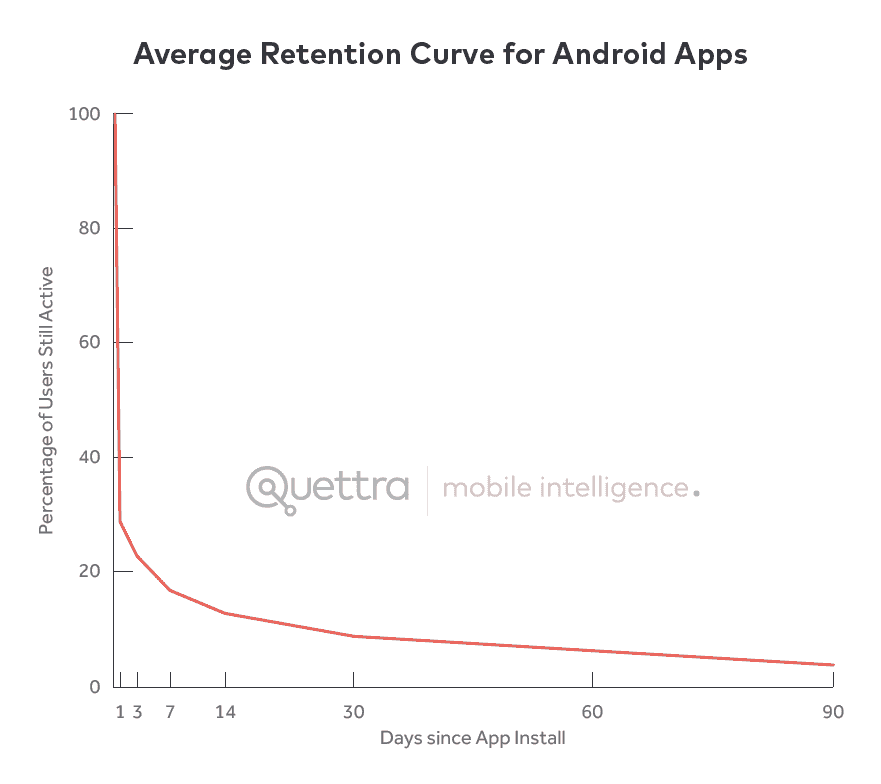

# 新的数据显示，失去 80%的移动用户是正常的，这也是为什么最好的应用在 andrewchen 做得更好

> 原文：<http://andrewchen.co/new-data-shows-why-losing-80-of-your-mobile-users-is-normal-and-that-the-best-apps-do-much-better/?utm_source=wanqu.co&utm_campaign=Wanqu+Daily&utm_medium=website>

在最近一篇关于[下一个功能谬误](http://andrewchen.co/the-next-feature-fallacy-the-fallacy-that-the-next-new-feature-will-suddenly-make-people-use-your-product/)的文章中，我解释了为什么发布“多一个功能”并不能修复你的产品。根本原因是普通应用的留存指标[非常糟糕](http://andrewchen.co/why-consumer-product-metrics-are-all-terrible/)。今天，我很兴奋地分享一些关于移动留存的真实数据。我曾与移动智能初创公司 [Quettra](https://www.quettra.com/) 及其创始人/首席执行官[Ankit Jain](https://twitter.com/jain_ankit)(Google Play 搜索+发现的前负责人)合作，根据超过 1.25 亿部手机的匿名数据点，整理了一些关于留存率**的独家数据/图表。

**Google Play 应用的平均留存率**
第一张图展示了一条留存率曲线:自首次安装以来已经过去的天数，以及在该特定日期活跃的用户比例。正如我的读者所知，这经常用在类似“D7 保留率为 40%”的句子中，这意味着在初始安装后的七天，这些用户中有 40%在那一天是活跃的。

这张图表看起来相当惊人:

[T2】](http://andrewchen.co/wp-content/uploads/2015/06/retention_graph_average.png)

根据 Quettra 的数据，我们可以看到，一般应用在安装后的前 3 天内会丢失 77%的 dau。30 天之内，它丢失了 90%的 dau。90 天内，超过 95%。令人惊叹。另一种说法是，一般的应用程序大多会在几个月内失去整个用户群，这就是为什么 Google Play 商店中超过 150 万个应用程序中，只有几千个保持有意义的流量。(*如果您感兴趣，脚注中有表格数据)

与我合作撰写本文的 Ankit Jain 对这一趋势评论道:

> 用户试用了许多应用程序，但在最初的 3-7 天内决定他们想要“停止使用”哪些应用程序。对于“体面”的应用程序，大多数保留 7 天的用户会停留更长时间。成功的关键是在关键的前 3-7 天让用户上钩。

这反映了我自己的经验，在我看来，改善这些保留曲线的最大杠杆作用发生在如何描述产品、入职流程，以及你为推动持续保留而设置的触发因素。这项工作通常集中在使用的第一天，而长期数字很难改变，无论你发送多少封提醒邮件。

请注意，当我们说这些 dau 正在“丢失”时，并不意味着用户突然变得完全不活跃——他们可能只是每周使用一次应用程序，或者每月几次。不同的应用有不同的使用模式，正如我在[中所写的，什么因素影响 MAU 毛？](http://andrewchen.co/what-factors-influence-daumau-nature-versus-nuture/)用 Flurry 的数据。仅仅因为你失去了一个每日活跃用户并不意味着你失去了一个每月活跃用户，然而因为两者相关，没有前者你就无法维持后者。

**💌 Are you up to date?**

获取新的更新，通常一周一次——以关于技术发展的长篇文章为特色。

最好的应用程序表现如何？好多了。
我们要讨论的第二张图是基于 Google Play 排名的留存曲线对比。数据显示有一个非常明确和直接的相关性:

顶级应用拥有更高的 D1 留存率，并以更强的绝对 D30 数结束。然而，有趣的是，从 D1 到 D30 的衰减与所有其他应用程序大致相同。另一种说法是，用户发现顶级应用程序立即有用，在第一周重复使用，下降的速度与普通应用程序大致相同。令人着迷。

对我来说，这进一步证实了弯曲保留曲线的最佳方式是针对最初几天的使用，尤其是第一次访问。这样，用户就为自己的成功做好了准备。虽然今天显示的数据与移动应用程序有关，但我见过桌面客户端和网站的数据，它们看起来都一样。因此，无论你是在开发移动应用还是其他应用，同样的想法也适用:

*   对于一个**博客产品**，你可能希望用户选择一个主题，一个名字，然后写他们的第一篇文章，让他们投入进来。
*   对于**社交服务**，你可能希望用户导入他们的地址簿并连接几个朋友，给他们一个强大的 feed 体验，并选择他们加入好友通知
*   对于一个 **SaaS 分析产品**，你可能希望用户把他们的 JS 标签放在他们的网站上，这样你就可以开始为他们收集数据并发送摘要邮件
*   对于一个**企业协作产品**，您可能希望用户启动一个新项目，并添加几个同事让他们开始

上面的每一个场景都可以有一个定性的激活目标，以及定量的结果来确保它真的发生了。无论你做什么，发送一大堆主题为“我们想念你”的垃圾邮件通知都不太可能使曲线明显弯曲。

我讨厌这些，你也应该这样。

(再次感谢 Quettra 的 Ankit Jain 分享这些数据并帮助我开发这个作品。[更多信息请点击这里](https://www.theinformation.com/which-apps-retail-their-users-and-which-ones-dont)，它调查了即时通讯应用的应用留存率)

***表格数据**

<colgroup><col> <col> <col> <col> <col> <col> <col> <col> <col></colgroup>
|  | Zero | one | three | seven | Fourteen | Thirty | Sixty | Ninety |
| 十大应用 | One hundred | Seventy-four point six seven | Seventy-one point five one | Sixty-seven point three nine | Sixty-three point two eight | Fifty-nine point eight | Fifty-five point one | Fifty point eight seven |
| 下 50 个应用 | One hundred | Sixty-four point eight five | Sixty point three one | Fifty-four point one three | Forty-nine point four eight | Forty-four point eight one | Thirty-nine point six | Thirty-four point five |
| 接下来的 100 个应用 | One hundred | Forty-eight point seven two | Forty-two point nine six | Thirty-five point nine three | Thirty point seven nine | Twenty-five point four five | Twenty-one point two five | Eighteen point nine eight |
| 接下来的 5000 个应用 | One hundred | Thirty-four point three one | Twenty-eight point five four | Twenty-one point six four | Seventeen point four three | Thirteen point six two | Ten point seven four | Eight point nine nine |
| 平均的 | One hundred | Twenty-nine point one seven | Twenty-three point four two | Seventeen point two eight | Thirteen point one one | Nine point five five | Six point eight two | Three point nine seven |

*** *方法论**
下面是一些方法论的笔记，由 Quettra 分享:

> Quettra 软件目前在全球超过 1.25 亿台 Android 设备上运行，收集设备上每个应用程序的安装和使用统计数据。在这份报告中，我们考察了从 2015 年 1 月 1 日开始的五个月的数据。
> 
> 由于我们在这项研究中只考虑 Android 用户，因此我们排除了谷歌应用程序(例如 Gmail、YouTube、地图、Hangouts、Google Play 等。)和其他常见的预装应用程序，以消除偏见。我们也只考虑全球安装量超过 10，000 的应用。
> 
> 关于隐私的说明，这对我们非常重要:我们收集的所有数据都是匿名的，我们的任何系统都不会收集任何个人身份信息。据我们了解，这是第一次对无处不在的移动应用使用进行如此大规模的分析。Quettra 与本报告中提到的任何应用或应用开发者都没有直接关系。

**PS. Get new updates/analysis on tech and startups**

我写一份高质量的每周时事通讯，报道硅谷发生的事情，关注创业、营销和移动领域。

在本网站链接的“内容”(包括帖子、播客、视频)中或在社交媒体和其他平台(统称为“内容分发渠道”)中发表的观点是我自己的，并不是 AH Capital Management、l . l . c .(“a16z”)或其各自附属公司的观点。AH 资本管理公司是一家在证券交易委员会注册的投资顾问公司。注册为投资顾问并不意味着任何特殊技能或培训。这些帖子不针对任何投资者或潜在投资者，也不构成出售或购买任何证券的要约，不得用于或依赖于评估任何投资的价值。

内容不应被解释为或以任何方式依赖于投资、法律、税务或其他建议。您应该向您自己的顾问咨询有关任何投资的法律、商业、税务和其他相关事宜。这些材料中表达的任何预测、估计、预测、目标、前景和/或观点可能会在不通知的情况下发生变化，并且可能与他人表达的观点不同或相反。此处提供的任何图表仅供参考，在做出任何投资决策时不应依赖。此处包含的某些信息来自第三方来源。虽然这些信息来自据信可靠的来源，但我并未独立核实这些信息，也未对这些信息的持久准确性或其在特定情况下的适当性做出任何陈述。该内容仅在所示日期有效。

在任何情况下，本网站或相关内容分销渠道上提供的任何帖子或其他信息都不应被解释为 a16z 人员发起、讨论或提及的任何集合投资工具中的任何证券或权益的购买或销售要约。也不应被理解为提供投资咨询服务的要约；投资 a16z 管理的集合投资工具的要约将单独提出，并且仅通过特定集合投资工具的保密要约文件提出，这些文件应完整阅读，并且仅提供给符合联邦证券法规定的特定资格的人。这些投资者被定义为合格投资者和合格购买者，通常被认为有能力评估潜在投资和财务事项的优点和风险。不能保证 a16z 的投资目标会实现或投资策略会成功。对 a16z 管理的投资工具的任何投资都包含很高的风险，包括损失全部投资金额的风险。提及、提及或描述的任何投资或投资组合公司并不代表 a16z 管理的所有投资工具，也不能保证这些投资将会盈利，也不能保证将来进行的其他投资会有类似的特征或结果。a16z 管理的基金所做的投资清单可在 https://a16z.com/investments/.获得。该清单不包括发行人未允许 a16z 公开披露的投资，以及对公开交易的数字资产的未宣布投资。Andreessen Horowitz 投资、集合投资工具或投资策略的过去结果不一定代表未来结果。请参见[https://a16z.com/disclosures](https://a16z.com/disclosures)了解更多重要信息。