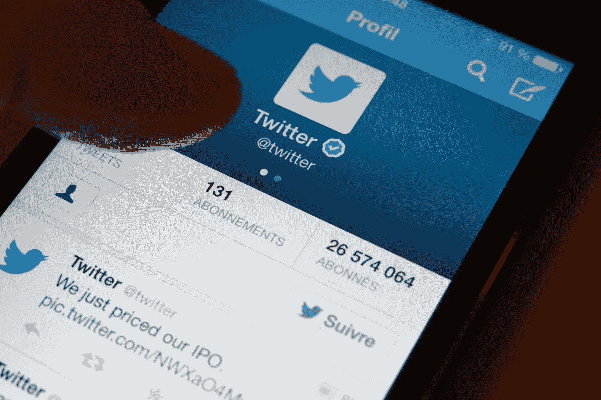
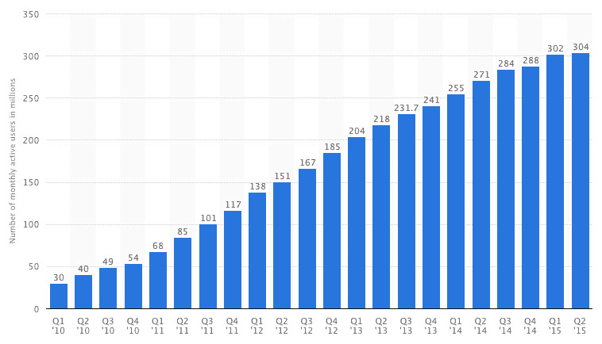

# 第三季度业绩疲软后，Twitter 股价下跌。这就是该公司苦苦挣扎的原因。- Vox

> 原文：<https://www.vox.com/2015/6/11/8761731/twitter-trouble-facebook-twtr?utm_source=wanqu.co&utm_campaign=Wanqu+Daily&utm_medium=website>

在该公司周二发布令人失望的第三季度业绩后，Twitter 股票在盘后交易中暴跌 11%。虽然 Twitter 实现了本季度的收入目标，但用户增长已经放缓至爬行状态，该公司向下修正了第四季度的财务业绩。几周前，首席执行官杰克·多西T5】[宣布裁员 8%的公司员工。](http://recode.net/2015/10/09/twitter-is-planning-company-wide-layoffs-for-next-week/)

多尔西正试图扭转 Twitter 一年来的糟糕表现。首席财务官安东尼·诺托(Anthony Noto)在 7 月份的最后一次财报电话会议上表示，“在我们开始进入大众市场之前，我们预计每月活跃用户不会出现持续、有意义的增长。”“我们预计这将需要相当长的一段时间。”

Twitter 的惨淡表现促使该公司最大的投资者之一，风险投资家克里斯·萨卡在今年早些时候写了一份被广泛阅读的备忘录,讨论 Twitter 的问题并提出一些解决方案。萨卡写道:“Twitter 未能达到自己宣称的用户增长预期，也未能利用大量注册账户后不再回来的用户。”

Twitter 的基本问题是，它没有脸书那样的大众市场吸引力，后者的用户数量是它的四倍多。但是没有明显的理由——除了公司的估值——认为这应该是个问题。可以说，Twitter 可以通过专注于当前的用户群来打造强大的业务。它没能显示出类似脸书的数字，而这正是华尔街真正想从 Twitter 得到的。因此，Twitter 面临着改变核心服务的压力，这可能会赶走其最忠实的粉丝。

### Twitter 又遭受了一个季度的亏损

Twitter 是互联网上最受欢迎的网站之一，拥有超过 3.2 亿用户。但该公司已经远远落后于脸书，用户增长最近也停滞不前。Twitter 表示，它仅增加了 400 万用户，从 3.16 亿用户增长到 3.2 亿用户。相比之下，脸书大约有 15 亿用户。

尽管收入巨大且不断增长，该公司仍难以盈利。Twitter 在 2014 年亏损了 5.78 亿美元。在 2015 年的前六个月，Twitter 的收入令人印象深刻，为 9.38 亿美元，但该公司亏损了 2.99 亿美元。

周二，Twitter 透露，第三季度带来了更多同样的情况。收入为 5.69 亿美元，较去年第三季度收入大幅增长。但该公司在该季度损失了 1.32 亿美元，低于 2014 年第三季度的损失，但对于一家用户增长几乎停止的公司来说，这仍然令人不安。

### Twitter 针对高级用户进行了优化

<picture class="c-picture" data-cid="site/picture_element-1668357009_7360_201450" data-cdata="{&quot;asset_id&quot;:3779352,&quot;ratio&quot;:&quot;*&quot;}"><source srcset="https://cdn.vox-cdn.com/thumbor/PL1zcSFjHtCBkIqJn9hphd9AbLk=/0x0:4928x3280/320x0/filters:focal(0x0:4928x3280):format(webp):no_upscale()/cdn.vox-cdn.com/uploads/chorus_asset/file/3779352/GettyImages-187222006.0.jpg 320w, https://cdn.vox-cdn.com/thumbor/aRd13pmcnk-Wx3eOIL-4WbExHwA=/0x0:4928x3280/520x0/filters:focal(0x0:4928x3280):format(webp):no_upscale()/cdn.vox-cdn.com/uploads/chorus_asset/file/3779352/GettyImages-187222006.0.jpg 520w, https://cdn.vox-cdn.com/thumbor/DZ8Nt4QrHRfEaJQ0nlm9psriFEg=/0x0:4928x3280/720x0/filters:focal(0x0:4928x3280):format(webp):no_upscale()/cdn.vox-cdn.com/uploads/chorus_asset/file/3779352/GettyImages-187222006.0.jpg 720w, https://cdn.vox-cdn.com/thumbor/GQczJ7DuONQg4cHrVGeXxPFHLck=/0x0:4928x3280/920x0/filters:focal(0x0:4928x3280):format(webp):no_upscale()/cdn.vox-cdn.com/uploads/chorus_asset/file/3779352/GettyImages-187222006.0.jpg 920w, https://cdn.vox-cdn.com/thumbor/_1HwSs-TeLRzF-tzVy6aK3V2k8g=/0x0:4928x3280/1120x0/filters:focal(0x0:4928x3280):format(webp):no_upscale()/cdn.vox-cdn.com/uploads/chorus_asset/file/3779352/GettyImages-187222006.0.jpg 1120w, https://cdn.vox-cdn.com/thumbor/TTRCv-GnyBlTYs-mnW6g1Qdv-xQ=/0x0:4928x3280/1320x0/filters:focal(0x0:4928x3280):format(webp):no_upscale()/cdn.vox-cdn.com/uploads/chorus_asset/file/3779352/GettyImages-187222006.0.jpg 1320w, https://cdn.vox-cdn.com/thumbor/QkGigfvvVCykAUD0oCsmxX3t8fg=/0x0:4928x3280/1520x0/filters:focal(0x0:4928x3280):format(webp):no_upscale()/cdn.vox-cdn.com/uploads/chorus_asset/file/3779352/GettyImages-187222006.0.jpg 1520w, https://cdn.vox-cdn.com/thumbor/7PnqHgAtHIUY4nR4g5XjP51uNtw=/0x0:4928x3280/1720x0/filters:focal(0x0:4928x3280):format(webp):no_upscale()/cdn.vox-cdn.com/uploads/chorus_asset/file/3779352/GettyImages-187222006.0.jpg 1720w, https://cdn.vox-cdn.com/thumbor/Qqmpp7DU09Kxqe32JgyhN_wUU_o=/0x0:4928x3280/1920x0/filters:focal(0x0:4928x3280):format(webp):no_upscale()/cdn.vox-cdn.com/uploads/chorus_asset/file/3779352/GettyImages-187222006.0.jpg 1920w" sizes="(min-width: 1221px) 846px, (min-width: 880px) calc(100vw - 334px), 100vw" type="image/webp"></picture>

(达米恩·迈耶/法新社/盖蒂图片社)

Twitter 的许多优势和劣势都来自于这样一个事实:用户时间表中的推文是严格按照时间顺序显示的。任何时候登录 Twitter，你都可以看到你关注的人的最新推文。

这种对近期的关注使得 Twitter 对于某些类型的用户来说是不可或缺的。例如，如果你是一名追踪突发新闻的记者，Twitter 是迄今为止最好的信息来源。对于整天坐在电脑前的人来说，Twitter 是一个了解最新对话的好方法。

但严格按照时间倒序来展示推文会让这项服务对临时用户没那么有用。那些工作不需要坐在电脑前的人可能一天只签到一两次。他们更关心看到最重要的信息，而不是最新的。脸书的新闻订阅就是为这些用户设计的。它使用一种专有算法来预测用户最可能关心的帖子，确保你看到朋友的婚礼和怀孕公告。

直到最近，Twitter 都没有这么做。由于 Twitter 没有努力对推文进行优先排序，用户不得不做更多的工作来让它变得有用。超级用户精心挑选了他们关注的人的名单，以优化他们的 Twitter 体验。很多普通用户没有时间做这个，结果 Twitter 让他们感到混乱不堪。

这些订购帖子的不同方案导致这两个网站被以不同的方式使用。脸书已经成为普通用户与朋友和家人分享个人内容的最受欢迎的方式。相比之下，Twitter 的使用方式更加人性化。人们使用 Twitter 来查看他们最喜爱的名人、记者和其他公众人物的推文，了解最新新闻，并分享对当天新闻的尖刻见解。

这种差异产生了巨大的商业后果，因为想要与朋友和家人保持联系的人数远远多于想要了解时事的人数。2015 年 6 月，脸书拥有 14.9 亿月活跃用户，是 Twitter 3.2 亿活跃用户的四倍多。

虽然脸书的用户数量是 Twitter 的四倍半，但脸书的收入却是 Twitter 的近八倍。

Twitter 认识到这是一个问题，并开始尝试新功能，以帮助临时用户从服务中获得价值。今年早些时候，该公司增加了“当你不在的时候”功能，以显示自你上次登录以来发布的一些热门推文。几周前，Twitter 推出了 Twitter Moments，展示关于突发新闻故事的精选推文集合。Twitter 希望这样的功能能够推动公司的增长，但现在说这一战略是否奏效还为时过早。

### Twitter 正在落后于其他社交媒体网站

按照大多数标准，一家拥有 3.2 亿用户、年收入超过 10 亿美元的公司是一个巨大的成功。但 Twitter 在 2013 年成为一家上市公司，因此它面临着来自华尔街的持续增长压力。

Twitter 没有提供:

<picture class="c-picture" data-cid="site/picture_element-1668357009_9824_201451" data-cdata="{&quot;asset_id&quot;:3920888,&quot;ratio&quot;:&quot;*&quot;}"><source srcset="https://cdn.vox-cdn.com/thumbor/Fn6atXcdu80uRuIQkU1JAikCmEk=/0x0:758x434/320x0/filters:focal(0x0:758x434):format(webp):no_upscale()/cdn.vox-cdn.com/uploads/chorus_asset/file/3920888/Screen_Shot_2015-07-30_at_11.57.07_AM.0.png 320w, https://cdn.vox-cdn.com/thumbor/DVPKHxRei2j1RDwrACUKly03Zro=/0x0:758x434/520x0/filters:focal(0x0:758x434):format(webp):no_upscale()/cdn.vox-cdn.com/uploads/chorus_asset/file/3920888/Screen_Shot_2015-07-30_at_11.57.07_AM.0.png 520w, https://cdn.vox-cdn.com/thumbor/AYfhQ6blBh8Y5QlSDxTjfymY3hE=/0x0:758x434/720x0/filters:focal(0x0:758x434):format(webp):no_upscale()/cdn.vox-cdn.com/uploads/chorus_asset/file/3920888/Screen_Shot_2015-07-30_at_11.57.07_AM.0.png 720w, https://cdn.vox-cdn.com/thumbor/w2PZIGnLqB1MWaPli7Q2i1Cvv7Q=/0x0:758x434/920x0/filters:focal(0x0:758x434):format(webp):no_upscale()/cdn.vox-cdn.com/uploads/chorus_asset/file/3920888/Screen_Shot_2015-07-30_at_11.57.07_AM.0.png 920w, https://cdn.vox-cdn.com/thumbor/AScP6_tzPn1ptVYMxcN0WwR9YPU=/0x0:758x434/1120x0/filters:focal(0x0:758x434):format(webp):no_upscale()/cdn.vox-cdn.com/uploads/chorus_asset/file/3920888/Screen_Shot_2015-07-30_at_11.57.07_AM.0.png 1120w, https://cdn.vox-cdn.com/thumbor/xJQOcdVIErXF_u_CRQ2LYov3YH8=/0x0:758x434/1320x0/filters:focal(0x0:758x434):format(webp):no_upscale()/cdn.vox-cdn.com/uploads/chorus_asset/file/3920888/Screen_Shot_2015-07-30_at_11.57.07_AM.0.png 1320w, https://cdn.vox-cdn.com/thumbor/W7RTCdp8detU_skVgZRZYsWUwIk=/0x0:758x434/1520x0/filters:focal(0x0:758x434):format(webp):no_upscale()/cdn.vox-cdn.com/uploads/chorus_asset/file/3920888/Screen_Shot_2015-07-30_at_11.57.07_AM.0.png 1520w, https://cdn.vox-cdn.com/thumbor/t1UQ9q8bvrUg_ZjjS58laY7B3R0=/0x0:758x434/1720x0/filters:focal(0x0:758x434):format(webp):no_upscale()/cdn.vox-cdn.com/uploads/chorus_asset/file/3920888/Screen_Shot_2015-07-30_at_11.57.07_AM.0.png 1720w, https://cdn.vox-cdn.com/thumbor/g7oQCearaHG5tM1u55F4xKjw6oQ=/0x0:758x434/1920x0/filters:focal(0x0:758x434):format(webp):no_upscale()/cdn.vox-cdn.com/uploads/chorus_asset/file/3920888/Screen_Shot_2015-07-30_at_11.57.07_AM.0.png 1920w" sizes="(min-width: 1221px) 846px, (min-width: 880px) calc(100vw - 334px), 100vw" type="image/webp">  </picture> 

( [Statista](http://www.statista.com/statistics/282087/number-of-monthly-active-twitter-users/) )

2012 年，Twitter 增加了 6600 万用户，增长率接近 50%。2013 年，该公司增加了 5100 万用户，增长率为 25%。2014 年，该公司增加了 4700 万用户，增长率为 18%。2015 年 3 月至 6 月，该公司仅增加了微不足道的 200 万用户。6 月至 9 月间，Twitter 仅新增了 300 万用户。(所有这些数字都忽略了的纯短信用户，这些用户在最近几个季度增长更快——但没那么快。)

与此同时，其他社交网络的受众规模正在超过 Twitter。2014 年末，insta gram(2012 年被脸书收购)[的规模超过了 Twitter](http://techcrunch.com/2014/12/10/not-a-fad/) 。Snapchat 正在[快速增长](http://www.businessinsider.com/snapchats-monthly-active-users-may-be-nearing-200-million-2014-12)，今年可能会超过 Twitter。

这对 Twitter 来说尤其成问题，因为广告业务存在规模经济。最大的互联网公司——目前是搜索领域的谷歌和社交媒体领域的脸书——可以为广告商提供一站式购物和极其精确的广告定位，比较小的服务产生更多的每用户收入。现在，3.2 亿用户可能看起来很多，但几年后可能不足以达到社交媒体网站的顶级水平。

### Twitter 损失了很多钱

<picture class="c-picture" data-cid="site/picture_element-1668357009_4030_201452" data-cdata="{&quot;asset_id&quot;:4113302,&quot;ratio&quot;:&quot;*&quot;}"><source srcset="https://cdn.vox-cdn.com/thumbor/kn6cwdFhkgtIwONO9GGjexrswuc=/0x0:1922x592/320x0/filters:focal(0x0:1922x592):format(webp):no_upscale()/cdn.vox-cdn.com/uploads/chorus_asset/file/4113302/Screen_Shot_2015-09-30_at_7.11.09_PM.0.png 320w, https://cdn.vox-cdn.com/thumbor/FnfPMTDePyVVp7DkF-TvMkVzRG4=/0x0:1922x592/520x0/filters:focal(0x0:1922x592):format(webp):no_upscale()/cdn.vox-cdn.com/uploads/chorus_asset/file/4113302/Screen_Shot_2015-09-30_at_7.11.09_PM.0.png 520w, https://cdn.vox-cdn.com/thumbor/-3aYIYNmc4fvOrEIpkawzvwKYSE=/0x0:1922x592/720x0/filters:focal(0x0:1922x592):format(webp):no_upscale()/cdn.vox-cdn.com/uploads/chorus_asset/file/4113302/Screen_Shot_2015-09-30_at_7.11.09_PM.0.png 720w, https://cdn.vox-cdn.com/thumbor/6OSJZ9N17hrz8K_XeewlCwuUy0o=/0x0:1922x592/920x0/filters:focal(0x0:1922x592):format(webp):no_upscale()/cdn.vox-cdn.com/uploads/chorus_asset/file/4113302/Screen_Shot_2015-09-30_at_7.11.09_PM.0.png 920w, https://cdn.vox-cdn.com/thumbor/y1bEt6siEndq0gybZ4fjVbt5xI0=/0x0:1922x592/1120x0/filters:focal(0x0:1922x592):format(webp):no_upscale()/cdn.vox-cdn.com/uploads/chorus_asset/file/4113302/Screen_Shot_2015-09-30_at_7.11.09_PM.0.png 1120w, https://cdn.vox-cdn.com/thumbor/P69SyD_CsDm1W0W3S4RQUwt1f1Q=/0x0:1922x592/1320x0/filters:focal(0x0:1922x592):format(webp):no_upscale()/cdn.vox-cdn.com/uploads/chorus_asset/file/4113302/Screen_Shot_2015-09-30_at_7.11.09_PM.0.png 1320w, https://cdn.vox-cdn.com/thumbor/11cTRZJ3kffXioZUjBmi-EBbwCg=/0x0:1922x592/1520x0/filters:focal(0x0:1922x592):format(webp):no_upscale()/cdn.vox-cdn.com/uploads/chorus_asset/file/4113302/Screen_Shot_2015-09-30_at_7.11.09_PM.0.png 1520w, https://cdn.vox-cdn.com/thumbor/Yu_avD9SKreg3VUmZYqe8AuQZPI=/0x0:1922x592/1720x0/filters:focal(0x0:1922x592):format(webp):no_upscale()/cdn.vox-cdn.com/uploads/chorus_asset/file/4113302/Screen_Shot_2015-09-30_at_7.11.09_PM.0.png 1720w, https://cdn.vox-cdn.com/thumbor/i9veRCjEQyN8nBn14B7z8JNZfRk=/0x0:1922x592/1920x0/filters:focal(0x0:1922x592):format(webp):no_upscale()/cdn.vox-cdn.com/uploads/chorus_asset/file/4113302/Screen_Shot_2015-09-30_at_7.11.09_PM.0.png 1920w" sizes="(min-width: 1221px) 846px, (min-width: 880px) calc(100vw - 334px), 100vw" type="image/webp"></picture>

Twitter 的股价低于其 2013 年 IPO 时的水平。( [MSN 钱](http://www.msn.com/en-us/money/stockdetails?symbol=US:TWTR))

Twitter 上加速增长的压力有助于解释该公司的一个令人困惑的事实:它正在亏损。2014 年，Twitter 亏损 5.78 亿美元，仅略低于该公司 2013 年的 6.45 亿美元。

对于一家拥有 3.2 亿用户的公司来说，扭亏为盈应该不难。事实上，Twitter 在 2014 年获得了 14 亿美元的收入，是 2013 年 6.65 亿美元收入的两倍多。但是公司的成本增长几乎一样快。2014 年，Twitter 在研发上花费了 6.92 亿美元，在销售和营销上花费了 6.14 亿美元。

Twitter 在 2015 年的前九个月又亏损了 4 . 3 亿美元，几乎与 2014 年同期的 4 . 52 亿美元持平。

如果亏损反映的是未来会带来更快速增长的投资，那么亏损不一定是值得担忧的。Twitter 的问题是，它似乎在工程和营销计划上花了很多钱，但似乎没有产生多少增长。

### Twitter 正试图提高其在第三方开发者中的声誉

Twitter 早期的优势之一是充满活力的第三方开发者生态系统。例如，当 iPhone 在 2007 年迎来现代智能手机时代时，Twitter 推出移动 Twitter 应用程序的速度相对较慢。但幸运的是，Twitter 是一个开放平台，第三方介入提供客户需要的移动应用程序。

<q aria-hidden="true" class="right">一家拥有 3.2 亿用户的公司扭亏为盈应该不难</q>

但 2012 年一切都变了，Twitter [有效地扼杀了第三方 Twitter 应用](https://blog.twitter.com/2012/changes-coming-to-twitter-api)。它这样做是因为 Twitter 用户分散在多个应用程序中，这使得 Twitter 更难提供一致的用户体验。此外，第三方应用的流行使得 Twitter 更难获得广告收入。

但是杀死第三方客户有长期的成本。通过激怒平台上的第三方开发者，Twitter 失去了扩展 Twitter 生态系统的重要新思路来源。现在扩展 Twitter 的想法必须来自 Twitter 本身。在过去的几年里，这些想法少之又少。

Twitter 的新任首席执行官杰克·多西认识到这是一个问题，他一直在努力赢回开发者的支持。上周，他[为 Twitter 之前的行为公开道歉](http://www.theverge.com/2015/10/21/9586084/jack-dorsey-twitter-ceo-apology-developers)，并要求开发者再给他一次机会。

### 人们有很多修复 Twitter 的想法

随着 Twitter 一个季度又一个季度发布糟糕的财务业绩，各种各样的人都在思考这家社交媒体公司如何走出当前的低迷。

专注于变得更容易接近。这可能是最常见的建议，也是 Twitter 的发展方向。基本的想法是，普通用户发现今天的 Twitter 令人困惑和不知所措，Twitter 应该努力使其提供的丰富信息更容易被普通用户获取。例如，今年早些时候，投资者克里斯·萨卡[写了一份备忘录](http://lowercasecapital.com/2015/06/03/what-twitter-can-be-2/)，建议 Twitter 建立一系列频道，让人们能够快速找到关于特定话题的信息，如运动队、电视节目或选举。多尔西似乎把这个建议放在心上，因为最近推出的 Moments 功能就是这样做的。

Sacca 还鼓励 Twitter 放松推文应该严格按照时间倒序出现的假设。相反，当用户登录时，平台应该显示自上次登录以来出现在用户时间线上的最有趣和最有见地的推文。今年早些时候，Twitter 在这个方向上迈出了一小步，推出了“当你不在的时候”功能，但 Twitter 的界面仍然基本上基于显示最近的推文。

我在这里提出的反驳是，一个更容易理解的 Twitter 版本已经存在。它叫做脸书，非常受欢迎。危险在于，模仿脸书可能会比吸引新用户更快地疏远现有用户。

**重新关注第三方应用。分析师 Ben Thompson 提出的[的另一个选择是建立许多不同的应用程序，让人们以不同的方式与 Twitter 平台互动。不同的应用可以针对不同类型的用户，其中一些为高级用户提供高级功能，而另一些则为普通用户提供从 Twitter 的大量信息中提取价值的简单方法。](https://stratechery.com/2015/twitter-might/)**

最好的办法是鼓励第三方开发 Twitter 应用。但这很棘手，因为自 2012 年以来，Twitter 已经与开发者断绝了很多联系。多尔西最近向开发者公开道歉，是为了修复这些关系，鼓励更多人为 Twitter 的平台建设。

**卖给谷歌。**Twitter 最有价值的资产之一是对此时此刻正在发生的事情的无与伦比的观察。这些知识可能对谷歌非常有用，谷歌的使命是“组织全世界的信息”。今年早些时候，谷歌和推特[签署了一项协议](http://www.bloomberg.com/news/articles/2015-02-05/twitter-said-to-reach-deal-for-tweets-in-google-search-results)，让谷歌更容易实时索引推文。但是，如果 Twitter 是谷歌的子公司，搜索巨头可能会找到更多的方法从这些数据中提取价值——而不需要对主要的 Twitter 应用程序进行重大更改。

这里的大问题是 Twitter 可能太贵了。Twitter 目前价值约 200 亿美元，即使对谷歌这样的庞然大物来说，这也是一大笔钱。通过今年早些时候签署的战略合作伙伴关系，谷歌或许能够以很小的代价实现许多相同的目标。

只关注高级用户。Vox 的 Matt Yglesias 的[主张](http://www.vox.com/2014/5/1/5672102/twitter-is-no-facebook-and-thats-fine)最后一个选择是，简单地接受 Twitter 永远不会成为脸书规模的大众市场产品，并尽可能地专注于服务它现在拥有的 3.2 亿热情用户。这一选择需要大幅削减研究和营销支出，这样 Twitter 就可以用有限的收入盈利。该公司还可能会更加专注于销售针对其极具影响力的用户群的优质广告。

这个选择的问题是华尔街会讨厌它。该公司目前 200 亿美元的估值是基于该公司将继续增长的假设。多尔西将面临巨大的压力来实现这一期望。

* * *

### Vox 视频:使用 Twitter 揭穿愚蠢的节目

### 

**[帮助保持这样的文章免费](http://vox.com/pages/support-now?itm_campaign=Nov-2022-midterms&itm_medium=site&itm_source=article-footer%20)**

理解美国的政治领域可能会让人不知所措。这就是 Vox 的用武之地。我们的目标是给每一个想要的人提供研究驱动的、智能的、可访问的信息。

【读者礼物】通过帮助保持我们的工作自由来支持这一使命——无论我们是为意想不到的事件添加微妙的背景，还是解释我们的民主是如何走到这一步的。虽然我们致力于保持 Vox 免费，但我们独特的解释性新闻确实需要大量资源。单靠广告不足以支撑它。[今天就为 Vox 制作一份礼物，帮助所有人保持这样的免费工作。](http://vox.com/pages/support-now?itm_campaign=Nov-2022-midterms&itm_medium=site&itm_source=article-footer)

 [是的，我会给 250 美元/年](https://vox.memberful.com/checkout?plan=) 

是的，我会给 250 美元/年

我们接受信用卡、Apple Pay 和 T2 Google Pay。您也可以通过投稿

