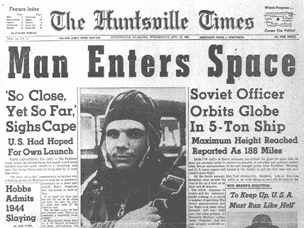
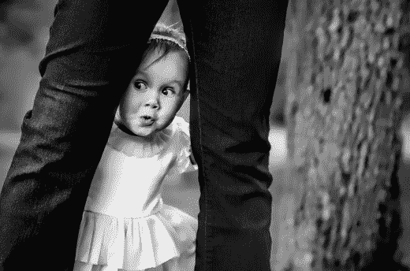
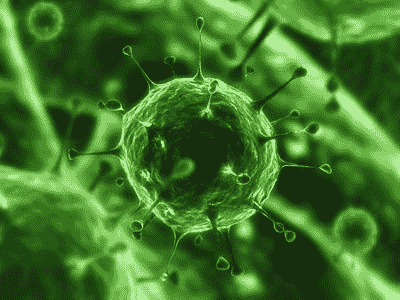
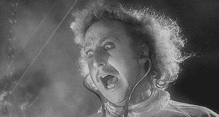

# 病毒内容背后的科学

> 原文：<http://thenextweb.com/insider/2015/06/14/the-science-behind-viral-content/?utm_source=wanqu.co&utm_campaign=Wanqu+Daily&utm_medium=website>

对于数字营销人员和在线内容提供商来说，创造病毒式内容是最终的胜利。当一条内容获得 100，000 次浏览时，你的品牌就有 100，000 次潜在转化。听起来不可能？其他人会这样做，你也可以——关键是要理解让内容病毒化背后的科学。

### **小差异很重要**

首先，让我们看看病毒式传播的机制。撇开滑板狗不谈，大多数内容的传播是因为几个单独的因素——而不是一个单一的灵丹妙药。即使是对你的内容分享频率有很小影响的因素，也会对你的整体浏览量产生巨大影响。

这里有一个例子。你和 100 个人分享一个内容。四个小时后，这些人中的百分之五会与另外 20 个人分享，其中的百分之五会做同样的事情，以此类推。三天后，1900 人已经看到了你的内容。现在，想象你想出了一个更好的标题，导致每 100 个人中有 7 个人分享它。

你可能会认为这会让你的总浏览量增加几千，但是你错了。三天后，它会给你带来惊人的 150，000 次浏览——增加了大约 7，500%。

那么到底是什么因素让内容病毒式传播呢？

### **笑声、娱乐和敬畏**

[

<noscript></noscript>](https://thenextweb.com/wp-content/blogs.dir/1/files/2015/06/01_453784086_519de37834.jpg) 

*图片来源:[static Flickr](https://c1.staticflickr.com/1/240/453784086_519de37834.jpg)T3】*

积极的情绪是让人们分享内容的关键。最近， [BuzzSumo](http://buzzsumo.com/) 分析了社交媒体上 10 万篇被广泛分享的文章，观察每篇文章产生的情绪。他们发现敬畏是最主要的情绪(25%)，其次是笑声(17%)，娱乐(15%)和喜悦(14%)——总共占 73%。负面情绪表现更差——愤怒占 6%，而悲伤仅占 1%。

### **标题极其重要**

[

<noscript></noscript>](https://thenextweb.com/wp-content/blogs.dir/1/files/2015/06/02_254888-newspaper-headline.jpg) 

*图片来源:[pcmag.com](http://www1.pcmag.com/medimg/254888-newspaper-headline.jpg)T3】*

在有人阅读你的内容之前，他们会看到标题。除非你的内容吸引了他们，让他们想点击进入，否则你的内容不会有任何进展。标题选择的影响可能是巨大的——[up worthy](https://www.upworthy.com/)表示，在某些情况下，改变标题会使他们的点击率增加 1600%。

### **最好的标题是个性化的、具体的**

[Buffer](https://buffer.com/) 最近分析了病毒帖中使用的热门词汇。这导致了两个有趣的结论。首先，使用“你”和“你的”这样的词的标题是最常见的。这些标题承诺与读者直接相关的价值，而不是谈论作者。

第二，像“这个”这样的词也能让标题成功，因为它们在读者心中创造了一个具体的形象——就像“这个母亲”而不是一般的母亲。

### **数字吸引人们的注意力**

数字也更有可能让你的内容成为病毒。事实上，用数字作为标题的开头——比如“消除飞行恐惧的 7 种方法”——比直接面对读者要有效得多。最近由[乐队指挥](http://www.conductor.com/)进行的一项调查要求人们选择他们最喜欢的标题类型。

数字标题以 36%的得票率高居榜首，而“如何做”标题获得了 17%的选票。这两种方法都有效，因为它们清晰明了，并承诺提供可操作的信息。有趣的是，最有效的数字似乎是 10，其次是 23。

### **利用好奇心缺口**

[

<noscript></noscript>](https://thenextweb.com/wp-content/blogs.dir/1/files/2015/06/03_11057641_large.jpg) 

*图片来源:*

好的标题也应该在人们实际知道的和他们想知道的之间创造一个空间。这被称为“好奇心差距”——这一术语首先由卡内基梅隆大学教授乔治·洛温斯坦提出。在实践中，这意味着写标题，提供足够的信息让人们感兴趣，而不给出答案。

这里有一个很好的例子，同样来自 Upworthy。标题 A 是“当他们在德克萨斯州找不到任何偏执狂时，一个隐藏的摄像机节目感到困惑。”标题 B 是“一个隐藏的摄影展去了德克萨斯。他们没想到会找到这个。”标题 A 给出了妙语，而标题 B 创造了好奇心。不出所料，B 的点击量是 a 的两倍。

### **长内容分享多**

大多数人认为病毒内容都是关于脾气暴躁的猫的可爱镜头和令人难忘的两三个单词的模因。但正如传统印刷作家几十年来所知道的那样，长篇大论很畅销——这是一项又一项研究证明的事实。有趣的是，同样的事情也适用于社交媒体。

长文是最有效的。人们正在寻找写得好的、信息丰富的内容，而不仅仅是 300 字的废话。事实上，研究表明，随着内容长度的增加，平均分享数量会持续增加。涨幅最大的是 2000 到 3000 字的文章。

### **图片让文章像病毒一样传播**

[

<noscript></noscript>](https://thenextweb.com/wp-content/blogs.dir/1/files/2015/06/04_light-virus-1.jpg) 

*图片来源:[hsw static](http://s.hswstatic.com/gif/light-virus-1.jpg)T3】*

视觉内容有助于增加文章被分享的次数。这是有确凿数字支持的。最近的一项研究表明，至少有一张图片的文章在脸书上被分享的次数是没有图片的文章的两倍。缩略图甚至更重要——它们将脸书的份额提高了 200%以上。

### **与有影响力的人接触**

让内容像病毒一样传播的一个非常有效的方法是让有影响力的人向他们的追随者推荐你的内容。你可以通过社交媒体平台与有影响力的人联系，但与他们建立直接关系更为重要。

事实上，Tomoson 最近的一项研究显示，37%的内容营销者认为博客是影响者最有效的方式——超过了脸书、YouTube 和 Twitter 的总和。

### **惊讶，而不是震惊**

[

<noscript></noscript>](https://thenextweb.com/wp-content/blogs.dir/1/files/2015/06/05_GRAPHIC_YoungFrankenstein-20120419.jpg) 

*图片来源:[mbu-a](http://www.mbu-a.com/site/wp-content/uploads/2012/04/GRAPHIC_YoungFrankenstein-20120419.jpg)T3】*

惊喜可以让你的内容像病毒一样传播，但是惊喜和震惊是有区别的。虽然人们会经常观看令人震惊的内容，但他们不太愿意分享。如果你太震惊，这可能会阻止内容传播。《哈佛商业评论》报道的一个很好的例子是百威啤酒的“[服装推广](https://www.youtube.com/watch?v=ew9cEATPzDE)”广告。

在这个幽默的广告中，不断增加的裸露程度——办公室职员用衣服换成了啤酒——导致了很高的初始收视率，但很低的分享率。一个姐妹广告有着相同的演员和相似的前提，但没有裸体，有着相似的高初始收视率和高分享率。

**阅读下一篇:** *[网页浏览背后的心理](https://thenextweb.com/news/the-psychology-behind-web-browsing)*

*图片来源:[Shutterstock](http://shutterstock.com)T3】*