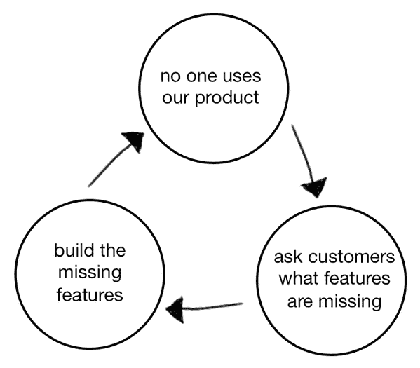
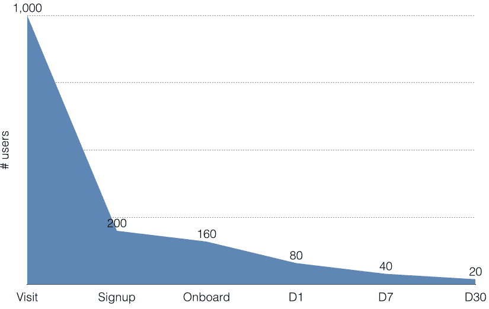

# 这就是产品死亡周期。为什么会这样，以及如何在安德鲁森摆脱它

> 原文：<http://andrewchen.co/this-is-the-product-death-cycle-why-it-happens-and-how-to-break-out-of-it/?utm_source=wanqu.co&utm_campaign=Wanqu+Daily&utm_medium=website>

任何新产品发布最困难的部分是开始，当它不太奏效时，你要迭代和塑造体验来修复它。这可能是最困难的阶段，但也是最有趣的阶段。

**产品死亡周期**
当我看到大约一年前的一篇关于产品死亡周期的精彩推文时，所有这些都在我的脑海中，当事情出错时。旧金山的管理顾问大卫·布兰德[在推特上发布了这张图表](https://twitter.com/davidjbland/status/467096015318036480):

> 这就是我所说的产品死亡周期
> –[@ davidjband](http://twitter.com/davidjbland)

 [T3】](http://andrewchen.co/wp-content/uploads/2015/06/product_death_cycle.png)

一年前当我看到这个的时候，我立刻转发了这张图，一年后，它的总点击量达到了 1400+RTs。这张图表引起了很多人的共鸣，因为可悲的是，我们已经多次看到这种产品死亡循环。我们甚至可能已经陷入其中——这太容易了。我以前写过关于这个阶段的文章，在 Techcrunch 的《低谷时期的生活》中。以及一些[想法](http://andrewchen.co/2011-blogging-roadmap-zero-to-productmarket-fit/)和[策略](http://andrewchen.co/ttpmf-time-to-product-market-fit/)与尽早实现产品/市场契合度相关。

让我们谈谈这个循环的每一步，为什么会发生，并提出一系列可能让我们逃避的问题/挑衅。

没有人使用我们的产品
任何新产品的自然状态都是没有人使用:)所以这本身不是问题。然而，你对这个问题的反应是导致产品死亡循环的原因。

询问客户缺少什么功能
早期的一个大错误是完全以用户为导向，而不是有一个产品愿景。这表现在询问用户“缺少什么功能？”

这种方法存在以下问题:

*   现在喜欢你的产品的用户可能不代表从未体验过它的非用户的更大市场。所以你得到的反馈可能会偏向一个小众群体，他们建议的功能可能不是主流
*   用户研究对于提出设计问题非常有用，但是你不能指望用户提出他们自己的设计解决方案。那是你的工作！他们可能会陷入某种模式，没有工具/技能来提出自己的解决方案。更快的马和所有这些
*   “缺少哪些功能？”认为增加更多的功能就能解决问题。但是还有很多很多其他的原因导致你的产品不能正常工作——也许价格是错误的。或者是营销不好，激活坏了，或者是定位烂了等等。

即使是辛普森一家也知道盲目听从功能需求是个坏主意。因此，这一集讲述的是一辆试图吸引所有人的汽车——荷马:

[T2】](http://andrewchen.co/wp-content/uploads/2015/06/the-homer-inline4.jpg)

不要问缺少了什么，相反，解决方案是问——用户不使用产品的根本原因是什么？根本瓶颈在哪里？在一个 80%的日活跃用户在 30 天内流失的世界里，有很多原因可以解释为什么用户在进入你已经建立的“深度参与功能”之前就反弹了。询问参与用户他们想要什么功能不会有太大帮助——相反，你可能会得到一个杂乱无章的功能清单，这将把你推向你的竞争对手。

关于这个话题的一本书推荐:哈佛商学院教授 Youngme Moon 的关于竞争差异化的[书](http://www.amazon.com/Different-Escaping-Competitive-Youngme-Moon/dp/030746086X)准确描述了客户研究迅速导致混乱差异化的过程，值得一读。

**3)构建缺失的功能**
产品死亡周期的第二次跳跃是获取客户建议的功能，并构建缺失的功能。然而，这很快就陷入了[下一个功能谬误](http://andrewchen.co/the-next-feature-fallacy-the-fallacy-that-the-next-new-feature-will-suddenly-make-people-use-your-product/)，这是一个错误的信念，即仅仅增加一个新功能就会突然让人们想要使用你的整个产品。

正如我在那篇文章中所讨论的，从人们第一次接触到它的时候起，每个产品的使用量都有惊人的下降:

[T2】](http://andrewchen.co/wp-content/uploads/2015/05/Screenshot-2015-05-31-19.50.54.png)

我也在[发表过一些真实的数据，失去 80%的移动用户是正常的](http://andrewchen.co/new-data-shows-why-losing-80-of-your-mobile-users-is-normal-and-that-the-best-apps-do-much-better/)。关键是，大多数与产品的互动发生在最初的几次访问中。在这里，你可以要求用户设置长期保留，并向用户呈现一个[的神奇时刻](http://genius.com/Alex-schultz-lecture-6-growth-annotated/)。构建一堆“缺失”的功能不太可能针对用户体验中最容易泄露的部分，即入职阶段。如果新功能的目标是核心体验，重要的是它们真正改善了 UI 中的大多数工作流，否则人们不会充分使用它们来改变他们的参与度。

为了打破产品死亡循环的这一部分，问问你自己——这种改变足以影响体验吗？这是否足以影响产品体验中最易泄露的部分？这只是另一个只有一小部分用户会体验的很酷的功能吗？

**爆发**
产品死亡周期很棘手，因为它是由正确的意图驱动的:倾听客户的意见，制造他们想要的东西。产品死亡周期中的人自然相信自己做的是对的，但是良好的意图并不能转化为良好的牵引力。相反，[问“为什么？”一遍又一遍](https://en.wikipedia.org/wiki/5_Whys)，去理解增长乏力的根本原因。

对这些根本原因的回应应该包括一个大的回应工具包——可能是营销:定价、定位、分销、公关、内容营销等。可能跟策略有关:走高端不走低端。建立一个功利的产品，而不是基于网络的产品，或者相反。关键是，解决方案应该针对根本原因，而不是由每个产品团队构建更多产品的愿望来明确驱动。

再次感谢 [David Bland](https://twitter.com/davidjbland) 与我们分享产品死亡周期图。

**PS. Get new updates/analysis on tech and startups**

我写一份高质量的每周时事通讯，报道硅谷发生的事情，关注创业、营销和移动领域。

在本网站链接的“内容”(包括帖子、播客、视频)中或在社交媒体和其他平台(统称为“内容分发渠道”)中发表的观点是我自己的，并不是 AH Capital Management、l . l . c .(“a16z”)或其各自附属公司的观点。AH 资本管理公司是一家在证券交易委员会注册的投资顾问公司。注册为投资顾问并不意味着任何特殊技能或培训。这些帖子不针对任何投资者或潜在投资者，也不构成出售或购买任何证券的要约，不得用于或依赖于评估任何投资的价值。

内容不应被解释为或以任何方式依赖于投资、法律、税务或其他建议。您应该向您自己的顾问咨询有关任何投资的法律、商业、税务和其他相关事宜。这些材料中表达的任何预测、估计、预测、目标、前景和/或观点可能会在不通知的情况下发生变化，并且可能与他人表达的观点不同或相反。此处提供的任何图表仅供参考，在做出任何投资决策时不应依赖。此处包含的某些信息来自第三方来源。虽然这些信息来自据信可靠的来源，但我并未独立核实这些信息，也未对这些信息的持久准确性或其在特定情况下的适当性做出任何陈述。该内容仅在所示日期有效。

在任何情况下，本网站或相关内容分销渠道上提供的任何帖子或其他信息都不应被解释为 a16z 人员发起、讨论或提及的任何集合投资工具中的任何证券或权益的购买或销售要约。也不应被理解为提供投资咨询服务的要约；投资 a16z 管理的集合投资工具的要约将单独提出，并且仅通过特定集合投资工具的保密要约文件提出，这些文件应完整阅读，并且仅提供给符合联邦证券法规定的特定资格的人。这些投资者被定义为合格投资者和合格购买者，通常被认为有能力评估潜在投资和财务事项的优点和风险。不能保证 a16z 的投资目标会实现或投资策略会成功。对 a16z 管理的投资工具的任何投资都包含很高的风险，包括损失全部投资金额的风险。提及、提及或描述的任何投资或投资组合公司并不代表 a16z 管理的所有投资工具，也不能保证这些投资将会盈利，也不能保证将来进行的其他投资会有类似的特征或结果。a16z 管理的基金所做的投资清单可在 https://a16z.com/investments/.获得。该清单不包括发行人未允许 a16z 公开披露的投资以及对公开交易的数字资产的未宣布投资。Andreessen Horowitz 投资、集合投资工具或投资策略的过去结果不一定代表未来结果。请参见[https://a16z.com/disclosures](https://a16z.com/disclosures)了解更多重要信息。