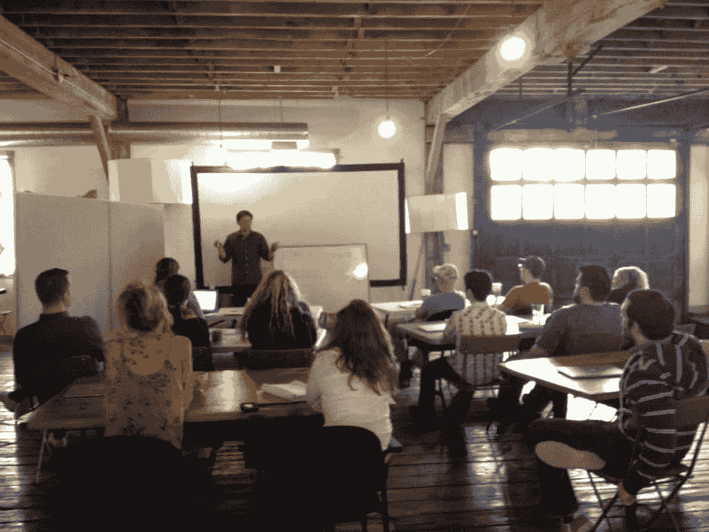
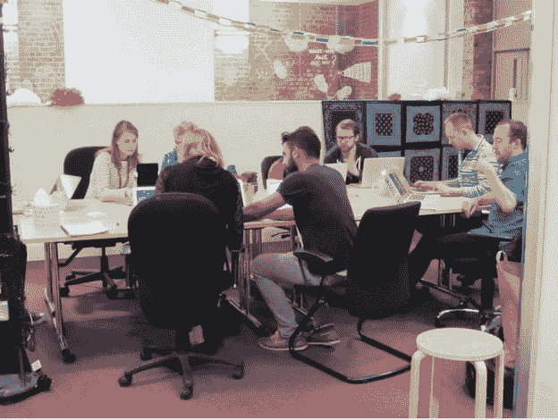
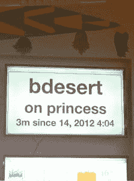

# Etsy 工程|我们邀请 Etsy 的每个人进行工程轮换:原因如下

> 原文：<https://codeascraft.com/2014/12/22/engineering-rotation/?utm_source=wanqu.co&utm_campaign=Wanqu+Daily&utm_medium=website>

在 Etsy，不仅仅是工程师编写和部署代码，我们的设计师和产品经理也经常这样做。现在，任何 Etsy 员工都可以报名参加“工程轮换”，参加 Etsy 编码速成班，最终与工程师一起编写和部署代码，将他们的照片添加到我们的“关于”页面。在过去的一年中，70 名员工完成了工程轮换。我们的工程师已经在第一天推进了一段时间，但是让非编码人员在第二周就准备好推进还需要一点工作。在这篇文章中，我将解释为什么我们开始工程轮换，以及整个轮换需要什么。

## 什么是轮换？为什么轮换很重要？

自 2010 年以来，Etsy 员工每个季度都会参加“支持轮岗”，他们会花大约两个小时来回复我们会员的支持请求。[甚至我们的 CEO 也参加](https://twitter.com/chaddickerson/status/545313526626385920)。最初是为了在我们的成员运营团队一年中最忙的时候帮助他们，现在已经发展成为一个促进跨团队沟通、建立全公司同理心并提供大量用户见解或乐趣的计划！这让我们开始考虑启动工程轮换，工程组织之外的人花一些时间学习团队如何工作，并完成一些工程任务。有了我们优秀的持续部署工具，我们设计了一个程序，可以让一个没有技术知识的员工在三个小时内将代码部署到网站上。这包括花费在培训和部署本身上的时间。

工程轮换计划

该计划分为三个部分:家庭作业；面对面的课堂；然后动手部署。参与者更改和部署的代码会将他们的照片添加到 Etsy [关于页面](https://www.etsy.com/about)。这是一个很好的视觉回报，让新员工公开宣布自己是 Etsy 团队的一员。在课程开始之前，我们会布置家庭作业，以便参与者为他们将要部署的代码更改做好准备。我们要求他们完成互动教程，包括[代码学院](http://www.codecademy.com/)的 HTML 级和 2 级以及我们内部的 Unix 命令行 101。我们也请他们阅读马克·科恩的优秀文章“[网络如何工作——在一堂简单的课](http://mkcohen.com/how-the-web-works-in-one-easy-lesson)”中，讨论了工程组织如何处理中断。这些资源帮助每个参与者熟悉他们将使用的技术，并向他们介绍 Etsy 的一些核心工程原则，如[无过失验尸](https://www.etsy.com/codeascraft/blameless-postmortems?ref=codeascraft)。

接下来是面向所有参与者的课程。它有五个部分。第一部分介绍了网络的工作原理，并解释了 Etsy 的工作原理。然后，我们介绍标准的[三层架构](http://en.wikipedia.org/wiki/Multitier_architectureThree-tier_architecture)，并浏览一些示例请求:查看、创建、搜索和购买列表。接下来，我们将深入了解[数据库分片](http://www.slideshare.net/jgoulah/the-etsy-shard-architecture-starts-with-s-and-ends-with-hard)。我们解释了它是什么，为什么它是必要的，为什么我们按数据所有者进行分片，以及我们如何重新平衡我们的分片。然后我们解释内容交付网络以及我们为什么使用它们。之后，我们离开艰难的技术讨论，来谈谈[持续部署](http://www.infoq.com/news/2014/03/etsy-deploy-50-times-a-day)。我们讨论其背后的哲学，并描述为什么每天改变网站 50 次是安全的，以及我们如何确保每次改变都完全符合我们的预期。我们通过概述 Etsy 的所有工程团队及其职责来结束本次会议。

在这一点上，我们将每个参与者与一名工程师配对，该工程师将指导他们完成代码更改的制作和测试过程，并最终按下绿色的大[部署到生产按钮](https://www.etsy.com/codeascraft/quantum-of-deployment)。这些一对一的会议可能需要两个小时，因为两人讨论每个步骤中存在的不同工具——有些像 IRC 一样简单，有些像我们的持续集成集群一样复杂。当参与者开始部署他们的代码变更的过程时，他们将看到他们的名字出现在我们的仪表板上。

## 我们学到了什么？

工程轮换的好处在许多方面与我们的支持轮换相似。对于整个 Etsy 的管理人员来说，这是一个与他们通常不会共事的人一起工作的机会，也是一个在个人和专业上相互了解更多的机会。对于一个局外人来说，Etsy 的更多技术方面可能感觉难以接近——甚至有点神秘——但是揭开它们的神秘面纱会鼓励更多的合作。以下是 Etsy 工程轮换的一些参与者所说的话:*“理解你同事的工作会培养同理心和 it&39；“更好地理解在 Etsy 工作对他人意味着什么，真是太好了。”“这个项目最棒的地方在于它揭开了软件开发在 Etsy 的帷幕。对于那些不是每天都与代码打交道的人来说，这看起来像是某种魔法，但事实并非如此——这只是不同类型的工作，使用不同类型的工具。如果没有这个项目，我们将错过一个让不同群体相互同情的巨大机会，我认为这对一家公司感觉像一个真正的团队至关重要。”“互联网通过电缆进入海底。哇哦。”*工程和支持轮岗的参与者都学到了很多课程之外的东西。不止一次，支持轮换让工程师接触到了产生大量问题的网站部分，他们能够立即修复这些问题。在一次工程轮换中，有人指出，我们构建的许多 IRC 工具不能被所有员工使用，因为他们无法访问我们的内部代码片段服务。因此，我们现在正在研究如何让每个人都有这样的机会。我和我们的国际法律顾问进行了一次会谈，最终我们就删除数据的合法性进行了一次有趣的讨论。这源于我对我们如何进行数据库迁移的解释！但是，也许我们从工程轮换中学到的最重要的事情是，参与其中的每个人都喜欢这样做。他们认识新的人，学习新的东西，并使用一种叫做“部署者”的工具不喜欢什么？*你可以在推特上关注丹 [@jazzdan](https://twitter.com/jazzdan) 。*