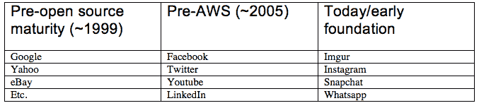

# 10X 工程师的幸福死亡|安德森·霍洛维茨

> 原文：<https://a16z.com/2014/07/30/the-happy-demise-of-the-10x-engineer/?utm_source=wanqu.co&utm_campaign=Wanqu+Daily&utm_medium=website>

Whatsapp 被收购时拥有 4.5 亿月用户，只有 32 名工程师。Imgur 仅用 7 名工程师就实现了每月超过 400 亿的图片浏览量。当 Instagram 以 10 亿美元被收购时，它有 3000 万用户，只有 13 名工程师。

这是一种新的常态:比以往更少的工程师和更少的资金来为更多的用户提供代码。孤独的软件工程师的潜在影响正在飙升。我们还要多久才能收到一家只有一名工程师的初创公司的十亿美元收购要约？手工制作定制解决方案的工程师的角色还要多久才会完全消失？

随着个人软件工程师影响力的增加，成为代码创建者的障碍正在快速降低。同样的软件基础(开源软件、Github 等开发工具、Digital Ocean 等提供的基础设施即服务等)让 Whatsapp 和 Imgur 得以扩展，这意味着编写软件的经验和技能变得不那么重要了。

一个人现在可以通过 Digital Ocean、Heroku 和 AWS(可能由 Mesosphere 协调)将一个 web 应用程序扩展到数百万用户。在 Google App Engine 上扩展数据库不再需要对 MySQL 参数的深刻理解，就像它不再需要了解它所运行的 CPU 芯片一样。

> 距离一家只有一名工程师的初创公司收到 10 亿美元的收购要约还有多久？

描述这种软件编码连续体的方式可能是*基础前*——在其极端形式下，每一个软件都是以组装的方式开始的——以及*基础后*——软件就像乐高积木，只是将各个部分组装在一起。

基础前，即使是最简单的任务也需要大量的知识和劳动，因为你必须从底层开始。对于一个网站来说，这可能意味着(沿着堆栈向上)一个您自己修补和管理的服务器操作系统，运行您自己开发或手动调整的 web 服务器、缓存系统、数据库、帐户管理系统、渲染引擎和前端库，以及您自己手动构建的分析平台、构建流程和错误报告工具。如果这听起来像是要管理很多东西，那是因为确实如此。

在建立之后，人们只需要关注手边面向用户的功能，只使用一个抽象层次。有一天，建造脸书需要调整网络服务器软件，更不用说建造整个数据中心了，这将是可笑的。堆栈的其他层将被完全抽象，编写软件将继续看起来更像是组装 Github 托管的库和 API 的集合。

[T2】](https://i1.wp.com/a16z.com/wp-content/uploads/2014/07/sam_2.png?ssl=1)

多亏了网络和它创造的开源社区，我们现在正快速奔向一个有软件基础的世界。我们正在构建一个软件工具和平台的公共核心，让人们可以编写更少的代码，完成更多的工作，接触到更多的用户。我们正在向软件发展，就像乐高积木一样。

然而，尽管取得了巨大的进步，我们仍然处于这一转变的开端。这是布拉德·考克斯，Objective-C 的创造者，[写于 24 年前](http://virtualschool.edu/cox/pub/PSIR/):

> 像管道工程这样的成熟行业没有我们复杂，不是因为软件本质上更复杂，而是因为他们——而不是我们——已经通过使用生产者/消费者层次结构来跨时间和组织空间分配这些问题，解决了他们的复杂性、不一致性和可变性问题。管道供应市场让管道工只解决生产者/消费者层级中单一层次的复杂性，而不必考虑更低层次，例如，通过从基本原则重新发明管道、水龙头、恒温器和水泵。

虽然考克斯在 Linux 和 Stackoverflow 之前写了这篇文章，但他仍然是对的。现代工程师虽然幸运地拥有消除复杂性的库和框架，以便专注于手头的问题，但仍然受到需要在抽象级别的阶梯上上下移动的约束。软件工程还不是管道工程——或乐高——因为我们的标准不完整，我们的库不兼容，扩展仍不自由，我们的软件仍有缺陷。所有这些都需要造物主在抽象的阶梯上留下他或她的梯级。

但是我们正在到达那里，并且[软件正在吃掉软件开发](http://cdixon.org/2014/04/13/software-eats-software-development/)。基于开源的软件平台、基础设施、知识和最佳实践的基础在不断发展。我敢打赌[单单 Stackoverflow】就让编程生产率提高了几个百分点。现在再加上十五年免费或廉价的开发者工具(Github，太多 ide 无法一一列举)、自动化基础设施(Mesosphere、AWS、Google App Engine、Heroku、DigitalOcean 等等)、数据库(MySQL、MongoDB、PostgreSQL、Firebase 等等)、高级语言(Python、Ruby、PHP 等等)和框架(Meteor、Angular、Django、Rails、Bootstrap 等等):编程的水龙头、管道和水泵。所有的一切都植根于开源，所有的细节都被删除，这是一个为用户制作软件的创作者不应该关心的。](https://twitter.com/ID_AA_Carmack/status/380018564792455168)

> 软件工程还不是管道工程或者乐高积木，因为我们的标准不完整，我们的库不兼容，扩展仍然不自由，我们的软件仍然有缺陷。

现在，这对 10x 工程师意味着什么？仍然需要“10 倍工程师”来构建基础——构建 AWS 或 Mesos 仍然非常困难。但是，随着我们构建出共同的基础，个人在平台上完成任务所需的技能和经验会减少。

毕竟，“10 倍工程师”是一个不可思议的误称。10 倍的工程师不一定比 10 倍更有生产力，他们只是“下一级”更好的工程师，在某些情况下，他们比 1.5 倍甚至 100 倍更好，这取决于任务的难度和成果的杠杆作用。但是后软件基础，当软件看起来更像乐高积木而不像工匠的手艺时，在基础上工作的“10x”工程师的相对产出倍数向 1 移动。

于是软件本身就成为了拉平编写软件解决问题能力的驱动力。这是一件好事:随着软件成为高影响力、低技能的行业，我们将编写棘手软件所需的技术能力和经验与为人们解决问题的能力分离开来。

我们开始为问题解决者和商业建立者优化成功，而不是那些碰巧两者都是并且从 12 岁就开始编程的人。我们从有新背景和新观点的创业者中释放出新的创业类别。我们释放了数以千计的新的创业公司，现在可以建立，因为这种摩擦消失了。虽然我们在这里主要谈论的是网络，但我们已经看到同样的现象开始在大数据、生物计算、人工智能和其他领域发生。

今天，如果你有一个软件产品的好主意，你需要成为一名工程师或者找到一个。明天，价值十亿美元的初创企业收购可能根本不需要工程师。

*此处表达的观点是引用的 AH Capital Management，l . l . c .(“a16z”)人员个人的观点，并非 a16z 或其关联公司的观点。此处包含的某些信息来自第三方，包括 a16z 管理的基金组合公司。虽然来自据信可靠的来源，但 a16z 没有独立核实此类信息，也没有对信息的持久准确性或其在给定情况下的适当性做出任何陈述。T3】*

*本内容仅供参考，不应作为法律、商业、投资或税务建议。关于那些事情，你应该咨询你自己的顾问。对任何证券或数字资产的引用仅用于说明目的，并不构成投资建议或提供投资咨询服务。此外，本内容不针对任何投资者或潜在投资者，也不打算由任何投资者或潜在投资者使用，并且在决定投资 a16z 管理的任何基金时，在任何情况下都不得依赖本内容。(投资 a16z 基金的要约只能通过私募备忘录、认购协议和任何此类基金的其他相关文件进行，并应完整阅读。)提及、提及或描述的任何投资或投资组合公司并不代表 a16z 管理的投资工具的所有投资，也不能保证这些投资是盈利的，也不能保证将来进行的其他投资会有类似的特征或结果。安德森·霍洛维茨基金管理的基金的投资清单(不包括发行人未允许 a16z 公开披露的投资和某些公开交易的加密货币/数字资产)可在 https://a16z.com/investments/.T3 获得*

*其中提供的图表仅供参考，不应作为投资决策的依据。过去的表现并不代表未来的结果。该内容仅在所示日期有效。这些材料中表达的任何预测、估计、预测、目标、前景和/或观点可能会随时更改，恕不另行通知，并且可能与他人表达的观点不同或相反。更多重要信息，请见 https://a16z.com/disclosures。T3】*