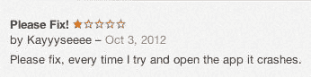
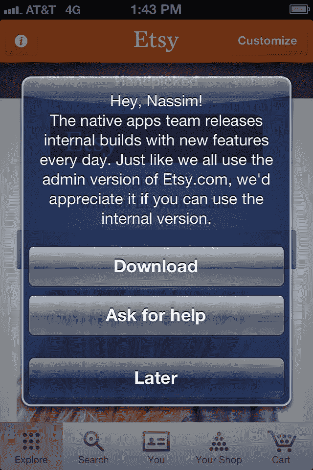
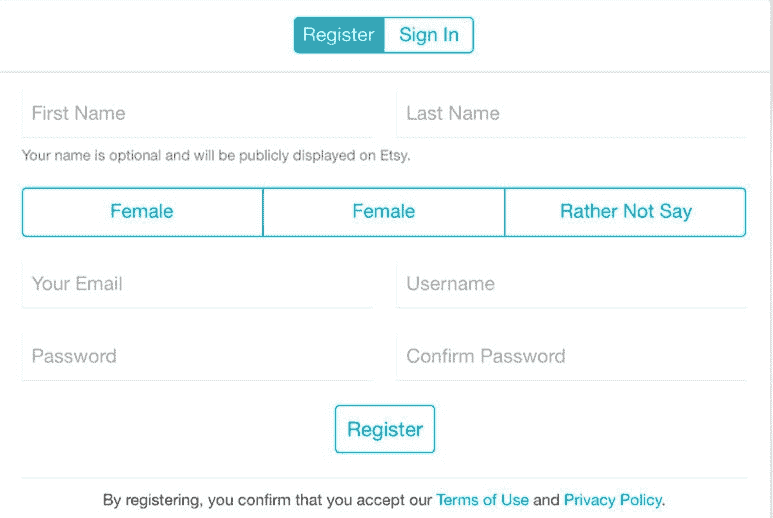
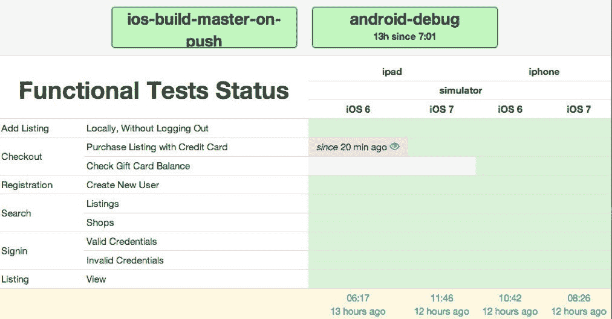
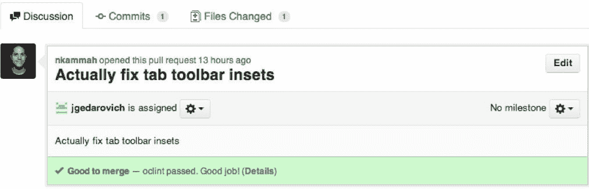
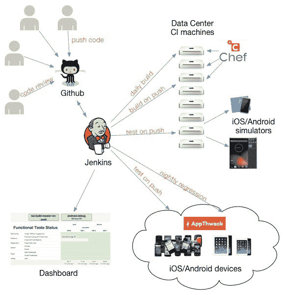

# Etsy 工程| Etsy 的移动应用持续集成之旅

> 原文：<https://codeascraft.com/2014/02/28/etsys-journey-to-continuous-integration-for-mobile-apps/?utm_source=wanqu.co&utm_campaign=Wanqu+Daily&utm_medium=website>

积极的应用评论可以极大地帮助用户转化和品牌形象。另一方面，差评会产生戏剧性的后果；正如安迪·巴德(Andy Budd)所说:“移动应用程序的生死取决于它们在应用商店中的评级”。

以上评测是对 Etsy iOS 应用的实际评测。作为一名 Etsy 开发人员，阅读它们令人难过，但这是一个事实:bug 有时会溜进我们的发布。在 web 堆栈上，我们使用持续交付的[不那么秘密的](https://www.etsy.com/codeascraft/quantum-of-deployment)武器作为安全网来快速解决生产中的错误。然而，发布移动应用需要第三方的批准(应用商店)，这[平均需要五天](http://reviewtimes.shinydevelopment.com/ios-annual-trend-graph.html)；一旦应用程序被批准，用户就可以决定何时升级——因此他们可能会被老版本所困。根据我们的分析数据，我们目前有 5 个 iOS 和 10 个 Android 版本供公众使用。

通过[持续集成](http://martinfowler.com/articles/continuousIntegration.html) (CI)，我们可以在项目的开发和验证阶段检测并修复主要缺陷，以免它们对用户体验产生负面影响:这篇文章探索了 Etsy 为我们的 android 和 iOS 应用程序实现 CI 管道的旅程。

## “每次提交都应该在集成机器上构建主线”

这个基本的 CI 原则是一旦引入缺陷就检测缺陷的第一步:编译失败。在 IDE 中构建应用程序不能算作持续集成。幸运的是，iOS 和 Android 都是命令行友好的:构建一个 iOS 应用程序版本就像运行:

`xcodebuild -scheme "Etsy" archive`

## 设置集成机器

集成机器与开发机器是分开的——它们为构建和测试提供了一个稳定的、受控的、可复制的环境。确保所有的集成机器都是相同的是至关重要的——使用一个[供应框架](http://en.wikipedia.org/wiki/Configuration_managementMaintenance_systems)来管理所有的依赖关系是确保一致性和可伸缩性的一个很好的解决方案。

在 Etsy，我们非常喜欢让 [Chef](https://www.etsy.com/codeascraft/migrating-to-chef-11) 来管理我们的基础设施——我们很自然地求助于它来供应我们不断增长的 Mac Mini 机队。配备了用于安装包的[家酿](https://github.com/opscode-cookbooks/homebrew%20)食谱和用于以相对理智的方式管理 ruby 环境的 [rbenv](https://github.com/fnichol/chef-rbenv) 食谱，我们的系统操作向导 [Jon Cowie](https://twitter.com/jonlives) 撒了一些 [hdiutil](https://developer.apple.com/library/mac/documentation/Darwin/Reference/ManPages/man1/hdiutil.1.html) 咒语(用于管理磁盘映像),我们的食谱就准备好了。我们现在能够以编程方式安装 95%的 Xcode(一些步骤仍然是手动的)、Git 和所有为我们的应用程序构建和运行测试所需的 Android 包。

最后，如果你曾经不得不处理 iOS 预置描述文件，你可以理解管理和更新它们是多么的烦人；拥有一个集中的系统来管理我们所有的配置文件为我们的工程师节省了大量的时间和挫折。

## 构建于推送之上，并提供日常部署

随着我们的 CI 机器连接到我们的 Jenkins 服务器，建立一个在每次 git 推送上构建应用程序的计划是微不足道的。这个简单的步骤帮助我们每周多次检测提交或编译问题中丢失的文件——开发人员会通过 IRC 或电子邮件得到通知，构建问题会在检测到后几分钟内得到解决。除了在 push 上构建应用程序，我们还提供每日构建，任何 Etsy 员工都可以安装在他们的移动设备上——这是 dogfooding 的精髓。鼓励我们的同事安装预发布版本的一个简单方法是在他们使用 app store 版本的应用程序时唠叨他们。

## 测试

iOS 设备有很多种口味，有 7 款不同的 iPads，5 款 iPhones 和少数 iPods 当谈到 Android 时，过多的设备变得势不可挡。即使在关注顶层设备时，CI 的目标也是在缺陷一出现就检测出来:我们不能期望我们的 QA 团队在每次推送时都反复验证相同的特性！

我们的 web 堆栈拥有非常广泛的测试套件集合，测试驱动的开发文化是显而易见的。最终，我们的移动应用程序利用我们的大量 web 代码库来交付内容:数据从 API 中检索，许多屏幕都是 web 视图。我们应用程序的大部分核心逻辑依赖于 UI 层——这可以通过功能测试来测试。因此，我们的第一个方法是集中在一些功能测试上，假设 API 已经在 web 栈上测试过了(通过单元测试和冒烟测试)。

手机应用的功能测试并不新鲜，选择的范围仍然相当广泛；在我们的例子中，我们选定了葫芦和 T2 黄瓜。Cucumber + Calabash 友好的格式和预定义的步骤允许我们的 QA 团队自己编写测试，而不需要我们的移动应用工程师的任何帮助。

迄今为止，我们的功能测试在 iPad/iPhone iOS 6 和 7 以及 Android 上运行，涵盖了我们的一级功能，包括:

*   搜索列表和商店
*   注册新账户
*   用信用卡或礼品卡购买商品

因为功能测试模拟实际用户的步骤，所以测试需要某些假定的资源存在。在检验测试的情况下，这些是:

*   专门的测试买家账户
*   专门的卖家测试账户
*   与账户相关联的预付信用卡

我们的检验测试包括:

1.  使用我们的测试买家帐户登录应用程序
2.  搜寻物品(在卖家测试帐户商店)
3.  将其添加到购物车
4.  使用预付信用卡为物品付款

一旦测试结束，我们后端的一个特别机制就会触发订单取消，信用卡就会退款。

我们的功能测试捕捉 bug 的一个很好的例子在下面的 iPad 应用程序截图中突出显示:

我们的注册测试导航到这个视图，并填写所有可见的字段。此外，测试循环通过“*女性*”、“*男性*”和“*而不是说*”选项；在这种情况下，测试失败(因为“*公*”选项丢失)。

通过在每次工程师推送代码时运行我们的测试套件，我们不仅可以在 bug 一出现就检测到，还可以检测到应用崩溃。我们的开发人员通常在最新的操作系统版本上测试他们的工作，但 Jenkins 支持他们:我们的测试在不同的设备和操作系统版本组合上同时运行。

<iframe src="https://www.youtube.com/embed/XD8xmQjo-kQ" title="YouTube video player" frameborder="0">VIDEO</iframe>

## 在物理设备上测试

虽然我们的开发人员喜欢我们的[非常广泛的设备实验室](https://www.etsy.com/codeascraft/mobile-device-lab)来进行手动测试，但是维护一组设备并在其上持续运行自动化测试是一个后勤噩梦，也是一项全职工作。在多次尝试开发内部解决方案后，我们决定使用 [Appthwack](https://appthwack.com) 在物理设备上运行我们的测试。我们在一组专用设备上运行每次推送的测试，并通过接入 Appthwack [设备云](https://appthwack.com/devicelab)在更广泛的设备上运行夜间回归。这种集成仍然是最近的事情，我们仍在解决一些与物理设备测试相关的问题，以及从 200 多台设备中汇总和报告测试状态的挑战。

## 报告:在上面放一个仪表板

有超过 15 个 Jenkins 工作来构建和运行测试，向开发人员快速展示关键信息是一个挑战。一个简单的自制仪表板可以很好地沟通所有配置的当前测试状态:

## 静态分析和代码审查

自动化测试不能捕获所有的 bug 和潜在的崩溃——与 web 堆栈类似，开发人员在提交代码之前非常依赖代码评审。像 Etsy 的所有代码一样，这些应用程序存储在 Github Enterprise repositories 中，代码评审包括一个 pull 请求和一个与之相关的问题。通过使用[GitHub pull request builder Jenkins 插件](https://wiki.jenkins-ci.org/display/JENKINS/GitHub+pull+request+builder+plugin)，我们能够系统地触发一个构建，并对审查请求进行一些静态分析(参见[静态分析和 OCLint post](https://www.etsy.com/codeascraft/static-analysis-with-oclint) ),并将结果发布到 GitHub 问题:

## 基础设施概述摘要

总而言之，我们当前的基础设施如下所示:

## 挑战和后续步骤

构建我们的持续集成基础设施是一项艰巨的任务，挑战一个接一个地出现，比如无法自动化一些软件依赖项的安装。一旦稳定，我们总是要跟上新版本(iOS 7，Mavericks ),这往往会破坏测试和测试工具。此外，功能测试本质上是易变的，需要持续的关注和优化。

目前，我们的测试和基础设施足够可靠，可以定期检测应用程序崩溃和第 1 层错误。从基础设施的角度来看，我们的下一步是通过测试提供商 Appthwack 将我们的测试扩展到物理设备。集成刚刚开始，但已经出现了一些问题:我们如何在 200 台设备上并发运行相同的结帐测试(向购物车中添加商品，使用礼品卡购买)——我们是否会创建 200 个测试帐户，每台设备一个？我们将在 6 个月后再次发布我们的状态，希望有更多的经验教训和成功故事——敬请期待！

*你可以在推特上关注纳西姆，地址是* [@kepioo](https://twitter.com/kepioo)