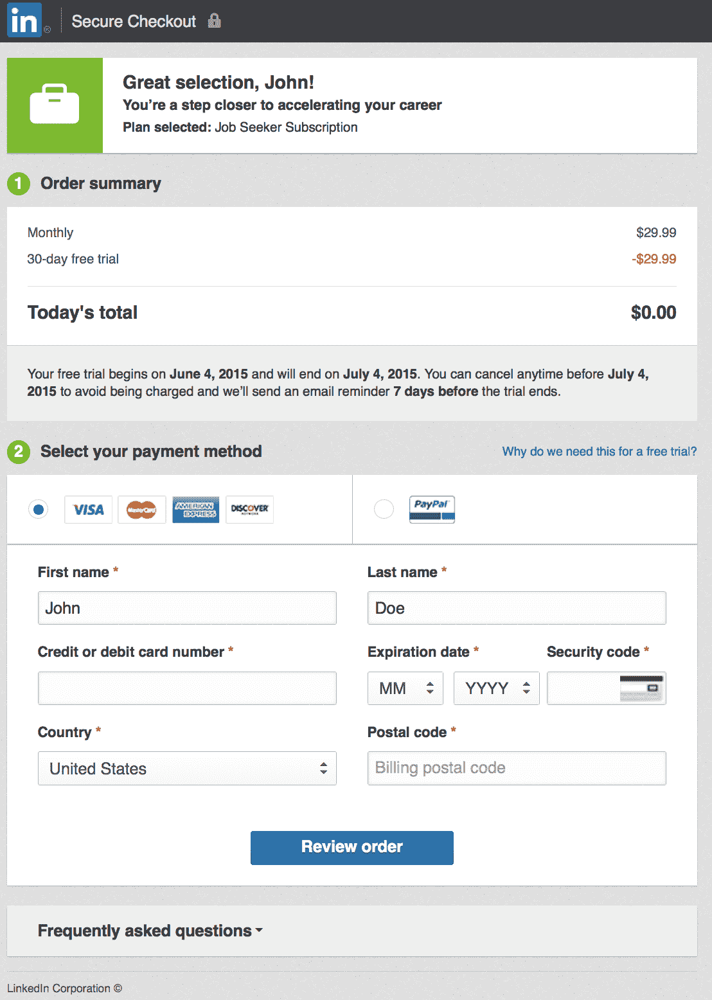
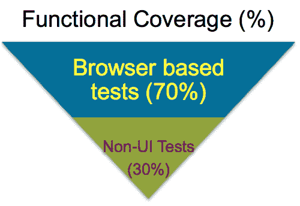
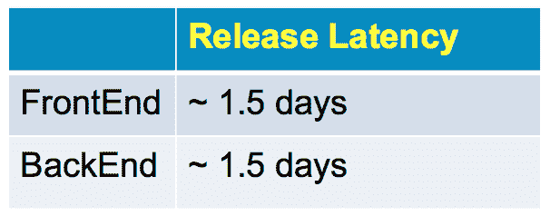
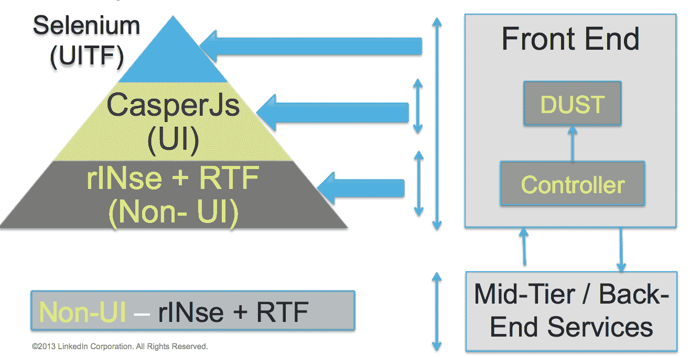
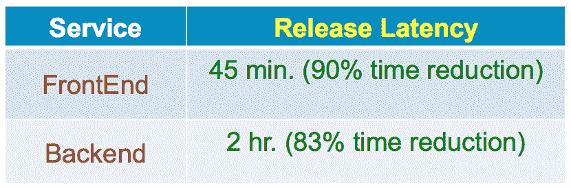

# 以更少的摩擦和高质量将代码投入生产| LinkedIn 工程

> 原文：<https://engineering.linkedin.com/developer-happiness/getting-code-production-less-friction-and-high-quality?utm_source=wanqu.co&utm_campaign=Wanqu+Daily&utm_medium=website>

许多开发人员感到沮丧的一个关键点是缓慢且不灵活的发布周期。发布周期越慢，开发人员就越难将特性从初始阶段转移到生产阶段。当开发人员可以构建新的特性时，这就产生了一个不断增加的需要管理和维护的积压。LinkedIn 对这一挑战的解决方案是我们转向越来越敏捷的发布周期。这允许我们的开发人员以迭代的方式构建一个特性的各个部分，并且有助于简化开发周期的管理。

# 问题空间

当开发人员希望将一个特性推向生产服务器时，通常需要进行严格的认证测试。这种释放仪式往往每次都有变化；通常包括运行测试、手动分析故障、重新测试故障和迭代，直到发布版本中的所有错误都被修复。较低的发布频率会增加生产中出现问题的可能性，因为变更集成比例地变大。

# 个案研究

为了提高我们的发布频率和质量，让我们研究一下 LinkedIn 支付系统最近的升级。

LinkedIn 支付系统由结账界面和后端系统组成。我们最初使用端到端测试进行服务认证。这就引入了两个问题:1)端到端测试执行起来很慢，2)只使用端到端测试会降低测试特定服务的可靠性和可用性。

为了实现全自动、高质量和低延迟的发布，我们将以下内容确定为新自动化战略的关键部分:

*   隔离测试服务
*   在开发周期的早期执行测试
*   质量的团队所有权

## 初态

我们主要使用端到端测试进行服务认证。我们知道我们的测试执行起来很慢，而且我们只使用端到端的测试，这使得它们不太可靠，不适合测试特定的服务。

 

*发布延迟=发布的版本到达生产服务器所需的时间。

## 独立测试服务

故障与服务的关联需要针对特定服务的大量测试。孤立地测试服务改善了测试和服务之间的关联。我们发现混合测试策略对于我们的构建认证过程更有效，而不是仅仅依赖端到端的 UI 测试。单元、功能和集成测试协同工作，以快速确保构建的质量。

注意:rINse 是我们的内部集成测试库。RTF(Restli 测试框架)是我们内部的模拟库。UITF(UI 测试框架)是我们的 UI 端到端测试框架。rINse 允许我们在声明性机制中编写 API 测试，以确保对每个组件的适当覆盖。RTF 通过记录重放组件之间的响应来实现服务隔离。

## 在开发周期的早期执行测试

在开发过程中的每一步运行测试对于尽早识别代码中的 bug 是至关重要的。随着软件在开发过程中的深入，修复问题的成本会增加。LinkedIn 测试工具允许我们在开发过程的不同阶段执行测试。LinkedIn 有持续集成系统，允许在软件开发周期的每一步集成质量检查点。

通常，可以运行测试的阶段有:

*   代码提交前
*   代码提交开始
*   构建完成
*   将构建部署到临时环境
*   将构建部署到生产环境中

在过程的早期运行测试并捕获 bug 比后期更有效。为了使测试有效，它们需要高质量。

## 质量的团队所有权

质量是整个团队的责任。如果在开发周期的每一步都考虑软件质量，那么质量控制就能最有效地实现。软件质量过程将受益于在软件开发工作中合作的团队之间测试自动化所有权的适当分配。

# 结果

通过采用改进的自动化策略，LinkedIn 支付工程团队实现了更频繁的发布，对测量的质量更有信心。我们的发布标准现在是:

我们的发布过程变得更加确定。问题在流程的早期被隔离；开发人员能够更确定地在一个时间框架内将一个特性推送到生产服务器。感谢 LinkedIn 支付团队、LinkedIn 测试工具团队在设计和实施该流程中提供的所有帮助，并特别感谢

[Randal Moore](https://www.linkedin.com/pub/randy-moore/14/2b0/b55)

感谢你帮助我写了这篇博客。