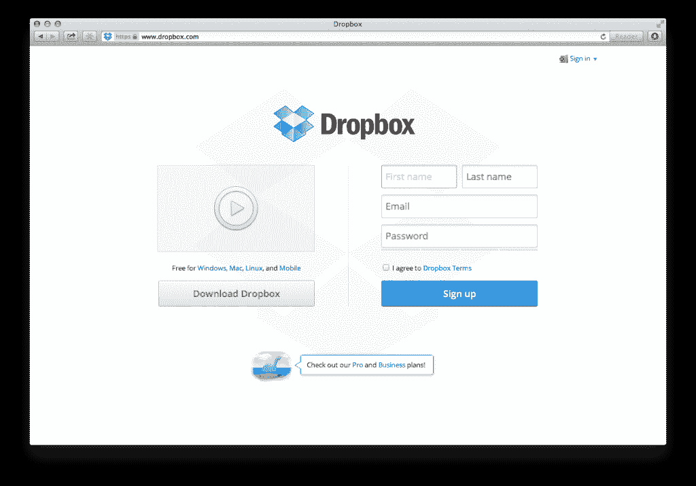
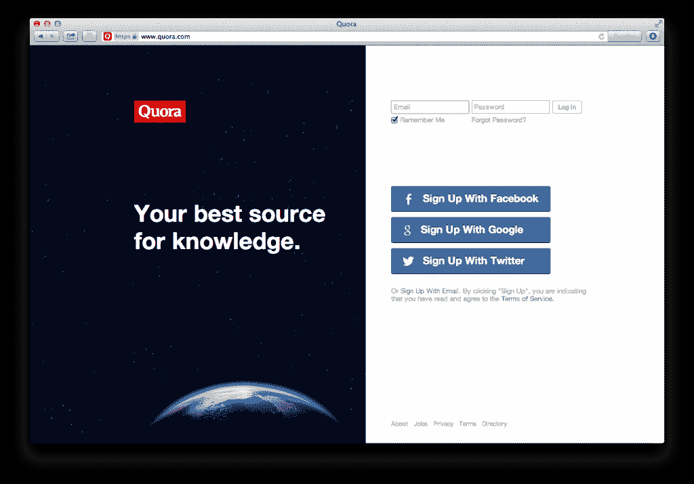
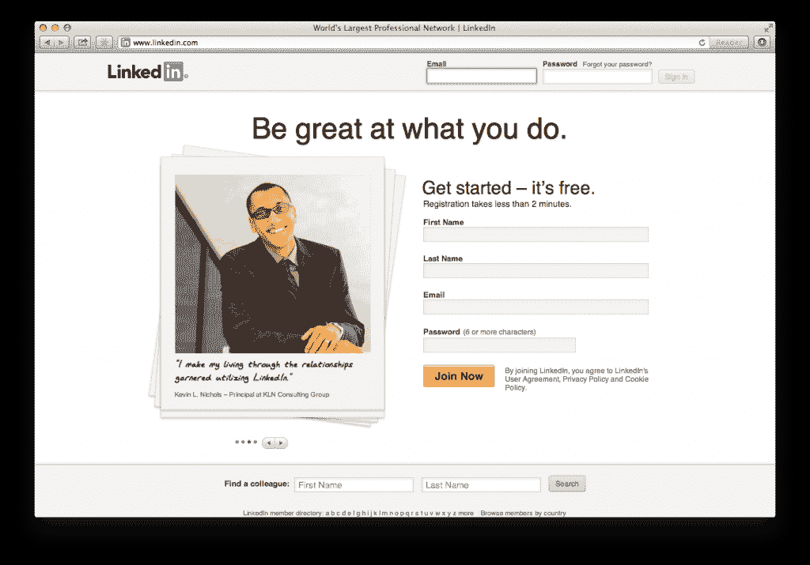
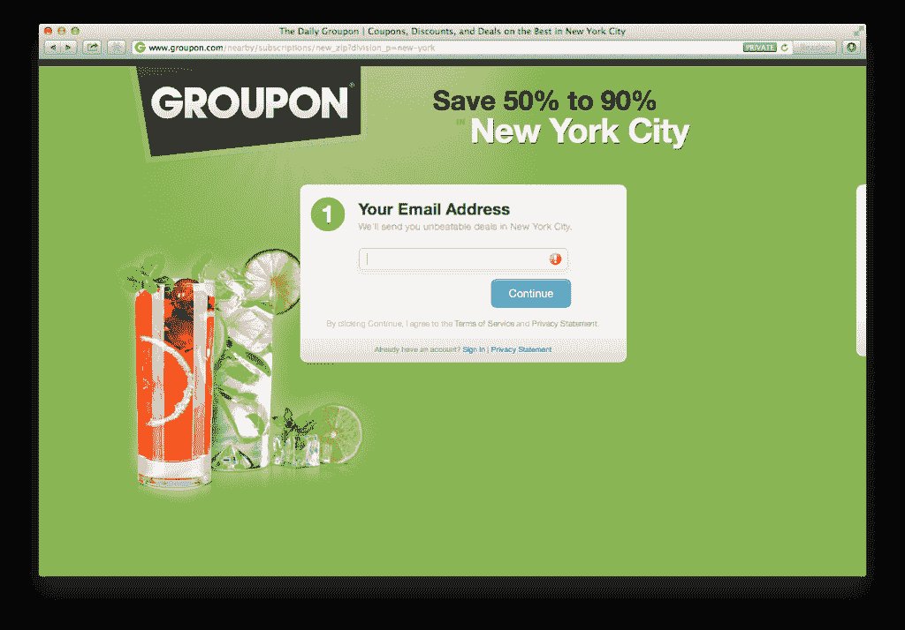
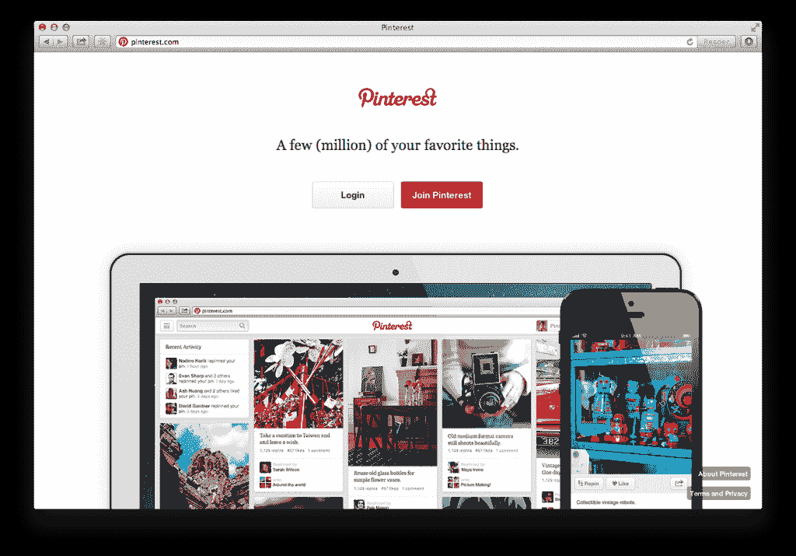

# 增加注册的最高投资回报率的方法:在 andrewchen 制作一个最小的主页(客座博文)

> 原文：<http://andrewchen.co/the-highest-roi-way-to-increase-signups-make-a-minimal-homepage-guest-post/?utm_source=wanqu.co&utm_campaign=Wanqu+Daily&utm_medium=website>

*[Mattan Griffel](http://about.me/mattangriffel) 在 [Growhack](http://growhack.com/) 写了一些关于用户增长的很棒的文章，你可以在 Twitter 上关注他，地址是 [@mattangriffel](https://twitter.com/mattangriffel) 。我尤其喜欢他的文章[最小化主页](http://www.growhack.com/2013/04/04/the-minimal-homepage/)，其中陈述了每个 A/B 测试过他们主页的人都知道的东西:保持简单，并要求你提前注册。这是增加注册的最简单也是投资回报率最高的方法之一，因为你的访问者不会找到进入低转换率页面和反弹的途径。令人惊讶的是，这对许多人来说仍然是违反直觉的。我以前曾推荐人们看这篇博文，Mattan 慷慨地提出让它转贴到这里。尽情享受吧！——安德鲁*

# Mattan Griffel:
最小化主页

关于世界上发展最快的公司的主页，你注意到了什么？

# 

以下是我注意到的情况:

*   没有注册就不能进入。大多数创业公司都犯了一个错误，那就是让访问他们网站的人免费访问内容，无论是公寓预订还是日常交易。这通常是个坏主意。与普遍的想法相反，访问者在被提示注册之前在你的网站上互动的东西越多，你的注册率就越低。
*   导航和超链接几乎总是不存在。多年来，互联网营销人员开发了他们称之为[“挤压页面”](http://en.wikipedia.org/wiki/Squeeze_page)的内容最少，只有一个清晰的行动号召，因为他们发现额外的信息会分散访问者的注意力，或导致他们点击进入不同的网站。请注意，在这些网站的文件夹下没有任何内容。
*   专注于单一、清晰的价值主张。几乎在所有情况下，产品的价值主张都可以归结为一句清晰的话:“你最好的知识来源”或“做你擅长的事情”。人们几乎从来不会在你的网站上阅读超过一句话(他们甚至不会阅读那个*一个*，除非它足够大并且被战略性地放置)，所以试图找出你的前 3 个“要点”是没有意义的。这也使得测试成长黑客变得非常非常容易。把一句话换成另一句话，直到它起作用。
*   你的产品不在于分享。我一直看到这个错误。许多初创公司一开始认为人们会使用他们的产品，因为这有助于他们更容易地“分享”东西。让我在这里说清楚:大多数人不分享。甚至那些分享东西的人 90%的时间都没有分享东西。网络上的大部分时间花在消费上，而不是生产上。超过 50%的推特用户[几乎从不发推特](http://socialmediatoday.com/brian-honigman/482904/many-twitter-users-rarely-tweet-study)。这就是为什么 Twitter 将他们的信息从“与你的朋友分享的最简单的方式”转变为“了解你关心的人和组织正在发生什么”。如果你只迎合积极主动的人，你会疏远你的大多数潜在用户。
*   **大图。** [大幅图片增加转化率。](http://econsultancy.com/us/blog/62391-do-bigger-images-mean-improved-conversion-rates-three-case-studies)照做就是了。
*   **嵌入式注册表单。**在主页上开始注册，这样人们就不会无缘无故地点击进入新页面。一般来说，你注册过程中的点击越多，就会有越多的人离开。请注意，这些注册表单几乎总是在文件夹的右侧上方。他们也很少要求超过一个名字，电子邮件和密码。

当我告诉人们这些事情时，他们经常抱怨:“但是每个人都知道 Twitter 和脸书，所以他们不必解释他们的产品是关于什么的。没有人听说过(我的初创公司)，所以我实际上需要向人们解释。”

你错了。

也许你和我已经知道 Twitter 和脸书是什么，但我们不是他们试图在主页上注册的人。24 亿人使用互联网，而且每天都有更多人使用互联网。信不信由你，地球上仍然有人没有听说过推特或脸书。这些主页试图转化的正是这些人——而不是拒绝注册的勒德分子(相信我，Twitter 和脸书早就不再关心他们了)。

你的创业也是如此。不要固执，也不要认为出于某种原因，你的创业是个例外。因为害怕尝试与直觉相反的东西而做出这种假设，肯定会让你永远做不出任何创新。

我读了一篇关于脸书的很棒的评论，想在下面分享一下。——安德鲁】
[埃米特·谢尔](https://twitter.com/eshear)在对这篇文章的评论中提出了一个伟大的观点，收录如下:

> 我不喜欢像 http://Andrew Chen . co/2013/07/29/the-high-ROI-way-to-increase-signs-make-a-minimal-home page-guest-post/这样的文章，因为虽然他的观点有一部分是正确的(看看所有这些公司，他们决定在“注册优先”之后进行事情，并且首页非常简单！)反例数不胜数。看看 Alexa top 10 就知道了。
> 
> # 3 YouTube——在 YouTube 前面放一面巨大的“先注册”墙可能会杀了他们。亚马逊——亚马逊致力于在人们决定购买后将他们转化为账户，你最好相信他们已经 a/b 测试过了。
> #7 维基百科——主要是一种先读的体验
> # 8 QQ——神圣的废话，有很多文本
> 
> 现在谷歌/脸书/百度肯定遵循“简单主页”的设计。但是他过分概括了，而且没有迹象表明他意识到了这一点。思考设计的要点是要意识到权衡，而不是把最新的趋势说成是“做这件事的聪明方法”。

换句话说，增加注册人数并不一定对每家公司都重要，许多成功的公司并不关注这一点。所以我会重申“以下是如何增加注册人数”的观点，“一旦你决定增加注册人数很重要，以下是如何增加注册人数。”说得好埃米特。

**PS. Get new updates/analysis on tech and startups**

我写一份高质量的每周时事通讯，报道硅谷发生的事情，关注创业、营销和移动领域。

在本网站链接的“内容”(包括帖子、播客、视频)中或在社交媒体和其他平台(统称为“内容分发渠道”)中发表的观点是我自己的，并不是 AH Capital Management、l . l . c .(“a16z”)或其各自附属公司的观点。AH 资本管理公司是一家在证券交易委员会注册的投资顾问公司。注册为投资顾问并不意味着任何特殊技能或培训。这些帖子不针对任何投资者或潜在投资者，也不构成出售或购买任何证券的要约，不得用于或依赖于评估任何投资的价值。

内容不应被解释为或以任何方式依赖于投资、法律、税务或其他建议。您应该向您自己的顾问咨询有关任何投资的法律、商业、税务和其他相关事宜。这些材料中表达的任何预测、估计、预测、目标、前景和/或观点可能会在不通知的情况下发生变化，并且可能与他人表达的观点不同或相反。此处提供的任何图表仅供参考，在做出任何投资决策时不应依赖。此处包含的某些信息来自第三方来源。虽然这些信息来自据信可靠的来源，但我并未独立核实这些信息，也未对这些信息的持久准确性或其在特定情况下的适当性做出任何陈述。该内容仅在所示日期有效。

在任何情况下，本网站或相关内容分销渠道上提供的任何帖子或其他信息都不应被解释为 a16z 人员发起、讨论或提及的任何集合投资工具中的任何证券或权益的购买或销售要约。也不应被理解为提供投资咨询服务的要约；投资 a16z 管理的集合投资工具的要约将单独提出，并且仅通过特定集合投资工具的保密要约文件提出，这些文件应完整阅读，并且仅提供给符合联邦证券法规定的特定资格的人。这些投资者被定义为合格投资者和合格购买者，通常被认为有能力评估潜在投资和财务事项的优点和风险。不能保证 a16z 的投资目标会实现或投资策略会成功。对 a16z 管理的投资工具的任何投资都包含很高的风险，包括损失全部投资金额的风险。提及、提及或描述的任何投资或投资组合公司并不代表 a16z 管理的所有投资工具，也不能保证这些投资将会盈利，也不能保证将来进行的其他投资会有类似的特征或结果。a16z 管理的基金所做的投资清单可在 https://a16z.com/investments/.获得。该清单不包括发行人未允许 a16z 公开披露的投资以及对公开交易的数字资产的未宣布投资。Andreessen Horowitz 投资、集合投资工具或投资策略的过去结果不一定代表未来结果。请参见[https://a16z.com/disclosures](https://a16z.com/disclosures)了解更多重要信息。