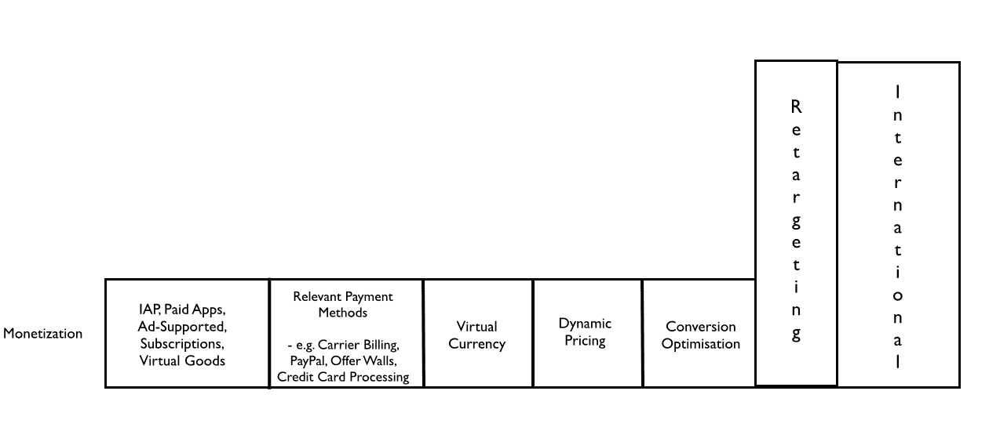
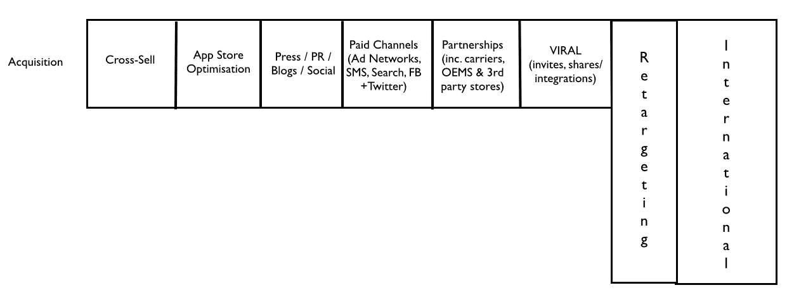

# 移动增长堆栈-图片-移动增长咨询和代理

> 原文：<https://medium.com/mobile-growth/the-mobile-growth-stack-3ffa6856f482?utm_source=wanqu.co&utm_campaign=Wanqu+Daily&utm_medium=website>

 <noscript></noscript> 

注:这是我关于移动增长栈的原创文章。您可以在[【www.mobilegrowthstack.com】](http://www.mobilegrowthstack.com/)找到最新版本的堆栈，以及关于移动增长的信息和文章

在为您的企业制定移动增长战略时，您应该考虑哪些因素？你应该考虑应用什么工具和技术？你将如何衡量成功和有效地衡量什么在起作用？

在考虑如何有效、可持续地扩大移动产品或服务的用户群时，没有放之四海而皆准的解决方案；采取全面的方法是有用的。我使用我称之为“移动增长栈”的东西来概念化移动生态系统中增长的各种杠杆和催化剂:

 **<noscript></noscript>** 

#### **打开堆栈包装**

堆栈的目的是鼓励在制定发展战略时考虑所有包含的因素。这并不是说我们必须推动堆栈中所有部分的活动来实现增长，而是说一个成功的增长战略很可能由这些元素的子集组成，并注意其他元素。对于特定的应用程序或业务，或者在业务的不同阶段，一些元素必然或多或少相关/有效。

> 有效的增长战略将发挥核心优势，同时开发新生能力和技术，随着时间的推移实现增量增长。

堆栈中的许多元素是特定于移动设备的(推送通知、ASO 等)。)虽然有些并不是固有的“移动性”,可以很容易地应用于发展基于网络或跨平台的产品或服务。

该堆栈有三个主要层，代表关键业务目标:获取、参与/保留和货币化。根据公司生命周期的阶段，特定的层可能会受到更多的关注或重视，但一个成功的企业在某个时候需要跨所有层交付。

为什么要将货币化纳入增长框架？毕竟，应用内购买或广告与增长有什么关系？当 Rovio 在 iOS 上发布付费应用程序和在 Android 上发布免费应用程序(支持广告)时，它展示了整体思维的价值(以及对 iOS 和 Android 之间差异的良好理解)。如果《愤怒的小鸟》是 Android 上的一款付费应用，它的增长就不会那么令人印象深刻了。重要的是要认识到，货币化决策会对增长轨迹产生重大影响。

#### **作为乘数的国际化**

“国际”增长是一个广泛的话题，超越了框架中的任何特定层面。国际市场的增长策略很可能是针对你的产品/服务和它所处的竞争环境的。然而，如果做得好——这可能不仅仅意味着翻译你的应用和商店列表，尽管这将是一个很好的起点——国际化将成为你的收购、参与和盈利努力的催化剂，从而全面补充你的活动

强大的国际战略可能会考虑支持与当地相关的支付方式、与目标地区最受欢迎的社交网络整合、国家级或区域合作伙伴关系等，因此会与电池组中的许多单个单元协同工作。

#### **重定目标可应用于所有三层**

通过有针对性的信息有效地重新定位用户或潜在用户，可用于推动获取、提高参与度或促进盈利；它跨越所有三层。理想情况下，成长型营销人员将能够准确定位那些已经退出或陷入转换漏斗任何阶段的用户，并传递一条可能会推动他们实现目标的信息。

#### **世界一流的分析作为基础**

无论是向你的应用添加功能、更新你的应用商店副本，还是在脸书的应用安装活动上花钱，如果没有必要的工具和测试基础设施来衡量效果并朝着你的目标优化，几乎永远都不应该做出改变。 如果你在做改变，希望事情进展顺利，然后继续处理待办事项中的下一个项目，你很可能会浪费大量的时间&金钱，但收效甚微。

 <noscript></noscript> 

坚实的分析基础和对测试- >衡量- >规模增长方法的承诺对于任何严肃的增长战略都至关重要，因此它在框架中有自己的部分。

> 在考虑你的战略时，分析和洞察力不仅仅是另一个可以打勾的方框；它们为战略提供信息。

与其他单元一样，您的分析堆栈没有必要包括框架中包含的所有元素，但值得考虑在列出的领域发展或买入能力。

#### **挽留&接触是一个好的开始**

尽管是中间层，钉钉的参与度&在早期，留存很可能是任何新应用的首要关注点。假设产品本身对用户有吸引力(这是一个巨大的假设)，通过分析和用户测试，努力优化新用户体验，可以有效地提高参与度。精心制作的欢迎邮件和应用内教程是有效帮助新用户加入的两种方法。

围绕产品或服务建立社区有助于增加粘性；培养最有激情的用户，并提供工具和论坛(在线和现实世界)来连接享受应用程序的用户，可以推动各个层面的参与，并为新用户提供灵感。

 <noscript></noscript> 

重新激活已经流失的用户可能很难，尤其是在变化无常的移动时代，移除应用程序的门槛很低，发现竞争产品的可能性很高。因此，在用户进入休眠状态之前，集中精力留住他们通常更有价值。然而，带回一个失效的用户可能仍然比获得一个全新的用户更具成本效益。

客户关系管理(CRM)本身就是另一个巨大的话题，市场上有许多旨在解决这个问题的解决方案。诸如 [【卡哈纳】](https://www.kahuna.com/)[Localytics](http://www.localytics.com/)[app boy](https://www.appboy.com/)[Capptain](http://www.capptain.com/)等服务旨在简化向用户交付有针对性、及时且个性化的消息的过程，以提高参与度。与所有元素一样，CRM 将更适用于一些应用程序和业务。

用他们不关心的信息打扰用户的风险很高，因此与用户的每一次互动都应该对他们有价值(有数据证明这些互动长期增加了参与度),并基于对用户的深入了解。允许用户在高粒度上微调他们接收的消息类型将为该过程提供有价值的反馈循环，并降低流失的风险。

深度链接被吹捧为应用参与的下一件大事。虽然在某些情况下这可能是真的(特别是当你的应用程序链接到单独的内容项目时)，但这可能不是普遍适用的。值得考虑的是，你的应用程序如何利用深度链接来提高参与度或可发现性。

####  **<noscript></noscript>** 

**收购不仅仅是购买用户**

“用户获取”一词经常与绩效营销混为一谈。付费收购通常是更广泛的增长战略的重要和有影响力的一部分，可以显著加快增长。这也可能是一种昂贵的方式，让你学到一个应用缺乏潜在吸引力或粘性的惨痛教训。

由于几乎所有用户都将在商店页面做出下载应用的最终决定，应用商店优化可能是一项重要活动，无论是转化(通过优化的资产和信息)还是发现(通过仔细的关键词选择)。

“病毒式”的虚幻概念很难人为产生；最终，持续的病毒式增长很可能植根于强大的产品或吸引人的内容。然而，对内容共享、物品赠送或邀请流的密切关注为病毒式传播的发生创造了合适的条件。

与品牌或网络的合作可以帮助你的应用接触到新用户，同时为合作伙伴带来价值，这对于增加接触范围和为双方的客户提供附加值来说是巨大的，例如[SoundCloud+Sonos](https://sonos.soundcloud.com/)合作伙伴关系。

社交媒体、公关、内容营销等带来的额外影响。就对增长的直接影响而言，可能更难衡量，这往往导致它被“增长黑客”团队忽视，或被视为营销的一个独立分支。尽管如此，这样的活动可以建立可衡量的品牌知名度，最终导致用户获取量的增加。

#### **货币化不应该是事后的想法**

即使你的公司处于“成长阶段”，关心的是建立用户群而不是赚钱，在某个时候赚钱通常是可取的。考虑到这样的事情，如应用程序将如何货币化，可能需要什么支付方式或计费集成等。可能会导致产品定位方式的根本转变，以及在应用程序中推出哪些功能。

> 一旦用户开始在应用上或应用内花钱，LTV 建模就变得至关重要，并告知何时以及在多大程度上扩大性能获取。

为了强调堆栈中各层的互联性，考虑在应用中部署过于激进的横幅广告的影响；货币化可能会在短期内增加，但可能会以增加流失和减少病毒传播为代价。同样，收取 1.99 美元的应用程序费用可能会大大减少购买量，但会带来更高的回报，以换取更适度的增长。

虽然需要一次性购买的付费应用仍有一席之地，但免费增值模式正迅速成为应用领域的一种过时模式。对于免费增值应用模式的深入和可行的解释，我推荐阅读埃里克·苏费的 [【免费增值经济学】](https://www.amazon.com/gp/product/0124166903/ref=as_li_tl?ie=UTF8&camp=1789&creative=9325&creativeASIN=0124166903&linkCode=as2&tag=andycamobile-20&linkId=GFASLHCM3DLUWLI5) 。

 <noscript></noscript> 

如果你能找到对你的观众有吸引力且相关的东西，而不仅限于游戏，虚拟商品提供了一种非常可扩展的赚钱方式。快速增长的 LINE messenger 应用程序 [通过虚拟“贴纸”](http://blogs.wsj.com/digits/2014/11/19/deloitte-koreas-kakao-fastest-growing-tech-firm-in-asia/) 很好地实现了盈利，为用户提供了个性化服务。

使用虚拟货币带来了应用经济的复杂性和精细控制，并可能使动态定价或价格实验更容易实现。虽然虚拟货币通常被认为是游戏的专利，但也有其他值得注意的例子，包括捆绑销售的 Skype 点数，为座机和手机提供通话时间。

#### **在堆栈上迭代**

移动增长堆栈在很大程度上是一项正在进行的工作；它已经经历了几次迭代。我很想听听其他增长实践者和移动专家的意见；上述框架应用到自己的战略思维中有用吗？如何改进？你会做出什么改变？