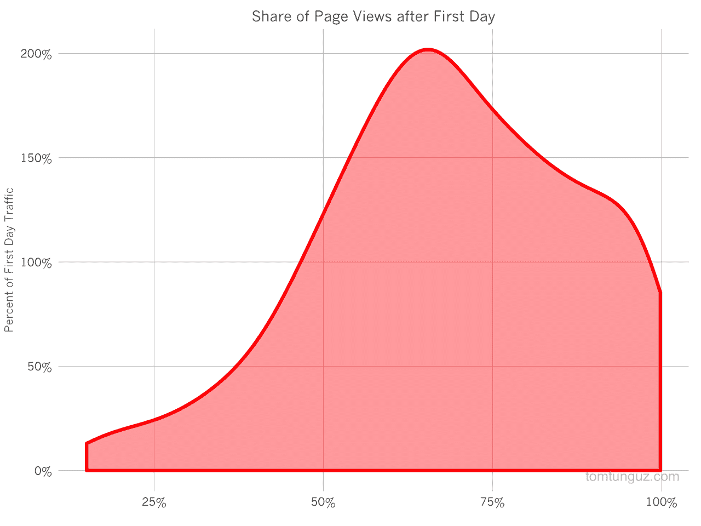
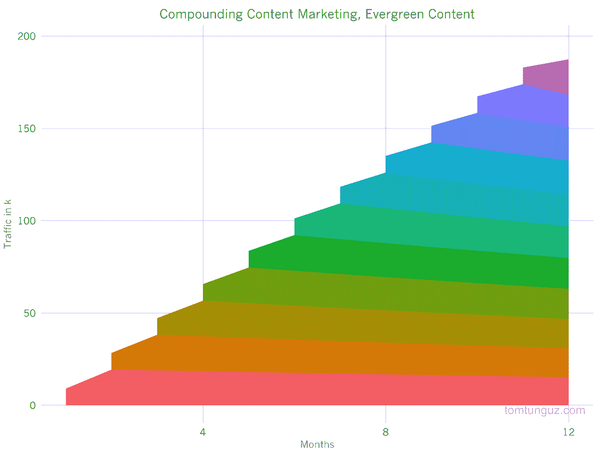
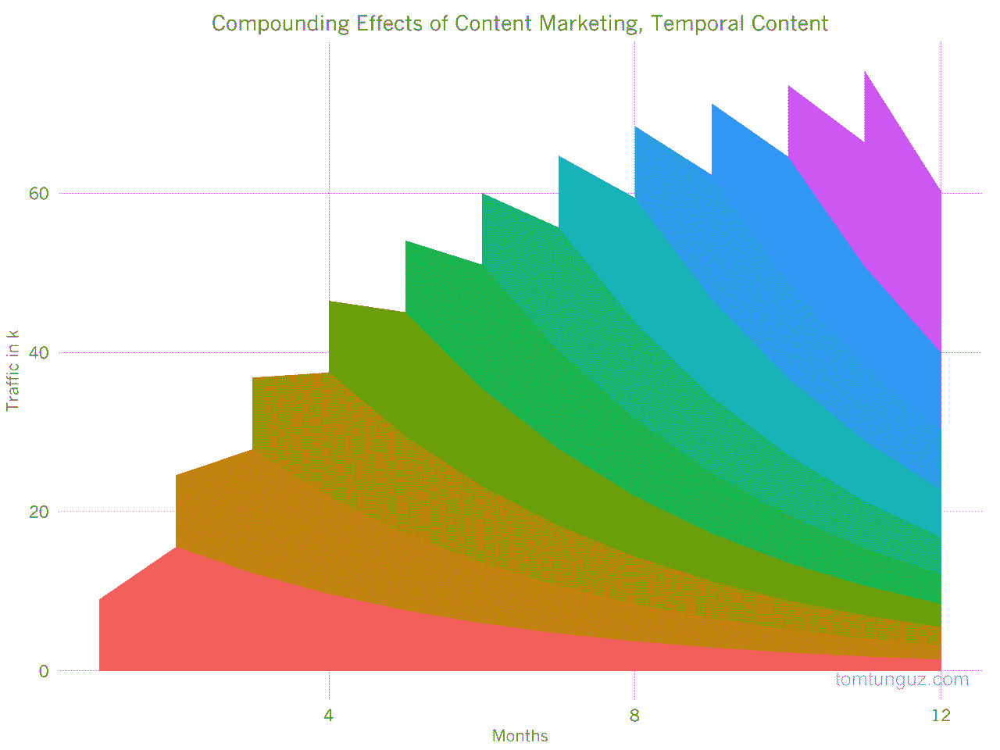

# 内容营销的复合回报

> 原文：<http://tomtunguz.com/content-marketing-compounding-returns/?utm_source=wanqu.co&utm_campaign=Wanqu+Daily&utm_medium=website>

[T2】](https://res.cloudinary.com/dzawgnnlr/image/upload/q_auto/f_auto/w_auto/pdf_blog_traffic.png)

几周前，我和 Hubspot 公司的 CMO·迈克·沃尔普一起参加了《成长秀》,在那里我们聊了一些关于 SaaS 的话题，聊得很开心。播客的一些听众从播客中挑选了一句话，我认为这是内容营销非常重要的一点。我说，“内容是少数几种有复合回报的营销形式之一。”

就像一个银行账户，开始时很小，并赚取递增的收益，但随着时间的推移会变得很大，内容营销工作需要持续的投资，但最终可以产生巨大的结果。Hubspot 的努力证明了这句格言。他们的博客每月吸引超过 100 万读者。

我将用一些我自己的数据和一些假设的数据来证明这一点。内容不仅仅与一天相关。一篇典型的 tomtunguz.com 帖子只有大约 1/3 的浏览量是在第一天产生的。事实上，上面的图表显示了过去一年博客文章页面浏览量份额的概率密度函数。图表显示，随着时间的推移，典型的博客帖子将产生 1 到 2 倍的流量。

当创建内容营销活动时，营销人员必须仔细考虑常青内容(读者总是感兴趣的帖子)和时间内容(仅一两天相关的帖子)之间的平衡。常青的帖子通常提供永恒的建议。临时帖子评论最近的事件。

偏向于更常青内容的内容营销活动将比那些关注时间性内容的营销活动发展得更快、规模更大。让我们对比两个假设的博客。

[T2】](https://res.cloudinary.com/dzawgnnlr/image/upload/q_auto/f_auto/w_auto/evergreen.png)

第一个博客是一个常青树博客。每条帖子在第一天大约有 150 次浏览，之后的每一天大约有 20 次。帖子的浏览量根据适度的衰减函数衰减，但一年后每天仍会产生约 18 次的浏览量(这个衰减常数是基于这个博客，但数字是不同的。)

你可以清楚地看到复合效果。在一年的时间里，这个博客每月产生超过 25 万的访问者。记住，这是一个假设的例子，完美的执行。但是这个想法仍然成立。内容营销价值复合。

[T2】](https://res.cloudinary.com/dzawgnnlr/image/upload/q_auto/f_auto/w_auto/temporal.png)

将常青树战略与时间战略进行对比。在这个例子中，每篇博客文章在第一天产生大约 150 篇文章，第二天产生 20 篇，但是衰减函数要积极得多。到今年年底，每个帖子每天产生 1 次浏览。

这个博客的访问量上限约为 7 万，不到前一个的三分之一。

实际上，内容营销活动平衡了常青内容和世俗内容。虽然它可能不会产生长期回报，但时间内容可以让博客保持新鲜。但是，为了从内容营销的复合效应中受益，营销人员应该积极投资建设常青内容，不断促进流量增长，建立公司的品牌并最终产生销售。