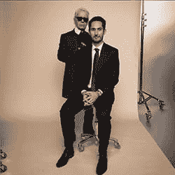
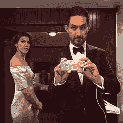
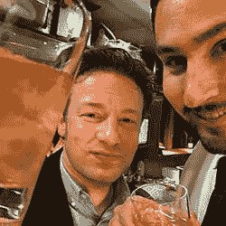

# Instagram 未经过滤|金融时报

> 原文：<https://www.ft.com/cms/s/2/e56964b0-1a22-11e5-a130-2e7db721f996.html?utm_source=wanqu.co&utm_campaign=Wanqu+Daily&utm_medium=website>

高耸的红杉林、夕阳下的游艇和一杯精心制作的咖啡的大型方形照片装饰着凯文·斯特罗姆办公室的墙壁。曾几何时，这些拍摄精美的照片可能会挂在美术馆里。现在，它们是日常的 Instagram，来自智能手机应用程序中的过滤内容。

Instagram 位于硅谷，在生机勃勃、不断扩张的脸书园区，每个人都刚刚搬过桌子，很少有人换下运动服，其联合创始人兼首席执行官朴素的办公室是一个永远时尚的角落。希斯特罗姆大步走进来，发现我在他的白色椭圆形大理石桌旁等着。他穿着卡其布 mac、浅蓝色条纹衬衫和漆头黑色运动鞋，比他的老板马克·扎克伯格(Mark Zuckerberg)更加精心打扮，后者负责将这件连帽衫变成一个极客图标。然而，无论他的服装多么时尚，他仍然缺乏他在 Instagram 上发布的最后一张照片的光泽。

在视频中，31 岁的希斯特罗姆在酒店房间的镜子前展示了他的燕尾服，女友妮可穿着露肩银色礼服在他身后摆姿势。这对夫妇被拍到前往美国时装设计师委员会颁奖典礼，在那里他拿起了 Instagram 上最著名的 insta gram(拥有 3710 万粉丝)之一金·卡戴珊·韦斯特(Kim Kardashian West)颁发的贡品。

在我问了一个他不想回答的问题:随着 Instagram 与所有者脸书的进一步融合，他将在 insta gram 掌舵多久之后，希斯特罗姆厚脸皮地说:“我想我的余生都将穿着晚礼服。”

他俯身看着桌上记录着每一个字的 iPhone，说道:“亲爱的英国《金融时报》读者，那是一个玩笑。”

* * *

获得 CFDA 媒体奖是 Instagram 在从时尚到食品、旅游到音乐的创意产业中影响力日益增长的最新标志。这种影响使得它的领导人不得不经常穿燕尾服。“在过去的一个月里，我想我不得不穿着燕尾服去参加三个活动，以至于我觉得我的清洁工就像是在说，‘通常人们一年清洗一次燕尾服，你就像是在吹这个，’”他笑着说。

Instagram 拥有 3 亿月活跃用户，其中 2 亿人每天登录。普通用户每天花 21 分钟在应用上上传图片、浏览照片和评论。它是新一代专注于照片的社交媒体应用程序之一，与 Snapchat(其消息会在 10 秒后消失)和在线剪贴簿 Pinterest 齐名。

对 Systrom 来说，这款应用不仅仅是一组漂亮的照片。他形容它是“世界的视觉脉搏”，是“世界的历史”，是与朋友交流的“视觉对讲机”。

该应用正在催生一个完整的 Insta 经济，成为成千上万人的收入来源，并改变了从名人到小企业的所有人的沟通方式。

当优步(Alibaba)和亚马逊(Amazon)等许多大型美国科技公司进军世界其他地区，发誓要“颠覆”其他行业，对自己的优势和(用优步的话说)“喧嚣”充满自信时，Instagram 正在向硅谷以外的地方发展，结交朋友。他表示:“我们特意与他人交朋友，不是因为这是一种战略，而是因为我们喜欢这种方式。”。"我从走出去和活在当下中获得了很多能量."

Systrom 的 Instagram 上显示他与设计师卡尔·拉格费尔德合影，与厨师杰米·奥利弗匆忙自拍，并俯视奥斯卡观众。当我们见面时，他对希拉里·克林顿刚刚加入感到兴奋，张贴了一张她的红白蓝套装的照片。

“看到时尚界真的喜欢上了 Instagram，这很酷，但这也是许多社区的众多例子之一:无论你是厨师、滑板手、冲浪者还是滑雪者，”他说。本周，Instagram 宣布了一种在应用程序上发现这些社区的新方法，整理“极限运动”和“高耸的岩石”等集合，并更容易找到可以关注的人。“有一些有趣的例子——比如，美甲社区，”Systrom 说。他检查着自己不起眼的男性指甲，补充道，他本人并不关注 Instagram 上的美甲。

 10 亿美元  脸书为 Instagram 支付的金额 

Instagram 的业务才刚刚开始显露。2012 年，它被脸书以 10 亿美元收购，当时只有 13 名员工，躲过了一轮轮融资狂潮，这些融资给 Twitter 和 Snapchat 等竞争对手带来了大量媒体关注。它也不必急于做广告。现在，在它成立五年和被收购三年后，它准备开足马力创收。它与其他行业的关系应该有助于增加广告销售，在这些行业中，人们热衷于拍摄和过滤食物、服装和风景的图像。

莎拉·菲利普斯(Sarah Phillips)是第一批使用 Instagram 做生意的人之一，她抓住了“食物”和“烘焙”这两个把手。这位身材苗条的 61 岁老人从她的女儿那里知道了这个应用程序，她的女儿的昵称是@newyorkcity。(同一个句柄不能被另一个 Instagrammer 使用。)她马上就知道这一定会火的。“人们说一张照片胜过千言万语，但我认为它价值数十亿，”她说。"它是技术加艺术的结合，因此而受欢迎."

© Kevin Systrom

菲利普斯是一个早期采用者，她在 2000 年创办了基于订阅的 craftybaking.com，在那里她发布食谱和食物图片，她称赞这些食物充满了“色彩、营养、乐趣和快乐”。Instagram 帮助建立了她的业务，达成了价值数千美元的交易，在她的 feed 中推广了卡夫、联合利华和星巴克等食品品牌，并帮助她与其他食品行业的 Instagram 建立了联系。

她是成千上万表示 Instagram 改变了他们业务的人之一。在食品领域的其他方面，厨师们更加关注菜肴的制作，咖啡馆表示，烤面包上的鳄梨等食品之所以受欢迎，是因为它们的外观，而不是它们的味道。

在时尚界，模特们经常在时装秀结束时聚集在一起，摆出各种姿势，以便 Instagrammers 可以给她们拍照。当一个模特参加工作试镜和起草合同时，她的粉丝数量会被考虑在内。

歌手蕾哈娜正准备在 Instagram 上发布一张带有预告的专辑，马里奥·格策在 Instagram 上发布了他的第一张与世界杯奖杯的照片，而获得《时代》杂志 2014 年度人物荣誉的非营利创始人凯蒂·梅耶勒(Katie Meyler)使用这款应用来推广她在利比里亚抗击埃博拉的工作。

19 岁的新西兰人克里斯蒂娜·韦伯(Kristina Webb)在 Instagram 上建立了一份全职工作。她色彩鲜艳、迪斯尼风格的照片吸引了 Instagram 上庞大的青少年用户群——而且她现在有能力雇佣她的姐姐，一名前会计师。

“这可以说是我最完美的工作，因为在一天结束时，Instagram 是我放学回家或兼职工作回家后在业余时间经常做的事情，”她说。她在海报和手机壳上出售自己的作品，与哈珀柯林斯(HarperCollins)有一项图书交易，并计划今年在美国 20 个城市进行巡回售书。

上次来美国时，她发帖询问是否有粉丝(她商业账户上有 170 万，个人账户上有 60 万)想在圣莫尼卡的一家购物中心见面。第二天，她发现 300 名粉丝在等她，尖叫着挥舞着标语，一名愤怒的经理对这种大惊小怪感到困惑。“对我来说，这是最不真实的时刻。在 Instagram 上，这是一个数字，但在现实生活中看到它们才是最重要的部分。知道我影响了他们的生活，”她说。

34 岁的洛伊克·古泽(Loic Gouzer)是佳士得的一名专家，当他在纽约为一场前卫的现代艺术拍卖会设计的宣传单“如果我活着，我会在周二见你”被“管理层的某个部门”拒绝时，他意识到了 Instagram 的力量。他在 Instagram 上发布了这张照片，因为他觉得“没有法律”，他可以发展自己的声音和与粉丝的关系。这有助于吸引收藏家来看他的展览，艺术家们也吵着要在他的节目中出现。

“从一幅画在画廊展出到它获得某种可信度的时间通常需要两年、三年、五年或十年，”他说。“现在，你甚至还没有完成工作，某个工作室的某个人正在拍照，两分钟后，一个人看到了照片并买了下来。”

 300 米  每月活跃用户 

但有迹象表明，互联网经济的动态可能已经发生了变化。莎拉·菲利普斯(Sarah Phillips)正在组织一次食品 Instagrammers 同行会议，试图为她所说的经常“不劳而获”的品牌创建一些标准。

“我为什么要白给一家大食品公司打广告？我认为 Instagram 上的赚钱方式将会有所改变，”她说，并补充说，一些人现在向她提供每张照片 100 美元的价格，甚至只是免费产品。“这并不是说我喜欢拒绝金钱。简直令人发指。她说:“如果我开始接受这些工作，整个公司都会被拖垮。

* * *

Systrom 可能是 30 出头，但他说，他觉得他的年龄。他指着自己办公室的门，称员工为“外面的年轻人”。外面，新面孔的男男女女或坐或站在一排排办公桌前，凝视着笔记本电脑。开放式办公室拥有高科技的额外待遇(免费小吃),但一个有趣的“重力”房间被移走了，这样可以拍照，看起来好像一个人在飞，为更多的员工腾出空间。

 21 分钟  平均每日使用量 

他描述了自己的青少年时代——在他的诺基亚上玩“蛇”游戏——与 Instagram 上的一群青少年有多么不同。当被问及自 2006 年开始在硅谷工作以来，硅谷发生了什么变化时，他把重点放在了年龄上。“有更多的公司有更多的年轻人，”他说。“这就像 23 岁的年轻人创办公司，而且发展非常迅速。”

Systrom 在 26 岁的高龄与联合创始人迈克·克里格(Mike Krieger)一起创立了 Instagram，他领导着技术方面的工作。Instagram 是少数几个真正一夜成名的网站之一，第一天就有 25000 次下载。一年半后，当它被脸书收购时，它拥有 2700 万活跃用户。

© Annie Tritt

Instagram 的早期投资者克里斯萨卡(Chris Sacca)表示，Systrom 在与投资者交谈时并没有极力推销。“凯文一直知道 Instagram 会很大。他从未试图说服我们任何人，”他说。在此之前，Systrom 有一个典型的想要成为企业家的职业生涯:在斯坦福大学学习管理科学和工程，在谷歌和初创公司 Odeo 工作，后者后来变成了 Twitter。但正是他在科技出现之前的生活，让他准备创造一种在网上发布照片的新方式。

希斯特罗姆在马萨诸塞州长大，母亲从事营销工作，父亲从事人力资源工作，还有一个妹妹。他在波士顿附近的一所独立高中学习计算机科学，滑雪，并在当地电台工作。

大学期间，他在佛罗伦萨学习，参加了一个摄影班，在课上，一位老师鼓励他尝试一种塑料相机，并向显影溶液中添加化学物质，以达到有趣的效果。“那改变了我的生活。我的意思是，你知道，方形过滤照片的发现。我的意思是，就是这样，对不对？”他指着墙上的大号照片说道。

几年后，他描述了自己是如何用 Photoshop 做到这一点的，“没有暗室里的所有艰苦工作”，然后通过编程滤镜的算法，让它变得很容易“在 iPhone 上点击”。

他从未考虑过成为一名摄影师，因为他“并不擅长”。“我只是喜欢尝试在 Instagram 上拍出好照片，人们会说，‘你为什么不每天都拍照？’因为我没那么好，我在尽力。"

> It is creating a world record, a world history. ... I think it's beautiful. I don't think it's narcissism

相反，Systrom 在艺术与技术相遇的地方蓬勃发展。他打赌，如果你“回到高中时代”，那时他是摄影俱乐部的主席，并问同龄人他会发现什么样的初创企业，他们会预测是关于艺术、摄影和联系人们的。

但帮助 Instagram 击败许多其他照片应用的不仅仅是方形格式和讨人喜欢的滤镜。他说，这也是一种“不对称追随模式”，人们可以追随他人，而无需他人追随或加好友。“没有多少人用照片来做这件事。照片被视为最隐私的内容类型，Instagram 彻底颠覆了这一观点，称照片可以真正公开。”

* * *

批评者担心，在 Instagram 上展示的这张公众面孔正在创造一个自恋的一代，他们使用这款应用描绘了一个他们可能实际上没有过的生活愿景。自拍成了自我推销的终极象征。希斯特罗姆的信息显示，他也喜欢自拍。“我就像我自己的自拍杆，”希斯特罗姆开玩笑说，张开双臂。“我身高 6 英尺 5 英寸，你能看见我吗？”但他拒绝了他的应用程序只是生活方式色情的想法，例如，人们太关心向朋友展示每一顿饭，他们把食物放在冰箱里。

© Kevin Systrom

“我从来没有醒来后想，伙计，我们生活在自恋的一代，”他说。“我认为它创造了一个世界纪录，一部世界历史，人们的情感，人们的表情，我认为这很美。我不认为那是自恋。”

Systrom 喜欢青少年的 Instagram feeds 展示他们成长的方式。一个年轻人在 Instagrammers 的一次早期聚会上遇到他时才 13 岁，现在他 18 岁了，正在使用这款应用推广他的音乐。他说，在智能手机出现之前，自拍就已经存在了，但它“花了很长时间”。

“我认为，这不是一个 Instagram 的事情，这是一个社会的事情。人们穿特定的衣服来展示特定的形象，人们开特定的车，住特定的房子，做特定的工作或有特定的头衔。这是人之常情。他说:“我认为你只是通过 Instagram 上的图片看到了人类大规模的表演。

Instagram 有人性，现在需要钱。Systrom 现在必须通过制作 Instagram 爱好者欢迎的广告，从平台上已经获得的收益中分得一杯羹。

> Sister Romer expressed his boldest proposition: Instagram may make money faster than any other social network, "that's it"

除了开玩笑，Systrom 通常会小心谨慎地说话，但当他在采访中不经意地说出最大胆的主张时，他感到惊讶:Instagram 可能比任何其他社交网络都更快地商业化，“句号”。

这是一个大胆的举动，因为这家初创公司自 18 个月前展示了第一个广告——一只金色迈克高仕手表放在喝茶的桌子上——以来，一直只涉足广告业务。很少有 Instagram 用户经常看到广告，它只允许用户在今年 3 月点击进入一家公司的网站。

“最初，我们进展得相当缓慢，因为我们想确保每个人都明白我们要货币化，”希斯特罗姆说。现在，Instagrammers 对平台上的广告感到满意，所以“我们的意图当然是现在就非常快速地进行”。

他将这种加速发展的能力归功于 Instagram 的所有者脸书，他是第一个掌握社交媒体广告的人。他说，脸书是“广告服务引擎”，可以为 Instagram 提供动力。

脸书的算法可以使用详细的目标定位来帮助营销人员触及他们的受众。例如，零售商可以选择向年龄在 25 岁至 35 岁之间的女性展示广告，这些女性喜欢网球，并与其他顾客有共同的特点。

Systrom 也从母公司学到了重要的一课:广告商不想被迫为每一个新平台从头开始学习。脸书在麦迪森大街的第一次冒险中受到了打击，当时它试图重新发明广告，却没有理解广告商衡量和比较不同媒体的愿望。它改变了策略，现在是更受欢迎的数字媒体公司之一。

“我认为，随着时间的推移，大多数科技公司将从广告中学到的一点是，在广告业务中真正成功的方法是不要试图过于独特，”他说。

* * *

Systrom 称赞脸书加速了 Instagram 的广告业务，这证明了收购的最初逻辑。Instagram 是脸书现在称之为“应用程序家族”的第一个孩子。这笔交易为后来的收购奠定了基础，比如去年收购即时通讯应用 WhatsApp。

在这种模式下，被收购的初创企业的创始人被赋予了很大的独立性，但也提供了一份脸书可以帮助他们的清单:从招聘、服务器空间到广告。脸书早期投资者 Accel Partners 的 Rich Wong 表示，该公司有“胆量”收购 Instagram。“当时人们认为这很疯狂，但回想起来，这是有先见之明的，针对的是移动用户和年轻人群，”他说。

> He doesn't like to be compared with his boss mark zuckerberg. We are just two very different people

但 Instagram 的成功也引发了他们是否卖得太早、价格太低的问题。10 亿美元，比两年后扎克伯格花 220 亿美元收购 WhatsApp 要便宜得多。当时，10 亿美元是一大笔钱；现在，大约有 80 家所谓的“独角兽”，即估值超过 10 亿美元的初创企业，其中最大的估值分别为 110 亿美元(Pinterest)、150 亿美元(Snapchat)和 400 亿美元(优步)。

格雷洛克资本(Greylock Capital)的约翰莉莉(John Lilly)表示，Instagram 本可以成为一家“大型、持久的公司”。格雷洛克资本在收购前几天刚刚完成了一笔投资 Instagram 的交易。但他补充道:“我的猜测是，如果它保持独立，情况不会有太大不同。在收购之前，它已经具有相当大的规模。我认为凯文与扎克伯格、迈克·斯科洛普夫(脸书的首席技术官)和谢丽尔(桑德伯格)的合作给他带来了变革。”

当我问及他和扎克伯格的关系时，Systrom 似乎非常紧张。在整个过程中，他一直在旋转旁边的旋转皮椅，先是用脚，然后把它拉近，用手把它从一边转到另一边。当话题转向扎克伯格时，旋转变得更加烦躁。

“我每周都会见到他，并不总是谈论 Instagram 之类的东西。他说:“我是脸书管理团队的一员，所以我也帮助进行一般性管理。”。“我们一起吃饭，不是每周，那是骗人的。 . . "

当被问及去哪里吃饭时——脸书食堂、家里还是高级硅谷餐厅——他耸耸肩说:“这完全取决于情况。”

© Kevin Systrom

“但是，是的，我们有着密切的关系，我认为这种关系是相当富有成效的。所以这很好，”他总结道。

我试着开一个关于扎克伯格缺乏着装品味的玩笑，以此来缓和气氛。Systrom 提出异议，但微笑着说:“我不知道。我是说，每个人都有自己的事情。他一周读一本书，我希望我能做到。”

他显然不喜欢被拿来和他的老板相比。“我想我的观点是，每个人都有自己的事情，但我喜欢美学，我喜欢工艺，我喜欢基于那些真正喜欢 Instagram 的社区的产品，这是有道理的，”他说。“我认为试图比较我们很难，因为我们只是两个非常不同的人，但这就是 Instagram 和脸书在一起如此酷的原因。”

脸书还帮助 Instagram 免受科技泡沫破裂的担忧。估值正在飙升，就连知名风险投资家和企业家也公开质疑一些初创企业的估值是否过高。

Systrom 并不担心科技泡沫，因为“我们唯一的投资者是脸书”，他们的业务“健康”(去年产生了 47 亿美元的调整后收益)。但是他意识到这个循环影响到这里的每个人——他只是不知道我们在其中的位置。

“现在存在技术问题。科技公司，每个人都成长得非常非常快，但我认为从长远来看，它会自己解决的。他说:“我不担心技术的长期前景。他预测，社交媒体的未来将包括更多视频、可穿戴设备和虚拟现实。Instagram 已经提供视频，脸书正在挑战 YouTube 的统治地位，但“我不认为有人已经搞清楚了视频。”

他自己的未来呢？许多人想知道 Systrom 是否会继续留任。即使 Instagram 发展出坚实的业务，Systrom 仍将是脸书帝国一角的领导者，而不是上市公司的首席执行官。也许他会想重新开始自己的事业。

事实上，他在未来看到的不仅仅是穿燕尾服。他拒绝说出时间表，他说他很高兴有机会推出新的 Instagram 应用程序，如布局、排列照片和 Hyperlapse，后者将视频加速到漫画的速度。

“创业是我真正相信的事情。他说:“我并不是因为觉得这是一个好主意才开始做这个应用的，我和迈克一起开始做这个应用是因为我们觉得我们可以围绕通过图像把人们联系起来，建立一个令人惊叹的业务。“太棒了，对吧？”

汉娜·库奇勒是《金融时报》驻旧金山记者

照片:安妮·特里特