# 改善用户体验的 15 个移动增长秘诀| VentureBeat

> 原文：<http://venturebeat.com/2015/06/22/15-mobile-growth-hacks-that-improve-user-experience/?utm_source=wanqu.co&utm_campaign=Wanqu+Daily&utm_medium=website>

*查看来自低代码/无代码峰会的点播会议，了解如何通过提升和扩展公民开发者的技能来成功创新和实现效率。* [*现在看*](https://attendees.bizzabo.com/427958/agenda?date=1667952000000) *。*

* * *

让用户安装你的应用程序很难——应用程序发现相当混乱。超过 80%的应用程序没有出现在苹果应用商店的顶级列表中，每个细分市场都有很多竞争，挤出了搜索结果。但如果你设法获得了用户，那么留住他们就是一个更大的挑战。Quettra 的一项新研究表明[一个应用平均在头 3 天内流失 77%的用户](http://andrewchen.co/new-data-shows-why-losing-80-of-your-mobile-users-is-normal-and-that-the-best-apps-do-much-better/)，在前 30 天内流失 90%。那么，你应该如何建立一个移动应用业务呢？

留住用户和获得新用户一样重要，甚至更重要。但添加额外的弹出窗口或第九个“我们想你”推送通知并不能留住用户，尽管他们可能会想到这些策略，因为这是大多数移动增长博客和社区谈论的话题。从长远来看，发展你的移动应用业务不一定要破坏用户体验和伤害自己。

在这篇文章中，我给你带来了 15 个技巧，可以帮助你通过增加用户体验来发展你的移动应用。当然，你必须亲自尝试一下，看看数据是什么样的，但是潜在的理念是帮助用户更好地完成工作。

## **入职**

### **#1 关注用户利益**

除非你的应用非常简单，有非常直观的流程，像脸书一样受欢迎，或者你完全反对让用户熟悉你的应用，否则你的应用会有一个入门步骤。因为这是你的用户对你的第一印象，入职是你的应用程序最重要的部分之一。

在你要求用户做任何事情之前，从注册你的应用程序到添加主题来填充内容，解释它将如何使用户受益。当用户知道应用程序将如何让他们的生活变得更好时，他们更有可能采取你希望他们采取的行动。

Periscope 在入职时简洁明了地总结了它的价值主张。

[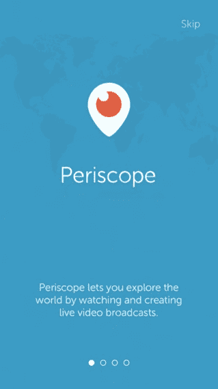

<noscript></noscript>](https://venturebeat.com/wp-content/uploads/2015/06/onboarding-periscope.jpg?resize=319%2C568&strip=all?strip=all) 

### **#2 显示，不告诉**

当你在教用户某个特定的功能是如何工作的时候，告诉他们某个东西是如何工作的并期望他们记住它会更容易。但是大多数用户会忘记他们所阅读的内容。相反，让他们实际做一项活动，他们会记得更久。因此，只要有可能，就让用户在入职培训中实际尝试这些功能。

IFTTT 的 Do Button 解释了应用程序中按钮的工作原理，要求用户点击一个按钮，向他们发送一个有趣的 GIF。

[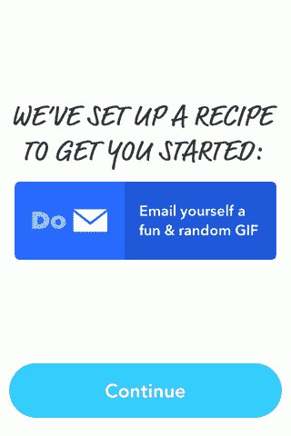

<noscript></noscript>](https://venturebeat.com/wp-content/uploads/2015/06/onboarding-do-button-ifttt-show-dont-tell.gif?resize=320%2C480&strip=all?strip=all) 

### **#3 保持简短和专注**

仅仅因为你的应用可以做六件不同的事情，并不意味着入职培训必须解释所有的事情。只要把重点放在你的应用程序的主要价值主张上，并继续进行培训——一旦你认为用户已经很好地掌握了你的核心功能并能处理更多，就告诉她下一个功能以及它将如何使她受益。

## **请求权限**

### **#4 在请求发送通知的许可之前设置正确的上下文**

推送通知的选择加入率从 2013 年的 45%下降到 2015 年的 42%。随着应用程序开始发送更多的推送通知来增加参与度，用户对希望哪些应用程序向他们发送推送通知变得越来越挑剔。

虽然不同行业的选择加入率不同，但通过在权限弹出窗口出现之前清楚地解释通知如何帮助用户，您可以确保您的通知有更高的选择加入率。

[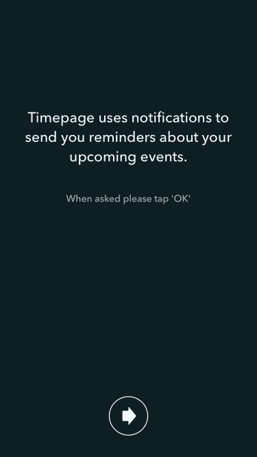

<noscript></noscript>](https://venturebeat.com/wp-content/uploads/2015/06/permissions-timepage-notifications.jpg?resize=375%2C667&strip=all?strip=all) 

上图:图片来源:Pttrns

[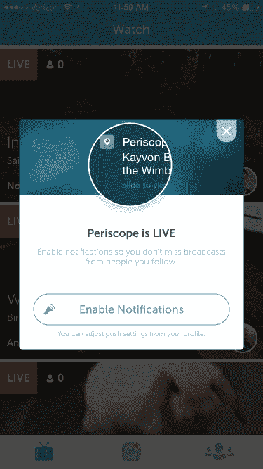

<noscript></noscript>](https://venturebeat.com/wp-content/uploads/2015/06/permissions-periscope-notifications.jpg?resize=375%2C667&strip=all?strip=all) 

上图:图片来源:Pttrns

### **#5 不仅仅是通知，解释每个许可的好处**

你的应用程序还需要获得许可才能访问许多其他内容，包括位置、摄像头和麦克风。例如，如果你的应用程序是基于位置显示附近的人、地方或事件，拒绝访问该位置实际上使你的应用程序变得无用。对于一部手机来说，推翻访问权限是一个相当复杂的过程。

当然，我们可以责怪用户愚蠢，但对你为什么需要访问的一点解释不会有什么坏处，即使对于那些已经明白你为什么需要位置数据的人来说，这也只是一种强化。

[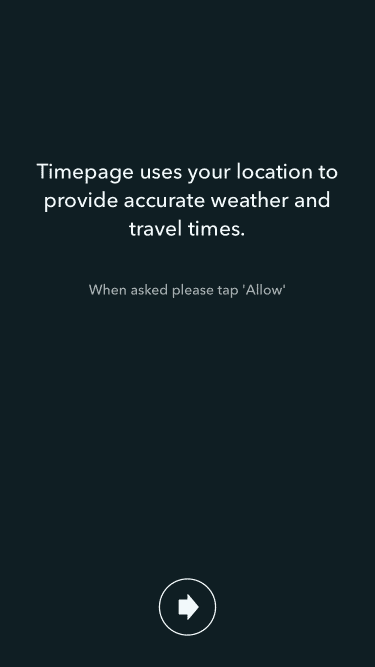

<noscript></noscript>](https://venturebeat.com/wp-content/uploads/2015/06/permissions-timepage-location.jpg?resize=375%2C667&strip=all?strip=all) 

上图:图片来源:Pttrns

## **推送通知**

### **#6 保持对话状态**

电话是非常私人的设备。如果你要用支持票式的语言用被动语态和我说话，我会觉得被推销了。我会提高警惕，我会淹没你要说的一切。

但是像朋友一样跟我说话，我会更容易接受你要说的话。体重和营养教练应用 Lark 在应用本身和通知中的语气方面做得很好。

[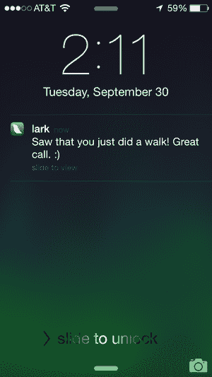

<noscript></noscript>](https://venturebeat.com/wp-content/uploads/2015/06/push-notifications-lark-conversational.png?resize=300%2C533&strip=all?strip=all) 

上图:图片来源:TechHive

SleepBot，顾名思义，有一个非常厚脸皮的消息，可以在你有一段时间没有使用该应用程序时让你回来。

[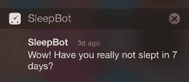

<noscript></noscript>](https://venturebeat.com/wp-content/uploads/2015/06/push-notifications-sleepbot.jpg?resize=320%2C139&strip=all?strip=all) 

上图:图片来源:小细节

### **#7 使用您拥有的数据添加上下文**

即使有了正确的细分，通知仍然会让人感觉非常营销化。毕竟，他们仍然被发送给一部分有共同兴趣的人，而不仅仅是我。

但是如果这些通知仅仅是基于我的行为呢？基于我什么时候喜欢跑步？我喜欢看的那种电影？我喜欢看的内容？

Runkeeper 就是这样做的，它根据用户跑步的历史数据提醒用户去跑步。

[

<noscript></noscript>](https://venturebeat.com/wp-content/uploads/2015/06/push-notifications-runkeeper.jpg?resize=338%2C600&strip=all?strip=all) 

上图:图片来源:Mobypicture

## **登录表单**

### 社交登录是你的一个选择吗？这对用户来说是一个很好的选择

如果你可以选择使用脸书、推特或谷歌登录，它们是防止在登录界面掉线的好方法。它们不仅消除了在登录屏幕上键入三个字段的需要，还消除了移动键盘上常见的所有拼写错误，从而消除了以后仅仅因为用户拼写错误而恢复用户名和密码的需要。

### **#9 对密码有特殊规定？让用户事先知道**

注册你的应用程序时，密码必须包含大写字母、数字、特殊字符、表情符号和密码——那么，你当初为什么要拥有它们呢？但是如果你有一个很好的理由，在表单的顶部非常清楚地写下规则，这样用户就不会输入名字、用户名和密码，点击“注册”就可以发现密码需要的所有特殊规则。然后不得不再次键入所有内容。

[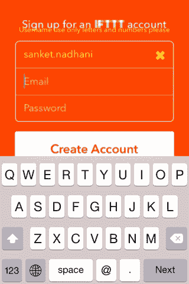

<noscript></noscript>](https://venturebeat.com/wp-content/uploads/2015/06/login-form-do-button-username-special-rules.jpg?resize=320%2C480&strip=all?strip=all) 

IFTTT 的 Do Button，在其他方面是一个很棒的应用程序，却因用户名而犯了这个错误。他们也有一些错误信息的间距问题。

## **评级和反馈**

### **#10 允许用户报告错误或向您发送反馈**

许多[用户给一个应用程序一星评级，因为它崩溃了或者有一个错误](http://www.loopinsight.com/2014/02/04/begging-for-app-ratings/)，他们只是无法找到联系应用程序开发者的方法。沮丧之余，他们只是去了，并在评级中发泄出来，因为他们知道他们肯定会引起应用程序开发人员的注意。这些评级损害了应用商店优化(ASO)和应用的整体可信度。

不一定要这样。在你的应用程序中一个非常显眼的部分添加一个反馈链接，邀请用户联系你，并主动回复。你不仅可以通过这个渠道打倒 1 星恐怖，你还可以利用这个机会把你的一些诽谤者变成热情的粉丝。你也可以利用这一点与广大用户建立关系，并获得对你产品的反馈。

### **#11 在适当的时候要求评分**

除非你从哲学上不同意要求评级，并且认为你的应用程序应该尽可能地说话，否则你会得到某种提示，要求用户对应用程序进行评级。你为什么不能呢？

但你会在别人第三次打开你的应用时就要求评级吗(有些真正有名的应用会这样做)？还是因为他们安装 app 已经 5 天了？让用户真正从你的应用中获得价值，他们完成了他们来完成的任务——在他们预订了他们来预订的酒店，成功地与他们的团队分享了文件，通过了游戏中真正困难的关卡，或者检查了三个待办事项列表之后。

### **#12 以正确的方式询问评分**

现在，当你考虑评级时，首先想到的是要求你在 App Store 上给 5 颗星评级的弹出窗口。这肯定是最常用的方法，但许多应用程序最终只因为他们的要求而获得 1 星评价。一些科技专家建议给一星，因为提示让他们很烦。

那么，你应该如何要求最重要的评级呢？Circa 是一个新闻应用程序，它没有我之前提到的神奇时刻，[询问用户是否喜欢 Circa 新闻](https://medium.com/circa/the-right-way-to-ask-users-to-review-your-app-9a32fd604fca)。我的意思是要求反馈是一种权利，对吗？如果他们喜欢这个应用程序，Circa 就会要求用户给这个应用程序打分。

[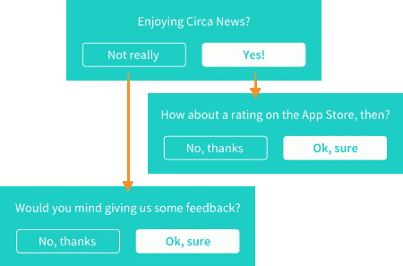

<noscript></noscript>](https://venturebeat.com/wp-content/uploads/2015/06/ratings-circa-news-flowchart.gif?resize=450%2C297&strip=all?strip=all) 

上图:图片来源:大约

他们已经将它原生地嵌入到他们的新闻提要中，而不是一个你被迫与之交互的弹出窗口——当你向下滚动新闻提要时，它非常明显，但如果你想忽略它，你完全可以不需要任何额外的努力。

[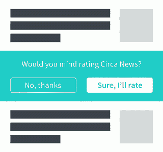

<noscript></noscript>](https://venturebeat.com/wp-content/uploads/2015/06/ratings-circa-news-prompt.gif?resize=320%2C300&strip=all?strip=all) 

上图:图片来源:大约

另一个提示评分的好地方是，如果你有一个通过电子邮件或应用内聊天与用户沟通的渠道。如果你这样做了，在你解决了用户的问题或者让她开心之后，让她给应用程序打分。

## **用微小的细节取悦用户**

### **#13 用不寻常但巧妙的方法节省时间**

对大多数人来说，在电话上打字不是最愉快的经历。Yelp 通过允许用户使用表情符号进行搜索来消除这种痛苦:汽车、鲜花、酒吧、按摩，只要你能想到的。它不仅节省了打字的时间，而且更有趣。

[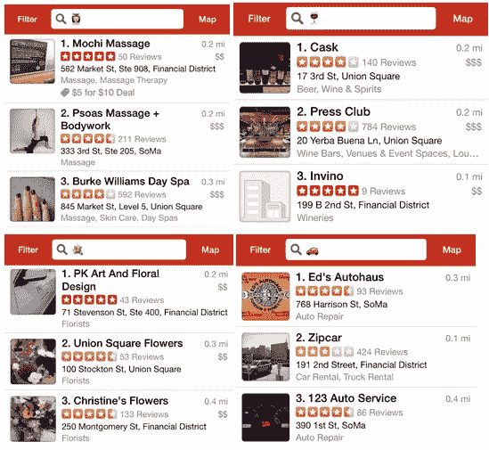

<noscript></noscript>](https://venturebeat.com/wp-content/uploads/2015/06/delight-users-yelp-emoji-search.jpg?resize=549%2C505&strip=all?strip=all) 

上图:图片来源:小细节

Slack 通过给你发送一个“神奇链接”让你自动登录，免去了输入更复杂密码的痛苦。

[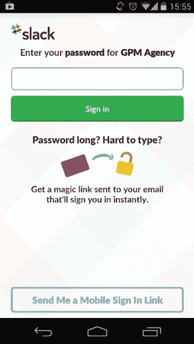

<noscript></noscript>](https://venturebeat.com/wp-content/uploads/2015/06/save-time-slack-password-link.jpg?resize=320%2C568&strip=all?strip=all) 

上图:图片来源:小细节

### **#14 有趣的错误信息**

谁喜欢错误？我这辈子没见过的人。但是谁说错误消息不能成为在你的应用中建立一些个性的地方呢？

同样，Yelp 在这里大放异彩。当它找不到你的当前位置时，它暗示你是一个忍者。

[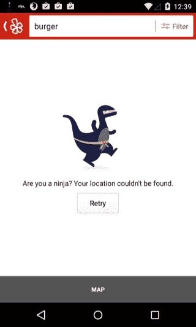

<noscript></noscript>](https://venturebeat.com/wp-content/uploads/2015/06/delight-users-yelp-ninja.jpg?resize=320%2C533&strip=all?strip=all) 

上图:图片来源:小细节

### **#15 最意想不到的惊喜**

当你在网上发现一个藏在你最意想不到的地方的惊喜时，你最有可能告诉每个人你的发现。也许你甚至会截图放在你的推特账户上。

大多数人都像你一样。

在大多数屏幕上，当你下拉刷新时，YouTube Creators Studio 显示猫从界面后面偷看。

[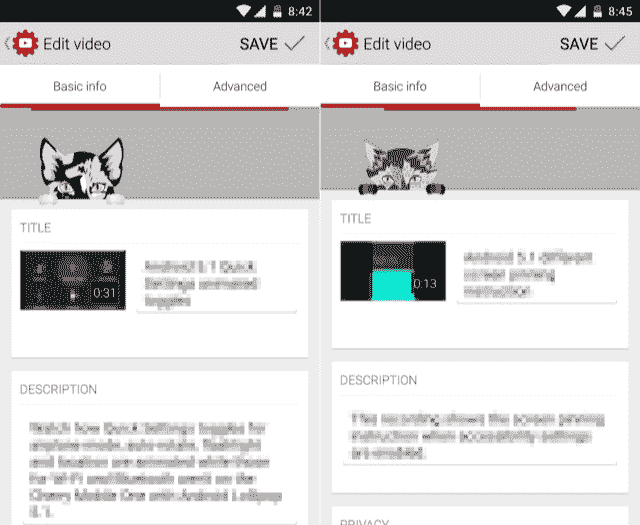

<noscript></noscript>](https://venturebeat.com/wp-content/uploads/2015/06/delight-users-youtube-content-creator-cat.jpg?resize=640%2C525&strip=all?strip=all) 

上图:图片来源:小细节

人们似乎很喜欢它——我认为非常值得努力。

[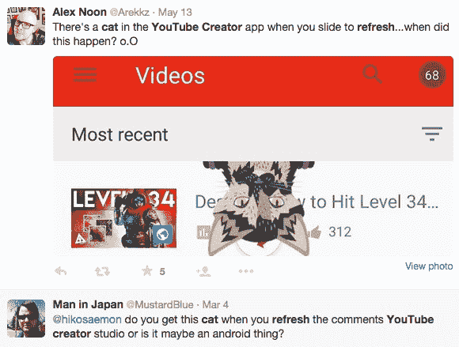

<noscript></noscript>](https://venturebeat.com/wp-content/uploads/2015/06/delight-users-youtube_cat_tweets.jpg?resize=580%2C439&strip=all?strip=all) 

优步允许你在出租车申请等待批准的时候涂鸦。

[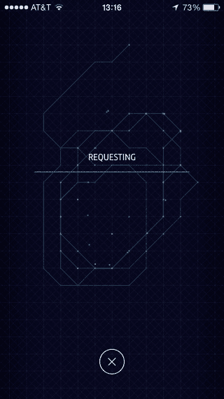

<noscript></noscript>](https://venturebeat.com/wp-content/uploads/2015/06/save-time-uber-doodle.jpg?resize=320%2C568&strip=all?strip=all) 

上图:图片来源:小细节

当天气真的很冷时，雅虎天气会在屏幕边缘结霜。

[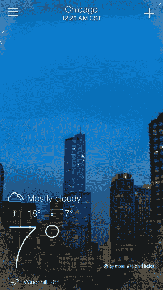

<noscript></noscript>](https://venturebeat.com/wp-content/uploads/2015/06/delight-users-yahoo-weather-frost.jpg?resize=320%2C568&strip=all?strip=all) 

上图:图片来源:小细节

就是这样。有 15 种非黑客的方法可以通过为用户提供良好的体验来增长你的移动应用。你最喜欢哪一个？你还知道哪些为他们的应用带来巨大成功的黑客？

* * *

[

<noscript></noscript>](https://venturebeat.com/wp-content/uploads/2015/06/sanket-nadhani.jpg?strip=all) Sanket Nadhani 目前正在打造 [Upquire](http://upquire.com/) ，这是一个面向独立开发者的免费移动互动平台。

**VentureBeat 的使命**是成为技术决策者获取变革性企业技术知识和进行交易的数字城市广场。[发现我们的简报。](https://info.venturebeat.com/website-preference-center.html)