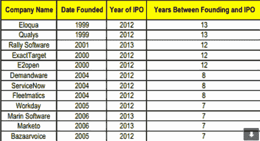
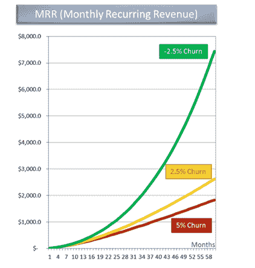

# 43 节课，收入两次从 0 美元增长到 100 多万美元

> 原文：<http://thenextweb.com/entrepreneur/2015/06/13/43-lessons-growing-from-0-to-1-million-in-revenue-twice/?utm_source=wanqu.co&utm_campaign=Wanqu+Daily&utm_medium=website>

前几天我意识到，我们通过两个独立的产品( [HelloSign](http://t.sidekickopen01.com/e1t/c/5/f18dQhb0S7lC8dDMPbW2n0x6l2B9nMJW7t5XZs5wvHZnVS9QDR2BFJ8FW8qC87H56dJMff3yLP9v02?si=5933787492384768&pi=DA24AC03-08D6-49B3-9C28-43E00C7B7529&t=http%3A%2F%2Ft%2Esidekickopen01%2Ecom%2Fe1t%2Fc%2F5%2Ff18dQhb0S7lC8dDMPbW2n0x6l2B9nMJW7t5XZs5wvHZnVS9QDR2BFJ8FW8qC87H56dJMff3yLP9v02%3Fsi%3DX%2DSIG%2DAPPLE%2DNOKEY%26pi%3DBE377D13%2D312B%2D4EA2%2DB2B3%2D955B86E4CE1C%26t%3Dhttp%253A%252F%252Ft%252Esidekickopen01%252Ecom%252Fe1t%252Fc%252F5%252Ff18dQhb0S7lC8dDMPbW2n0x6l2B9nMJW7t5XZs5wvHZnVS9QDR2BFJ8FW8qC87H56dJMff3yLP9v02%253Fsi%253DX%252DSIG%252DAPPLE%252DNOKEY%2526pi%253DF5462BB6%252D5C47%252D4676%252D9841%252DBB6FA6867CDE%2526t%253Dhttps%25253A%25252F%25252Fwww%25252Ehellosign%25252Ecom%25252F) 和 [HelloFax](http://t.sidekickopen01.com/e1t/c/5/f18dQhb0S7lC8dDMPbW2n0x6l2B9nMJW7t5XZs5wvHZnVS9QDR2BFJ8FW8qC87H56dJMff3yLP9v02?si=5933787492384768&pi=DA24AC03-08D6-49B3-9C28-43E00C7B7529&t=http%3A%2F%2Ft%2Esidekickopen01%2Ecom%2Fe1t%2Fc%2F5%2Ff18dQhb0S7lC8dDMPbW2n0x6l2B9nMJW7t5XZs5wvHZnVS9QDR2BFJ8FW8qC87H56dJMff3yLP9v02%3Fsi%3DX%2DSIG%2DAPPLE%2DNOKEY%26pi%3DBE377D13%2D312B%2D4EA2%2DB2B3%2D955B86E4CE1C%26t%3Dhttp%253A%252F%252Ft%252Esidekickopen01%252Ecom%252Fe1t%252Fc%252F5%252Ff18dQhb0S7lC8dDMPbW2n0x6l2B9nMJW7t5XZs5wvHZnVS9QDR2BFJ8FW8qC87H56dJMff3yLP9v02%253Fsi%253DX%252DSIG%252DAPPLE%252DNOKEY%2526pi%253DF5462BB6%252D5C47%252D4676%252D9841%252DBB6FA6867CDE%2526t%253Dhttps%25253A%25252F%25252Fwww%25252Ehellofax%25252Ecom%25252F) )从 0 美元增长到了 100 万美元。这发生在很久以前，但我最近在反思这些教训。

我发现很多成长真理都是错误的。我们学到了很多。有些教训是痛苦得来的，这就是为什么我可能对它们有强烈的看法。他们也可能倾向于 B2B 产品，但如果你不在这个领域，我不会打折扣。

以下是我们的经验教训:

### 1.尽快为您的产品收费。真的。

我接触过的每个创始人都有一个不为他们的产品收费的好理由，而且通常是一个糟糕的理由。我记得和保罗·格拉厄姆在一起的办公时间。我们解释说，我们现在专注于产品，但以后会专注于收入。他很困惑，不知何故，我们看到了专注于产品和专注于增长之间的权衡。建筑产品应该等于增长的收入。人们通过付钱来表明他们重视你的产品。

### 2.收入告诉你应该关注哪些功能

充电是一个强有力的指标，表明你正在制造人们想要的东西。如果你不收费，你可能会花钱(开发时间=金钱)来构建用户并不真正想要的特性。付钱给你的人对下一步要做什么有意见。让他们开心会让更多像他们一样的人付钱给你(注意:[不要开发加拉帕戈斯产品](http://t.sidekickopen01.com/e1t/c/5/f18dQhb0S7lC8dDMPbW2n0x6l2B9nMJW7t5XZs5wvHZnVS9QDR2BFJ8FW8qC87H56dJMff3yLP9v02?si=5933787492384768&pi=DA24AC03-08D6-49B3-9C28-43E00C7B7529&t=http%3A%2F%2Ft%2Esidekickopen01%2Ecom%2Fe1t%2Fc%2F5%2Ff18dQhb0S7lC8dDMPbW2n0x6l2B9nMJW7t5XZs5wvHZnVS9QDR2BFJ8FW8qC87H56dJMff3yLP9v02%3Fsi%3DX%2DSIG%2DAPPLE%2DNOKEY%26pi%3DBE377D13%2D312B%2D4EA2%2DB2B3%2D955B86E4CE1C%26t%3Dhttp%253A%252F%252Ft%252Esidekickopen01%252Ecom%252Fe1t%252Fc%252F5%252Ff18dQhb0S7lC8dDMPbW2n0x6l2B9nMJW7t5XZs5wvHZnVS9QDR2BFJ8FW8qC87H56dJMff3yLP9v02%253Fsi%253DX%252DSIG%252DAPPLE%252DNOKEY%2526pi%253DF5462BB6%252D5C47%252D4676%252D9841%252DBB6FA6867CDE%2526t%253Dhttp%25253A%25252F%25252Fjosephwalla%25252Ecom%25252Fdont%25252Dbuild%25252Da%25252Dgalapagos%25252Dproduct)

### 3.关注正确的客户

YC 和保罗·布赫海特常说，找到一个用户，让她开心。我会修改的。在一个大市场中找到一个 LTV 最高、客户流失率最低的用户，并专注于让她开心。否则，你可能正在煮沸海洋。

### 4.你有分销问题，而不是产品问题。

一次董事会后，我们的投资者说，你有分销问题，而不是产品问题。改变你的信息并重新关注不同的目标市场比完全改变你的产品要容易得多。在改变或重建你的产品之前，这样做。

### 5.“更便宜更好”不一定会带来更高的转化率

更便宜和更好是另一个我认为是错误的真理。顾客经常怀疑产品是否更好，因为它更便宜。很奇怪，我知道。我记得 Wufoo 的创始人之一解释了更贵更好的概念。此外，如果你收费更高，你可以在产品上投入更多，并真正使它变得更好。

事实上，我遇到过一个 CEO，他故意给自己的产品定价高于竞争对手，只是为了让他们问一句‘为什么’。然后，他会推销为什么他的服务比竞争对手好。当我们对我们的定价进行对比测试时，仅仅是更便宜并没有带来更高的转化率。

也许在某些情况下，更便宜更好可能是有意义的，但我认为这个真理需要质疑，也许默认的真理应该颠倒过来:更贵更好。

### 6.太便宜或太免费会导致增长放缓

原来分发给商家是要花钱费力的。他们不会突然出现。因为我们有更便宜的计划，我们负担不起接触更多的客户。但是，随着更昂贵的计划和更高的 LTV，我们可以花更多的钱来获得客户。

“更便宜”和“更好”真的会让你接触到更少的人。

### 7.美丽的设计和成功之间没有很强的相关性(在早期)

让我先说，我们热爱设计。我是设计的超级粉丝，我们现在正在进行一项大投资。我想这会帮助我们进入下一个阶段。

我记得和 Garry Tan 见过面，他是一个不可思议的设计师。他提到，他还没有看到好的设计和创业公司的成功之间有很强的相关性。所以，如果你必须选择，选择伟大的用户体验，然后再加上伟大的设计。

反过来，早期专注于像素的完美，甚至可能让你无法获得你需要的营收。

### 8.免费计划经常让商业领导感到不舒服

一个大客户想用我们来买几千个座位。他们没有对我们的免费计划感到兴奋，而是感到困惑。我们甩掉他们了。那是痛苦的。不付钱意味着你可能不会永远在你身边。花钱买软件表明他们将来可以依赖你的这个非常重要的功能。

创业公司总是定价过低。作为一家企业，我们注册了一个 15 美元/月的工具。我会为它提供的价值每月支付 100 美元。我有一个不寻常的时刻，我没有为它有多便宜而兴奋，而是为每月只花 15 美元使用一个关键软件而紧张。

### 9.不要在定价上(过多)听取用户的意见

创新你的产品，而不是价格。我们已经尝试了所有类型的创新定价模式，通常是由我们的用户群驱动的，这导致了许多定制开发。具有讽刺意味的是，当我们切换回行业标准定价时，这些计划的表现明显更好。

### 10.5 美元/月太便宜了

如果你是一个商业工具，每月收费 5 美元，你可能会留下很多钱。贾斯汀·坎说我们在经营一个慈善机构。他是对的。我们把价格提高了一倍。见第 9 条。

### 11.尽早并经常进行分割测试定价

发布两年后，我们在不影响客户流失或转化率的情况下，将价格翻了一番。由于我们为所有这些用户提供了保护，我们有两年的付费计划，每月支付 10 美元，而不是 5 美元。如果我们早点进行这种对比测试，我们的收入实际上会翻一番。

为了直观地展示这种影响，想象一家拥有 1000 名付费客户的公司:

5 美元/月= 5，000 美元 MRR(每月经常性收入)和 60，000 美元 ARR(年度经常性收入)。

10 美元/月= 10，000 美元 MRR 和 120，000 美元 ARR

这可能是一家公司成功与失败的区别。

### 12.努力盈利，至少一次

我经常遇到一些创始人，他们告诉我他们正在致力于自由用户增长。我要说一些有争议的事情:除了极少数的例外情况，你永远不应该只关注免费用户的增长而牺牲收入，除非你之前已经盈利或运营一家盈利的公司。我不认为大多数新创始人知道如何在免费和付费用户增长之间做出最佳权衡。

我记得和埃米特·希尔一起办公。我解释说，我们关注的是用户增长，而不是收入增长。他问我们公司专注收入六个月会不会受到伤害？从那时起，我们开始了有史以来最大的收入增长。

如果你不相信，你应该读一读马克·苏斯特关于收入的惊人文章。

### 13.你的付费计划数量会变得混乱，这没关系

我记得我不愿意分割测试定价计划，因为这会产生更多的付费计划来支持。然后，我们做到了。当然，支持他们需要额外的工作，但是让你的收入翻倍是值得的。

### 14.专业消费者的流失率更高

是的，差别是巨大的。

潜在消费者工作的唯一方式是，如果他们对你的产品有极高频率的活动——他们经常做的事情，他们看到如此多的价值，以至于他们付费，就像 Evernote 或 Dropbox 一样。另外，确实需要有大量的人可以使用你的软件。然而，这种类型的大众市场 prosumer 软件是少之又少。

### 15.Dropbox 的推荐页面对 Dropbox 来说很神奇，但对你有用吗？

Dropbox 有一个令人惊叹的推荐页面，用户可以在那里执行一些操作，比如邀请朋友，以换取免费存储空间。这对他们来说是一个巨大的增长来源，我也看到很多其他公司在尝试。在我见过的所有公司中，我从未听说过它成为有意义的增长来源。

###  [

<noscript></noscript>

](https://thenextweb.com/wp-content/blogs.dir/1/files/2015/04/dropbox-786x305.jpg) 

### 16.“我用得不够多”或“太贵了”意味着他们是错误的顾客

一些创始人对这种反馈的反应是降低价格。这通常是错误的做法。如果有人不经常使用产品，她会一直抱怨价格，因为她看不到它的价值。

那只能说明她不是顾客。相反，找到经常使用你的软件的人，或者修复一个更大的痛点。参见#3。

### 17.初创公司可能是你的第一批用户，对价格抱怨最多

仔细听他们的话，否则你可能会开始以不自然的方式开发你的产品或定价，这与真实的市场毫无关系。我们已经这样做了，并为此感到后悔。

### 18.免费用户制造的噪音最多，但支付的费用最少

我们当然会给我们的免费用户尽可能好的支持，但是我们对他们的功能要求有所保留。如果你听得太仔细，你可能会把你的产品带到次优的方向。为付钱给你的人建立特色。

### 19.月环比增长是关键

我怎么强调都不为过。这就是生活方式企业和创业公司的区别(PG: [Startups = Growth](http://t.sidekickopen01.com/e1t/c/5/f18dQhb0S7lC8dDMPbW2n0x6l2B9nMJW7t5XZs5wvHZnVS9QDR2BFJ8FW8qC87H56dJMff3yLP9v02?si=5933787492384768&pi=DA24AC03-08D6-49B3-9C28-43E00C7B7529&t=http%3A%2F%2Ft%2Esidekickopen01%2Ecom%2Fe1t%2Fc%2F5%2Ff18dQhb0S7lC8dDMPbW2n0x6l2B9nMJW7t5XZs5wvHZnVS9QDR2BFJ8FW8qC87H56dJMff3yLP9v02%3Fsi%3DX%2DSIG%2DAPPLE%2DNOKEY%26pi%3DBE377D13%2D312B%2D4EA2%2DB2B3%2D955B86E4CE1C%26t%3Dhttp%253A%252F%252Ft%252Esidekickopen01%252Ecom%252Fe1t%252Fc%252F5%252Ff18dQhb0S7lC8dDMPbW2n0x6l2B9nMJW7t5XZs5wvHZnVS9QDR2BFJ8FW8qC87H56dJMff3yLP9v02%253Fsi%253DX%252DSIG%252DAPPLE%252DNOKEY%2526pi%253DF5462BB6%252D5C47%252D4676%252D9841%252DBB6FA6867CDE%2526t%253Dhttp%25253A%25252F%25252Fwww%25252Epaulgraham%25252Ecom%25252Fgrowth%25252Ehtml) )。实现 20%以上的月增长率，你就可能成为下一个 Dropbox。

### 20.积累收入需要数年时间

即使是高增长，收入增长也需要时间。平均 IPO 7-13 年。每年叠加付费计划是需要时间的。但是，如果你有很高的 MoM 增长率，并随着时间的推移尽量减少流失，收入就会增加。

 [

<noscript></noscript>

](https://thenextweb.com/wp-content/blogs.dir/1/files/2015/06/Screen-Shot-2015-06-10-at-10.14.59.png) 

### 21.最终，你需要营销和销售

产品 CEO 的危险在于，当你热爱产品时，每个解决方案都是产品解决方案。Dropbox 是极少数成功实现这一点的公司之一——一群麻省理工学院的毕业生坐在一个房间里，构建伟大的产品和病毒循环。

然而，在更普遍的世界里，口碑只能让你到此为止。市场营销、销售和业务拓展是公司成长的动力。伟大的产品只是让它更容易。

我遇到过一个人，他以低价收购那些资金即将耗尽的初创公司。然后，他实施非常标准的策略，让他们增加收入。这些事情都不是火箭科学。然后，这些公司就变成了赚钱机器。他的影响立竿见影，令人振奋。

很遗憾，创始人错过了亲自驾驶的机会。创始人通常会等待增长的自然提升，并不断改变他们的产品，直到它到来——即使改变产品不再有意义。

### 22.随着时间的推移，客户流失率的微小变化会对收入增长产生巨大影响

这是我见过的关于客户流失的最好的图表。随着时间的推移，客户流失的微小差异会对你的 MRR 产生指数级影响。见下文。

除非你能控制客户流失，否则你的增长最终会停止，因为客户流失会抵消任何新的升级。随着时间的推移，更换被搅动的用户会变得越来越困难。

 [

<noscript></noscript>

](https://thenextweb.com/wp-content/blogs.dir/1/files/2015/06/Screen-Shot-2015-06-10-at-10.15.48.png) 

### 23.年度计划是惊人的。尽快实施。

你为你的用户提供一年的折扣，作为交换，你马上得到大约 10 个月的收入(取决于你如何打折)，而不是每个月一个月的收入。这很容易造成现金流为正和烧钱之间的差异。它还可以减少客户流失，你的许多客户更喜欢它们。赢了赢了。此外，当这些续订在一年后开始时，您的收入会大幅增加。如果我是你，我会尽快实施年度计划。

### 24.参与度是收入的领先指标

参与度持平，但收入稳定增长？这可能不会持续太久。在付费升级减少之前，你只能做这么多。

### 25.关注有限数量的指标

尽管我喜欢度量标准，但请将您的注意力集中在少数几个方面。我会从一个收入增长指标、一个客户流失指标和一个参与度指标开始。然后，随着时间的推移，扩展您的指标仪表板。当你这样做的时候，实现[这个](http://t.sidekickopen01.com/e1t/c/5/f18dQhb0S7lC8dDMPbW2n0x6l2B9nMJW7t5XZs5wvHZnVS9QDR2BFJ8FW8qC87H56dJMff3yLP9v02?si=5933787492384768&pi=DA24AC03-08D6-49B3-9C28-43E00C7B7529&t=http%3A%2F%2Ft%2Esidekickopen01%2Ecom%2Fe1t%2Fc%2F5%2Ff18dQhb0S7lC8dDMPbW2n0x6l2B9nMJW7t5XZs5wvHZnVS9QDR2BFJ8FW8qC87H56dJMff3yLP9v02%3Fsi%3DX%2DSIG%2DAPPLE%2DNOKEY%26pi%3DBE377D13%2D312B%2D4EA2%2DB2B3%2D955B86E4CE1C%26t%3Dhttp%253A%252F%252Ft%252Esidekickopen01%252Ecom%252Fe1t%252Fc%252F5%252Ff18dQhb0S7lC8dDMPbW2n0x6l2B9nMJW7t5XZs5wvHZnVS9QDR2BFJ8FW8qC87H56dJMff3yLP9v02%253Fsi%253DX%252DSIG%252DAPPLE%252DNOKEY%2526pi%253DF5462BB6%252D5C47%252D4676%252D9841%252DBB6FA6867CDE%2526t%253Dhttp%25253A%25252F%25252Fwww%25252Eforentrepreneurs%25252Ecom%25252Fsaas%25252Dmetrics%25252D2%25252F)。

我们从一个非常复杂的指标设置开始，我们得到的只是大量浪费的时间和一个重要的教训。

### 26.对于筹款来说，收入增长幻灯片比免费用户增长幻灯片更有力

这可能会有争议，但是我完全从我们的卡片中取出了免费用户增长的幻灯片，并把它贴在了附录中。投资者更容易接受我们的推销。免费用户增长只是未来收入的一个代表。所以，如果你有收入，就显示出来。

### 27.专注于“交易破坏者功能”，而不是功能请求

有人说除非你有 X 功能，否则他们不会注册，或者因为你没有 y 功能而取消注册，这很有力量。任何人都可以有功能请求。很少有人会用脚投票。

构建这些交易破坏者功能将产生更多收入。

### 28.永远了解你的跑道

我仍然会遇到这样的创业者，当他们意识到他们几乎没钱的时候，他们会措手不及。了解你的跑道可以让你尽早做出关于收入和筹资的明智决定。仅仅知道你什么时候会没钱是健康的，因为它指导着你对收入的日常决定。

### 29.你的免费用户是为了营销

我记得一位经验丰富的 CEO 向我解释说，免费用户只是漏斗的一部分。她认为支持这些免费用户是营销预算的一部分。他们传播消息。他们订婚了，然后升级。但是，请在这种背景下考虑它们。

### 30.增长不是魔术，也不是黑盒子

这是公司做或不做的事情。他们做得好或不好。有一些屡试不爽的策略。

谈到增长，我看到了很多近乎绝望的创新。当然，继续寻找黑客和病毒循环。也许你会想出自己的 Dropbox 推荐页面。但是，当你这样做的时候，有大量的增长来源，这些年来被证实是真实的。你只需要建立这些渠道:BD，PPC，SEO，渠道合作伙伴，PR，内容，API 福音，病毒等等。

### 31.如果做得好，业务发展可以创造收入奇迹

我们学到了很多商业发展的经验，其中一些是痛苦的。当你是一家初创公司的时候，做 BD 会有很多陷阱。但是，它可以(并且已经)成为增长的巨大源泉。以下是我在“500startups”的一次演讲中谈到的一些教训。

### 32.做付费广告可以改善你的整个漏斗

没有什么比花钱做广告更能让你的整个漏斗更有规律。我们改变了我们的入职、电子邮件和定价，这一切都是为了让我们的活动有利可图。付费广告只是我们增长的一小部分。但是，产品的其余部分极大地受益于这些优化。

### 33.产品市场适合度

产品市场契合度=整个团队(产品、业务开发、营销、工程师)专注于一个市场&以可预测的方式摧毁它。这是最终目标。

### 34.每次发布时都要张贴验尸报告

当你在一项功能上投入巨资，却没有人使用它或为它付费时，这是令人羞愧的。这样做一次，它会完全改变你对你构建的每个特性的看法。

### 35.客户开发！=增长

做客户开发，关注正确的用户。但是，不要陷入客户开发/研究周期。客户开发是重要的，但在你的脑海中应该有一个完全不同的位置，因为增长。我看到许多公司陷入了客户开发周期，但结果是，这些公司可能永远不会关注分销。

### 36.口碑的增长让一些投资者感到紧张

口碑很好，但是不可预测。你需要可预测的增长。  

[

<noscript></noscript>](https://thenextweb.com/wp-content/blogs.dir/1/files/2015/05/contentmarketing.png) 

### 37.如果你建造了它，他们不会只是来

我见过公司倒闭，等待用户到来。他们没有来。

### 38.当你创造收入时，压力会小一些

创业可能会有压力。很多人都写过关于创始人抑郁症的文章——这是真实存在的事情。山姆谈到创始人肩上的担子有多重。有收入可以大大减轻这种负担。

### 39.将一个假设的定价页面和一个电子表格放在一起，当你用特性填充它时会是什么样子

该电子表格将有助于指导产品开发，因为一切都与收入相关。将更高价值的功能放在更高的计划中。

### 40.顾客不会像你想的那样给商店定价

与我们的竞争对手相比，我们的价格不常出现。有时我们的价格更高，但我们仍有可能赢得交易。所以，不要太在意竞争对手的价格。为你的用户优化就好。

### 41.如果你只是在价格上取胜，重新考虑你所增加的价值

除非你是亚马逊，否则价格战会很残酷。与其便宜，不如想想怎么差异化。

### 42.当涉及到金钱时，消费者和企业的行为是不同的

作为一家公司，我们为软件支付了巨额资金，并没有退缩，但在我的个人生活中，我仍然是一个免费的 Spotify 账户。很多创始人在开公司之前都没有真正的工作经验，包括我自己。如果不在工作环境中，创始人很难想象公司为软件支付多少钱，这导致他们的产品定价过低。

### 43.如果你是 SaaS 产品，请反复阅读这篇文章

这无疑是我读过的最好的 SaaS 分析文章。收入不是一件坏事。想知道我们用收入做什么吗？我们支持一个了不起的团队，他们帮助我们开发和支持这个产品。我们每天都在改进产品，因为我们有收入。你的收入越多，你就能更好地为顾客生产产品。

出于某种原因，创始人的心理默认是，他们的产品应该是免费的——而且收费需要合理。反过来应该是正确的——心理默认应该是，你的产品应该付费，免费应该是合理的。

事实上，大多数定价真理都应该被推翻。像“更便宜、更好”这样的陈述应该需要被证明是合理的，而不是被说出来并被接受为真理。

今天是增加收入的好日子！没有理由等待。我觉得很奇怪，我会见创始人时，必须说服他们增加收入很重要。然后，跑道减少，他们不能提高，游戏结束了，每个人都表现出惊讶。([不要成为一不小心就没钱了的创业公司](http://t.sidekickopen01.com/e1t/c/5/f18dQhb0S7lC8dDMPbW2n0x6l2B9nMJW7t5XZs5wvHZnVS9QDR2BFJ8FW8qC87H56dJMff3yLP9v02?si=5933787492384768&pi=DA24AC03-08D6-49B3-9C28-43E00C7B7529&t=http%3A%2F%2Ft%2Esidekickopen01%2Ecom%2Fe1t%2Fc%2F5%2Ff18dQhb0S7lC8dDMPbW2n0x6l2B9nMJW7t5XZs5wvHZnVS9QDR2BFJ8FW8qC87H56dJMff3yLP9v02%3Fsi%3DX%2DSIG%2DAPPLE%2DNOKEY%26pi%3DBE377D13%2D312B%2D4EA2%2DB2B3%2D955B86E4CE1C%26t%3Dhttp%253A%252F%252Ft%252Esidekickopen01%252Ecom%252Fe1t%252Fc%252F5%252Ff18dQhb0S7lC8dDMPbW2n0x6l2B9nMJW7t5XZs5wvHZnVS9QDR2BFJ8FW8qC87H56dJMff3yLP9v02%253Fsi%253DX%252DSIG%252DAPPLE%252DNOKEY%2526pi%253DF5462BB6%252D5C47%252D4676%252D9841%252DBB6FA6867CDE%2526t%253Dhttp%25253A%25252F%25252Fjosephwalla%25252Ecom%25252Fdont%25252Dbe%25252Dthe%25252Dstartup%25252Dthat%25252Daccidentally%25252Druns%25252Dout%25252Dof%25252Dmoney)

事实上，如果你想通了这一点，你可能会到达神话中的“无限跑道”。然后，如果你愿意，你可以打开水龙头，亏损经营，以换取收入增长。这时候，提高你的燃烧率来促进增长是有意义的，但以前很少。