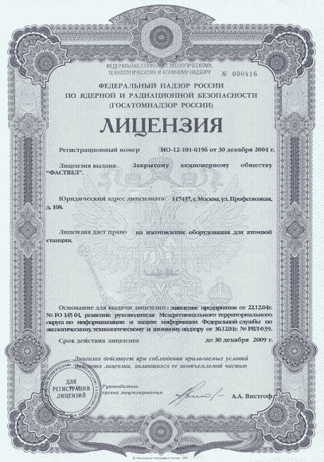

# 选择一个许可证，任何许可证

> 原文：<http://blog.codinghorror.com/pick-a-license-any-license/?utm_source=wanqu.co&utm_campaign=Wanqu+Daily&utm_medium=website>

我讨厌软件许可证。当我阅读软件许可证时，我看到的是一堆多管闲事的、令人麻木的法律术语。等等等等..现在杀了我吧。

如果我可以的话，所有的东西都会在 [WTFPL](http://sam.zoy.org/wtfpl/) 下发布。随着时间的推移，我不情愿地得出结论，就像律师、死亡和税收一样，选择软件许可是不可避免的。当然，如果你的眼睛是唯一能看到代码的人眼也没关系。但是**对于你计划向公众发布的任何代码来说，一个合适的软件许可是不可或缺的。**

我很后悔没有为我的 CodeProject 文章选择软件许可。我偶尔会收到一些友好的电子邮件，请求允许在各种项目中使用我文章中的代码，包括商业项目和其他项目。人们首先询问是考虑得很周到的。我真的很感激，而且许可总是被授予，只有一个警告，我的名字和网址保留在评论中。

因为我没有明确指出许可，所以我声明了一个隐含的版权，而没有解释其他人如何使用我的代码。由于代码是未经许可的，理论上我可以在任何时候主张版权并要求人们停止使用我的代码。有经验的开发者不会碰未经授权的代码，因为*他们没有合法的权利使用它*。这很讽刺，考虑到我最初发布代码的全部原因是为了让其他开发人员可以从这些代码中受益。如果我做了正确的事情，并且**在我的代码**中包含了一个软件许可，我本可以很容易地避免这种不幸的情况。

不幸的是，我们像热爱标准一样热爱软件许可——这就是为什么有这么多软件许可的原因。所有这些许可证之间的区别到底是什么？如何为您的软件选择正确的许可证？在下面这张方便的图表中，我试图简洁地捕捉最著名的软件许可证之间的主要区别。

|  | 来源 | 类型(条款) |  |
| **无** | 打开 | 无 (0) | 如果没有许可证，默认情况下代码受版权保护。人们可以阅读代码，但他们没有使用它的合法权利。要使用代码，您必须直接联系作者并获得许可。 |
| [**公共领域**](http://en.wikipedia.org/wiki/Public_domain) | 打开 | 许可(0) | 如果你的代码在公共领域，任何人都可以出于任何目的使用你的代码。默认情况下，公共领域中没有任何内容；如果你想把你的作品放在公共领域，你必须明确地把它放在那里。否则，在你的作品回归公共领域之前，你肯定早就死了。 |
| [GPL](http://en.wikipedia.org/wiki/GNU_General_Public_License) | 打开 | 向左复印(12) | 留着胡子、穿着凉鞋的自由软件许可证的原型。你的代码永远不能在任何专有程序中使用，永远！接招吧，资本主义！ |
| [LGPL](http://en.wikipedia.org/wiki/GNU_Lesser_General_Public_License) | 打开 | 大部分是左复印(16) | GPL 带有一个巧妙构造的压力释放阀。在某些非常特殊的情况下，您的自由软件可以二进制链接到专有程序。 |
| [MIT/X11](http://en.wikipedia.org/wiki/MIT_License) | 打开 | 许可(2) | 又短又甜。包括一般法律免责声明。 |
| [BSD](http://en.wikipedia.org/wiki/BSD_license) | 打开 | 许可(2) | 又短又甜。包括明确命名的组织的法律免责声明。 |
| [阿帕奇](http://en.wikipedia.org/wiki/Apache_License) | 打开 | 许可(9) | 要求衍生作品在公共位置提供任何许可或专有代码的通知。 |
| [月食](http://en.wikipedia.org/wiki/Eclipse_Public_License) | 打开 | 许可(7) | 商业友好。允许衍生作品为其贡献选择自己的许可证。 |
| [Mozilla](http://en.wikipedia.org/wiki/Mozilla_Public_License) | 打开 | 弱左复印(13) | 允许与专有软件自由混合。 |
| [毫秒许可](http://www.microsoft.com/resources/sharedsource/licensingbasics/permissivelicense.mspx) | 打开 | 许可(3) | 类似于 MIT 和 BSD 许可证。未被 OSI 正式接受，也以“仅适用于 Windows”的 LPL 版本提供。 |
| [微软社区](http://www.microsoft.com/resources/sharedsource/licensingbasics/communitylicense.mspx) | 打开 | 向左复印(3) | 类似于 GPL 许可证。要求将所有贡献的代码返回到社区。未被 OSI 正式接受，并且还提供了“仅 Windows”LCL 版本。 |
| [MS 参考值](http://www.microsoft.com/resources/sharedsource/licensingbasics/referencelicense.mspx) | 所有人 | 只读(3) | 您可以查看代码，或者复制代码，但是您不能以任何方式使用或更改代码。允许在以前完全私有的秘密代码上有一个窗口。 |

编完这张表后，我学到了两件事:

1.  我头疼。
2.  我还是比较喜欢 [WTFPL](http://sam.zoy.org/wtfpl/) 。

我甚至不打算谈论软件许可的许多宗教问题，例如...

伙计们，这是个雷区。我要说的是:**下一次你发布代码时，帮你的开发伙伴一个忙，选择一个许可——任何许可**。

