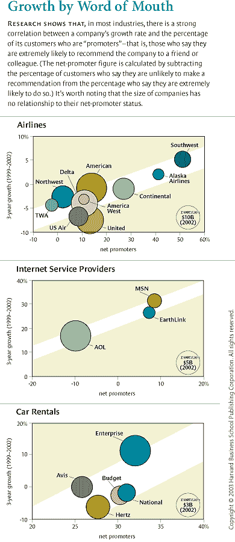

# 你需要增加的一个数字

> 原文 https://HBR . org/2003/12/the-one-number-you-need-to-grow/ar/1？UTM _ source = Wanqu . co&UTM _ campaign = Wanqu+Daily&UTM _ medium = website

 #### 这个想法简单来说

许多公司——通过培养高度忠诚的客户来争取前所未有的增长——投入大量时间和金钱来衡量客户满意度。但他们使用的大多数标准都很复杂，产生的结果模糊不清，而且不一定与利润或增长相关。

好消息是:你不需要昂贵的调查和复杂的统计模型。你只需要问你的客户一个问题:“你向朋友或同事推荐我们公司的可能性有多大？”你的公司有越多的“推动者”，它的增长就越大。

为什么宣传你的公司的意愿是忠诚度和增长的一个强有力的指标？因为当顾客推荐你时，他们是在拿自己的名声冒险。只有在极度忠诚的情况下，他们才会冒这个险。

通过问这个问题，你收集了与成长相关的简单而及时的数据。你还会得到易于解释和交流的回应。你传达给员工的信息——“多做宣传，少做诋毁”——变得清晰、可行、有激励性，尤其是与激励挂钩的时候。

实践中的想法

## 计算你的净推广分数

询问统计上有效的客户样本“您向朋友或同事推荐我们公司的可能性有多大？”使您能够计算您的**净推广分数**:推广者与贬低者的比率。

根据客户的回答，用 0 到 10 的评分标准，将客户分为“推销者”(9-10 分，极有可能推荐)、“被动满意者”(7-8 分)和“贬低者”(0-6 分，极不可能推荐)。然后用推动者的百分比减去贬低者的百分比。获得世界级忠诚度的公司获得 75%到 80%以上的净推广分数。

## 使用你的净推广分数

你的净推广分数为如何获得更多的推广者和更少的诋毁者提供了有价值的见解。例如，比较贵公司在地区与地区、分支机构与分支机构、销售代表与销售代表以及客户群与客户群之间的得分。发现差异的根本原因，分享得分最高的团队的最佳实践。也用同样的方法调查你的*竞争对手*的客户。你的公司如何应对 75%至 80%的净推广得分这一非常高的标准？

## 激励变革

用你的分数向经理和员工传达一个清晰的信息，告诉他们推销者的重要性，以及诋毁者的危险。考虑这些准则:

*   确保公司里的每个人都知道他们对哪些客户负责。然后，确保所有业务职能部门——不仅仅是市场调研部门——拥有并接受调查过程和结果。

*   让您的分数在整个组织中透明。向员工展示前一周(或前一天)的数据，显示推销者、被动满足者和诋毁者的客户百分比(和名称)。

*   然后提出管理指控:“为了发展，我们需要更多的推动者，更少的诋毁者。”解释诽谤者的危险:如果你的新客户流量跟不上你客户桶里的漏洞，营销成本会上升，现金流会下降。

*   通过将奖励与分数提高挂钩来制造一种紧迫感——从本质上说，给予客户对加薪和升职的否决权。

例如:

通过使现场经理没有资格晋升，除非他们的分支机构或分支机构组达到或超过公司的平均净晋升分数，企业租车公司的调查分数上升了，相对于其竞争对手，其增长也增加了。 

房间里的首席执行官们都知道忠诚的力量。他们已经将自己的公司转变为行业领导者，主要是通过与客户和员工建立高度忠诚的关系。现在，来自先锋、福乐鸡快餐店、State Farm 和六家其他领先公司的首席执行官们聚集在一个为期一天的论坛上，交流见解，这将有助于他们进一步提高忠诚度。他们从租车公司的首席执行官安迪·泰勒那里听到的内容非常吸引人。

泰勒和他的高级团队已经找到了一种方法来衡量和管理客户忠诚度，而没有传统客户调查的复杂性。每个月，Enterprise 只使用两个简单的问题对其客户进行调查，一个是关于他们租赁体验的质量，另一个是关于他们再次从该公司租赁的可能性。因为过程很简单，所以很快。这使得该公司能够在几天内公布其美国 5，000 家分支机构的排名结果，为分支机构提供实时反馈，了解他们的表现，并有机会向成功的同行学习。

这项调查在另一个重要方面有所不同。在对这些分支机构进行排名时，该公司只统计了那些给予这种体验最高评价的顾客。这种对热情顾客的狭隘关注让房间里的首席执行官们感到惊讶。举起手来。那么企业的其他客户呢？这些勉强满意的客户继续从企业租赁，并且是其业务所必需的。以更复杂的方式跟踪平均值或中值统计数据不是更好吗？不，泰勒说。通过专注于那些对租赁体验最有热情的人，该公司可以专注于盈利增长的关键驱动因素:不仅会再次租赁，还会向朋友推荐企业的客户。

企业号的做法也让我大吃一惊。大多数客户满意度调查都不是很有用。它们往往又长又复杂，回复率低，含义模糊，运营经理很难采取行动。此外，它们很少受到质疑或审计，因为大多数高管、董事会成员和投资者都不太重视它们。这是因为他们的业绩与利润或增长并不紧密相关。

但是，Enterprise 的方法——以及它通过一个看起来相当简单的工具实现盈利增长的能力——让我想到该公司可能有所发现。你能在其他行业——包括那些似乎比汽车租赁更复杂的行业——得到类似的结果吗？只关注那些对一系列旨在评估他们对公司忠诚度的问题做出最热情回答的客户。这个列表可以简化为一个问题吗？如果是，那会是什么问题？

我花了两年时间进行研究，将调查反馈与实际客户行为——购买模式和推荐——联系起来，最终与公司增长联系起来。结果很清楚，但违反直觉。事实证明，一个简单的调查问题可以作为一个有用的增长预测。但这个问题与客户满意度甚至忠诚度无关——至少在很多方面是如此。更确切地说，它是关于客户向其他人推荐产品或服务的意愿。事实上，在我研究的大多数行业中，热情到推荐朋友或同事的客户比例——这可能是客户忠诚度的最强标志——与竞争对手之间的增长率差异直接相关。

通过用一个简单的问题代替典型的客户满意度调查的复杂黑箱，公司实际上可以利用消费者调查结果，并使员工专注于刺激增长的任务。

当然，除了客户忠诚度之外，其他因素也在推动公司增长方面发挥着作用——经济或行业扩张、创新等等。我不想夸大这些发现:尽管“会推荐”的问题通常被证明是确定忠诚度和预测增长最有效的方法，但并非每个行业都是如此。但福音派客户忠诚度显然是最重要的增长动力之一。虽然它不能保证增长，但一般来说，没有它就无法实现盈利性增长。

此外，这些发现指出了一种全新的客户调查方法，这种方法基于与公司结果直接相关的简单性。通过用一个简单的问题——尽管看起来是一个生硬的工具——代替典型的客户满意度调查的复杂黑箱，公司实际上可以利用消费者调查结果，并使员工专注于刺激增长的任务。

## 忠诚度和成长

在我描述我的研究和来自许多行业的结果之前，让我们简要地看一下忠诚度的概念以及公司在试图衡量忠诚度时犯的一些错误。首先，一个定义。忠诚是某个人——顾客、员工、朋友——为了加强关系而做出投资或个人牺牲的意愿。对于客户来说，这可能意味着坚持与对他好并给他带来长期价值的供应商在一起，即使供应商在特定交易中没有提供最好的价格。

因此，客户忠诚度不仅仅是重复购买。事实上，即使有人一次又一次地从同一家公司购买产品，也不一定对该公司忠诚，相反，他可能会被惰性、冷漠或公司或环境设置的退出障碍所困。(有人可能经常乘坐同一家航空公司的航班去某个城市，只是因为该公司提供的航班最多。相反，忠诚的顾客可能不会因为对产品或服务的需求减少而频繁重复购买。(随着年龄的增长和驾驶次数的减少，人们购买新车的频率可能会降低。)

真正的忠诚显然会影响盈利能力。虽然老客户并不总是有利可图，但他们选择坚持使用一种产品或服务通常会降低公司的客户获取成本。忠诚度也推动了顶线增长。显然，如果公司的客户桶是有漏洞的，那么没有一家公司能够成长，而忠诚度有助于消除这种流失。事实上，忠诚的客户可以提高水桶里的水位:真正忠诚的客户往往会随着时间的推移购买更多，因为他们的收入增加了，或者他们将更大一部分钱包献给了他们觉得不错的公司。

忠诚的顾客会向他们的朋友、家人和同事吹嘘一家公司。事实上，这样的推荐是忠诚度的最佳指标之一，因为客户在推荐时会做出牺牲。当客户充当推荐人时，他们不仅仅表明他们从一家公司获得了良好的经济价值；他们拿自己的名誉冒险。只有当他们感到强烈的忠诚时，他们才会拿自己的名誉冒险。(注意，在这里，忠诚度可能与重复购买没有太大关系。随着某人收入的增加，她可能会从她买了多年的本田车中往上爬。但如果她对公司忠诚，她会热情地推荐一辆本田，比如说，推荐给一个正在购买自己第一辆车的侄子。)

随着公司的成长，忠诚客户带来新客户的趋势——无需公司付费——尤其有益，尤其是如果它在一个成熟的行业中运营。在这种情况下，通过广告和其他促销手段获得每个新客户的巨大营销成本使其难以盈利。事实上，实现盈利增长的唯一途径可能在于一家公司让其忠诚客户实际上成为其营销部门的能力。

## 错误的标准

因为忠诚度对盈利增长如此重要，所以衡量和管理忠诚度很有意义。不幸的是，现有的方法并不十分有效。不仅它们的复杂性使它们对直线经理几乎无用，而且它们经常产生有缺陷的结果。

最好的公司倾向于关注客户保持率，但这种衡量仅仅是平庸公司中的佼佼者。在许多行业，留存率为盈利能力提供了一个有价值的链接，但它们与增长的关系是脆弱的。这是因为他们基本上跟踪客户流失——一个桶是空的而不是满的程度。此外，正如我所指出的，在客户被高转换成本或其他障碍所挟持的情况下，或者在客户由于年龄增长、收入增加或其他因素而自然不再需要某个产品的情况下，保留率并不是客户忠诚度的良好指标。在你继续投资大量资金之前，你会希望在保留和增长之间有更强的联系，仅仅基于关于保留的数据。

一个更不可靠的衡量忠诚度的方法是通过传统的客户满意度测量。我们的研究表明，满意度与实际客户行为和增长之间缺乏持续的明显联系。投资者对美国消费者满意度指数等报告的冷淡证实了这一发现。ACSI 每季度发表在《华尔街日报》上，反映了大约 200 家美国公司的客户满意度。总的来说，很难看出高客户满意度得分和出色的销售增长之间有很强的相关性。的确，在某些情况下，存在着反比关系；例如，在凯马特，该公司 ACSI 评级的大幅上升伴随着销售额的急剧下降，因为它滑向破产。

即使是最复杂的满意度测量系统也有严重的缺陷。我在三大汽车制造商之一亲眼目睹了这一点。该公司的营销主管想知道为什么在公司花费数百万美元进行客户满意度调查后，单个经销商的满意度评级与经销商利润或增长的关系并不密切。当我采访经销商时，他们一致认为客户满意度似乎是一个合理的目标。但他们也指出，其他因素对他们的利润和增长要重要得多，例如对销售人员保持压力，以完成高比例的销售线索，通过积极的广告让展厅充满潜在客户，以及对客户的汽车收取尽可能高的价格。

经销商告诉我，在大多数情况下，满意度调查是一个游戏，他们玩这个游戏是为了取悦制造商，并确保最畅销车型的慷慨分配。他们向销售人员施加压力以提高分数，这往往导致售后服务恳求客户提供最高评级——即使他们必须提供免费的地垫或机油更换作为回报。在这个过程中，经销商通常与销售人员串通一气，这种情况进一步降低了这些分数的完整性。事实上，一些精明的客户会协商一个低价——然后再降价 500 美元卖给经销商一套最高满意度调查评级。

找出一种准确衡量客户忠诚度和满意度的方法极其重要。公司不会意识到忠诚的果实，直到可用的测量系统使公司能够根据明确的忠诚目标来衡量他们的表现——就像他们现在在盈利能力和质量目标方面所做的那样。有一段时间，信息技术似乎提供了一种准确衡量忠诚度的手段。复杂的客户关系管理系统承诺帮助公司实时跟踪客户行为。但迄今为止，这种成功仅限于特定的行业，如信用卡或杂货店，在这些行业，购买如此频繁，以至于客户忠诚度的变化可以很快被发现并采取行动。

## 获取事实

那么，衡量客户忠诚度的有用指标是什么呢？为了找到答案，我需要做一些很少在客户调查中进行的事情:随着时间的推移，将单个客户的调查反馈与他们的实际行为(重复购买和推荐模式)进行匹配。我向 Satmetrix 寻求帮助，这是一家开发软件来收集和分析实时客户反馈的公司，我也是该公司董事会的成员。贝恩公司的团队也帮助了这个项目。

我们从忠诚度酸性测试的大约 20 个问题开始，这是我四年前与贝恩的同事一起设计的一项调查，它在建立公司与其客户之间的关系方面做得非常好。(完整的测试可以在 http://www。loyaltyrules.com/loyaltyrules/acid_test_customer.html.)我们对从六个行业的公共列表中招募的数千名客户进行了测试:金融服务、有线电视和电话、个人电脑、电子商务、汽车保险和互联网服务提供商。

然后，我们获得了每个被调查者的购买历史记录，并要求这些人说出他们向其他人推荐该公司的具体例子。当这些信息不能立即获得时，我们等待 6 到 12 个月，从这些人那里收集后续购买和推荐的信息。利用来自 4，000 多名客户的信息，我们能够构建 14 个案例研究，也就是说，在这些案例中，我们有足够的样本量来衡量一家公司的单个客户的调查响应与这些个人的实际推荐和购买行为之间的联系。

这些数据使我们能够确定哪些调查问题与重复购买或推荐具有最强的统计相关性。我们希望能为每个行业找到至少一个能有效预测此类行为的问题，从而推动增长。我们发现了更多的东西:有一个问题最适合大多数行业。“您向朋友或同事推荐[X 公司]的可能性有多大？”在 14 个案例研究中的 11 个中排名第一或第二。在另外三种情况中的两种情况下，“会推荐”的排名非常接近前两个预测因素，以至于依靠这一个问题的结果，调查几乎一样准确。(关于得分最高的问题的排名，请参见侧栏“问正确的问题”)

这些发现让我大吃一惊。我个人对第一个问题的猜测(可能反映了我近年来对员工忠诚度的研究重点)是“你有多认同[X 公司]值得你的忠诚？”然而，很明显，对顾客来说，忠诚的抽象概念不如忠诚的终极行为——向朋友推荐——有吸引力。我还希望“您在多大程度上认同[X 公司]为其行业设定了卓越标准？”这意味着为消费者提供经济利益和公平待遇，将比过去更有预见性。一个结果根本没有让我吃惊。问题“您对[X 公司]的整体表现有多满意？”虽然与某些行业相关，但将被证明是相对较弱的增长预测指标。

因此，我和我的同事们提出了正确的问题——“你向朋友或同事推荐[X 公司]的可能性有多大？”—现在我们需要开发一个量表来给这些回答打分。这可能看起来有些微不足道，但是，正如统计学家所知，事实并非如此。让顾客忠诚成为经理们可以努力实现的战略目标，需要一个和问题本身一样简单明了的量表。正确的方法会有效地将客户划分为值得不同关注和组织响应的实际群体。当客户分配等级时，以及对于负责解释结果和采取行动的员工和合作伙伴来说，它必须是直观的。理想情况下，这一尺度非常容易理解，即使是投资者、监管者和记者等局外人也无需手册和统计摘要就能掌握基本信息。

出于这些原因，我们确定了一个等级，10 表示“极有可能”推荐，5 表示中性，0 表示“完全不可能”当我们沿着这个尺度检查客户推荐和再购买行为时，我们发现了三个逻辑群。“促销员”，也就是重复购买率和推荐率最高的客户，给这个问题打了 9 到 10 分。“被动满意”的得分为 7 或 8，“反对者”的得分从 0 到 6。

通过将推销者指定限制在最热情的客户，我们避免了“等级膨胀”，这种膨胀经常影响传统的客户满意度评估，在这种评估中，一个分子在中性以北的人被认为是“满意的”。(这是企业租车公司在决定专注于最热情的顾客时避免的危险。)不仅将顾客分为三类——推销者、被动满足者和诋毁者——结果提供了最简单、最直观、最好的顾客行为预测；这对于一线经理来说也是有意义的，他们可能更容易与增加推动者的数量和减少批评者的数量的目标相关联，而不是将他们的满意度指数的平均值增加一个标准差。

## 增长联系

到目前为止，我们所有的分析都集中在客户调查反馈上，以及这些反馈与六个行业的 14 家公司的客户推荐和再购买行为的关联程度。但真正的考验是，这种方法在多大程度上解释了一个行业中所有竞争对手的相对增长率——以及更广泛的行业领域。

实现盈利增长的唯一途径可能在于一家公司有能力让其忠诚的客户实际上成为其营销部门。

2001 年第一季度，Satmetrix 开始跟踪新客户群的“推荐”分数，其中数千人来自十几个行业的 400 多家公司。在随后的每个季度，他们收集了 10，000 到 15，000 份对一份非常简短的电子邮件调查的回复，该调查要求受访者(再次从公开来源，而不是 Satmetrix 的内部客户名单中抽取)对一两家他们熟悉的公司进行评级。在我们可以获得一系列竞争对手的可比且可靠的收入增长数据的地方，在有足够的消费者反应的地方，我们绘制了每家公司的净促进者(促进者的百分比减去贬低者的百分比)与公司收入增长率的关系。

结果是惊人的。以航空公司为例，在 1999 年至 2002 年的三年时间里，净促进者数字与公司的平均增长率之间存在很强的相关性。值得注意的是，这个简单的统计数据似乎解释了整个行业的相对增长率；也就是说，没有一家航空公司找到了在不提高促进者和反对者比例的情况下增加增长的方法。这一结果或多或少地反映在我们研究的大多数行业中——包括出租汽车，在这些行业中，企业在竞争对手中享有最高的增长率和最高的净促进者百分比。(参见展品“口碑增长”)

“会推荐”这个问题并不是所有情况下增长的最佳预测。在一些情况下，这完全无关紧要。例如，在数据库软件或计算机系统中，高级管理人员选择供应商，高层管理人员通常不会出现在我们用来抽样调查客户的公开电子邮件列表中。询问系统用户是否会向朋友或同事推荐该系统似乎有点抽象，因为他们在这件事上没有选择。在这些案例中，我们发现“树立卓越标准”或“值得你忠诚”的问题更有预见性。

不足为奇的是，“推荐”也没有预测垄断和准垄断行业的相对增长，在这些行业中，消费者几乎没有选择。例如，在本地电话和有线电视业务中，决定增长率的是该地区的人口增长和经济扩张，而不是供应商对待客户的态度。在某些情况下，我们发现小型利基公司的增长速度比他们的净发起人百分比所暗示的要快。但对于大多数行业的大多数公司来说，让客户有足够的热情推荐一家公司似乎是增长的关键。(要计算你自己的净启动子数量，请参阅侧栏“净启动子入门”)

## 诋毁者的危险

互联网服务提供商 AOL、MSN 和 EarthLink 之间的增长之战使我们的发现成为现实。多年来，市场领导者 AOL 积极致力于新客户的获取。通过这些努力，AOL 不仅仅抵消了大量的人员流失。但该公司很少关注如何将这些新客户转化为高度忠诚的促销员。客户服务失效了，以至于客户甚至找不到联系公司代表的电话号码来回答问题或解决问题。

今天，AOL 正在努力成长。尽管 AOL 的客户数量最终飙升至 3500 万的峰值，但其不断恶化的支持者和反对者组合最终扼杀了其扩张。新客户流的消防水管——充满了被免费试用促销吸引的人——跟不上 AOL 客户桶的漏洞。2003 年，客户流失率每月超过 200，000 人。营销成本逐渐增加以阻止这一趋势，这些支出，加上在线广告的崩溃，导致现金流在 2001 年至 2003 年间下降了近 40%。

我们的研究发现，到 2002 年，该公司 42%的客户是诋毁者，而只有 32%是推广者，因此该公司的净推广者比例为-10%。目前的管理团队正在解决这个问题，但这是一个具有挑战性的问题，因为失望的客户无疑会将他们对 AOL 的看法传播给家人、朋友、同事和熟人。

AOL 的拨号竞争对手在培养推广人员方面做得更好，这表现在他们的相对增长率上。MSN 在 R&D 投资了 5 亿美元来升级它的服务，改进了功能，比如改进了家长控制和垃圾邮件过滤器。到 2003 年，MSN 的推广者人数达到了其客户群的 41%,而贬低者人数为 32%,使该公司的净推广者比例为 9%。在此期间，EarthLink 通过继续投资于拨号连接的可靠性(最大限度地减少忙音和掉线的烦恼)和随时提供电话支持，成功地接近了 MSN 的网络推广得分。

AOL 的经历生动地说明了通过大规模降价或其他激励措施等捷径而不是通过建立真正的忠诚度来寻求增长的愚蠢。它还说明了诋毁者的口碑传播可能对企业产生的不利影响——顾客向朋友推荐的另一面。对抗受损的声誉需要公司创造极具吸引力的激励措施，说服持怀疑态度的客户尝试某项产品或服务，而这些激励措施会推高本已很高的客户获取成本。

此外，诋毁者——甚至只是被动满意而非热情忠诚的客户——通常会对员工造成损失，并增加服务成本。最后，每一个诋毁者都意味着错过了一个向客户群添加推广者的机会，多了一个推销你的产品或服务并创造增长的无薪销售人员。

## 保持简单

我们的研究得出的一个主要结论是，公司可以简化客户调查。最基本的调查——采用正确的问题——可以让公司及时报告易于采取行动的数据。当今太多的满意度调查过程产生了复杂的信息，而这些信息在到达一线经理手中时已经过时了几个月。祝分行经理好运，他试图帮助一名员工解释一个复杂的加权算法得出的分数，该算法基于匿名客户的反馈，其中许多人在该员工担任当前工作之前就接受了调查。

相比之下，在这种情况下，经理向员工展示前一周(或前一天)的数据，显示分支机构的客户中推销者、被动满足者和诋毁者的百分比(和姓名)，然后发出管理指控，“为了增长，我们需要更多的推销者和更少的诋毁者。”目标是明确的、可操作的和激励性的。

简而言之，客户反馈计划不应被视为“市场研究”，而应被视为一种经营管理工具。再次考虑企业租车。企业当前系统开发的第一步是设计一种方法，通过从客户的角度测量服务质量来跟踪忠诚度。最初的努力产生了一份冗长、笨拙的调查问卷，其中包括参与起草调查的每个人最喜欢问的问题。它只记录了地区基础上的平均服务质量——有趣，但没用，因为经理们需要看到每个分支机构的分数以建立清晰的问责制。随着时间的推移，该示例被扩展以提供这些信息。调查中的问题数量急剧减少；这简化了答案的整理，并允许该公司在收集到答案后立即发布每月的分支机构结果。

然后，该公司开始研究客户反应与实际购买和推荐之间的关系。这是企业号认识到爱好者的价值的时候。对租赁体验给予最高评级的客户再次租赁的可能性是给予 Enterprise 第二高评级的客户的三倍。当一位客户报告了一个中性或负面的经历，将他标记为潜在的诋毁者时，访问者请求允许立即将此信息转发给分支机构经理，分支机构经理接受过如何道歉、确定问题的根本原因并解决问题的培训。

该测量系统每年花费超过 400 万美元，但该公司在建立客户忠诚度方面取得了如此重大的进展，以至于公司管理层认为这是公司最好的投资之一。新系统肯定已经开始引起员工的注意。事实上，一些分支机构的经理(也许是受汽车经销商的暗示)试图操纵这个系统来为自己谋利。企业的回应是一个发现过程——例如，通过确保不满意的受访者的电话号码没有被更改，使其难以跟进——并惩罚“游戏玩家”

尽管该系统取得了成功，但首席执行官安迪·泰勒觉得还缺少点什么。分支分数提高得不够快，表现最差和最好的地区之间继续存在巨大差距。泰勒的评价是:“我们需要更大的紧迫感。”因此，管理团队决定，除非他们的分支机构或分支机构群体达到或超过公司的平均分数，否则现场经理没有资格晋升。仔细想想，这是一个相当激进的想法:实际上，给予顾客对管理层加薪和晋升的否决权。

这个简单的客户反馈系统的严格实施对业务产生了明显的影响。随着调查分数的上升，企业相对于其竞争对手的增长也在上升。泰勒将客户反馈与员工奖励联系起来，认为这是企业持续增长的最重要原因之一，即使企业变得更大，也可以说更成熟。(有关企业客户调查计划的更多信息，请参见“提高客户满意度”，HBR，2002 年 7 月。)

## 将客户转化为促销员

如果收集和应用客户反馈如此简单，为什么公司还没有这样做呢？我不想太愤世嫉俗，但也许管理当前客户调查的研究公司知道，像这样的基本业务对他们来说利润空间很小。复杂的忠诚度指数，基于十几个或更多的专有问题，用黑盒标度函数加权，只会为调查公司带来更多的业务。

市场研究公司有着更深的恐惧。随着电子邮件和分析软件的出现，领先的公司现在可以完全绕过研究公司，降低成本，提高反馈的质量和及时性。这些新工具使公司能够收集客户反馈并实时报告结果，直接传递给一线员工和经理。这也可能威胁到内部市场研究部门，这些部门通常通过控制和解释客户调查数据来建立自己的权力基础。可以理解的是，营销部门将调查集中在他们可以控制的领域，如品牌形象、定价和产品特性。但是，客户向朋友推荐的意愿取决于一线员工对客户的态度，而这又取决于有助于客户体验的所有职能领域。

对于一个实用的、可操作的和可靠的度量——也就是说，对于它来说，确定客户中净推销者的百分比并允许经理对其采取行动——过程和结果需要被所有业务功能所拥有和接受。组织中的所有人都必须知道他们对哪些客户负责。监督这样一个过程对于首席财务官或业务部门的总经理来说比对于营销部门来说更合适。事实上，它太重要了(而且充满了政治意味),不能下放给任何一项职能。

通往可持续盈利增长的道路始于创造更多的推动者和更少的诋毁者，并使你的净推动者数量在整个组织中透明。这个数字是你需要增长的一个数字。就是这么简单又这么深刻。

这篇文章的一个版本出现在

[December 2003](/archive-toc/BR0312)

发行

*Harvard Business Review*

。