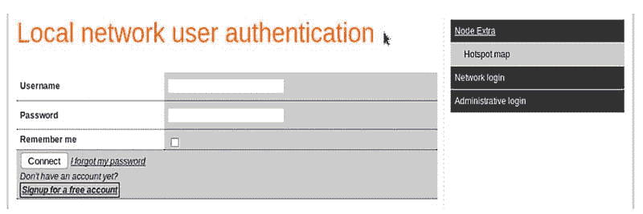
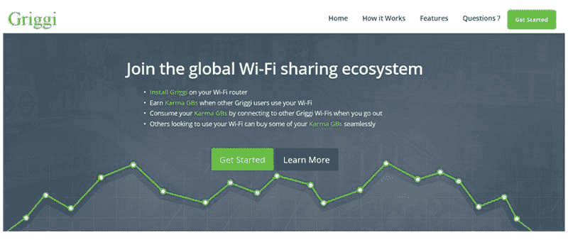
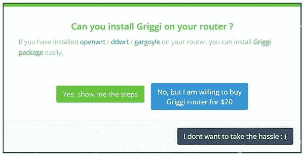
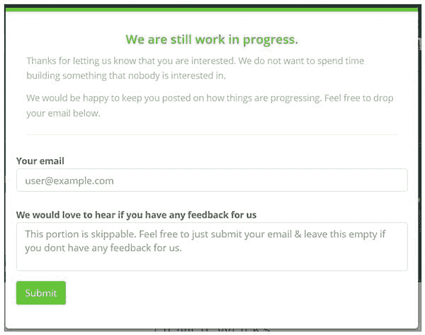
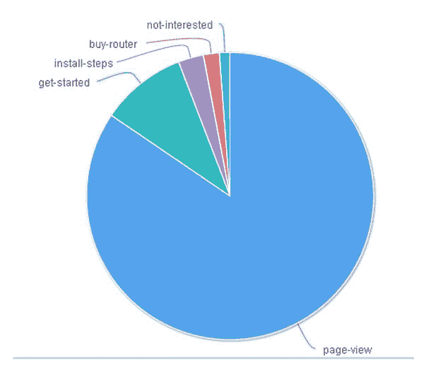
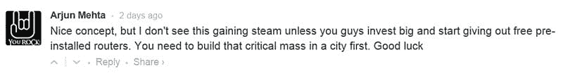

# 我如何验证我的创业想法

> 原文：<http://yourstory.com/2015/07/validated-startup-idea/?utm_source=wanqu.co&utm_campaign=Wanqu+Daily&utm_medium=website>

过去几个月你一直在想一个很酷的主意。您在构建第一个原型方面取得了重大进展。

然而，你仍然不确定人们是否会购买你的产品。

残酷的事实是，你可以花数年时间来构建，但当你发布时，你的产品可能仍然找不到任何用户。许多创业公司已经为他们的想法苦干了几个月，甚至几年，但收效甚微。

我们(一家社区供电的 WiFi 初创公司 griggi.com)面临着同样的疑问。因此，我们进行了一项实验，遵循“精益启动方法”。过一会儿我会谈到原因和方法。

问题在于在验证你的想法之前开发一个产品。这导致了金钱、时间和精力的浪费。

如果你与科技初创公司的创始人交谈，他们大多数人都想先打造产品，推出产品，然后“看看”。这种方法是错误的，因为在这个过程中没有任何地方对这个想法进行测试。

我们几乎犯了同样的错误。

当我们开始考虑一个可能会产生有用的东西的想法时，我已经做好了准备去创造一个 MVP。MVP 是“最小可行产品”；产品的第一个版本，只包含最高优先级的特性。

我的共同创始人，一个大学密友，对这种方法不太感兴趣。他花了 5 年时间研究不同的想法，但没有验证它们，也没有取得多大成功。所以这一次，他想先验证一下。

我们的辩论归结为从什么开始:

1.  一个 MVP:一个工作但粗糙的产品，可能有缺陷和不太好的 UI。努力，最少 6 个月。

运筹学

1.  一个好看的登录页面，重点是想法验证。努力，最多 6 天。

不用说，我们同意第二种方法，即先验证，后生产。

一会儿我将谈到“以验证为中心”的登录页面背后的逻辑。

创始人在制造产品之前不验证他们想法的原因是，初创公司被认为是天生完全混乱的。(然而，正如我们将看到的，这只是部分正确。疯狂是有方法的。)

在当前的创业生态系统中，最多只能做到以下一项或多项。没有一个像预期的那样工作。

1.  半熟的 MVP 大多会失败

快速启动 MVP 被认为是创业公司的一个好方法。这就是著名的“快速建立和快速销毁”方法。不幸的是，事情没有这么简单。

首先，建立一个 MVP 比创始人想承认的要困难得多。这将比计划花费更多的时间和精力，即使你有所有你需要的专家。

其次，很多创始人都不想发布一个未完成的产品。这不符合他们对产品的愿景。

1.  调查是无用的

假设产品的调查数据是没有价值的。人们通常都很友好，可能会对一件他们稍微感兴趣的产品说“当然，我会买的”。这并不是说他们在同意购买时就必须付钱。

1.  一个“即将推出”的页面没有帮助

当人们通过“即将推出”的页面谈论验证时，他们的意思是:

第一步:用一个“即将到来”的登陆页面获得一百万个电子邮件注册。

第二步:构建产品。

第三步:盈利！

此页面将针对最大注册数进行优化，这样可能会成功。但它不会证实你的想法。通过预先获得电子邮件 id，你没有让访问者仔细考虑你的产品。此列表中的大多数电子邮件 id 很可能不会转换为用户。

> 解决方法在于在实施一个想法之前先对其进行验证。

想法验证是一个迭代的过程，它应该是任何创业过程的核心部分。它应该在一个人大量投资构建产品之前完成。验证应该基于硬统计数据。在得到这些统计数据之前，人们不应该着手发展。

## **实施解决方案**:

当我们创建登录页面时，我们的意图很明确:它是为了衡量访问者对我们假设的产品的真正兴趣，而不是为了积累大量的注册人数。

在我们之前显示的登录页面的快照中，请注意我们没有在“电子邮件 ID”框中添加任何内容。相反，我们添加了一个“开始”按钮，以检查有多少人对该产品感兴趣。点击“开始”，访客可以选择我们提供的两种解决方案。这让用户思考片刻，所以只有真正感兴趣的访问者决定继续下一步。

我们把简单的救助作为第三种选择，以过滤掉疲软的兴趣。

请注意，显示的价格不是“即将推出”的产品；这是一个“立即购买”。

我们的最后一页显示“工作进行中”。在这里，我们需要一个电子邮件 ID。许多用户一旦知道产品还没有准备好，就可能不输入他们的电子邮件 id；但是没关系，因为我们还没有打算建立一个电子邮件 ID 库。我们对访问者的导航模式更感兴趣。

## **解释结果:**

在后端，我们集成了一个用于分析的混合面板。就在我们说话的时候，我们可以看到统计数据。点击“购买路由器”或“安装软件”的访问者比例已经超过了我们预先设定的阈值。

我们还通过集成到主页上的 Disqus 论坛获得了不少有见地的评论。

我们的最终数据将帮助我们决定下一步行动。

## **下一步:**

一些访问者提出了一个我们也认为有道理的观点。在一个全球可访问的网站上，用户群会非常分散，这在这样的想法中不是很有用。最初，只有当所有用户都在密集的集群中，最好是在一个城市中，这个想法才会起作用。

我们已经开始讨论旋转一点，并首先瞄准一个城市。对于社区的播种，我们计划在目标区域内提供一些免费的 WiFi 路由器。这当然需要一些资金。因此，我们已经开始寻找。

*我们现在希望让 Griggi reach caves&为他们的用户提供免费/计量 wifi 的共同工作空间。* [***更多详情在此***](http://griggi.com/wifi-business-solution-cafe-restaurant-coworking-space/) ***。***

**关于作者:**

作为一名芯片设计工程师，我在网络/通信领域工作了 10 年。最近，我开始探索创业世界，因为我渴望一种不同的体验。你可以在推特上关注我。