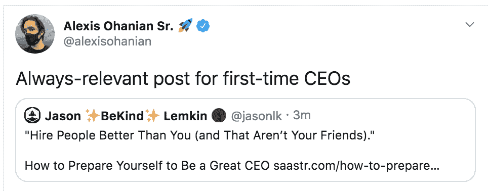

# 如何准备自己成为一名伟大的 CEO | SaaStr

> 原文：<http://www.saastr.com/how-to-prepare-yourself-to-be-a-great-ceo/?utm_source=wanqu.co&utm_campaign=Wanqu+Daily&utm_medium=website>

成为创始人很容易。你刚开始做某事。找一个聪明的朋友，跳上 WeWork(当我们这样做的时候)，点击 Canva 或 99 Designs 作为标志，你就可以开始比赛了。

[

<noscript></noscript>](https://www.saastr.com/wp-content/uploads/2015/07/hugeoffice.png) **做 CEO 是艰难的**。你必须说服人们加入你。把部队拖上山。在没有合理理由的情况下投资于你。做不可能的事。你可能以前没做过。

事实证明，第一次担任首席执行官的人往往是最成功的。因为他们不知道这是不可能的。

但他们往往是糟糕的管理者。或者至少比第二次糟糕得多。这意味着比你所需要的更多的员工流失、摩擦和戏剧性事件。

如果你在职业生涯早期是一名更好的 CEO，你会成长得更快，压力更小，成功更多。尤其是在 SaaS。因为 SaaS 是跨职能的。

事实证明，到时候你可以现在就接受培训，成为一名更好的 CEO。尤其是如果你认为这是你以后想做的事情。

为了有所帮助，我给准 CEO 们的 7 条建议。

*   **理人** 。这是你能做的最好的事情之一，因为首席执行官 50%的工作是招募团队，领导团队，授权团队，说服团队。这个团队将包括投资者、公众、媒体、公共关系等。—但都是一个团队。管理你能管理的任何人，即使不完美。我的第一份管理工作是管理 HR，我不想学 HR 这个职能，一开始就拒绝了。然后我意识到我错了，道了歉，回去拿了报告。我很幸运得到了这个机会。

*   **尽你所能为最好的人工作。**这可能是显而易见的，但如果可以的话，至少尝试这样做一次。要做到这一点，最好的方法是加入最好的初创企业的管理团队。即使你在未来的 12-24 个月内被超越，向最好的首席执行官汇报(并与之直接合作)也是值得的。

*   **尽量多关心人。还有** ***秀出来的*** **。** 这是我在初任 CEO 中看到的最大错误之一。他们如此关心公司，却忘了关心员工和团队。他们只是认为每个人都应该像他们一样忠诚。但其他人不可能。你不会一夜之间情商翻倍。但是尝试一些事情。多说声“谢谢”。多给员工加薪。多给点奖金。在他们没有要求的情况下，给你的前 10%员工多 20%的股份。带团队去郊游。当你达到 500 万美元时，为整个公司撤退。一起做事。做晚餐。当销售团队试图完成本季度的最后一笔交易时，和他们呆到很晚，然后带他们出去喝酒。全部做。再次，如果没有别的，说声谢谢！

*   **学会原谅人** 。首席执行官是最记仇的人之一。回想一下乔布斯和盖茨。至少对外部敌人来说，这一点点是可以的。但作为 CEO，你必须学会不要在内心寻找不存在的敌人。人们会搞砸的。人们会让你失望的。人们只会犯错误。人们不会意识到他们伤害了你的感情。作为经理，你必须学会原谅。作为首席执行官，这一点至关重要。尤其是，原谅你的合伙人。共同创始人之间的冲突会毁掉初创公司。有些是避免不了的。但是，很多可以。如果你学会原谅。

*   **站出来，拥有一些没人要求你拥有的重要的东西** 。在大多数情况下，这是通往成功的捷径。它教会你最终成为一名首席执行官意味着什么。

*   **【雇佣比你更好的人(而且那不是你的朋友】。无论你做什么，不要雇佣比你差的主管。这是许多新经理的失误之处。你可以雇佣有前途的人，这没问题。但作为首席执行官，关键是团队中的每个人都应该尽可能比你优秀。这不是威胁。这是一种让你的股票价值增加 100 倍的方法。在你自己成为 CEO 之前，先在这里尝试一下。不要只雇佣你的朋友，也不要雇佣让你看起来不错的人。雇佣物质上比你更好的人，这样你的外表、行为和感觉都会不同。但是你百分百相信。神奇的事情会发生。在这里你会学到很多 T4。**

 **[

<noscript></noscript>](https://www.saastr.com/how-to-prepare-yourself-to-be-a-great-ceo/screen-shot-2020-08-02-at-7-53-34-am/) 

(注:更新的 SaaStr 经典帖子)

2022 年 4 月 16 日发布** 