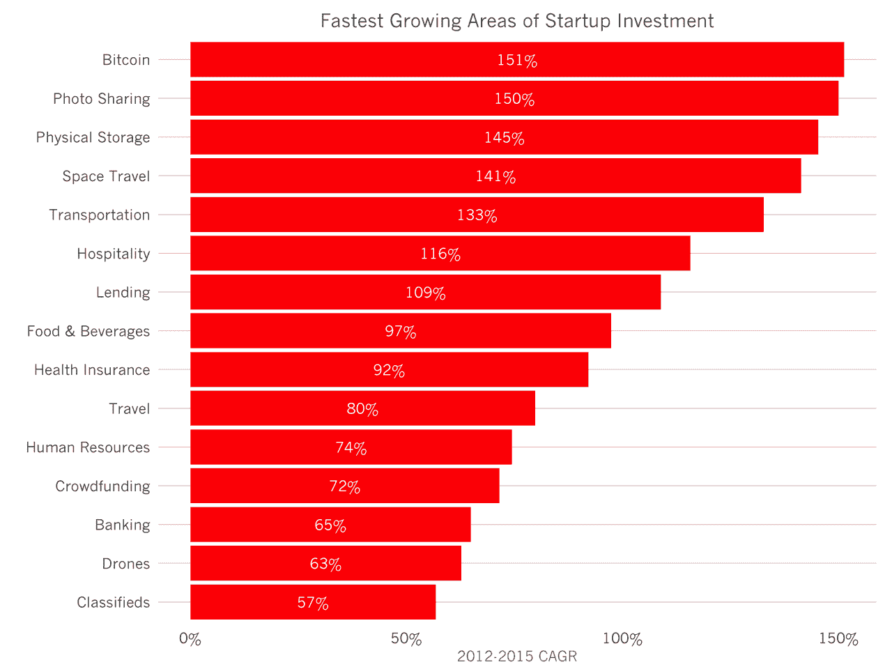
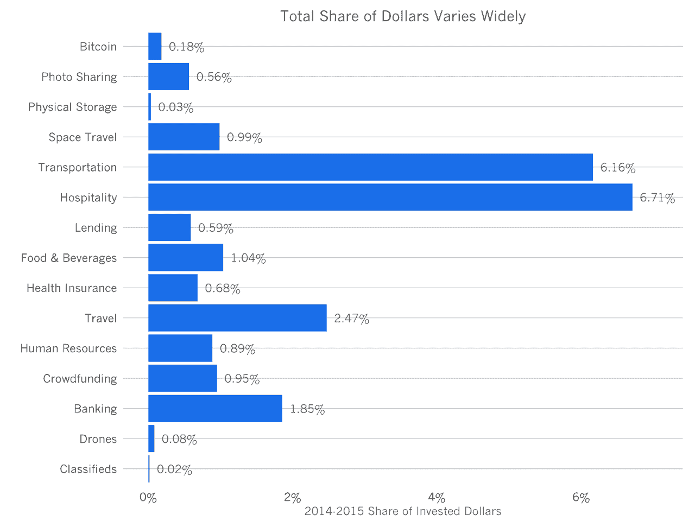

# 2015 年创业投资增长最快的领域

> 原文：<http://tomtunguz.com/fastest-growing-areas-investment-2015/?utm_source=wanqu.co&utm_campaign=Wanqu+Daily&utm_medium=website>

[T2】](https://res.cloudinary.com/dzawgnnlr/image/upload/q_auto/f_auto/w_auto/fastest_growing_investment_categories.png)

本周早些时候，我们研究了初创企业投资的主要类别，包括电子商务、软件、社交网络和教育。但是，哪些鲜为人知的创业领域开始筹集风险资金了呢？创始人在哪里寻找独特的创新机会？

比特币是增长最快的领域，其次是照片共享和物理存储(包括移动和自助存储公司)。根据 Mattermark 的数据，从 2012 年年中到 2015 年年中，这些行业的投资每年都增长 145%以上。

名单的其余部分反驳了创业公司和投资者只追求渐进式创新的观念。太空旅行初创公司希望征服最后的边疆。此外，创始人还筹集资金改造了许多基础行业:交通、酒店、贷款、医疗保险和银行。但是，不可避免的是，图片分享也在继续快速增长。

[T2】](https://res.cloudinary.com/dzawgnnlr/image/upload/q_auto/f_auto/w_auto/fastest_growing_investments_share.png)

如果我们检查过去 12 个月中每个类别筹集的美元的相对份额，我们会发现，比特币、物理存储、无人机和分类广告等相当多的类别只占总投资美元的极小一部分，不到 20 个基点。其他行业，如交通和酒店业，由优步和 AirBnB 的筹资活动推动，占过去 12 个月投资的数十亿美元的 6%以上。

让我们看看增长率为负的行业，随着时间的推移，初创公司筹集的资金越来越少。半导体投资每年下降 31%。电子邮件初创公司的融资额少了 22%。约会每年减少 9%。表现最差的类别:交易网站，其融资总额每年下降 48%。在某些情况下，这些类别收缩的原因是显而易见的。Groupon 主导着交易市场，因此新进入者的空间很小。半导体初创公司受到少数能够制造其设备的代工厂的限制，并与英特尔和 TSMC 等现有公司竞争，这些公司的巨额资产负债表可以为尖端研究提供资金。电子邮件和约会的下降不那么明显。

尽管如此，在接下来的几年里，我们应该会继续看到创业投资领域出现更大的差异。随着风险资本总额飙升至历史最高水平，创始人将追求竞争较小的领域，在这些领域，差异化更容易实现，从而在招聘人才和筹集资本时为公司创造优势。此外，投资者将寻求开发不足的领域进行融资，以寻求高额回报。