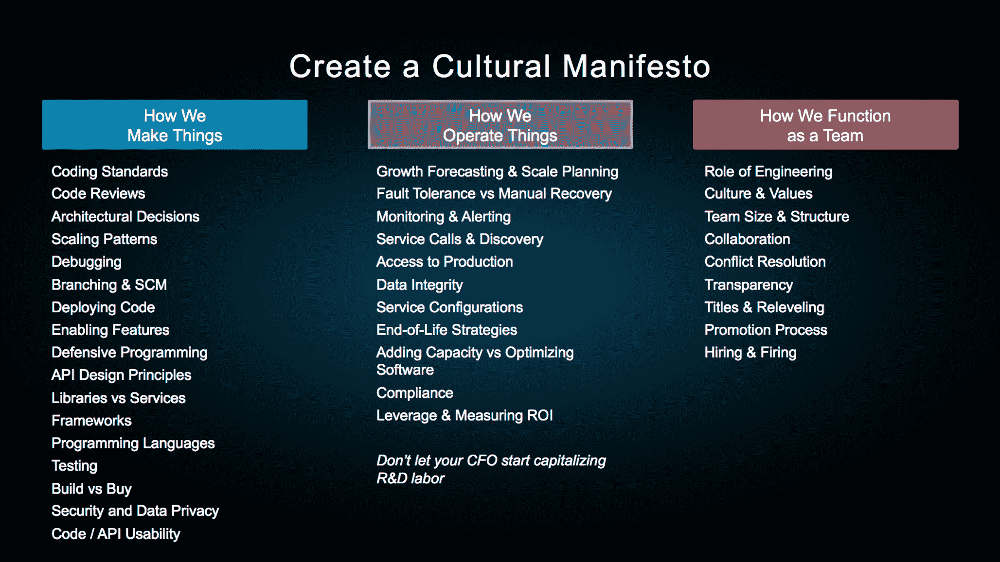

# 我如何在 LinkedIn 和 AdMob 构建成功的工程团队|第一轮回顾

> 原文：<http://firstround.com/review/how-i-structured-engineering-teams-at-linkedin-and-admob-for-success/?utm_source=wanqu.co&utm_campaign=Wanqu+Daily&utm_medium=website>

想象一个处于高速增长中的初创公司。它增加了工程师来跟上，但是因为它的团队已经超出了现有的有限流程，它的产品发布节奏开始变慢。签入和部署代码需要更长时间。功能——然后是整个产品——不再一路制造给客户。

现在想象一下，同一家公司最近达到了 1 亿用户大关，上一季度的收入为 9000 万美元，并将在下一季度以 25 亿美元的估值上市。这就是 LinkedIn 在 2011 年面临的情况。

“这是我们历史上令人痛心的时刻，”凯文·斯科特**[说，他加入](https://www.linkedin.com/in/jkevinscott "null")**[领英](https://www.linkedin.com/ "null")** 担任工程副总裁，三个月后公司在纽约证券交易所敲响了钟声。在 **[AdMob](https://www.google.com/admob/ "null")** 公司，他领导软件、运营和研究工程，直到公司被谷歌收购，他负责重塑和进一步扩大工程团队。**

在过去的十几年里，斯科特在高速发展和转型的公司组建了工程团队，他有战争故事来证明这一点。在首轮首席技术官峰会上，**他将这些经验总结为四条智慧，供工程领导者在接近、进入和卷入快速增长的混乱中时借鉴:**

# 不要把建筑技术和建立公司混为一谈。

在他的职业生涯中，Scott 与数百名工程师合作过——许多工程师的头衔发生了变化，但他们对发展的看法却没有改变。“想想你的工程生涯。斯科特说:“如果你是首席技术官或工程副总裁，你很可能是从工程师开始职业生涯的。“当你想到你作为一名工程师的工作时，你会想到编写尽可能好的代码并设计可伸缩的、优雅的系统。”

对于本质上的工程师来说，让漂亮的代码成为最重要的东西是很容易的。但是对于工程团队的管理者来说，这是一个危险的陷阱。“让一切都与你的技术根源联系起来是很诱人的，无论是打造出色而迷人的产品，与产品经理争论日期，还是争论哪个文本编辑器最好，或者如果他们打起来，达斯·维德是否会杀死超人。”

您的团队正在创造辉煌迷人的产品。但是不要忘记:你的工作不是运送代码。这是为了帮助你的公司获胜。

所有这些对话和决策对于创造技术和建立技术团队都是非常重要的，但是它们都忽略了更重要的一点。斯科特说:“作为一名工程师，你的工作和作为一个技术团队的目的是帮助你的公司取得成功。"**如果你领导一个工程师团队，最好从首席执行官的角度出发**。你的工作是找出你的公司、你的业务、你的市场、你的竞争环境需要什么。将这一点运用到你的工程团队中，这样你的公司才能取得成功。”

# 在问“什么”之前，总是先问自己“如何”

Scott 发现，一个工程师领导一个团队所需要的范式转变经常被开发人员的培训所阻碍。总的来说，他发现工程师们非常关注“是什么”——在一个高速增长的公司里，这可能会经常变化。例子包括:

我们将使用什么文档存储？

什么样的分片策略最适合我们的数据库？

我们将标准化哪些编程语言？

“所有这些都是‘是什么’的问题——但这并不完全令人惊讶，”斯科特说。“我们就是这样被教育的。计算机科学教育主要是关于“是什么”，而不是“如何”"

如果一个工程经理和她的团队可以开始问“如何做”的问题，他们会努力找到深思熟虑的答案和更持久的解决方案。例子包括:

我们将如何合作？

我们如何解决冲突？

当我们从五个开发人员发展到 50 到 500 人时，我们如何确保我们的代码库保持干净？

“有太多‘如何’的问题需要我们去解决。“与‘是什么’的问题相比，教育和培训中‘如何’的问题很少，”斯科特说。

对于工程师团队来说，讨论“是什么”是诱人的，但弄清楚“如何”才是持久的。

# 迭代适用于工程，但不适用于工程文化。

斯科特的团队开发了 LinkedIn 的图形数据库，这是一种分布式基础设施，用于模拟专业人士、公司和其他实体之间的关系。例如，图形数据库有助于指示两个人何时在 LinkedIn 上联系在一起。

第一个版本是用 Java 和 Oracle 编写的。所以面向连接的查询，比如请求某人的一级和二级网络，在每次请求时都被直接发送到数据库。第二个版本是用 C++写的。所有东西都存储在一台机器的内存中，这比关系数据库要快，但是一旦图形变得太大，它就会失效。然后，该团队用 Scala 重写了系统，并将图形数据分散到数百台机器上。然后，限制因素变成了 Java 虚拟机(JVM)的垃圾收集器，当单个图形碎片暂停以回收未使用的内存时，它会导致服务中断。为了解决这个问题，该团队构建了一个日志结构的堆外内存管理系统，以完全绕过 JVM 及其垃圾收集器。他们并没有就此止步。

“从团队开始的有利位置来看，我们绝对不可能预见到制作最新版本的 graph function 所需的方向和资源，”Scott 说。“我们甚至无法开始想象。当我们建造这个大规模的技术来纠正错误的时候，我们拥有的是这个很好的，自然的机会序列。你可以在成长的每一个里程碑上解决技术的基本问题。”

有一些杠杆和机制可以微调技术。但是对于工程文化来说，抛弃你构建的第一个版本要困难得多。

“有了一项技术，你或许可以进行红线测试，看着交通预测，然后说，‘从现在起五个月后，这条铁路将会垮掉。我现在必须开始重建它，这样我才能继续经营我的生意。没有一个等效的分析可以让你看到你的工程文化的一部分，然后说，‘当我增加下 50 个工程师时，这个特定的部分将会崩溃。如果我现在不解决它，我会崩溃的。"

没有一套自然的机制来解决文化问题，就像技术问题一样。然而，后果可能同样可怕。斯科特说:“当你在一家快速发展的公司内部遇到文化问题时，它们可能会转移，就像糟糕的技术决策可能会毁了你并导致事情发生一样。”“你已经有了技术更新的自然周期，但你也必须有正确的文化，否则你可能没有机会或能力重建这些系统。”

在他的职业生涯中，斯科特多次观察到工程文化中的这种高风险现象——不仅在不同的工程团队中，而且在整个公司中。不同之处在于，在构建技术时，错误是不可避免的。正如他所说，“当你决定要建立一个东西的时候，如果你处于高增长模式，你就不得不重建它。”

问题不在于你是否做对了，而在于你什么时候会开始犯错。

最好的公司依靠他们的工程文化——而不仅仅是他们的工程能力——来帮助他们的工程团队度过高速增长。怎么会？他们创造了一个文化宣言。

# 不要等着写你的宣言。

Elements of a Cultural Manifesto

斯科特说:“当你在扩展你的工程团队时，唯一最有价值的管理工具是我称之为文化宣言的东西。“这是一份文档或一套材料，可以帮助您的整个工程团队就如何制造和操作产品以及如何作为一个团队发挥作用达成共识。”

当斯科特在 2007 年加入 AdMob 时，它在市场、客户、收入和快速增长方面都是最有价值的。但是它没有宣言。

“为了满足需求，我们尽可能快地为客户编写新功能，”斯科特回忆道。“我们工作的很大一部分涉及到一次性的、针对特定广告客户的功能。因此，一个销售人员将获得 10 万美元的销售线索，我们将不得不对建立广告单元说是或不是，在那里用户可以摇摇他们的手机，一个人的裤子将进入卡其裤的广告。很棒的东西，真的很鼓舞人心。”

快速增长推动了 AdMob 的销售，但也让其工程基础设施出现了细微的裂缝。“我们一直在执行所有这些不可利用的功能，直到我们的工程团队变得完全和彻底紧张，”他说。“我们全天候处于救火模式。我们很难跟上扔给我们的一切。工程团队士气低落，濒临辞职，因为他们已经完全筋疲力尽了。”

一旦我们明白了自己在帮助公司成功中的作用，我们就不再做像特定交易开发这样的蠢事了。

对斯科特来说，问题的很大一部分在于当时公司没有文化宣言。在运营方面的一些关键领域，团队没有具体的、记录在案的意见。“每个人对增长预测和规模规划都有不同且不一致的看法。或者我们如何看待自动容错与手动恢复。或者我们如何进行监控和警报。或者……这份清单还在继续。”

一旦 AdMob 解决了所有这些情况，斯科特记得“生活变得好得多。”以下是他关于如何在一家高速增长的公司建立一份宣言来指导和激励工程团队的建议:

不要等待灾难降临。记下 Scott 在 AdMob 的早期经历。“忽视你的工程文化的错误会无声无息地击垮你。积极主动地起草一份宣言，因为在危机来临时决定写一份宣言是非常困难的。腾出时间围绕文化进行对话，并尽早开始。”

经常辩论和修改你的宣言。该宣言作为一种方式，随着时间的推移，完善你的工程文化。“不要指望在公司成立的那一刻就完美地确定你的文化，但一定要从一开始就谈论它。即使你已经做过六次了，我向你保证每个公司的环境都略有不同。利用这个框架来讨论你如何组建、运营和运作一个团队，而不仅仅是编纂规则。”

**求协调，不求共识**。让所有人达成一致并不意味着让所有人都同意。“你不一定会得到一致同意，因为你总是会在你的文化宣言中采取让你的工程团队中的某些人恼火的立场。请记住，这不是一份意见目录，而是一份书面承诺。”

**明确定义工程**的角色。斯科特回忆说，在 AdMob 的早期，该公司是如何在一个市场上竞争的，在这个市场上，既有老牌企业，提供移动广告服务的门槛也非常低。“市场本身正在飞速发展。他说:“你可以让一个销售人员雇佣一个 PHP 程序员，这个程序员可以编写足够的 PHP 代码来服务一个广告，瞧，你就有了一个移动广告业务。”“另一方面，你有广告技术巨头，他们拥有网络效应和领先我们数千年的工程技术。”

市场帮助 AdMob 的工程团队清晰地表达了其文化名片。一开始公司并没有真正理解工程的作用。但在冷静地审视了市场之后，事情变得很清楚:“我们需要工程团队来让我们抓住每一个可能的先发优势。这就是定义我们文化的特征。我们需要灵活性，这意味着一个能让我们快速行动并承担巨大风险的技术平台。”

斯科特称，LinkedIn、谷歌或 AdMob 的文化宣言完全不同。

“我们在每个地方关注不同的因素，因为环境是独特的，”斯科特回忆道。“在 LinkedIn，我们并不打算利用一系列先发优势。相反，我们问自己如何利用大量高质量的数据为 LinkedIn 的高级用户构建一套产品。这意味着一套完全不同的技术和运营视角。”

然而，即使只是公司故事中的一个小章节，工程团队的现实也会发生巨大的变化。当风向改变时，领导者有责任去感知。LinkedIn 上市六个月后，Scott 启动了 Operation InVersion ,将文化宣言的开端注入到他的团队的工程文化中。在 LinkedIn 的计算架构被改造之前，不会有新的功能开发——这是业务*和*他的团队所需要的。随着所有人的目光投向这家新成立的上市公司，斯科特表明了自己的立场。这带来了回报，给 LinkedIn 带来了令人印象深刻的工程灵活性，并提高了其估值。

无论是在 LinkedIn 还是在其他地方，斯科特都知道在一家快速发展的公司发展技术是非常困难的。但以超高速增长的模式构建技术团队要困难得多。“呼吁所有的工程领导者:请开始花费不成比例的管理时间，将文化视为一个设计过程。他说:“宣言是一种非常好的组织观点的方式，给你自己一条发展的道路。

如果你在你的公司领导一个工程师团队，从你自己开始。问“如何”，而不是“什么”，让这一系列的询问重新定位你的团队的集体思维，以帮助你的创业公司取得成功。

创业公司会有不同的文化宣言，但他们应该尽早创建并讨论它们——尤其是如果他们计划建立大型科技公司的话。宣言是一家快速发展的公司的支柱，对于斯科特来说，也是一个更大且急需的转变的一部分。

“作为一个全球性的互联网行业工程联盟，我们花了更多的时间集体思考建设技术，而不是设计我们的工程团队和技术文化，”他说。“这需要彻底改变。”