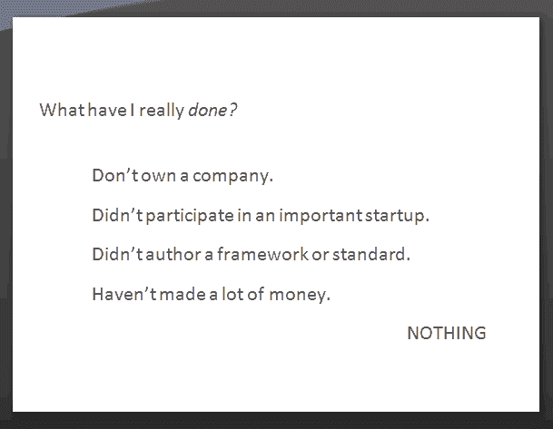
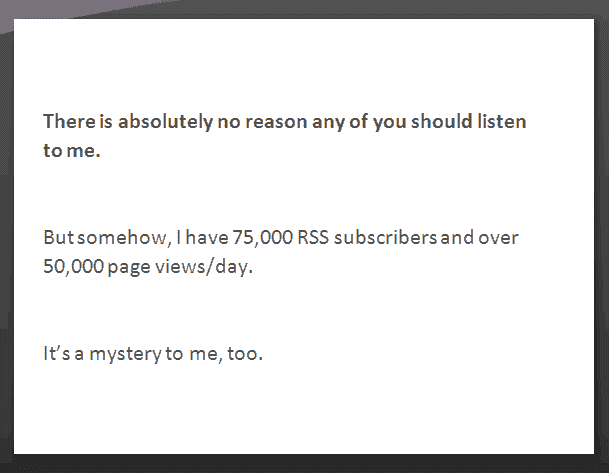

# 强烈的观点，微弱的支持

> 原文：<http://blog.codinghorror.com/strong-opinions-weakly-held/?utm_source=wanqu.co&utm_campaign=Wanqu+Daily&utm_medium=website>

我很少停下来回应对我博客的批评。如果我这样做了，我一天中就没有时间做其他事情，也没有时间做建设性的工作。但偶尔我会遇到一篇写得特别好的评论，让我停下来，比如阿拉斯泰尔·兰金的[博客恐怖](http://girtby.net/archives/2008/05/22/blogging-horror/)。因为我觉得阿拉斯泰尔是出于真诚的善意而写的，他的批评是真诚的，所以我想试着用耐心和合理的话来回答他的发言。

> 然而，编写恐怖代码变得如此流行，以至于阿特伍德辞去了日常工作，开始自己创业。在我看来，这在一定程度上提高了门槛。就像在许多其他领域一样，专业博客应该比涉猎者受到更多的关注。
> 
> Atwood 不仅在他的博客上表现得很专业，而且最近还创办了一个名为 stackoverflow 的项目，收集软件开发社区公认的智慧。现在还为时尚早，但据我所知，尽管有采用社区生成内容的意图，但仍有可能是 Atwood 的编辑参与了输出。
> 
> 换句话说，**阿特伍德似乎把自己树立成了软件开发的权威人物**，我对此有些异议。

我想首先用我的[1 月 CUSEC 演讲](https://blog.codinghorror.com/see-you-at-cusec-2008/)中的两张幻灯片来回答这个问题，在这里逐字逐句地呈现，没有任何修改。

 

我们这个领域的权威是个奇怪的东西。感知权威更奇怪。

我一直认为自己只不过是一个寻求启迪的业余爱好者。这个博客是我试图[邀请其他人一起踏上旅程](http://www.codinghorror.com/blog/archives/001020.html)。这已经成为一个相当受欢迎的旅程，这微妙地改变了旅程的性质和我接近它的方式，但目标仍然是一样的。

听到人们将我视为专家或权威，而不是一个业余爱好者，我感到非常困扰:

> 当我回到波士顿时，我去了图书馆，发现了木村关于这个主题的一本书，令我非常失望的是，我们所有的“发现”都被写在了前几页。当我回电话告诉理查德我的发现时，他非常高兴。“嘿，我们答对了！”他说。“对业余爱好者来说还不错。”
> 
> 回想起来，我意识到几乎在我们一起工作的所有事情上，我们都是业余的。在数字物理、神经网络甚至并行计算中，我们从来不知道自己在做什么。但是我们研究的东西太新了，没有人知道他们到底在做什么。是业余爱好者取得了进步。

这些人都是行业巨头，所以他们和我本人的任何比较都是偶然的。我想提醒大家注意的是他们提出的总体观点:[软件是一门非常年轻的学科](https://blog.codinghorror.com/fifty-years-of-software-development/)。软件中的一切都是如此的新，如此频繁的被重新发明，以至于**几乎没有人真正知道他们在做什么。是业余爱好者取得了所有的进步。**

当谈到软件开发时，如果你自称专业，如果你把自己标榜为权威，你不是在对我们撒谎，就是在对自己撒谎。在我们内心深处，我们知道:真正的进步是由业余爱好者取得的。他们忙于开发软件，通常没有时间长篇大论地谈论他们传奇般的专业知识。如果我在我的职业生涯中学到了什么，那就是作为一个专家，作为一个已经发现了关于某个给定主题的所有知识的人来进行软件开发，是一个最有可能失败的方式。

如果说有什么不同的话，专家比业余爱好者更值得怀疑，因为他们更不诚实。不管怎样，你绝对应该质疑我在这里写的所有东西，就像你质疑你在网上或者其他地方读到的所有东西一样。你自己的研究和数据应该胜过你从*任何人*那里读到的任何说法，不管你、我、谷歌或整个社区可能相信他们是多么权威或专家。

但是，正如阿拉斯泰尔正确指出的那样，如果我现在收入的很大一部分来自写博客，那我不就成了专业博客作者了吗？我认为戴夫·维纳有一个很好的解释，我很乐意采纳:

> 现在如果你问我——从来就没有职业博主这种东西。这是一个矛盾的说法。这就像说一个人是专业的业余爱好者。它就像咸橙汁，这种饮料的味道来自于它的酸度。写博客是一项业余活动。是用户写他们做什么，而不是专业人士写用户做什么。

戴夫在这里描述的是写程序员的记者和写编程的程序员的区别。写博客并不意味着从外部观察；它意味着参与。我喜欢认为我在编写恐怖代码时所做的是[运输软件](https://blog.codinghorror.com/yes-but-what-have-you-done/)的副产品，而不是我正在进行的某种奇怪的社会学实验。虽然有时候，我承认，确实有这种感觉。我是一个多面手，有着非常浅薄的编程背景，所以我可能会有点心不在焉。但是直接或间接地，我在这个博客上写的所有东西都是我作为一名程序员对我正在进行的工作的深深的、一生的热爱的副作用。

你可以说我是一个比程序员更好的作家。也许那是真的。我会第一个告诉你，我不是一个杰出的程序员。一个称职的程序员，是的。一直都是。在好的一天，甚至可能是一个体面的程序员。但我也不会欺骗自己。我永远不会是最好的之一。但是我在天赋上的不足，我用强度来弥补。

也就是说，从数学上来说，我一定非常非常紧张。

> 发布到《编码恐怖》的小部分内容都非常适合小主题。但是，如果主题太复杂，不容易提炼出来，事情往往会出错。过度简化经常随之而来，如以下所有最近的例子:
> 
> *   一个[试图对 XML 进行评论](https://blog.codinghorror.com/xml-the-angle-bracket-tax/)...
> *   类似的“这太难了”的反应似乎是一篇关于人道标记语言的文章的核心...
> *   诚然，模型-视图-控制器现在是一个越来越模糊的概念，但我就是不相信阿特伍德的例子...
> *   一个评论说软件分流是“零自由的化身”，这表明阿特伍德不知道零自由是什么...
> 
> 所有这些的共同点是对当前主题的肤浅理解。简而言之，阿特伍德只是*不可信*。

有时候可能有点太激烈了。这几乎就像是我试图过度补偿什么，但我无法想象那会是什么。

<video poster="/conteimg/2015/08/rex-kwon-do-poster.jpg" preload="none" controls=""><source src="http://discourse-cdn.codinghorror.com/uploads/default/original/3X/a/d/ada45bcfb90283e7b9a99624706d17f7343f4065.mp4"></video> 

> 我是雷克斯，雷克斯拳道自卫系统的创始人！在我的道场和我呆上一个星期后，你将准备好用灰熊的力量、美洲狮的反应和人类的智慧来保护自己。

就像雷克斯拳道的雷克斯一样，也许我在我的道场里有点过于依赖 T2 的“击倒”学习模式。我用它是因为我个人觉得它非常有效，对于[凯西·塞拉概述的所有理由](http://headrush.typepad.com/creating_passionate_users/2005/08/the_smackdown_l.html)。

但我担心，对某些人来说，它会碍事，损害潜在信息的可信度。他们得到的不是想要的学习部分，而是打击。我当然希望我的帖子比“关于 PHP 的一切都糟透了”、“关于 XML 的一切都糟透了”或我个人最喜欢的“关于(你最喜欢的技术)的一切都糟透了”更能被阅读和理解。说真的。”

我想这也是个人风格的问题。对我来说，没有强有力的声音来写*，写满了事后批评和否认，是单调乏味的，很难写完。我特意用强硬的语气写作，因为这样更有效。但是**每当我以强烈的声音发帖时，这也是一个隐含的邀请去参加一个讨论**，在这个讨论中我经常改变我的观点，并且总是能学到很多关于手头话题的东西。我相信原则[强有力的意见，弱有力地坚持](http://bobsutton.typepad.com/my_weblog/2006/07/strong_opinions.html):*

> 几年前，我和该研究所的鲍勃·约翰森(Bob Johansen)谈论智慧，他解释说——为了应对不确定的未来并继续前进——他们建议人们要有“强烈的观点，而这种观点是站不住脚的”他们多年来一直在提供这种建议，我知道这是由[前]研究所所长[保罗·萨佛](http://www.saffo.com/)首先提出的。鲍勃解释说，软弱的观点是有问题的，因为人们没有受到激励去提出对他们来说可能是最好的论点，或者拿出检验它们所需的精力。鲍勃解释说，同样重要的是，不要太执着于你的信念，因为否则，它会削弱你“看到”和“听到”与你的观点相冲突的证据的能力。这就是心理学家有时所说的“确认偏差”问题

所以当你读了我的一篇文章，听到这个:

> 我叫雷克斯，如果你参加我为期八周的课程，你会学到一套自我防卫的系统，这是我在八角形格斗场两个赛季中发展出来的。它叫做...雷克斯拳道！

请把它看作是一场**强有力的观点弱有力的观点**，一场同等地位的业余爱好者之间的模拟战斗，在一个八角形场地上举行，每个人都保持幽默感，思想开放，并喜欢激烈的辩论，在辩论中我们都学到了一些东西。

现在向你的老师鞠躬！向你的老师鞠躬！

