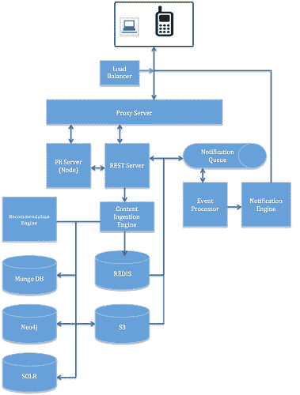

# 为社交产品设计后端——高可扩展性——

> 原文：<http://highscalability.com/blog/2015/7/22/architecting-backend-for-a-social-product.html?utm_source=wanqu.co&utm_campaign=Wanqu+Daily&utm_medium=website>

本文旨在带您了解关键的架构决策，这些决策将使社交应用成为真正的下一代社交产品。提议的变更针对以下属性:a)可用性 b)可靠性 c)可扩展性 d)性能和对扩展(而不是修改)的灵活性

## 目标

a)确保用户的内容容易被发现并且始终可用。

b)确保推送的内容不仅在语义上相关，而且从用户设备的角度来看也相关。

c)确保生成、推送和分析实时更新。

着眼于尽可能节约用户的资源。

无论服务器负载如何，用户体验都应保持不变。

f)确保整体应用安全

总的来说，我们想要应对一个惊人的挑战，我们必须应对不断膨胀的用户生成内容、不断增加的用户数量和源源不断的新项目，同时确保出色的性能。考虑到上述挑战，我们必须研究影响整个系统设计的某些关键架构元素。以下是一些关键的决策和分析。

### 数据存储

数据存储和数据建模是需要做出的关键决策之一。社交产品应该处理多种类型的数据，因此在为每种类型选择模型和存储之前，我们彻底分析和理解数据是至关重要的。

第一步是确定哪些是最常查询的数据，哪些是不经常需要的数据(用于分析的存档数据)。对于需要频繁查询的数据，需要将其放在始终可用、读写速度更快且水平可伸缩的位置。现在，我们在所有用例中都使用 MySQL，尽管我们的用例并不要求使用基于 RDBMS 的系统。随着数据的增长，我们的读写将成为应用程序性能的瓶颈。我们应该为每秒数十亿次的查询做好准备。

让我们对数据进行分类:

a)主数据或静态形式的数据，如用户资料

b)语义数据

c)用户生成的内容

d)会话数据

对于我们来说，很难找到一个对所有这些类型的数据都具有高性能的数据存储。因此，我们需要为每一个选择特定的数据存储。

**静态数据**:对于静态数据，我们最好选择基于文档的存储，其中键和值都是可查询的。我们可以选择像 MongoDB 这样的成熟的基于文档的存储。选择 MongoDB 的最大优势是它在文档级别提供了 ACID 属性。

它可以在多个分布式数据中心内部和之间轻松扩展。它将允许我们使用副本集轻松地维护冗余，从而解决我们的可用性问题。

分片是另一个需要考虑的重要因素，它对于确保规模和速度至关重要。幸运的是，MongoDB 透明地支持分片。

**关联或关系数据(核心数据)**:我们的大部分数据在本质上是关联的，例如，A 是 B 的朋友，C 是 A 和 B 的朋友。这种数据是高度语义的数据，最适合用图形建模。我们应该像 Neo4j 一样将这样的数据存储在一个 graph DB 中。优势明显；它将允许我们存储节点的所有连接以及节点本身，从而节省了计算连接数据之间的关系的额外步骤。图形数据模型也将帮助我们捕捉关系的属性。当尝试探索连接的数据时，属性丰富的关系是绝对重要的。GraphDB 支持 ACID 规则和自动索引。

同样，在可用性和可伸缩性方面，我们的要求是相同的。我们可能会有成百上千个并发事务同时写入数据库，并进行成千上万次读取。它应该可以扩展到每秒处理超过 10 亿次读取，跨越数 Pb 的数据集。

我们需要一个允许动态扩展读写的系统。另一个要考虑的因素是分片，这对于扩展我们的系统至关重要。

Neo4j 已经设计为水平扩展，并具有复制功能来保证可用性。但是目前它还不支持分片。在选择一个时，我们可能需要更多的分析。其他选项有 FlockDB、AllegroGraph 和 InfiniteGraph。

二进制数据(UGC) :我们还将不得不处理与我们的用户相关的大量二进制数据。考虑到二进制数据的大小，处理它们并不容易。如上所述，在我们的系统中，需求可能在几秒钟内达到相当高的水平(峰值)，规模和可用性是决定存储位置时要考虑的最关键因素。我们不能依赖文件系统来存储二进制数据。我们必须考虑可用性和可伸缩性。文件系统的缓存可能会受到 CPU 的限制，使其冗余将需要大量的簿记工作。相反，我们应该依靠一个已经具备这些功能的系统。例如亚马逊 S3，这是一个非常受欢迎的对象商店，有保证的可用性，本质上是有弹性的。

我们也可以考虑谷歌云存储或 Rackspace 云文件等。但在假设条件方面，S3 似乎是明显的赢家。

S3 已经支持数据分区。它通过基于高请求率和一个分区中的键数量将数据连续分割成多个分区来水平扩展 S3。但重要的是要认识到，仅仅存储内容是不够的，与这些内容相关联的元数据需要是可搜索的，并且搜索必须足够快和可伸缩。我们还可以尝试一些新的东西，如从图像中自动识别尺寸，基于上下文的自动标记等，然后使用这些来驱动图像的关键点*。这是一个潜在的知识产权领域。我们将在索引部分研究索引需求。但是现在，让我们注意，我们将使用一个标识符来存储内容，这个标识符可以在其他地方被索引。亚马逊的 S3 似乎最适合这种情况。

### 会话数据

认识和理解我们为什么需要考虑会话数据是很重要的。会话数据将帮助我们维护用户的状态。这种状态应该以与服务器无关方式持续下去，以使我们的部署具有可伸缩性。这将有助于我们保持设计足够灵活，从而确保会话不会局限于特定的节点或服务器。

我们必须以一种方式保存会话信息，我们可以重新生成用户的实际会话，如果用户的会话终止，我们仍然可以帮助用户从他离开的地方重新开始。

在我们的市场中，这一点尤其重要，因为这里的连接并不可靠，数据包丢失也很常见。这些数据需要跨我们的节点可用，因此需要可用性和可伸缩性。首先，我们可以在我们的 MongoDB 中很好地保存它。以后我们可以考虑把它转移到 REDIS 这样的纯键值存储上。

注意:所有建议和离线作业都应该只在非服务节点上运行。

### 索引

索引对我们的系统至关重要。用户可以搜索任何内容，这是我们的主要用例之一。为了提高搜索性能，我们必须非常认真地对待索引。这里有两件事需要考虑。首先是索引本身的创建，其次是索引系统本身。

为了建立一个有意义的可搜索系统，我们必须设计一个实时索引，它是倒排的，在生成的内容窗口上工作。首先，我们可以编写一个非常简单的系统，在内容摄取期间，它可以根据内容生成倒排索引。后来，随着内容摄取负载的增加，我们可以简单地用 Apache Storm 这样的实时数据处理引擎来代替它，这是一个分布式、容错和高度可扩展的系统。它可以接管索引逻辑的生成。

索引系统:Lucene 因其受欢迎程度和速度是一个明显的选择；其性能无与伦比。我们应该选择太阳星云。它已经支持透明分片、复制，并且具有读写端容错能力。

### 排队和推送通知

每次在我们的应用程序中触发事件时，我们都会被要求以通知的形式向他/她的关注者/朋友分发事件。重要的是，我们的系统不能错过任何这些信号，并且在发生故障时，这些事件的恢复是最重要的。要做到这一点，我们必须寻找排队解决方案。我们可以使用 ActiveMQ，这是最可靠的排队软件。它允许集群实现高可用性，并支持分布式排队。

推送通知是向用户发送通知的另一个重点领域。这里我们需要寻找规模。我们应该为几十亿的 nps 规模做好准备。这里有很多选项，但也许 pyapns、CommandIQ 和 App Booster 是最受欢迎的。

即使用户的设备离线，我们也需要自己管理一些东西来保证通知的传递。我建议我们实现一个基于双指针的系统，它维护一个通知的状态，并在后台写入一个磁盘。因此，每次通知失败时，都会维护其状态，并使用状态标志将其添加到重试队列中。最后，当一个通知被发送时，它被出队。

### 缓存策略

像我们这样的系统，我们的目标是扩展到 10 亿 rps，智能缓存是最重要的。我们的设计将需要逻辑在多个层缓存，并智能地驱逐它们。让我们来看看在顶层缓存什么以及在哪里缓存。

*【内容缓存】* :为了最大限度地减少缓存缺失，并确保缓存始终保持最新可用数据，我们需要寻找一种永不过时且始终更新数据的缓存。这基本上意味着在我们所有的一般用例中，我们将永远不必查询我们的数据库，因此节省了大量资源。我们还应该确保我们缓存的数据总是采用不需要任何消息传递的格式，并且应该准备好呈现。这实质上意味着我们将把在线负载转换为离线负载，从而节省延迟。要做到这一点，我们必须确保每次将内容接收到系统中时，我们都要做两件事

a)原始内容以在服务阶段不需要任何消息传递的方式被反规格化，然后被保存到高速缓存中。为了安全起见，我们总是会设置一个足够长的到期时间。

b)原始内容也按原样写入我们的数据存储中。

我们完全可以依靠 REDIS 来实现这种缓存，它是一种具有良好故障恢复能力的内存缓存。它是高度可扩展的，新版本也允许透明分片。它还支持主从节点配置。最好的部分是它将允许我们在原样模式下保持原生数据结构，这使得增量编写变得非常容易，并且对我们来说支持内容提要(扇出)是至关重要的。

还需要注意的是，我们将需要大量的读-修改-写操作和对大型内容对象的小型读取，以支持实时扇出，而 REDIS 在速度方面是这些操作的最佳选择。

*代理缓存 e* :反向代理级别的缓存也很关键。这有助于减少我们服务器的一些负载，从而保持延迟。但是要使代理服务器真正有效地缓存，正确设置 HTTP 响应头是至关重要的。选择很多，但比较受欢迎的是 nginx 和 ATS。

*二级缓存(代码级缓存)* :这是实体数据的本地存储，用于提高应用程序的性能。通过减少昂贵的数据库调用，将实体数据保存在应用程序本地，它有助于提高性能。EhCache 是这一领域的流行选择。

*客户端缓存* :这是实际的设备或者浏览器缓存。所有静态项都应该尽可能地被大量缓存。如果 API 响应设置了正确的 HTTP 缓存头，那么已经缓存了许多与资源相关的项目。我们应该确保它按预期运行。除此之外，我们应该缓存尽可能多的其他内容，要么使用设备自己的内存，要么可以使用 sqlite。所有昂贵的对象都应该被缓存。例如，NSDateFormatter & NSCalendar 初始化速度很慢，应该尽可能重复使用。iOS Lot 可以在这里进行调整和使用，但这超出了我们的研究范围。

### 内容压缩

考虑到我们的用户主要是为了处理大量的图像和视频，而下载这些图像和视频需要相当大的数据量，因此优化下载大小至关重要。这将为用户节省更多的数据，并提高应用程序的性能。

要考虑的另一个方面是我们的网络，我们的用户主要在非 LTE 网络中，使用 2.5g 或 3g，带宽通常是一个问题，连接不可靠。数据使用成本也高。在这种情况下，智能压缩是至关重要的需求。

但是压缩图像和视频并不是那么简单，通常需要更深入的分析。我们处理的图像和视频可能是无损的，也可能是有损的，这取决于用户的设备质量。所以我建议使用多种压缩技术来处理这种情况。在这种情况下，我们可以尝试帧内压缩和帧间压缩技术。

但是一般来说，我们可以使用 zpaq 和 fp8 来满足所有的压缩需求。我们也可以尝试 WebP，这对我们的市场有好处。总的来说，我们将始终使用 GZIP，我们所有的 API 响应将总是被 GZIPed。

### 内容转码

考虑到我们需要处理多种设备、多种操作系统和屏幕分辨率，我们的内容存储和处理应该与设备无关。但是服务层应该是上下文相关的，并且应该基于用户的设备能力来理解和提供正确的内容。这使得图像和视频的转码变得至关重要。

我们的应用应该收集设备在内存、编码和屏幕分辨率方面的能力，并将其作为上下文传递给我们的 API。我们的 API 应该使用这个上下文来修改/选择内容版本。根据我们收到的设备上下文，我们可以将内容预转码为几个最需要的版本。

对于代码转换，我们可以使用 FFMPEG，它是最可靠、使用率最高的框架。我们可以根据需要修改 FFMPEG。这也必须在摄入端进行。

### 传输协议

考虑到我们的网络场景(非 LTE、不可靠的连接等)，尽可能智能地节省资源并使通信尽可能轻便至关重要。我建议我们对所有 Http 请求使用 OkHttp client，它反过来使用 SPDY，SPDY 对连接失败具有很强的弹性，可以透明地恢复。

对于我们所有的消息传递需求，我们应该切换到 MQTT，这是一种轻量级的机器对机器连接协议。

### 安全性

保护我们的应用非常重要。我们的整体架构应该适应这个重要的属性。在这里，我将只讨论支持安全性所需的架构变化，我们不会讨论实现上的变化。

这里有一些我们必须添加到我们架构中的东西:

1。我们所有的用户数据都必须加密。MongoDB 和 Neo4j 已经支持存储加密。根据具体情况，我们可以决定加密关键用户信息。必须为所有与数据库相关的调用启用传输加密。

2。安全套接字层:所有到达我们的代理服务器的调用都应该是 SSLed。代理服务器可以充当 SSL 端点。

3。我们所有的 api 端点都应该运行在非默认端口上，并且必须实现 Oauth。

4。所有对数据库的读取应该总是通过 rest 端点进行。

5。必须对保存密码的配置进行特殊处理。密码必须经过哈希处理，文件应该限制为只有应用程序在启动时读取。这允许我们通过文件系统权限来控制应用程序身份实例。只有应用程序用户可以读，但不能写，其他人都不能读。所有这些配置都可以打包在 keydb 下，并受 pwd 限制。

## 成分

以下是我们架构的组成部分:

1。负载均衡器:这一层根据决定的策略决定请求应该转发到哪个代理服务器。这一层还将通过根据容量重定向流量来帮助我们保证可用性。

2。代理服务器:所有来电必须到达这里。这也是我们的 SSL 终点。它根据定义的策略缓存 HTTP 请求。FE 层:这一层运行一个节点服务器。

3。摄取引擎:该组件处理所有传入的内容。它包含与反规范化、代码转换、缓存等相关的策略。将来，如果需要，所有内容的丰富都可以在这里完成。

4。REST 服务器:这是与所有数据库对话并生成响应的层。它的访问受 Oauth 保护。它可以是实现了边缘缓存的 tomcat 容器。

5。事件处理器:这一层处理所有的事件，主要负责扇出特性。它读取 ActiveMQ 并使用通知引擎生成通知。

6。推荐引擎:该组件通过分析从用户活动中收集的所有信号来驱动推荐。基于收集的实际信号，我们可以部署各种基于相似性的算法。我们可以从 Apache Mahout 开始，它已经提供了各种算法接口

系统的逻辑视图:

T4】

# 结论

这更像是对关键组件的高级分析。如果需要实现，这个提议不需要一次实现，可以分阶段完成，但是如果我们需要扩展和支持真实的用例，我们必须遵循我在这里提出的模式。我没有接触任何设计领域。这是针对设计阶段的，需要更深入的分析和理解系统的当前状态。