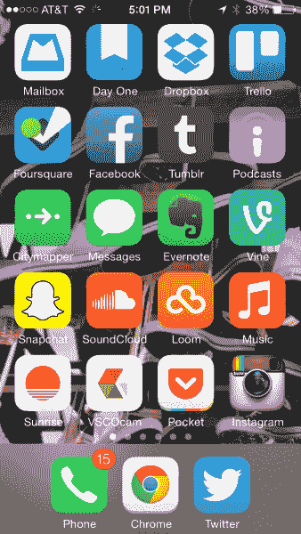

# 应用星座- AVC

> 原文：<http://avc.com/2014/05/app-constellations/?utm_source=wanqu.co&utm_campaign=Wanqu+Daily&utm_medium=website>

我在周五关于 Swarm 的文章中提到了应用星座的概念。过去一周我一直在思考这个概念，我认为这是*非游戏*原生移动应用世界的一个重要发展。

如果你列出所有非游戏移动应用的 mau 超过 10 毫米，这将是一个非常短的列表。如果没有所有的游戏，它可能看起来与 iOS 和 Android 应用商店中排名前 100 或 150 的免费应用没有太大区别。在一个排行榜驱动的世界里，大的变得更大，其他人都回家了。我们已经在 AVC 上多次讨论过这种现象，最近一次是在这里[。](https://avc.com/2014/04/the-mobile-downturn/)

上周早些时候，我的同事布莱恩向我展示了他 iPhone 的主屏幕。

[T2】](https://avc.com/wp-content/uploads/2014/05/brians-iphone.png)

他向我指出，他的主屏幕上有三个 Dropbox 应用程序——Dropbox、Mailbox 和 Loom。他说，他可以想象一个世界，在这个世界里，他的整个主屏幕都被几家顶级公司的应用占据。

这让我开始思考。我们不仅在移动应用领域有一种越来越丰富的趋势，而且我们也在见证一个成熟的市场整合。大型移动应用公司，谷歌，脸书，Dropbox，Twitter，雅虎！最近，如果你相信谣言，苹果公司正在收购领先的移动应用程序，进一步集中了在排行榜上有应用程序和在我们的主屏幕上有应用程序的公司名单。

但是，如果这还不够，在这些新兴的应用程序群中，还有两个趋势值得注意。这些应用程序群中的许多都提供了跨所有应用程序的单一登录，如果你在手机上登录了他们的一个应用程序，你就可以在手机上登录他们的所有应用程序。这在下载一个更大的应用群中的新应用时特别有用。对 CRM 和广告定位也有帮助。

我们看到同一星座的应用程序之间深度链接的使用越来越多。在不属于单一星座的应用程序之间进行深度链接的可能性越来越大。脸书和 Twitter 让第三方开发者更容易利用应用程序中的深层链接来做到这一点。但是当你控制了一大堆应用程序时，让应用程序之间的深度链接成为你所有应用程序的标准就容易多了。这是一件非常重要的事情，因为它在移动设备上创造了一种类似网络的体验，这种体验的流动性非常吸引人，进一步吸引用户。

这些应用程序群可能是解决移动分发难题的唯一可持续的答案——我如何绕过应用程序商店排行榜的交通堵塞？如果你拥有一个领先的星座，你可以利用你的应用程序和你与这些应用程序的用户的关系来推广和分发你自己开发或购买的新应用程序。这种促销是“原位”的，消费者的注意力越来越多地放在手机上。我认为这是移动生态系统中又一个“富人越来越富”的动态。

将所有这一切与技术领域上一个可下载软件阶段——个人电脑和个人电脑软件——所发生的事情进行对比是很有趣的。在那个世界里，微软的 Windows 操作系统完全占据了主导地位，并导致了应用程序的垄断(Outlook、Excel、Word、Powerpoint 等)。在本地移动领域，我们有 iOS 和 Android 的双头垄断，看起来至少有六个应用星座(谷歌、苹果、脸书、推特、雅虎！，Dropbox)。可能会有其他一些重要的星座出现。我想在评论中得到其他人的一些建议(Foursquare？).

这是我的主屏幕。除了我对谷歌完全彻底的投降，我的手机还不是一个应用星座的集合——除了 USV 星座🙂

但我认为它很可能会和你们所有的手机一起去那里。

[T2】](https://avc.com/wp-content/uploads/2014/05/freds-home-screen.png)