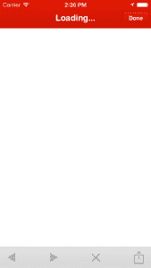
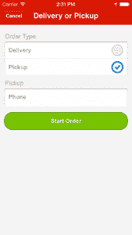
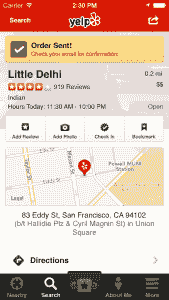

# 哇哦。嵌入式 Web 视图在您的 iOS 应用程序中看起来很热门！

> 原文：<https://engineeringblog.yelp.com/2013/11/whoa-that-embedded-web-view-looks-hot-in-your-ios-app.html?utm_source=wanqu.co&utm_campaign=Wanqu+Daily&utm_medium=website>

这篇文章来自我们移动团队的工程师 Allen C。移动团队有几十项创新，今天 Allen 解释了 iOS 团队如何使用 HTML 视图快速推出源于网络的功能。

* * *

2013 年第三季度，Yelp 移动应用平均每月在超过 1100 万台不同的移动设备上使用。我们不断挑战极限，尽可能让应用程序的用户体验更好。我们的应用程序中的一个常见需求是显示各种不同功能的嵌入式 web 内容。其中一个功能是我们新的 Yelp 平台，它允许用户直接从我们的网站和移动应用程序向参与企业订购食品。在这篇博文中，我们将带你在 iOS 上为你的原生应用构建一个无缝的嵌入式网络内容体验。

为什么需要嵌入网页内容？嗯，有时为了利用你已经建立的移动网站的优势，这是有意义的。其他时候，你想要的内容可能只存在于网络上。这里有一些我们在 Yelp 上使用的技术，用来显示华丽的网页内容，同时保留我们的用户期望从应用程序中获得的良好体验。

在 iOS 应用程序中显示网页内容的典型方法是创建一个`UIWebView`并向其传递一个要加载的 URL。如果您只这样做，您可能会得到类似这样的结果:

[T2】](/wp-content/uploads/2013/11/6a00d83452b44469e2019b00cab78a970c.png)

这是可行的，但是对于用户来说可能是一种不和谐的体验，这取决于你显示的是什么类型的网页内容。感觉好像他们离开了你的应用程序，进入了缩小版的 Safari。一个突出的例子，在上面的屏幕截图中突出显示，是缺乏一个专门的加载图形——当你的用户等待第一页加载时，会看到一个空白的屏幕。这种体验有几个方面不是最佳的:

*   web 视图的外观和感觉可能与应用程序的其他部分完全不同。
*   web 视图中的导航和页面转换很可能与应用程序的其他部分不同。
*   用户与 web 内容的交互无法直接影响应用程序中的本地视图。

由于问题 1 在很大程度上依赖于特定的应用程序外观和感觉，这篇文章将专注于克服问题 2 和 3。为了驯服`UIWebView`，我们需要给它一个实现`UIWebViewDelegate`的控制器。`UIWebViewDelegate`是一个协议，它定义了一组方法，这些方法赋予视图控制器对其 web 视图显著扩展的控制。我们将只关注其中一种方法:

<noscript><pre>- (BOOL)webView:(UIWebView *)webView shouldStartLoadWithRequest:(NSURLRequest *)request navigationType:(UIWebViewNavigationType)navigationType;</pre></noscript>

`UIWebView`从其委托中调用方法(委托是苹果 UIKit 框架实现模型视图控制器模式的方式；视图的委托通常是它的控制器)每当它将要加载 URL 请求时，无论是作为用户操作的结果，还是从应用程序以编程方式加载。它传递 3 个参数:自身、将要加载的 URL 请求和导航类型。返回值是事情变得有趣的地方:它是一个标志，告诉`UIWebView`是否实际加载 URL 请求。如果您返回 NO，web 视图将不会加载请求，也不会做任何事情。然而，这并不意味着我们的应用程序什么都不做——我们将在这个方法中添加我们自己的代码，它将指定应用程序对这个 URL 请求的响应。

### 自然外观的过渡

我们可以做的第一件事是在加载网页时创建自然的动画。通常，当用户单击 web 视图中的链接时，web 视图会显示一个加载屏幕，然后在完成加载后显示新页面，就像在移动浏览器上一样，如果我们在 delegate 方法中返回 YES，就会发生这种情况。不这样做，我们将如上所述返回 NO，然后我们可以获取 web 视图想要加载的 URL 请求，并在另一个 web 视图中打开它！新的 web 视图可以以最符合我们应用外观的方式在屏幕上显示动画。完成这项工作的伪代码大致如下:

<noscript><pre>- (BOOL)webView:(UIWebView *)webView shouldStartLoadWithRequest:(NSURLRequest *)request navigationType:(UIWebViewNavigationType)navigationType { // Load the first request in place, because there is no web view currently showing if (self.makingFirstRequest) { self.makingFirstRequest = NO; return YES; } // The web view that is currently showing originated the request if (webView == self.visibleWebView) { [self.hiddenWebView loadRequest:request]; [UIView animateWithDuration:duration animations:^{ // Some desired animation here } completion:^(BOOL finished) { UIWebView *oldVisibleWebView = self.visibleWebView; self.visibleWebView = self.hiddenWebView; self.hiddenWebView = oldVisibleWebView; } return NO; } return YES; }</pre></noscript>

瞧啊。我们只是粗略地实现了网页转换之间的自然动画。这还不完整，但基本思想已经在这里了。我们在实现它的时候学到的一件事是，并不是每个新的 URL 请求都应该被加载到一个新的 web 视图中，并在。例如，一个站点可能加载一个依赖于原始页面的 iframe。在这种情况下，仅仅在新的 web 视图中打开 iframe URL 是不正确的。

### Web 视图事件

我们可以扩展相同的概念，以实现 web 内容和本机应用程序之间的动态交互。在这种情况下，我们只需定义一个新的 URL 方案:例如，“mobile-event”。当 web 内容需要与原生应用程序交互时，它可以简单地告诉浏览器使用该方案打开一个 URL。在 Yelp，我们通过让移动网站加载带有这个自定义 URL 的 iframe 并立即关闭它来做到这一点。应用程序将检测到这个 URL 正在被打开，并且必须适当地响应 delegate 方法中的“web 视图事件”。下面是一些伪代码:

<noscript><pre>- (BOOL)webView:(UIWebView *)webView shouldStartLoadWithRequest:(NSURLRequest *)request navigationType:(UIWebViewNavigationType)navigationType { // Detect a web view event if ([request.URL.scheme isEqualToString:@"mobile-event"]) { // Execute code here for the event // Make sure to return NO or the web view will try to load a fake URL return NO; } // Execute normal URL request handling logic }</pre></noscript>

应用程序在响应 web 视图事件时所做的是依赖于上下文的，但是一个例子是加载一个新的非 web 视图，或者弹出到导航堆栈上的现有视图。这使得我们的 web 内容流能够与原生应用无缝集成。

### 将所有这些放在一起- Yelp 平台

让我们来看一个 Yelp 新平台功能的例子，它允许用户直接从 Yelp iOS 应用程序中从参与的企业订购食物(这也可以在 web 和 Android 上使用，但现在让我们专注于 iOS)。Yelp 平台的流程目前是通过移动网站实现的，并显示在 iOS 应用程序的 web 视图上。从 Yelp 业务页面，用户可以点击订单提取或交付按钮，这将加载一个 web 视图，启动订单上的平台流。

[T3】](/wp-content/uploads/2013/11/6a00d83452b44469e2019b00cad74a970b.png)

从那里，web 视图控制器使用本机外观转换将菜单动画显示在屏幕上。

[T2】](/wp-content/uploads/2013/11/6a00d83452b44469e2019b00cb1e93970d.png)

一旦用户到达结账页面并完成购买，我们的移动网站就会发送一个 web view 事件，通知 iOS 应用程序购买已完成。然后，iOS 应用程序返回到业务视图，现在有一个很好的小警告，说明订单已经下了，电子邮件确认已经发送。

 

### 下一步是什么

我们目前正在开发几个新功能，用于将网络内容集成到 Yelp 移动应用程序中，并使我们的用户体验更好。希望这篇文章也能给你一些想法，让你知道你自己的 iOS 应用程序如何集成动态的本地网页内容。

[回到博客](/)