# 明天的 GSV

> 原文：<http://gsvtomorrow.com/market-commentary/different-strokes/?utm_source=wanqu.co&utm_campaign=Wanqu+Daily&utm_medium=website>

金·吉列是一名失意的旅行推销员，在皇冠软木塞公司工作，销售瓶盖，这时他有了一个想法。如果不用昂贵、危险、高维护的“直刃”剃须刀刮胡子，而是有一个便宜的金属剃须刀，用几次后就可以扔掉，会怎么样？

吉列在从芝加哥到密尔沃基的火车上参加一个会议时刮胡子差点害死自己，而且不断为新剃须刀的价格和不断磨快剃须刀的需要而沮丧，他认为必须有一种更好的方法来保持胡子干净。

吉列对自己的灵感迸发非常兴奋，于是他去了麻省理工学院(MIT ),看看他们能否帮助设计他的发明。麻省理工学院的工程师告诉吉列，他想要制造的东西是“不可能的”。

但是吉列对自己理念的力量深信不疑，没有让愤世嫉俗者阻止他。具有讽刺意味的是，吉列在麻省理工学院找到了他的合作伙伴受过教育的威廉·埃默里·尼克森。五年后，他们一起生产出了他想象中的廉价锋利的剃刀。

吉列在 1901 年申请了专利，并成立了**吉列安全剃刀公司**来推出他的新产品。一把剃须刀加一片刀片的价格为 5 美元，20 片刀片——每片都用印有国王肖像的装饰性包装纸包装——价格为 1 美元。生产开始于 1903 年，该公司总共销售了 51 个剃须刀和 168 个刀片，收入不到 1000 美元。

到 1904 年，吉列发明了一次性双刃剃须刀，以及以低于制造成本的价格销售剃须刀并通过刀片的重复销售赚取全部利润的商业模式。于是“剃刀刀片”模式诞生了，无数企业从这种商业模式创新中受益。2005 年，吉列安全剃须刀公司以 570 亿美元的价格被卖给了宝洁公司(T4)和 T2 公司()，当时公司盈利 25 亿美元。

从**惠普**销售廉价打印机以产生持续的高利润打印机墨水销售，到**微软**以低利润销售 X Box 游戏机以实现高利润软件游戏销售，所有人都在一系列行业创造了惊人的商机。

回到原点，**美元剃须俱乐部**于 2011 年推出，一段歇斯底里的 **YouTube** 视频在网上疯传，浏览量超过 1800 万。创始人迈克尔·杜宾对吉列的前任们如此压榨他感到恼火，所以他想出了一个新点子——每月以 1 美元的价格送一套新刀片，同时给你机会购买其他男士美容产品。换句话说，Dollar Shave Club 用亏本的剃须刀片吸引你作为客户，并通过向你出售一系列高利润产品，如须后水、乳液、发胶和剃须膏来获利。

经过两年的经营，Dollar Shaving Club 每月的客户数超过 100 万，并筹集了 5000 万美元的风险投资。

瑞安航空将同样变革性的愿景应用于航空业，拆分飞行体验的关键组成部分，并提供透明的成本。最终游戏是瑞安航空乘客的极端价值，以及一家在行业中非常成功的航空公司，总体而言，自奥维尔和维尔伯·莱特首次飞行以来，该行业尚未盈利。

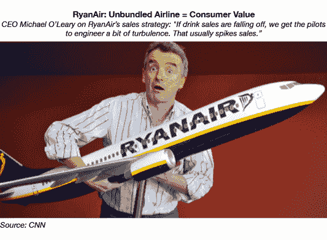

“免费增值”模式已经成为商业领域一股新的颠覆性力量，尤其是当它们创造网络效应的时候。Dropbox 似乎通过魔法赚钱，因为它的 4 亿用户中只有一小部分为这项服务付费……但它的价值是 100 亿美元。**脸书**是世界交流和合作的中心，但该平台对超过 14 亿用户免费开放。这个社交网络的价值超过 2700 亿美元。(披露:GSV 拥有 Dropbox 和脸书的股份。)

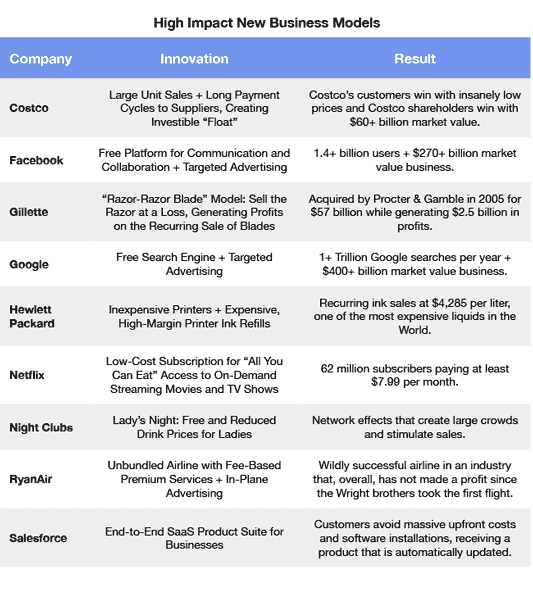

**新车型+教育**

近年来，在快速变化的技术基础(包括无处不在的计算和移动连接)的推动下，强大的新商业模式开始在教育行业出现。这为企业家和投资者创造了前所未有的机会。

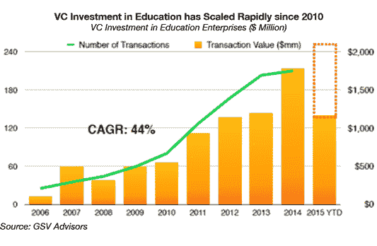

今天，教育是一个巨大的市场，仅在美国就代表了 1.6 万亿美元，约占 GDP 的 8%。但它仍然是一个高度分散的行业。教育公司在美国资本市场的份额不到 1%。

这种动态正在改变。自 2006 年以来，CAGR 在教育领域的风险投资增长了近 50%。2014 年投资超过 18 亿美元，预计到 2015 年底这一数字将超过 20 亿美元。重要的是，教育交易接近所有风险投资的 5%，开始接近教育占 GDP 的比例。这是一扇通向未来的窗户，我们预计在未来五到七年内，公开市场将开始看到一波又一波的公司登陆。

虽然 GSV 资本是投资这个市场的领导者，但我们并不孤单。安德森·霍洛维茨、凯鹏华盈、Benchmark、IVP、红杉、贝塞麦、高地、NEA 和红点等顶级风投公司都很活跃。

我们看到投资活动增加的一个关键原因是教育从一个以渐进式变革为特征的行业向一个利用颠覆性技术产生快速增长、规模化企业的行业的巨大演变。商业模式创新一直是驱动力。

**免费+免费增值**

《大英百科全书》于 1768 年由书商科林·麦克法夸尔和雕刻师安德鲁·贝尔构思而成。最初，这两位苏格兰人的目标是对一本流行的法国百科全书进行保守的反驳，这本百科全书在欧洲被许多人视为异端。《大英百科全书》第一版花了三年时间才出版，13 年后又出了第二版。

《大英百科全书》在 1990 年达到了巅峰，当时该百科全书自诩的挨家挨户销售队伍以每本 1200 美元的价格售出了 10 万多本。想象一下，如果你预测不到 20 年后，一家名为**谷歌**的公司将设法索引世界上所有的信息，并成为一个价值 4270 亿美元的动词——所有这些都不需要向客户收取一分钱。

但是成本的动态发生了根本的变化。在 2015 年，谷歌对任何东西收费——哪怕是每次搜索收费 1 美分——的想法对消费者来说都是不合理的，很可能会毁掉这个行业。如果脸书选择向用户收取每月 1 美元的费用来使用他们的平台，这部社交网络电影可能在你吃完爆米花之前就已经结束了。脸书不会在哈佛的校园里起飞，更不用说在全球 14 亿人中起飞了。

虽然谷歌和脸书创建了庞大的网络，使他们能够从数据宝库中赚钱，而不是向用户收费，但这种模式的衍生品正在出现，正在催生新一代的亿万美元婴儿:免费增值。

免费增值公司免费向用户提供基本产品或服务，而不是对高级功能的升级收费。2007 年，当世界上大多数人认为云是天空中的冷凝水时， **Dropbox** 创始人德鲁·休斯顿创造了一项免费服务，使人们能够在任何时间从任何设备上存储和检索数字文件。(披露:GSV 拥有 Dropbox 的股份。)

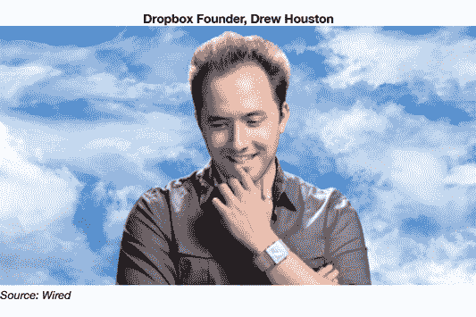

每个人都有需要存储的文件，Dropbox 的免费增值模式为新客户提供了充足的存储空间。但不可避免的是，人们需要更多。我们喜欢令人上瘾但不会致癌的生意。

今天，Dropbox 为超过 4 亿用户提供服务，每天上传超过 10 亿个文件。虽然花生画廊表示，Dropbox 的产品是一种功能，而不是一家公司，但 Dropbox 团队为用户管理他们的数字资产创造了无缝体验。出色的设计和可用性，加上免费增值模式，使 Dropbox 成为市值 100 亿美元的企业。

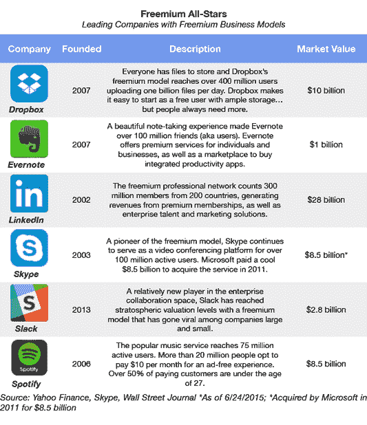

由于将“免费”的力量应用于教育，MOOCs 在早期吸引了很多关注。但是，各种引人注目的免费增值商业模式已经开始出现，迅速实现规模，同时绕过传统上决定教育变革缓慢速度的障碍和官僚机构。

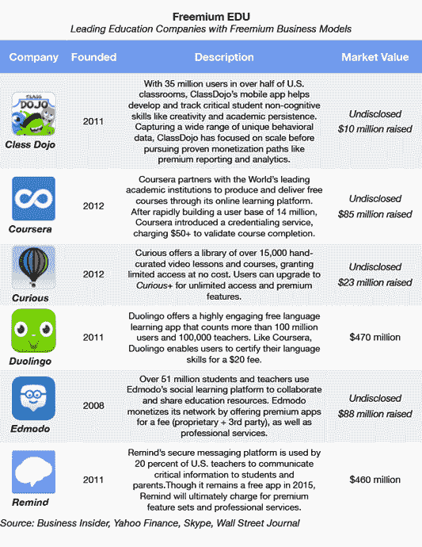

**Duolingo** 将免费增值模式应用于教育领域，取得了巨大的成效，创建了一个拥有超过 1 亿用户的有趣的语言学习应用程序。利用游戏让体验变得有趣，Duolingo 使用基于应用活动的实时大数据分析来强调用户正在努力的概念，并跳过他们已经掌握的领域。和 **Coursera** 一样，这款应用是免费使用的。但只需 20 美元，客户就可以证明他们的语言能力，并直接将数字证书导入 LinkedIn。(披露:GSV 拥有 Coursera 的股份。)

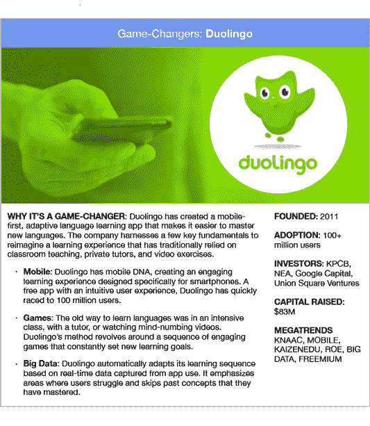

**订阅**

网飞有 6200 万用户，每月支付 7.99 美元就可以访问几乎所有他们可以消费的媒体。网飞可以花费 1 亿美元制作一季《纸牌屋》,因为该公司只需要 100 万新用户来支付制作成本。(披露:GSV 在网飞拥有股份。)

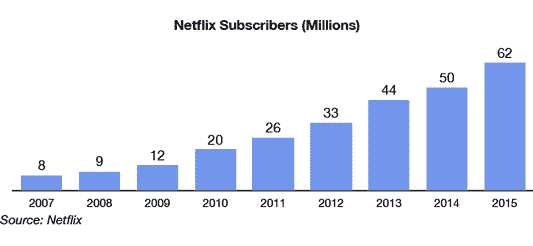

《纸牌屋》为现有会员创造了额外的价值，这是吸引互联网上近 30 亿非网飞会员的有效手段。如今，网飞的市值为 470 亿美元。

无论是网飞，还是大型好莱坞电影公司，专业内容制作人都能够投入巨资制作大片，因为这些内容被分发给大量观众，并且可以跨平台重复货币化。

今年，**Curious.com**推出了 CuriousTV，这是一项免费增值服务，提供一系列教育频道，数以千计的视频按类别分组，如商业、音乐、手工艺和美食。与网飞类似，用户每月只需支付 8.99 美元，就可以“随心所欲”地访问该平台的所有在线课程，还可以将内容传输到家庭电视。与网飞不同，用户还可以在直播活动中与老师互动。(披露:GSV 拥有好奇网的股份)

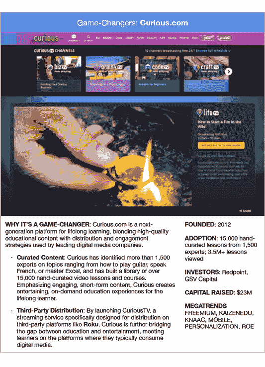

**点对点+集市**

现代经济学的基础是亚当·斯密的“看不见的手”。当人们根据自身利益做出经济决策时，最终会给其他人带来经济利益。

但是现代信息技术和无处不在的移动计算的兴起使得看不见的手变得更加协作。在任何一个晚上，大约有 80 万通常会入住酒店的旅行者转而使用 Airbnb 市场以更好的价格出租闲置的房屋、公寓和卧室，并获得更独特的体验。还有数百万人放弃出租车，转而乘坐优步、T2 和 T4 的 Lyft，从而节省了时间和金钱。(披露:GSV 拥有 Lyft 的股份。)

最大的变化是更多关于人和事物的数据的可用性，以及超连通性，这允许物理资产被分解并作为服务消费。技术降低了交易成本，创造了更高效的客户体验。

我们正在演变成一个“共享经济”。正如 Airbnb 的首席执行官 Brian Chesky 所观察到的，任何人都可以在 60 秒内成为企业家——通过数字 P2P 市场销售服务，将他们的房子、汽车甚至闲钱货币化。消费者支付的费用比他们从出租车公司、酒店或银行等传统提供商那里购买这些服务要少。利用这些新基本面的创新公司正在迅速扩张。

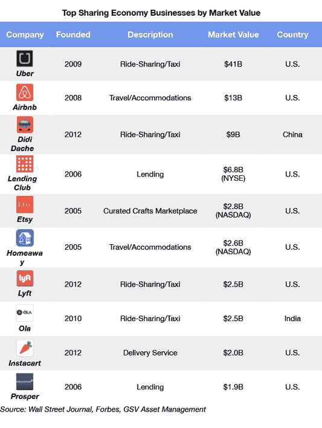

课程英雄于 2006 年由首席执行官 Andrew Grauer 在他的大学宿舍里创立，为教育资源和专家导师提供了一个点对点的市场。利用推动 Lyft、优步和 Airbnb 等企业发展的网络效应，课程英雄使学习者能够分享和货币化他们的知识。今天，Course Hero 的平台拥有数百万用户创建的、众包的笔记、学习指南、练习测试等，这些都与世界各地的高中和大学的特定课程相关联。(披露:GSV 拥有课程英雄的股份。)

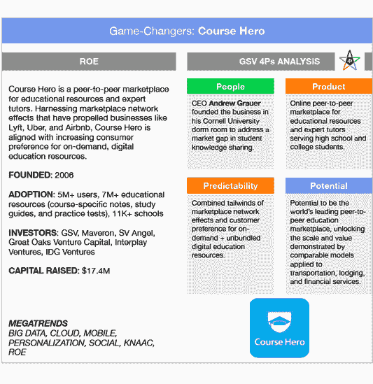

**社交图**

在 2007 年的一次演讲中，穿着牛仔裤和人字拖的马克·扎克伯格将他的公司的力量归功于“社交图”，即脸书平台上人们之间的联系和关系网络。他说，“这是脸书工作的原因。”

社交网络让脸书开发了一种新的信息、推荐、广告和产品分发模式。脸书不是猜测人们想要什么，而是根据从个人关系网络中收集的信息，为每个用户创造个性化的体验。随着脸书增加越来越多的人和越来越多的联系，这个平台的力量呈指数增长。

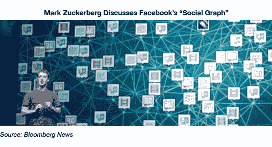

如果说脸书是社交图谱，其组织原则是以你的朋友和社交生活为中心， **LinkedIn** 是职业图谱，围绕你的工作、行业、头衔和职能进行组织。LinkedIn 利用网络效应优化人才招聘、企业对企业营销和职业发展。 **Spotify** 和 **Pinterest** 紧随其后，运用同样的原则分别成为领先的音乐和兴趣图。(披露:GSV 拥有 Spotify 的股份。)

今天，**齐格网**制作了第一张学生图。正如首席执行官丹·罗森斯维格(Dan Rosensweig)所观察到的，“如果我们知道你在哪里上的高中，你在哪里申请的大学，你什么时候被录取，你在学什么，那么我们就可以给你奖学金，帮你安排课程，推荐你所有需要的材料，并以比别人更便宜的价格提供。”(披露:GSV 拥有齐格网的股份。)

Chegg 最初被认为是一家教科书租赁公司，它将希望出售和租赁书籍的大学生联系在一起。该公司向提供个性化网络教育服务的互联学习平台的演变，与网飞从 DVD 租赁业务向数字内容平台的演变相类似。

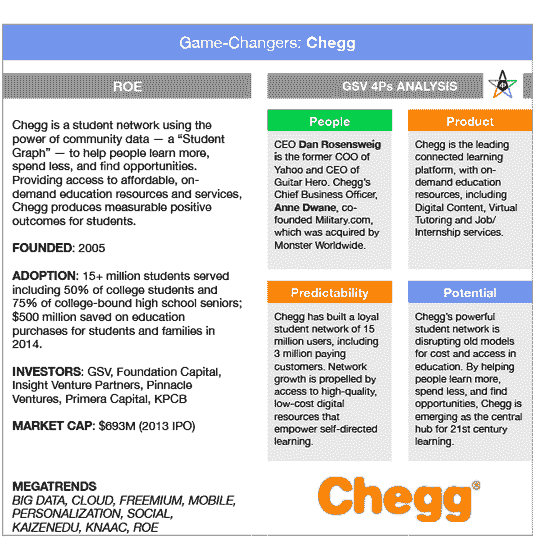

**SaaS**

 ****2U** 通过与领先的学院和大学合作，利用其基于云的技术平台创建和提供在线学位课程，将 SaaS 模式应用于高等教育。与创建和维护自己的在线学习基础设施不同，参与 2U 的学校可以高效地建立学位项目，通过单一平台管理整个生命周期(从招生营销到课程交付)。在任何给定时间，2U 都有 500 多名在职教师教授超过 1，000 门课程，包括每周 1，600 小时的现场教学。(披露:GSV 拥有 2U 的股份。)

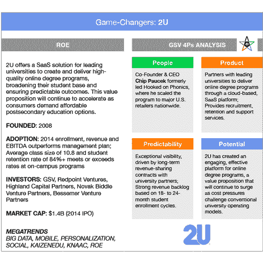

此外，2U 展示了大力投资教育内容制作质量，然后在大量受众中利用成本的力量。2U 提供极具吸引力的在线学习体验，通过其突破性的“无后排”协作学习平台将实时教学与丰富的媒体相结合，以生动的概念。

Minerva 应用了同样的原则，在云中创建了一个精英教育机构。Minerva 完全通过一个基于网络的学习平台进行授课，该平台将学生和教授联系在一起，提供同步的学习体验，其收费是常春藤联盟学校的一半，而没有牺牲质量。Minerva 没有提供杂乱无章的课程目录，而是通过开发批判性思维和沟通技能的课程来强调 21 世纪的技能。

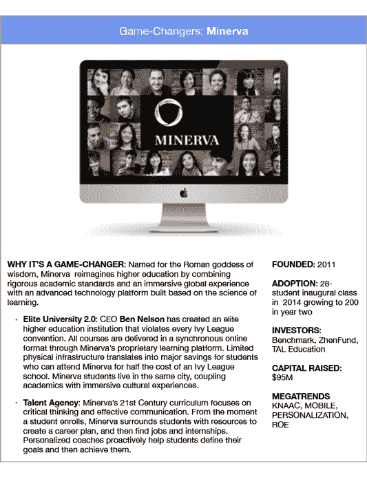

__

虽然收益总体上是正面的，但股票的价格走势却并非如此，纳斯达克下跌 2.3%，标准普尔 500 指数&下跌 2.2%，GSV 300 指数下跌 1.5%。10 年期国债收益率本周下跌 9 个基点，石油、黄金和美元均走弱。

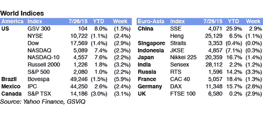

尽管蒂姆·库克的感觉与此相反，投资者对他们从**苹果**第三季度简报中了解到的情况并不热情。收益增长了惊人的 44.5%，但 iPhone 销量低于分析师预期，苹果在 Apple Watch 上明显的沉默也说明了这一点。(GSV 拥有苹果公司的股份)

似乎对赚钱过敏的亚马逊用一笔利润让投资者大吃一惊。亚马逊网络服务——又名“AWS”——仍然是一个庞然大物，本季度收入增长 81%，达到 18 亿美元。作为回应，亚马逊股价上涨了近 10%。

其他稳定的收益报告来自餐馆业**星巴克**和 **Chipotle** ，前者公布了 23%的增长，后者公布了 27%的每股收益增长。本季度，Visa 的收入增长了 37%。该公司宣布将在 10 月前收购其前子公司 Visa Europe。

我们对顶级成长型公司的前景保持乐观，因此持乐观态度。创新经济正在蓬勃发展，股票也应该做出相应的反应。**