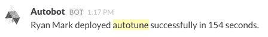
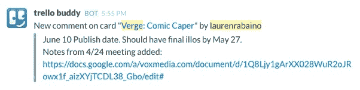
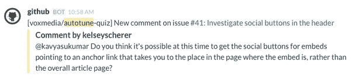

# 7 家新闻机构如何利用 Slack 更好、更有特色地工作|尼曼新闻实验室

> 原文：<http://www.niemanlab.org/2015/07/how-7-news-organizations-are-using-slack-to-work-better-and-differently/?utm_source=wanqu.co&utm_campaign=Wanqu+Daily&utm_medium=website>

[懈怠](https://slack.com/)是一种奇怪的野兽。它同时是一个虚拟会议室和饮水机，在某种程度上鼓励分散的工作团队成员进行社交，相互了解，同时完成工作。它几乎就像一个私人社交媒体网络，也取代了电子邮件和即时消息——脸书可能希望其 Messenger 做的事情，Slack 已经完成了，至少对某些员工来说是这样。

虽然开发/产品和编辑团队传统上是孤立的，但 Slack 最终打破了需要密切合作但在正式会议上可能感觉好像说不同语言的人之间的界限。

“它最终成为办公室文化的源泉，”

[Alexis Madrigal](https://twitter.com/alexismadrigal?lang=en)

Fusion 的主编，告诉我的。“那是为了企业什么

[Vine](https://vine.co/)

是更广泛的青年文化。在大多数媒体公司，技术人员和编辑人员是分开的。工作的性质不同，节奏也不同。因此，为每个人选择一个数码聚会场所是很好的，这不仅仅是关于工作。Slack 从来都不仅仅是关于工作的——我见过或听说过的所有 Slack 的地方都充满了工作之外的笑话和文化，我认为这就是这个平台的天才之处。产品人也爱碧昂斯！"

人们对一个企业通信应用程序如此热情是不寻常的。也许这就是为什么 Slack 尽管才成立两年，却已经获得了 3.4 亿美元的资本，现在价值 28 亿美元。它拥有 750，000 名每日活跃用户([比我们一年前写这款应用时的 65，000 名有所增加](http://www.niemanlab.org/2014/06/chatting-with-bots-how-slack-is-changing-how-newsrooms-talk-amongst-themselves/)，其中大约 200，000 人使用付费版本。

Slack 是如此开放，以至于过去通过更传统渠道沟通的新闻编辑室在将工作流程转移到它的时候可能不知道从哪里开始。我们请了几家新闻机构——[Quartz](http://qz.com/)、 [Vox Media](http://www.voxmedia.com/) 、 [Slate](http://www.slate.com/) 、 [Fusion](http://fusion.net/) 、[伦敦时报](http://www.thetimes.co.uk/)、[思想目录](http://thoughtcatalog.com/)和[美联社](http://www.ap.org/)——解释他们是如何对待 Slack 的，提供其他人如何更好地使用它的技巧，并分享他们希望它增加的功能(你好，外出通知)。

### 石英

产品副总裁兼执行编辑扎克·苏厄德(前尼曼实验室员工):

我们在 2014 年 2 月开始使用 Slack。我们一直使用聊天系统，但我很高兴我们[当时转向 Slack,因为组织越大，改变这样一个大系统就越困难，从那以后我们成长了很多。我无法想象今天让所有人都上船会是什么样子。

在编辑方面，我们使用一些渠道来组织新闻编辑室的典型工作流程，从任务到编辑再到出版通知。大多数频道是用于实际聊天的，但也有一些有更严格的系统:你进入任务频道，然后说，“这是我正在做的，有多少字，什么时候可能会进来，”这样新闻编辑室的其他人就可以看到有人在报道这个故事。

我们有一个用于编辑的生产频道，所以当一个故事准备好进行编辑时，它就会被放在那个频道中，然后由编辑来接收。

新闻报道发布后，会自动发布到制作频道。我们会注意这个故事是否被放在我们网站上最靠前的故事队列中，以及它是否被发布或发送到其他地方，以保持一切有序。

上周，我们开始使用表情符号反应来做这些事情。[“收藏”或“喜欢”一条消息的能力是一个长期要求的功能；本月早些时候，Slack 增加了一种方法，使用表情符号。]为了让事情不那么混乱，当编辑声称一个故事时，他们使用一种特定的表情符号反应——拳头，以显示他们正在“抓住”编辑。我们使用表情符号来表示某个东西已经出版，并且我们已经处理了它的发行。

很快就发现这真的很有用。在聊天环境中做大量工作流事情的明显缺点是，它会很快变得混乱。表情符号反应有助于为工作流程添加一些结构。

所有代码在网站上的部署都是使用 Slack 完成的，在 Slack 中使用我们称之为 Qzbot 的东西，而不是在 GitHub 上完成。

我们在编辑方面有许多频道，包括更具体的频道，如#编辑-非洲、#编辑-技术和#编辑-视频。随着时间的推移，我们整理频道，因为每个大量使用 Slack 的人最终都会导致频道无序扩张，我们希望确保人们不会错过重要的内容。

但是混乱是一个优势。随着时间的推移，它可以帮助人们找到他们想要的组织方式。在过去的六个月里，我已经成功地使用 Slack 运行了一些项目。它将您在会议中可能会做的许多事情压缩到一个松散的频道中，这样信息就可以被应该看到的每个人看到，并且节省了人们的时间:他们不一定要见面，但可以随时了解项目的最新状态。

### Vox 媒体

Vox 媒体产品总监 Lauren Rabaino ，社论:

Slack 是将我们分布在世界各地的团队联系在一起的纽带之一。我们用它来提高工作效率和透明度，同时培养团队精神和与远程同事的友谊。我们的一些团队致力于每日新闻截稿，一些致力于两周的产品冲刺，一些致力于常规销售周期，一些致力于这些工作方式的结合。我们混合使用定制集成、本地 Slack 集成和第三方服务，例如

[Ifttt](https://ifttt.com/)

和

[Zapier](https://zapier.com/)

充分利用它。

在编辑方面，我们的[合唱](http://www.adweek.com/news/press/vox-media-lets-advertisers-tap-native-content-platform-164449)机器人告诉我们一个新故事何时被发布到一个网站，以及是谁发布的。

[T2】](http://www.niemanlab.oimg/vox-slack-1.jpeg)

在产品方面，我们有一个机器人来告诉我们代码何时被部署到相关的存储库中，以及是谁部署的。

[T2】](http://www.niemanlab.oimg/vox-slack-2.jpeg)

类似地，我们有一个机器人告诉每个人我们的发布平台 Chorus T1 的新部署已经安排好了。

[T2】](http://www.niemanlab.oimg/vox-slack-3.jpeg)

对于像编辑产品团队这样的团队来说，Slack 是我们流程中不可或缺的一部分，在 T2 扎皮尔的帮助下。每个新项目的请求都通过谷歌表单提交。该表单在我们的传入队列中制作了一张新的 [Trello](https://trello.com/) 卡，它会 pings 我们的空闲空间。当新的评论、成员或附件被添加到 Trello 时，或者当截止日期被更新时，我们也会 ping 我们的备用空间。

[T2】](http://www.niemanlab.oimg/vox-slack-4.jpeg)

许多团队集成了 [GitHub](https://github.com/) 或 [FogBugz](http://www.fogcreek.com/fogbugz/) ，因此围绕特定 bugs 特性的对话可以以与特定问题相关的结构化方式进行，但仍然对每个人可见。

[T2】](http://www.niemanlab.oimg/vox-slack-5.jpeg)

我们使用名为“cfbot”([从我们在 Campfire](http://product.voxmedia.com/2013/8/22/5426860/introducing-campfirebot-how-our-robotic-assistant-fosters) 的日子里迁移过来的)的机器人存储了许多重要的文档，因此每个人都可以轻松地访问他们需要的东西。

[T2】](http://www.niemanlab.oimg/vox-slack-6.jpeg)

在所有 Vox Media 中，我们也将 cfbot 用于有趣和有用的非工作内容。我们可以使用它将照片中的面孔替换为产品团队成员的面孔，或者抓取有趣的 gif，或者获取我们存储的诗歌，或者祝贺新团队成员加入我们的公司，或者查看地铁状态或天气，以及许多其他操作。

### 融合

[亚历克西斯·马德里加尔](https://twitter.com/alexismadrigal)，主编:

我们在整个数字化团队中使用它，所以我们有团队中所有不同部门的渠道。我们是一个大组织，在迈阿密、纽约、奥克兰和洛杉矶都有办事处。需要跟踪很多人，所以 Slack 就像是我们在云中的国家办事处。

我们感兴趣的事情之一是我们所谓的“懈怠分析”我们如何能在我们的作者面前，就在他们工作流程的中间，把在更广阔的网络上发生的事情的数据放上去？而不是人们去检查

[Chartbeat](https://chartbeat.com/)

，也许我们可以在他们做他们正在做的事情时插入一个通知；也许这能减轻一些奇怪的音乐瘾。我们正在尝试看看是否有其他东西可以从更广泛的网络中引入 Slack，以帮助人们知道他们应该写些什么。

现在关于 Slack 最困难的事情是，在为部门团队和他们的编辑使用私人房间来完成工作和使用公共房间之间有一个真正的权衡。我们试图让人们默认在公共场合工作，这样团队可以顺便看看每个人都在做什么，但私下交谈是可以的。这是我们面临的最大问题。

Slack 最酷的地方在于它同时是同步和异步的。你可以得到关于某件事的即时反馈，但如果有人稍后进入房间，他们可能会补充一些东西，而如果你没有参加[物理]会议，你将无法在稍后做出贡献。

如果有人要去度假或他们的周年纪念日，或者如果他们要在一个长周末离开，我们会告诉他们从手机中删除 Slack，因为否则检查它的诱惑太大了。删除应用程序确实有助于人们断开连接，因为这是一种令人上瘾的社交体验。

如果我能给其他媒体公司一个建议，那就是他们应该对人们删除应用程序保持冷静。

### 石板

[朱莉娅·特纳](https://twitter.com/juliaturner)，主编:

Slack 是一个生动、充满活力的虚拟社区，不会被沉闷地塞在你的 Outlook 收件箱里。我们有纽约办公室和华盛顿办公室的渠道。我们有#Slate-Cute，人们可以在这里张贴他们的狗和婴儿的照片。我们也有更多的战术渠道。

我最喜欢的频道之一是一个名为#头条新闻和框架的团体。任何编辑或作家都可以进入频道，提供他们正在研究的标题创意，并询问谁有反馈。总有一些人会花点时间出去逛逛，研究一下产品系列。

我们还有一个渠道是#行踪。人们早上插话说，好的，我会在我的办公桌前，或者今天我在家工作，或者任何人有办公室我可以在 11 点进行采访吗？你可以直接忽略频道，直到你突然想找一个人。

我们还有一个叫做#突发新闻的频道。当有人在里面发帖时，它会向负责管理我们突发新闻报道的工作人员发送 pings。

我们有一个编辑频道，杂志的编辑们可以在那里互相联系。但我们倾向于将 Slack 更多地用于协调，而不是官方决策。因为 Slate 是一个很大的新闻编辑室，主要由相当自主和直接与编辑合作的作者组成，大多数决策都以非常分散的方式进行，Slack 成为一个标记某些东西的好地方。

如果 Slack 能够实现适当的离开消息或休假通知，那就太好了。如果你在度假，Slack 是你回到办公桌后必须要检查的东西，还是应该只是实时提醒和问题？这在 Slate 仍是一个悬而未决的问题。

这些新闻编辑室聊天工具的整体概念是，它们将把你从电子邮件的负担中解放出来，这是一件你不得不一直查看的可怕事情；有了聊天，你应该能够实时做所有的事情。但是，取决于你如何使用 Slack，有时你只需要检查两套东西。

### 伦敦的泰晤士报

[马特·泰勒](https://twitter.com/mattietk)，制作编辑，数字战略与开发:

我在《纽约时报》的数字发展和战略团队工作，我们是该组织中 Slack 的主要用户。我们在该服务还处于私人测试阶段时就开始了，当它推出时，我们立即成为了付费客户。我开始使用这项服务，是因为我对通常强加给你的其他聊天解决方案(比如 Google chat)感到失望，我想更多地了解整个团队正在发生的事情，而不是每天早上都要开会。

自从我们最初开始使用这项服务以来，我们已经相当有组织地增加了对它的使用，并且只进行了一些“松散的感觉检查”,在这些检查中，我们决定了我们应该如何做某事的政策或规则是什么。正如你所料，我们使用标准的普通/随机渠道，但也有 34 个其他渠道，成员各不相同。有些团队的人数与一般团队基本相同，例如#Development，它包含开发团队及其经理，但较小的团队有自己的存在，例如#Data-Team，这是我们的数据新闻部门。

我们已经为我们已经建立的插件建立了渠道来跟踪来自 GitHub 的问题，GitHub 只有很少的用户。我们有一个#会议频道，许多用户在那里跟踪在上午和下午的新闻发布会上代表我们的那个人。

在许多方面，Slack 已经完全消除了团队内部对内部邮件的需求，尽管在团队之外，我们很少有人使用它——通常是与我们团队合作很多的人。(它不仅仅是改变了)我们彼此之间的通信，现在发生在 Slack 上，还有像 GitHub 通知这样的事情，现在发生在 Slack 上，或者建立确认，或者系统报告问题。

Slack 有助于提醒每个人，而不是混乱的邮件列表，并允许人们有效地赶上，而不必转发一个长名单，然后仍然包括在对话中。这是一种更有效的赶上和跟上的方式。我们现在的交流更加公开化，人们试图尽可能地在公共渠道谈论，让每个人都了解情况，尽管报纸的性质不允许这样做。

我们计划最终将 Slack 介绍给更多的编辑人员。我们正在考虑首先与图片/图形工作台合作，因为他们经常通过电子邮件相互发送文件，我们认为 Slack 的存档和多用户意识的优势在这种工作流中更容易看到。

至于我们希望 Slack 具备的功能:不在办公室将是一个关键。更好的统计。更好地与文档集成。在我看来，Slack 应该购买 Quip 并以一次性付款的方式提供。创建用于讨论新产品的私人群组的能力)，然后将其作为公共渠道推出。邀请实习生进入频道而不给他们完整档案的能力。

我认为，最重要的是团队之间的融合。新闻英国与我们的技术部门有另一个懈怠，新闻集团有道琼斯和新闻集团澳大利亚。我们都有自己的实例，除了通过像走扁带这样的第三方技术，我们没有办法在它们之间聊天。

### 美联社

[Troy thibodeux](https://twitter.com/tthibo)，数据新闻团队编辑:

我在美联社领导一个分散的数据记者团队。我们开始使用 Slack 的主要原因之一是为了创建一个公共空间，这是一个向团队提出问题或评论的简单方法，虽然我们经常在那里讨论想法并提供意见，但我发现我们不可避免地会跳上一个

[Google Hangout](http://www.google.com/+/learnmore/hangouts/)

做出最后决定。我认为视频聊天给了我们一种更好的感觉，那就是我们已经达成了共识——或者至少每个人都被倾听了。

因为松散的沟通可能是不同步的，所以决策很容易在每个人都没有意识到的情况下溜走。这可能会导致一种决策混乱:要么这个话题不得不在以后重新讨论，要么重要的考虑被忽略。

我们避免懈怠的另一个时候是当我们讨论任何对资源敏感的事情的时候。我们的调查编辑会正确地避免使用它进行任何与一些敏感话题的故事相关的谈话。对于这项工作，我们有更安全的沟通渠道。

Slack 有助于避免令人抓狂的电子邮件链，它为我们提供了一些在其他沟通渠道中不存在的偶然对话的可能性。我希望它能成为一种虚拟的饮水机或休息室。到目前为止，它一直相当专注，这也很好。但是，随着我们越来越习惯于随意提出想法，我希望那里的对话能够涵盖更广泛的范围。

我们也开始让我们的同事加入到聊天中来——包括来自技术团队的人和来自交互团队的设计师和前端开发人员。后者在我们还在使用 IRC 的时候根本不可能发生。

### 思想目录

克里斯·拉弗涅，出版商:

我们鼓励员工禁用延迟通知，尤其是对组而言。至少在我们的工作环境中，我们不需要整天被束缚在懈怠中。如果超级重要，会有人给你打电话的。隐藏通知也给松散的工作流增加了一种很好的异步感觉，这有助于我们放慢速度，做出更慎重的决定。它让它更像电子邮件。当人们想查看它的时候，可以点击进入，而不是一直存在。

我们有一个直接连接到 [WordPress VIP](https://vip.wordpress.com/) 的休息室，所以每次我们在思想目录或[商店目录](http://shopcatalog.com/)上做出改变，工作人员都会得到通知。这对我们来说是一个真正的福音，因为作家和制片人与发展路线图合拍，并开始考虑技术如何简化他们的工作流程，或使网站更好地为读者服务。它让我们的一些作者像程序员或产品人员一样思考。像《T4》和《T5》这样的特写直接来自我们的编辑团队，因此有数百个微小的变化。

照片摄于 2014 年 Slack 高管务虚会

[kris krüg](https://www.flickr.com/photos/kk/14372036093/)

在知识共享许可下使用。