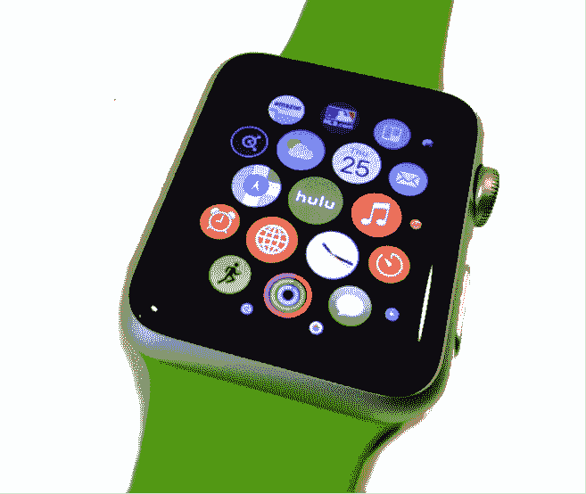
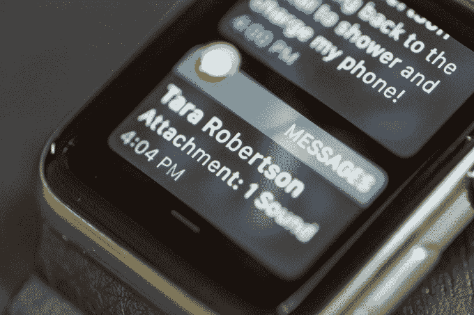
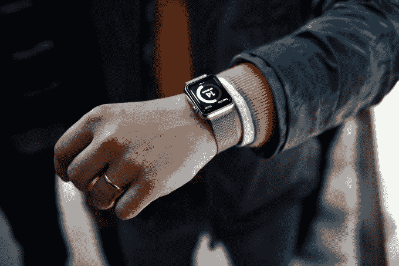

# 也许不需要一个苹果手表应用来做所有的事情 TechCrunch

> 原文：<http://techcrunch.com/2015/07/31/maybe-there-doesnt-need-to-be-an-apple-watch-app-for-everything/?utm_source=wanqu.co&utm_campaign=Wanqu+Daily&utm_medium=website>

苹果应该担心脸书、谷歌和 Snapchat 等一些受欢迎的应用程序制造商尚未推出自己的应用程序来支持其 Apple Watch 平台吗？这是最近《纽约时报》的一篇文章提出的问题，这篇文章详细描述了有多少开发者在苹果新的可穿戴设备上采取“观望”的态度。

但也许正确的问题不是，*应用程序*在哪里，而是，*我们真的需要它们吗*？

就我个人而言，我无法想象想要从我的 Apple Watch 上浏览脸书或与他互动——尤其是因为我的 iPhone，我身边有一个大尺寸的屏幕，这提供了更好的体验。我对在苹果手表上获得脸书提醒也不感兴趣。知道有人在帖子中给我加了标签，或者加我为好友，或者分享了一张照片，这并不紧急。

我不需要脸书应用程序。其实我根本不需要很多 Apple Watch 的应用。

在过去的一周里，我只浏览了一次 Apple Watch 的“应用程序”屏幕，那是为了查找几个小时前的一条短信。除此之外，我倾向于与 Apple Watch 上的应用程序进行交互的唯一方式是通过通知，有时还会通过扫视(那些像小部件一样的显示屏，你可以向上滑动来查看)。

但是在几乎每天都戴着这个东西几个月后，甚至连眼神都不会得到经常性的关注。在最好的情况下，我可能会在跑步后查看活动信息，查看天气，或者使用苹果地图。我不太倾向于通过浏览来阅读头条或 Twitter 趋势。如果脸书有一个应用程序或一瞥，我可能也不会使用它。

苹果手表很可能不会成为传统意义上的重要“应用”平台。这并不是说没有可用的应用程序——根据 App Annie 的数据，现在 iTunes 应用商店中有 7567 个 Apple Watch 应用程序。

但 Apple Watch 的出现正值用户已经不堪智能手机上的移动应用程序的重负。虽然消费者在手机上花费 85%的时间使用应用程序，但只有五个第三方应用程序经常使用，最近的一项研究发现。人们已经选择了他们最喜欢的，在他们的生活中没有太多的空间。

与此同时，移动应用生态系统本身也在继续增长。顶级应用商店现在有[接近](http://www.statista.com/statistics/276623/number-of-apps-available-in-leading-app-stores/)150 万个应用，这使得新来者更难找到受众，更不用说长期保持他们的注意力了。

随着新应用程序仍然以惊人的速度出现，这导致了一个市场，最近推出的许多应用程序实际上更像是昙花一现的奇迹，随着最初的吸引力逐渐消失，它们会繁荣，然后失败，然后破灭。(例如，Frontback 最近倒闭，这是一款曾经很有前途的自拍应用，获得了近 400 万美元的风险投资。或者说，现在真的有人在玩 Flappy Bird 了吗？我们现在不是已经完成了 Foursquare 吗？)

换句话说，对手机和平板电脑之外的第三个移动应用生态系统的需求并不高。如今用户需要的不是观看*应用*，而是可操作的*信息*。

今天最好的 Apple Watch 应用程序通过通知的方式实现了这一承诺。他们根据上下文感知你的周围环境或你的活动，然后向你提供相关信息。或者他们让你知道最紧急的事情——一个来电，一条短信。你的优步到了。就要下雨了。你的航班被延迟了。你的老板刚刚解雇了你。它们就像苹果自己的、注入了应用程序的 Google Now 版本。

最好的应用程序也不是向后倾斜的体验，你可以在一个小界面上点击，浏览内容。当你无聊地浪费时间时，它们不是你去的地方。

你最终在 Apple Watch 上真正使用的“应用程序”并不是它们在大屏幕上的丰富对应，而是你今天在 iPhone 上收到的垃圾通知的子集。由于如此多的应用程序制造商现在不得不依靠推送通知来重新吸引用户(修改手机设置以禁用每个应用程序变得很麻烦)，许多 iPhone 用户对 iPhone 的来电提醒产生了某种“通知盲”。

当然，你的电话可能响了，但这真的意味着什么吗？然而，当只对你关心的应用程序进行正确设置时，Apple Watch 上的嗡嗡声很重要。

在某种程度上，用户对使用 Apple Watch 应用程序不感兴趣可能是因为在你真正尝试使用它们的罕见时刻，它们的加载速度慢得令人痛苦。但即使他们迅速推出，我也不认为这会显著改变用户的行为或兴趣。

苹果表示，它将在 watchOS 2 中实现原生手表应用，这将使应用更强大，因此[更有能力](https://beta.techcrunch.com/2015/06/10/5-great-things-apple-watch-apps-will-be-able-to-do-in-watchos-2/#.s2agxy:SPkY)，消除一些担忧。这可能会将该条向前移动一定程度，但只是一点点。我不确定除了默认应用程序，用户还会想要更多的核心应用程序——尤其是考虑到大多数人很少在 iPhones 上经常使用六个应用程序。

即使当 watchOS 2 应用程序到来时，用户也不太可能经常访问手表的应用程序屏幕来启动它们——相反，当有可操作的信息时，他们会与收到的通知进行交互。

这并不意味着 Apple Watch 不是一个令人信服的平台，或者手表本身卖不出去。([他们是](https://beta.techcrunch.com/2015/07/21/what-we-know-about-apple-watch-sales/)。)它仍然是一个有吸引力和有用的硬件，很容易融入你的日常生活。

然而，更大的问题是是否每个人都想要一个。目前，答案是否定

今天，苹果手表仍然是一件令人好奇的东西:朋友和家人、收银员和陌生人在我手腕上发现它时，都会问我的想法。你喜欢吗？我应该买一个吗？，他们想知道。但与 iPhone 不同的是，我无法由衷地回答*“是的！”*

苹果手表并没有改变世界。它没有必备的应用程序或用例。对于你的数字生活方式来说，这是一个很好的配件，当然也很方便。它看起来很漂亮。这是一块很棒的手表，也是一个方便的健康监测器和活动跟踪器。我喜欢把手机放在包里。我喜欢点击一个按钮来回复收到的短信“好”和“是”。我甚至给迪克·特雷西打了一两个电话。

但它不需要脸书应用程序。

我没有错过 Apple Watch 的 Snapchat。

我不会数着日子，直到我最喜欢的 iPhone 应用程序中的任何一个推出 Apple Watch 版本。(在这一点上，无论如何，他们这样做只是为了说他们做了。)

因此，也许永远不会有一个苹果手表应用程序来处理所有事情。但也许不需要有。