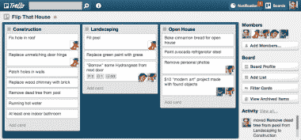

# 特雷罗与众不同——乔尔谈软件

> 原文：<http://www.joelonsoftware.com/items/2012/01/06.html?utm_source=wanqu.co&utm_campaign=Wanqu+Daily&utm_medium=website>

就在几个月前，我们推出了一个超级简单的基于网络的团队协作系统 [Trello](http://trello.com/) 。反馈非常积极，采用率非常高，即使在其早期的 1.0 版本中也是如此。

T4】

Trello 是 Fog Creek 的新型开发项目。是 100%托管的；永远不会有“安装软件”版本的 Trello。这使得我们能够在开发过程的许多方面实现现代化；我很高兴地宣布，Trello 的任何部分都绝对没有 Visual Basic 代码。下一步是什么，飞行汽车？

你会注意到最大的不同(与我们以前的 [产品](http://www.fogcreek.com/kiln/)相比，它只面向软件开发人员)是 *Trello 是一个完全水平的产品。*

横的意思是各行各业的人都可以用。文字处理器和网络浏览器是水平的。你的牙医用钻头折磨你的软件是垂直的。

垂直软件更容易赚钱，对你的第一次创业来说是个不错的选择。以下是两个主要原因:

*   更容易找到客户。如果你做牙医软件，你知道去参加哪些会议，在哪些杂志上做广告。你要做的就是找到牙医。
*   利润更高。你的用户是工作中的专业人士，如果你能解决他们的问题，他们给你钱是有意义的。

制造一个在各行各业都有用的主要横向产品几乎是不可能的。你不能收取很高的费用，因为你正在与其他横向产品竞争，这些产品可以在大量用户中分摊开发成本。这是高风险、高回报的:不适合年轻的自举创业公司，但对于像 Fog Creek 这样成熟稳定的公司的第二个或第三个产品来说，这是一个不错的主意。

请原谅我现在转移话题，给你讲一个我 1991 年在 Microsoft Excel 团队度过的时光的小故事。(是的，我知道你还没有出生，但我向你保证，计算机已经被发明出来了。跳上我的膝盖，闭上嘴。)

 大家都认为 Excel 是一个财务建模应用。它被用来创建带有公式和其他东西的计算模型。你可以提出你的假设，然后计算诸如“如果明年利率上升 0.00001%，拉斯维加斯有多少百分比的房主会陷入破产？”比如说。

大约在 1993 年，我们几个人去拜访客户，看看人们是如何使用 Excel 的。

我们找到了一个家伙，他的全部工作就是为一家监管严格的大型公用事业公司维护“本周受伤人数”电子表格。

每周一次，他打开一个 Excel 电子表格，其中列出了 10 个设施，包括设施的名称和数字 0，这表明该周的受伤人数为 0。(他们从未受过伤)。

他在电子表格的顶部输入当前日期，打印一份副本，放入一个三环活页夹，这几乎是他全部的工作。有点伤感。他每天午休两次。如果那是我的全部工作，我也会的。

在接下来的两周里，我们拜访了几十个 Excel 客户，并没有看到任何人使用 Excel 来实际执行您所说的“计算”几乎所有人都在使用 Excel，因为这是一种创建表格的便捷方式。

(不相干的旁注:我们能找到的少数做计算的客户是银行，他们设计了被称为“衍生品”的爆炸性装置。他们使用 Excel 在十年中的九年最大化银行家的奖金，并导致西方文明每十年几乎崩溃一次。关于[黑天鹅](http://www.amazon.com/gp/product/1400063515/ref=as_li_ss_tl?ie=UTF8&tag=joelonsoftware&linkCode=as2&camp=1789&creative=390957&creativeASIN=1400063515)的一些事情。可能只是浮点舍入误差。)

我在说什么？哦，对了…大多数人只是用 Excel 做清单。突然，我们明白了为什么 Lotus Improv，这种花哨的未来电子表格会让 Excel 过时，却完全失败了:因为它擅长计算，但不擅长创建表格，每个人都用 Excel 做表格，而不是计算。

冰！我脑子里突然灵光一闪。

伟大的横向杀手级应用实际上只是花哨的数据结构。

电子表格不仅仅是做“假设”分析的工具。它们提供了一个特定的数据结构:一个表。大多数 Excel 用户从不输入公式。当他们需要表格时，他们使用 Excel。网格线是 Excel 最重要的功能，而不是重计算。

文字处理器不仅仅是写书、写报告和写信的工具。它们提供了一种特定的数据结构:自动换行和分页的文本行。

PowerPoint 不仅仅是开无聊会议的工具。它提供了一种特定的数据结构:全屏图像的数组。

有些人看到特雷罗说:“哦，这是看板。以敏捷的方式开发软件。”是的，就是这样，但它也可以用来计划婚礼，列出潜在度假地点的清单与家人分享，跟踪空缺职位的申请人，以及其他十亿件事情。事实上，Trello 适用于任何你想和一群人一起维护一个列表列表的地方。

有数以百万计的东西需要这种数据结构，在 Trello 之前还没有一个伟大的“列表中的列表”应用程序。(曾经有过大纲，但是，依我看，大纲是 UI 设计中最大的死胡同之一:对程序员如此有吸引力，但对普通人却毫无用处)。

一旦你进入特雷罗，你会用它做任何事。我经常使用大约 30 个 Trello 板，我和我生活中的每个人都使用它们，从 AP(老年父母)，我和他一起计划假期，和工作中的每个团队，以及我参与的几乎每个项目。

所以，好吧，这是与特雷罗的第一大区别:水平的，而不是垂直的。但是还有很多其他的不同之处:

** 这是连续交货。我们并没有发布主要版本和次要版本，而是不断地从开发团队向客户推出新功能。您构建并测试了一个特性，但是因为您在等待下一个主要版本而没有交付，这个特性变成了*库存*。库存是一个沉重的负担:你花的钱浪费掉了，却没有给你带来任何收益。当然，100 年前，我们有这些被称为“光盘”的东西，我们以这种方式运送软件，所以在我们将它们应用于世界之前，有一个经济上的原因将它们聚集在一起。但是没有理由再那样工作了。当然，你已经知道了。我只是说—我大约五分钟前停止使用 Visual Basic。美丽新世界。**

它在发布前没有经过彻底的测试。我们认为我们可以侥幸逃脱，因为特雷罗是免费的，所以顾客更宽容。但说实话，我们侥幸逃脱的真正原因是因为 bug 是在几个小时内修复的，而不是几个月，所以“公众体验到的 bug”的净数量很低。

我们在公共场合工作。Trello 团队的规则是“默认公开”我们有一个[公共特雷罗板](https://trello.com/board/trello-development/4d5ea62fd76aa1136000000c)，显示我们正在做的一切以及进展情况。我们用这个让顾客投票并评论他们最喜欢的功能。顺便说一句，当 Trello 正在开发时，这是个秘密。我们有很多 beta 测试人员，他们给我们客户反馈，这样开发团队就可以使用[精益创业](http://www.amazon.com/gp/product/0307887898/ref=as_li_ss_tl?ie=UTF8&tag=joelonsoftware&linkCode=as2&camp=1789&creative=390957&creativeASIN=0307887898)原则，但是我们花了九个月秘密构建 1.0 版本，这让我们在竞争激烈的市场中取得了显著的领先。但是现在我们要出货了，没有理由不谈我们的计划。

这是一个“快速做大”的产品，而不是“本和杰瑞”的产品。见[策略信一](https://www.joelonsoftware.com/articles/fog0000000056.html)。Trello 的商业目标是最终达到 1 亿用户。这意味着我们的首要任务是消除采用的任何障碍。*人们可能用来作为不使用特雷罗的理由的任何东西都必须被发现和消除。例如:*

特雷罗自由了。产品收费带来的摩擦是大规模增长的最大阻碍。从长远来看，我们认为从大量用户身上提取少量资金比从少量用户身上提取大量资金要容易得多。一旦你拥有了 1 亿用户，就很容易判断出这些用户中的哪一个从你开发的产品中获得了最大的价值。得到最大价值的人会很乐意付钱给你。其他的不需要太多的支持。

**API 和插件架构具有最高优先级。**另一种说法是:如果你可以公开一个基本的 API，并让那些高价值用户(从平台中获得最大价值的人)为你构建，那么永远不要在内部构建任何东西。在 Trello 团队中，任何能够由插件提供的特性都必须由插件提供。

( [API](http://trello.com/api) 目前还处于非常初级的形式。你已经可以用它来做非常有趣的事情了。它正在迅速发展。)

我们使用尖端技术。通常，这意味着我们会被割破手指。我们的开发人员遍布 MongoDB、WebSockets、CoffeeScript 和 Node。但至少他们玩得很开心。在今天紧张的就业市场上，伟大的程序员对他们将要从事的工作有很大的影响力。如果你能给他们一个能感动数百万人的令人兴奋的产品，并让他们深入研究 TCP-IP 的内部机制，同时试图找出简单的东西为什么不起作用，他们会从中获得乐趣，并热爱他们的工作。此外，我们正在创造一个产品，我们将在未来十年内致力于此。今天仅仅是“最先进”的技术在五年后将会变得陈旧不堪。我们试图超越“最先进”的水平。这是一个可以计算的风险。

这些都不是很激进。TL；DR: Fog Creek Software 开发了一个互联网产品，使用的技术是每个 Y-combinator 初创公司都在使用的，因为 spez】和他的笔记本电脑一起睡觉，这样他就可以在半夜 Lisp 崩溃时重新启动 Reddit。如果你还没试过 Trello，试试吧，然后[在 twitter 上告诉我](https://twitter.com/#!/spolsky)它是否有效。