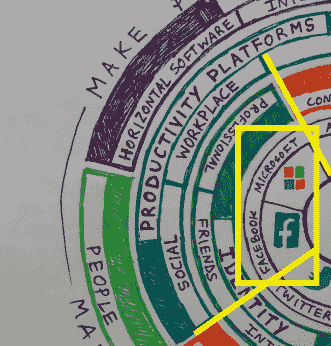

# 科技的色轮:为什么苹果讨厌谷歌，脸书是新的微软，等等——欢迎来到丹麦

> 原文：<http://alexdanco.com/2015/07/20/the-colour-wheel-of-tech-why-apple-hates-google-facebook-is-the-new-microsoft-and-more/?utm_source=wanqu.co&utm_campaign=Wanqu+Daily&utm_medium=website>

说到“跳出框框思考”，我想让人们跳出的一个特定框框(或者至少少用很多)是我们对 n 乘 n 表格、矩阵和网格的无限热爱，它们帮助我们组织我们的思考。人们似乎真的喜欢用直角对事物进行分类——就好像，我们应该把一个因素放在 X 轴上，另一个放在 Y 轴上，第三个放在 Z 轴上，它们的垂直排列将特别导致洞察力和清晰度。这种技术有时会奏效。但是偶尔，我们会看到一些完全不同的东西，它们比 n 乘 n 的表格更简单、更优雅、更能说明问题。当我们停止矩形思维而开始圆形思维时，这种情况就会发生。

对于任何阅读这篇文章的极客友好的人来说，考虑一下龙与地下城中使用的 3 乘 3 的字符值网格。一个玩家(或角色，或怪物)可以被放置在从好到中性到邪恶的范围内，然后再从合法到中性到混乱，导致九种可能的组合(如果你接受中间情况，甚至更多)。这是一个很大的类别，*没有那么有趣或说明*。将这种分类方案与万智牌的更具创新性、更漂亮的色轮相比较——游戏世界的伟大框架之一。色轮简单、优雅而完美:五种颜色(白色、蓝色、黑色、红色和绿色)排列成一个圆圈，每种颜色都有两个邻居(拥有共同价值观的盟友)和两个对立面(敌人和道德对手)。绿色是生命和自然的颜色，与白色(生命/美好)和红色(自发/混乱)结盟，而与黑色(死亡/邪恶)和蓝色(人工/非自然)为敌。圆圈上的每个点都有其独特的视角，包括视角、盟友和敌人，形成了一个框架，比任何方形矩阵都更有意义。

想到 MTG 色轮，以及它如何完美地捕捉到这些价值和差异，让我想知道为什么这个圆形框架还没有被应用到科技界。没有一个矩形矩阵能很好地解释为什么谷歌能与 Twitter 或亚马逊如此一致，却对苹果和微软如此对立和敌视。没有表格真正显示出为什么像 Kindle Fire 手机、iCloud 和 Bing 这样的产品会如此失灵，而谷歌收购 Twitter 或优步与亚马逊合作的前景只是感觉自然和正确的。

考虑到这一点，我整理了我认为可以作为“科技色轮”初稿的东西。我选择了七家公司——苹果、谷歌、脸书、微软、亚马逊、推特和优步——我觉得它们是科技界的核心“议程制定者”:当它们发布新东西时，人们会真正倾听。显然，这份名单并没有完全代表大公司——我很想包括一些亚洲科技巨头，如阿里巴巴和腾讯，而优步是这群人中唯一的年轻独角兽(尽管我觉得自己理所应当如此)。也就是说，我认为仅仅这七家公司就足够了，所以我们来看看:

在这种表现中，我们看到了一些不足为奇的功能以及一些有趣的新功能:苹果与谷歌(我们知道)和 Twitter(这也很有道理)截然相反；更有趣的是，脸书和微软实际上是相邻的邻居。从轮子的角度来考虑这些公司的许多非左领域产品发布是很有趣的:Kindle Fire 手机显示了亚马逊在试图建立一个生产力平台时如何明确地全面超越其核心竞争力，而 iCloud 显示了苹果的同样情况。为了更深入地了解这些全面的差异，让我们来看看我们的六个分组和出现的三对对立面:

**1。关于 X(脸书、推特、谷歌、亚马逊)与高级促成者(微软、苹果、优步)的信息:**

关于 X 公司的信息将世界视为**一组需要组织和理解的信息**，而高级使能公司将世界视为**一组需要完成的目标和任务**。

这可能是最简单的划分:归结为“我们关心列表”和“我们关心任务”。有没有想过，尽管谷歌很聪明，为什么它不能制作一个电子表格工具，甚至开始与 Excel 竞争？或者说为什么 iCloud 尽管有苹果的完美主义和以设计为导向的思维，仍然是这样的灾难？这是这些公司的 DNA:谷歌，一个巨大的数据处理和机器学习引擎，自然会擅长知识和理解类型的问题，并吸引世界级的人才来解决这类问题。但是当你根据*数据*来考虑所有事情的时候，你就不会那么擅长构建*工具*——反之亦然。(Bing 还是很烂，六年在。)

比较一下微软的使命宣言:“让这个星球上的每个人和每个组织都有能力实现更多，”和谷歌的:“组织全世界的信息，并使其普遍可用和有用。”这两个都是伟大的使命宣言:它们都完美地抓住了谷歌和微软深切关心的东西，同时在它们的基本价值观上彼此完全正交。这就是为什么 Google 搜索和 Excel 很棒，而 Google Sheets 和 Bing 很烂的原因。再举一个例子，必应最初的口号——*必应是为了做**——*听起来有点傻，但却完美地抓住了微软所关心的——*做事*。当然，这对微软和他们的内部任务一致性来说是很好的，但这也是为什么他们的搜索引擎很糟糕，没有人自愿使用它。

**2。身份(微软、脸书、推特、谷歌)与世界的界面(苹果、优步、亚马逊):**

对于身份公司来说，有意思的是**用户看待世界的视角**；对于与世界公司的接口，有趣的是**用户的世界效用**。

考虑这样一个问题:公司为了超越和改进他们的工作，不断询问他们的客户的是什么？

对于注重用户世界观的公司来说:

谷歌:我们如何帮助你组织和理解你周围的世界？

Twitter:我们怎样才能让你参与进来，并及时了解你的个人兴趣？

脸书:我们怎样才能更好地把你和你的朋友以及独特的社交网络联系起来？

微软:我们怎样才能让你和你的企业更有效率？*

与专注于全球用户效用的公司相比:

苹果:我们如何才能制造出一款完美的设备，让整个世界更加灵敏、有用、听从你的指挥？

优步:为了用户的利益，我们怎样才能提供一种通用的服务来组织物理世界及其内容？

亚马逊:我们如何提供一个通用的物流框架来完成任何购买或者为我们的客户提供任何服务？

—*有人肯定会说微软是这两个类别之间的边缘案例。微软当然也关心世界对用户的效用，并且是一个真正关心这两方面的组织的最佳候选人。这是有道理的，因为它就在边缘，可以合理地分配给任何一种方式。但我认为，塞特亚·纳德拉领导下的新微软可以算作一个组织，在这个组织中，个人及其个人需求、网络和云是我们讨论的基本构件。—

我认为这种分裂最好的框架是脸书或 Twitter 这样的服务与苹果(每个人都有相同的 iPhone——或多或少——每次都很完美)或优步(每次打车可能都是独特的，但实际上他们都是相同的服务)之间的并列。人们使用 iPhones、优步和亚马逊 Prime 有很多不同的目的，但作为与世界互动的工具，它们对我来说就像对你一样。

**3。生产力平台(脸书、微软、苹果)vs 组织世界的 X(推特、谷歌、亚马逊、优步):**

虽然接近第一次分裂(关于 X 与溢价使能因素的信息)，但这种分裂是不同的-处于边缘的两家公司，脸书和优步，跳槽到相反的团队。对于生产力平台公司来说，要解决的主要问题是**稀缺性**之一；对于组织世界 X 公司来说，要解决的首要问题是**充裕**的问题。

这是我最喜欢的。生产力平台公司围绕一个共同的目的组织起来，以最大限度地利用有限的资源。微软的最简单明了:您和您的组织拥有有限的时间和金钱，我们将帮助您最大限度地实现您的目标。苹果:你的时间和注意力是有限的，所以我们将为你打造最完美的设备，帮助你实现人生目标，控制你周围的世界。脸书尤其有趣:你的时间和社会资本是有限的，所以我们为你建立了一套社会生产力工具来管理你的社会投入和产出。

另一方面，组织世界上的 X 公司，解决相反的问题:驾驭极其复杂的事物，将其简化为可管理的东西。 Twitter 是一个组织世界集体对话的开放协议；谷歌吸纳了世界上所有的信息，并使其易于获取和使用；亚马逊对全世界的商品、服务、产品也是如此；优步(也许是最大的挑战)渴望组织整个世界的物质内容。

这种分裂揭示了脸书的许多情况。虽然人们可能会认为脸书与谷歌或 Twitter 大致相似(毕竟，它处理信息和互联网)，但在这方面它是非常不同的。是的，脸书的跨产品和平台的社交图谱是巨大的，包含超过 10 亿人。但是对于任何一个特定的脸书用户来说，手头的任务不是组织大量的用户数据(并将其缩减为一个搜索栏，比如谷歌或亚马逊)，而是最大限度地扩大你的注意力范围和社会资本。简而言之，它是你社交生活的生产力平台，就像微软是你工作的生产力平台一样。事实上，我甚至可以说*脸书在某种程度上是下一个微软*:雷德蒙无处不在的工作场所生产力平台的真正的社会和生活继承人。毕竟，除了在社交方面设置议程(在新功能、收购和产品战略方面)，它目前正在试图对智能手机生态系统做微软在 21 世纪初对台式电脑制造商所做的事情——即，坐在一个巨大的价值链的顶端，获取所有诱人的利润。

这也表明优步有着惊人的野心，要成为整个物理世界及其所有内容的实际组织者。尽管在最初的拆分中，优步被恰当地归类为工具导向型公司，而不是列表导向型公司，但目前的拆分突显了优步的真正挑战。也就是说，要真正实现使命和规模，优步必须为物理世界建立和运营 PageRank:对整个物理世界及其内容进行索引、分类和交付，就像谷歌为网络所做的那样。因此，尽管优步最终以“工具模式”作为一家优质使能公司运营，但他们的主要问题是巨大的丰富性而不是稀缺性——将他们归类为“组织世界的 X”公司，而不仅仅是一个生产力平台。这就是为什么，虽然我完全认为苹果可以制造一辆汽车(他们也是一家高级推动者/生产力平台公司，并且做得很好)，但他们永远不可能成为优步。毕竟，你真的认为优步雇佣卡耐基梅隆大学数学系和最初的谷歌地图团队只是为了让它的出租车更有效率吗？

最后，值得看一看圆圈中最外面的一圈文字——这些公司是如何赚钱的，以及这些公司如何与他们的创收机制保持一致。构建一个高级生产力工具来帮助您与世界互动？看起来你是苹果——你应该通过销售设备来赚钱。你是否通过围绕人们的兴趣和对话组织的社交网络来培养参与度和眼球？看起来你是 Twitter-你应该卖广告。你组织全世界所有的采购、交易、商品和服务吗？看起来你是亚马逊——你应该促进交易并把每一笔交易货币化。当一切完美匹配时，伟大的事情就会发生——正如 Stratechery 的本·汤普森(Ben Thompson)所说，“当文化、能力和机会相匹配时，强大的事情就会发生。”

尽管如此，有一个主要产品表面上看起来在这个框架中毫无意义:

**安卓呢？**

Android(从某些角度来看，它是迄今为止世界上最成功的产品——仅在五年多一点的时间里就拥有了 10 亿用户)在这张图上没有任何意义。这是谷歌武器中的一个关键部分，所有人都说这是一个巨大的成功，但几乎在每个领域都与谷歌相对。这是一个生产力平台(像 iOS 一样)，一个延伸到应用程序和网络的横向软件使能器(有点像 Windows Phone 的设计目标)，一个帮助你与周围世界互动的界面。

那交易是什么？在我看来，尽管 Android 无疑取得了巨大的成功，但这个圆圈布局提供了一些解释，为什么 6 年后，Android *仍然*有时对谷歌来说感觉非常陌生。想想最近的谷歌 I/O 开发者大会，会上的安卓部分感觉非常僵硬、不自然和无趣，而谷歌服务部分则充满活力和雄心，感觉就像魔术一样。然而，这实际上并不是对 Android 的打击——事实上，考虑到它与谷歌的核心竞争力如此背道而驰，谷歌的成功甚至更令人*印象深刻。请记住，谷歌收购并推出 Android 不是为了与苹果竞争，而是为了与微软竞争——他们迫切需要确保移动互联网不会被他们无法控制的专有操作系统锁定，他们成功了。事实上，他们能够做到这一点，同时全面拓展业务——即使 Android 有时仍感觉像是谷歌的一个外来分支——尤其令人印象深刻。*

总之:转圈思考！我将在某个时候对这篇文章进行一些扩展，比如这个框架暗示了什么样的未来举措和产品，以及可能更像一个色轮的抽象版本(而不是简单地将七家公司排列成一个圆圈，并相应地列出它们的核心特征)。与此同时，我邀请你评论你是否同意或不同意这个框架和位置，以及你会把阿里巴巴、小米或 Airbnb 等其他大公司放在哪里——请随意在评论区添加你的想法，或发推特给我@alex_danco。

### 像这样:

像 装...

### *相关*

