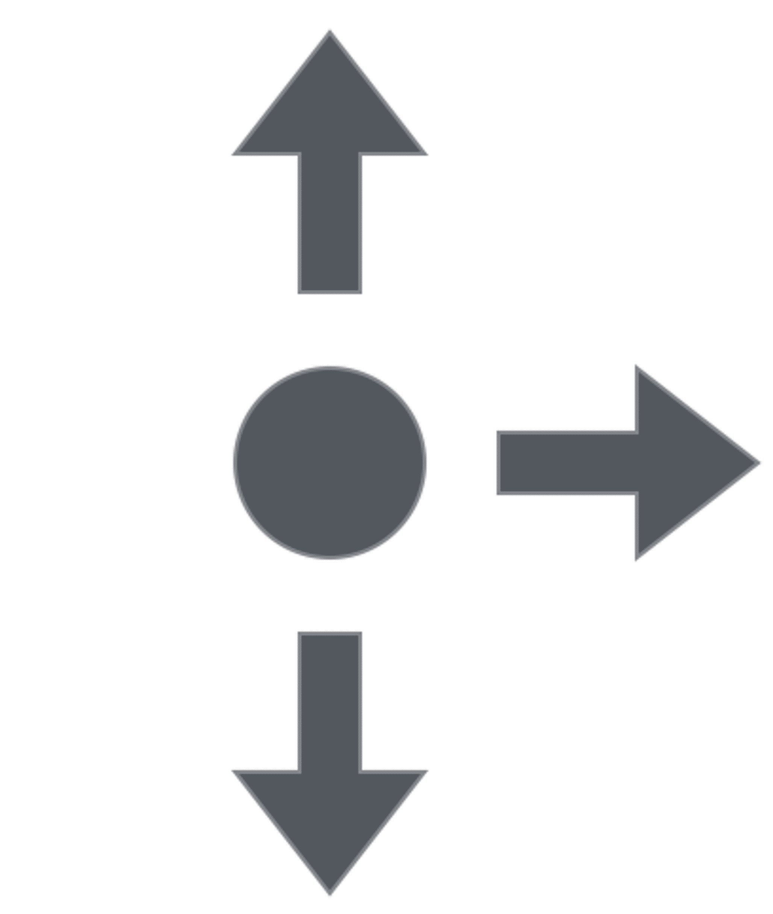
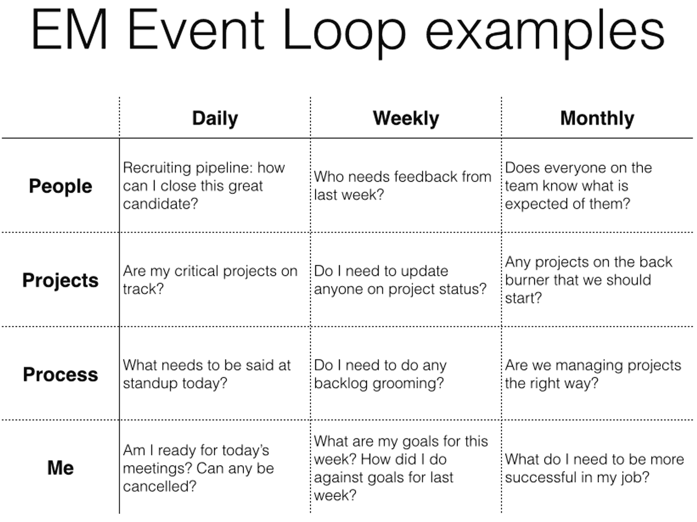

# 这个 90 天的计划将工程师变成卓越的管理者|第一轮回顾

> 原文：<http://firstround.com/review/this-90-day-plan-turns-engineers-into-remarkable-managers/?utm_source=wanqu.co&utm_campaign=Wanqu+Daily&utm_medium=website>

*David Loftesness 现在是* *[eero](https://eero.com/ "null")* *的工程主管，也是* *[缩放团队](https://www.amazon.com/Scaling-Teams-Strategies-Successful-Organizations/dp/149195227X "null")* *的合著者。*如今，科技行业有一个非常普遍的周期。启动避免管理。创始人做所有的决定。创业获得牵引力。招聘开始了。突然需要管理。创始人转向他最好的工程师:“我快淹死了。你能帮我管理这个团队吗？”

Twitter 的前工程总监大卫·洛夫特斯尼斯(David Loftesness)在过去的 20 年里多次被选为开发者，六家科技公司，包括 [Xmarks](https://www.xmarks.com/ "null") 和 Geoworks。在经历了多次工程师到经理的转变后，Loftesness 开始带领其他开发人员进入他们的第一个领导岗位。

2015 年，他将自己在这个问题上的智慧收集到一份 90 天计划中，该计划针对的是向管理层转型的开发人员。在这篇独家文章中，他分解了这个计划，以帮助工程领导者设定他们的优先事项，站稳脚跟，评估他们自己的表现，以便他们可以快速增长，并开始授权他人。

# 这就是为什么你需要一个计划

“确实有十亿篇关于如何管理的博文。但我觉得它们不仅经常相互矛盾，而且缺乏明确的检查点，”Loftesness 说。“我需要的是一个有时限的计划，其中有选择退出或升级的机会。我就是这样对待工程师成为技术经理的 90 天计划的。”

当他意识到科技公司往往倾向于将内部工程师转变为经理(有时不考虑他们的兴趣或经验)时，他制定了这个计划。一方面，开发人员带着丰富的技术和工作流程背景进入管理层，所有这些都有助于产品开发和流程。然而，一个新的技术领导者通常不知道如何管理人。

在一项非正式调查中，Loftesness 发现，每 15 名工程经理中只有一人在成为经理之前接受过正式的管理培训。当被问及哪种方法对学习有效管理最有帮助时，近 75%的人说是“试错法”，一半的人引用了直接下属的反馈，40%的人说是观察同级经理。

这听起来非常真实:“当我第一次成为经理时，我花了至少六个月的时间来假装。我制定了我们的日程安排，然后想，“我想我们需要开会……”于是我们创建了会议。基本上我只是复制了我在周围看到的东西。”

外卖？如果任其发展，许多工程团队最终会被托付给技术天才，而这些技术天才恰好也是未经考验的领导者。这些新经理经常受到更严格的考验，因为他们被要求及时管理——填补人员缺口、运送过期产品或处理公司危机。

Loftesness 的 90 天框架可以帮助新经理通过三个不同的阶段度过他们的第一个季度:拥有你的教育(第 1-30 天)，找到你的节奏(第 31-60 天)和评估自己(第 61-90 天)。但是首先，要决定是否投身于管理层——这比大多数人想象的要重要得多(需要更多的权衡)。

# 第 0 天:你需要提前接受的不可避免的事实

大多数工程师在代码库上花了太多时间，直到他们被安排去承担领导责任。通常由经验丰富的经理来识别那些有潜力的人。“多年来，我发现这一切都始于对工程师的直觉，”Loftesness 说。“但除非未来的管理者能够想象自己在代码之外扮演一个非常不同的角色，否则这不会成功。”Loftesness 发现，最好的新经理已经考虑并完全接受了这些新的现实。

***准备管理三个方向。*T3】**

“大约两年前，我的一位工程师问我:‘我怎么知道自己是否准备好了？’”洛夫特斯说道。在回答之前，他画了这个简单的图表:

“如果你从一开始就明白你将管理三个方向，而不仅仅是监督一个开发团队，你就准备好了，”Loftesness 说。以下是他提到的三种关系，以及未来的经理应该能够回答的关于每一种关系的问题:

**你的团队**。你能有效地领导工程师，尤其是你以前的同事吗？你完全理解这项工作吗？你会为你团队的目标负责吗？

**你的同龄人**。你能和你的同事很好地合作并避免地盘之争吗？你能有效地与你的同事交流吗？

你的经理。你能为忙碌的经理们提供项目状态的清晰快照吗？如果你不同意你的经理，你能巧妙地反击吗？

Loftesness 补充说，高素质的领导者学会管理上至他们的老板，下至他们的团队，以及他们的同事。“这不是一个序列或排名顺序，而是一个清单，”Loftesness 说。“您希望确保这三个框都被选中—可能不会立即选中，但会在最初的 90 天内选中。”

一开始就确定它会如何激励你。T3】

“这是一份全新的工作。Loftesness 说:“不要指望只是做一些管理工作，然后自称为经理。“现在，你的员工的幸福和工作效率在很大程度上取决于你。你要对结果负责，但不能一个人做所有的事情。”

作为管理者，你不再坐过山车。但是你操作它。那会让你兴奋的。如果没有，也许它不适合你。

在为他人承担责任之前，你需要彻底调查你承担这个角色的动机。对自己诚实，什么在驱使你。崇高已经见证了好的和坏的动机洗礼和淹没新的技术经理。以下是需要注意的最重要的事情:

**不要为了讨好老板而经营**。Loftesness 说:“让老板开心而忽略了你自己的快乐并不是担任一个角色的好理由。”“如果你的经理首先是你的朋友或同事，这尤其具有挑战性。退一步，先回答自己。”

不要只想着推进你的职业发展。许多科技公司对技术和管理方面的高绩效员工都有类似的晋升途径。“你想领导一个团队，这很好，但要评估一下。问问你自己现在是不是合适的时候。你准备好接受这个角色了吗？如果你过早地接受了这份工作却失败了，那将是一种倒退。一步也没向前。”

不要试图“为团队牺牲一个人”如果你过去扮演过烈士的角色，请按暂停键。作为一名经理，成为一名英雄——以及每一次相关的兴衰——对你的影响会更大。Loftesness 说:“充分了解你自己，以决定你是否会对团队中的一员感到不满。”“挺身而出帮助同事的动机是高尚的，但如果这是领导的唯一驱动力，那就不可持续。”

如果你的成长涉及到他人，那就去管理。“有一年夏天，我的两个工程师成了经理。这是新面孔暑期实习生的季节。一位经理哀叹被分配到实习生岗位，认为这种关系耗费时间。另一个人认为这是培养更好的工程师的机会。“他们仍然可以热爱技术工作，但经理们最满意的是帮助人们更好地完成工作。”

如果你能引导同理心，那就好好管理。作为管理者，具备换位思考的能力是根本。“移情不是每个人都有的，但我有一个自己喜欢的测试方法。我让人们讲述工作中的冲突。然后我让他们描述另一个人脑子里在想什么，”Loftesness 说。“如果他们能解释为什么对方希望他们做某件事，这是换位思考的表现，也是一个管理者的表现。”

如果你能给予别人你所要求的信任，那就努力去做。也许是最重要的提示:不要撒谎。不要分享一对一会谈中的敏感信息。但是有一种更合作的方式来建立——而不仅仅是保持——信任。“一个好的经理就像一个好的面试官，”Loftesness 说。“最好的面试官会做他们希望面试者做的事情。他们会分享一个个人的时刻，一个有趣的故事，他们会得到回来。显然，他们并不支配播出时间，但他们付出一点点，通常会得到很多回报。我觉得和经理很像。提出问题并表现出你真的在乎，可以为分享感受和建立信任创造很多空间。”

当你看到队友挣扎时，你是第一个走过去伸出援手的人吗？这是一个信号。

***准备告别编码。*T3】**

当你管理其他工程师时，编码、架构和技术决策不再是你的主要工作。这对许多做出改变的人来说是一个巨大的惊喜，也是最困难的调整之一。

“有一个过渡期是没问题的，但你坚持的时间越长，成为一名称职的经理所需的时间就越长，”Loftesness 说。“一家公司的成长可以决定环境，但是，考虑到要吸收的大量材料，我认为新经理需要承诺一年不遵守准则。”

想想这个:大多数工程师花了四年的大学时间学习成为一名入门级的程序员。那么，花一点时间来学习如何管理难道不是有意义的吗？决定你是否能坚持一年的编码休假。

当 Loftesness 谈到脱离代码时，他的意思是脱离编写代码。“对于一个经理来说，阅读代码比编写代码重要得多。Loftesness 说:“对任何经理来说，写代码都是一种诱惑，也是一种干扰。“读足够多的书知道人们在做什么，了解进展和管理团队是没问题的。只是不要为了逃避管理责任而去写代码。”

Loftesness 已经看到许多技术经理在这种转变中挣扎。“我曾与一位工程师共事，他知道这在理论上会发生，但在实践中却无法释怀。最终，管理层的变化比她预期的要大。她热衷于观察其他经理和我，发现会有很多电子邮件、会议和非编码工作。但是她没有意识到她会多么想念编码，最终还是回到了个人贡献者的行列。

和任何新工作一样，你在任何时候都应该做的最重要的工作肯定会让人不舒服。应该是。

“起初，我升职后没有停止编码，因为这是熟悉的工作，也是更快出货的一种方式。但我为此付出了代价，”Loftesness 说。“我避免告诉我的老板一个项目偏离了轨道，也没有给我团队中的一个成员一个关键的评价。如果我专注于提供绩效反馈，我会在几个月前解雇一名表现不佳的员工。从长远来看，这对工程师、项目和团队都有好处。我应该早点停止编码。”

“知道拐杖和训练轮之间的区别，”他说。如果一个新经理充当“训练轮”，他已经做了一些事情，使他的团队在未来执行得更好更快。但是如果他自己冲进去做工作，他就是一个“拐杖”——剥夺了别人学习的机会。

“信任但要核实，”Loftesness 说。“不要看着他们编写所有的代码，而是要关注重要的部分，并根据他们的工作给予积极或消极的反馈。”此外，选择时间让他们带着一个你一开始可能不同意的想法运行。没有比这更能显示信任的了。

“为新经理寻找那些定义和探索新事物的时刻。如果它是关键任务，并且这个任务的失败会使项目脱轨，那就不是合适的时机。但也有其他时候他们想做 X，你认为他们应该做 y，从两方面解释你的动机。无论成功还是失败，让他们做 X 都是建立信任的重要时刻。

***准备好向你的团队问好。*T3】**

当 Loftesness 成为 Twitter 的一名工程经理时，他很早就知道了沟通的方式——相对于代码的方式——对他的成功有多么重要。“我接手了工程副总裁发起的一个非常引人注目的项目。我的经理被拉去很多地方，让我监督这个项目。唯一的目标是让它出门。”

Loftesness 冲在前面，要求另外三名工程师尽快将它运出。一位新来的、有思想的工程师向他详细询问了该项目的背景，以及一些关于其目标的难题。“在那之前，这是公司的*项目。它将拯救 Twitter，所以没有人质疑它，”Loftesness 回忆道。“但在工程师提出问题后，我们意识到我们制造了错误的产品，并取消了项目。我们找到了另一条前进的道路，但这对我们的团队和 Twitter 的管理团队来说是一个重要的时刻。”*

决定成为一名技术经理意味着，你的职责将不是编码和设计工作，而是建立频繁的交流机会——更好地了解你团队中的人，并使他们能够做最好的工作。以下是他用来仔细倾听团队意见的两个非显而易见的策略:

**连续的职业对话**。“这可能不会出现在你的第一次谈话中，但我认为你很快就会想知道你的员工想要实现什么？如果有的话，他们的职业目标是什么？通常他们会说，“我只想继续做一名工程师，”但他们可能会说一些具体的事情，比如，“哦，我想在几年内成为一名经理，”或者，“我想有一天创业，所以我想学习我需要做的一切，”或者，“我想成为一名公认的技术专家。”不管是什么，问这个问题并定期检查是非常重要的。"

按资历和大小排序的日历。“每周，我都会在周一上午与我的老板会面，然后在周一下午与我的整个团队会面，然后从周二开始进行一对一的会面。这种顺序有意地促进了自上而下的交流，这样做的工程师就有了尽可能多的上下文。否则，我会成为一个瓶颈，信息会一点一点地从我或其他人那里出来。上下沟通是经理最容易迷失的地方。”

正如你所看到的，在这个角色开始之前，有许多思考、准备和战略必须进入管理的过渡阶段。你越快完成工作并决定如何应对这些挑战，你对未来工作的准备就越充分。如果管理听起来仍然是你的正确道路，下面是你接下来应该做的。

# 第 1-30 天:拥有你的教育

如果你已经决定从工程师转型为技术经理，你的第一个月是关于承诺拥有你的教育。下面是 Loftesness 推荐的三种方法:

划出时间来学习。没有比在日历上预留时间更简单、更有效的管理教育方式了。这些会议是对新员工会议或一对一会议的补充，在这些会议中，您可以练习所学内容。“我是认真的。Loftesness 说:“在你的日历上划出时间。”“这一次的目的是成为一名更好的管理者，无论是与导师会面还是研读管理策略。”

以下是 Loftesness 推荐给任何新技术经理的几本管理读物:

*[Peopleware](http://www.amazon.com/Peopleware-Productive-Projects-Second-Edition/dp/0932633439 "null")* 作者汤姆·狄马克和蒂莫西·李斯特。这是一部空前的经典之作，虽然在细节上有些过时，但在原则和整体方法上仍然是真实的。

神话中的人月:小佛瑞德·P·布鲁克斯的软件工程论文 ，尤其是他的“没有银弹”论文的最新版本。

*[首先，打破所有规则](http://www.amazon.com/First-Break-All-The-Rules/dp/0743510119 "null")* 马库斯·白金汉和科特·科夫曼。他们带来了大量的盖洛普数据，来说明如何成为一名伟大的经理人。

还有很多优秀的管理简写作家，包括[斯波尔斯基](http://www.joelonsoftware.com/ "null")、[兰德斯](http://randsinrepose.com/ "null")和[萨顿](http://bobsutton.typepad.com/ "null")。不要把它们当成真理，而是用它们来磨练你自己对如何最好地管理你的团队的感觉。

不要隐藏你的学习时间。新经理将积极向团队学习，也从其他来源和资源学习。Loftesness 说:“当你为了成为一名更好的管理者而耽误了学习时间时，就拥有它吧。”“首先要让你的团队能够看到你的日程安排。很多时候，新经理会隐藏他们的日历，这会导致团队的混乱和紧张。你的团队会在受益之前就欣赏你的努力。在你的日历上划出时间，称之为“管理:提升”"

**找一个管理导师(或者两三个)**。在 Loftesness 的调查中，将近一半的工程经理从来没有向有管理经验的导师寻求意见。那是一个错过的机会。“在你的第一个月，向你的老板寻求导师推荐，但不是成为你的导师，”Loftesness 说。“你应该已经从老板那里得到了指导。找一个至少稍微有点距离、能提供额外指导和视角的人。”

你会惊讶地发现，有多少工程经理会很好地回应这些要求。“Twitter 和亚马逊的董事们非常愿意花时间给年轻的经理们，帮助他们提高，”Loftesness 说。“在没有直接询问某人的情况下，ping 一个经理的邮件列表。这个问题并不复杂:“我在找人花点时间解决几个关于管理的问题。有人在吗？"

# 第 31-60 天:找到你的节奏

在第二个月，你的目标是构建你的时间表，找到一个新的节奏，一个与你作为程序员的日子明显不同的节奏。以下是对 Loftesness 和他建议的许多其他经理有效的方法。

**取消会议**。这似乎有悖常理，但屈服于无休止的会议循环是最常见的新经理陷阱之一。“我认为明智地——甚至是恶意地——取消会议是尽早开始的一个关键习惯，”Loftesness 说。“当然，如果你拒绝了，就要尊重，但永远要保护好你的时间。”人们会邀请你参加会议，因为其他经理也在参加，或者他们已经广撒网了。很容易觉得有义务。我鼓励我的经理问自己:“这个会议对完成你的工作重要吗？”

当涉及到你的工程师的时间时，尊重并捍卫他们的判断。“我曾经有一个同事喜欢打我下属的小报告。他会说，‘你知道苏珊最近三次会议都没来吗？“你能和她谈谈吗，”我会让他知道苏珊能够自己做决定，如果你需要她，让她相信这很重要。"

继续防守，但不是在真空中。在你的 30 天中，你已经安排了与团队的定期会议，并花时间学习如何成为一名更好的经理。继续防御性地阻止你的日程表，但不要以牺牲你的工程师的时间为代价。“如果一名工程师和我需要见面，我通常会在一天的开始或结束时留出时间，以避免打断他们的‘创造者时间’，”Loftesness 说。“一天开始时的一个小时比一天中间的半个小时要便宜得多。”

给自己建立一个“事件循环”事件循环是定期运行的管理清单——每天、每周和每月。“这样做的目的是确保你为那些可能被淹没在噪音中的重要活动腾出时间，”Loftesness 说。“每周一次和每月一次尤其困难，因为你骑车的频率较低，但它们对养成习惯同样重要。”这是一个工程经理事件循环的例子:

An event loop for an engineering manager

为了有效地进行事件循环，在你的日历上留出时间，根据指定的频率重新访问和回答每组问题。如果你需要重新安排或者推迟，那也没关系——至少这是一个有意识的选择，如果必要的话，给你机会重新安排优先顺序。

在某些情况下，最好不要拖延时间。“在招聘周期中，每日活动循环会很有帮助。Loftesness 说:“在这些时候，没有什么比搞定那个出色的候选人更重要的了。“然而，推迟给申请人发邮件，直到下一次会面之后，这真的很容易。但如果你拖延时间，你就会得到它。”

# 第 61-90 天:自我评估:你真的想要这样吗？

90 天计划的最后一个月应该是坦诚地评估你作为管理者的潜力。有两个方面需要明确:首先，你应该能够清楚地阐述你的每份报告的优势和职业方向。其次，你拿出了具体的证据，证明你有能力——也有动力——成为一名工程经理。下面是 Loftesness 要求他的新经理回答的问题，以评估他们自己:

每个团队成员的独特之处是什么，以及你利用这一点的计划？ Loftesness 采纳了来自[《T4:你需要知道的一件事](https://twitter.com/mwbuckingham "null")的作者马库斯·白金汉的这个问题，来衡量一位新经理是否已经发现了她团队中每个成员的不公平优势。给自己一分钟给每个人起个名字。接下来，你应该能够清楚地说明你计划如何利用每个人才来帮助你的团队获胜，并让他们在职业生涯中达到他们想要的目标。

“我的一位工程师在设计软件时非常随意。他会加快设计阶段的速度，然后快速完成实现。但后来我意识到了原因，”Loftesness 说。“他擅长调试软件。他检查了所有东西，这样他就可以开始调试了。”这位工程师缺乏改进软件设计的动力，这对团队和产品都是有害的，但他独特的才能却是他们成功的工具。所以 Loftesness 创造了一个“消防员”的角色，在这个角色中，他可以全职调试。

有时，情况并不那么简单。工程师可能表现出对团队有益的独特才能，但对他们的职业生涯无益。“工程经理 Glen 在工作中表现出色。Loftesness 说:“他有自知之明，清楚自己的期望。“他最突出的技能是能够识别团队的关键问题并迅速采取行动。在某一点上，他为他的团队写了一个清晰的大纲[他对代码评审的期望](http://glen.nu/ramblings/oncodereview.php "null")，几乎立刻，团队的产出有了可测量的增长。

格伦深受团队的爱戴，但他选择回去做工程师。他意识到他喜欢开发代码胜过喜欢人，尽管他在这两个角色上都很有效率。最后，保持格伦的积极性并留在公司比不开心并寻找其他地方更重要。

90 天后，如果你不能回答出团队每个成员的独特之处，那你就没有进行正确的对话或问对问题。

反思你是否因为技能、时间或动机而失败。如果是前两种原因，进行调整改善。如果是后者，这也是一个重要的认识——这个角色可能不适合你。

团队真的在交付成果吗？虽然第一个问题是关于个人的，但这个问题是关于他们作为团队的协调。这里有几个具体问题需要回答，以评估其性能:

软件质量怎么样？到底有没有改善？

他们的里程碑进展如何？

团队士气如何？

90 天后，经理应该能够评估任何需要改进的地方。如果他们不能立即解决这个问题，他们应该知道从哪里开始。如果没有，可能是他们不适合这个角色。

当然，交付成果对公司来说是最重要的，但是了解*如何完成*对经理来说也是同样重要的。“深入挖掘他们是否达到了里程碑。如果您的团队错过了截止日期，您是否因为团队的技能而将过多的工作打包到一个里程碑中？我们错过了哪些类型的截止日期，为什么？”Loftesness 说。"这不仅关乎你跑了多少英里，还关乎你的引擎运转得如何。"

你能看到你从哪里开始增加价值吗？Loftesness 说:“每个新的技术经理都有一份责任——从降低某个领域的成本，到提高客户增长的漏斗顶端——这份责任会为公司带来一些有意义的事情。作为一名新经理，你可能会因为职责被打破或处于临界点而进入角色。

有时候，这个切入点可以帮助你衡量进展，而其他时候，你仍然可以找到自己的方向。不管怎样，90 天后，你应该会开始看到你有价值的具体证据。如果你已经取得了进步，并且能够解决最初是什么让你得到这份工作，这就是这个阶段的成功。如果没有，你应该有一个如何到达那里的计划。

你晚上和周末工作多少小时？Loftesness 说:“新的技术经理在开始时工作过度有很多原因。“他们对新角色、学习曲线或发展团队感到兴奋。他们可能会工作到深夜，甚至整个周末。”90 天后，开始问自己:你投入额外的时间是因为你兴奋还是因为这是你的新生活？

量化你的“下班后”时间是一个简单的检验，可以测试你的快乐和这个角色的可持续性。一年后，当你还在牺牲周末的时候，你会有什么感觉？这可能是一个信号，它不会工作了。

同时，不要太早放弃。两个月后就开始给自己签到吧。“老实说，我只见过一个经理，他当经理比当工程师更开心，”Loftesness 说。"从工程师到经理的转变是对不舒服和新鲜事物的一次尝试."所以从问自己是否可持续开始，而不是问自己是否更快乐。刚开始的时候，走在通往幸福的道路上比快乐更现实。

# 第 90 天:下定决心站出来或者靠边站

在第 90 天，一个新经理应该有足够的跑道来决定前进或从工程领导角色中过渡出来。如果你还没有通过前 90 天的测试——或者没有兴趣通过它们——是时候离开了。如果你有或看到一个具体的前进道路，恭喜你！你的工作才刚刚开始。

以下是 Loftesness 对做决定的建议:

在你的日历上写上第 90 天。Loftesness 喜欢在日历上标出任务和优先级，鼓励新经理在第一天上班后，在日历上标出第 90 天。“年轻的技术经理看到地平线上的一个检查点是很重要的，”Loftesness 说。"第 90 天是去/不去的决定."至少留出几个小时来收集你的想法并进行自我反思，另外一个小时和你的老板讨论。

**如果没有，靠边站，不要下来。不想管理的原因可能有很多:对编程的强烈热爱，错误的动机，没有可持续的幸福之路。它们都是有效且重要的行动依据。“不要认为这是下台，而是专注于你的优势和激励你的东西，”Loftesness 说。“如果你辞去这个角色，你不应该自责。认识到有些事情对你不起作用，并能够回到你热爱的事情上来，这真的很重要。”**

组织应该有管理和技术提升的途径。洛夫特斯尼斯表示:“在管理层比工程师更高层的公司，这是最危险的。”。“人才应该有能力从技术层面晋升到管理层面，并保持自己的视野。他们应该对抓住机会而不丧失资历感到自在。公司还可以通过培养更多见多识广、多面化的员工而受益，这些员工对组织的运作方式了解得更多。”

公司可以通过从一开始就淡化过渡，让工程师很容易尝试管理。“为技术经理创造一个安全有效的 90 天从第一天开始。Loftesness 说:“不要对工程师向技术经理的转变大惊小怪。“如果一家公司在全公司范围内发布公告，称之为升职，并公开表示祝贺，那么这位工程师就更难让位了——即使这对这个人和公司来说都是正确的决定。”

如果是的话，还有很多东西要学。如果你发现管理适合你，你仍处于漫长旅程的起点，还有很大的成长空间。以下是 Loftesness 在第 90 天后快速启动管理教育的下一个策略:

***重在扬长避短*** *。*“对于新上任的经理来说，专注于弥补工程师的弱点而不是增强他们的优势是一个常见的陷阱。提高某人的优势带来的好处通常比解决弱点带来的好处更大，也更有可能持续下去。

***解析性格与表现*** 。“当新经理给出批评性反馈时，他们很容易以批评工程师个性的一部分而告终。“如果他们是个大嘴巴，他们不会突然停下来。如果他们擅长某事，你可以选择容忍它。所以你的方法应该是如何让他们在不伤害团队的情况下大声说话。

***找到你的倾诉者*** 。在他的管理生涯中，Loftesness 总是在他的团队中发现真相。没有过滤器的人只会说出自己的想法。Loftesness 说:“有时候，这个人会直接告诉你，而其他时候，说真话的人会在一个集体环境中说出来。”“不要对他们的公开挑战反应迟钝。

要明白，你越是身居高位，就越难在地面上听到真相。如果你找到了一个会不加过滤就给你的人，告诉他们:‘嘿，我喜欢你在我的团队里，因为你给了我这个原始的反馈。“那是你的特殊工作——我想听听发生了什么事，”这对那个人来说是非常有益的。"

***加长你的教学大纲*** 。多年来，Loftesness 收集了他最喜欢的管理领导力指南。如果你已经读过上面列出的他的第一套建议，再补充几条，比如汤姆·狄马克的 *[懈怠](http://www.amazon.com/Slack-Getting-Burnout-Busywork-Efficiency/dp/0767907698 "null")* 或者乔·泽维尔的《[优秀人事经理的主要特质是什么](https://www.quora.com/What-are-the-primary-traits-of-a-great-people-manager/answer/Joe-Xavier "null")》。

无论是通过管理书籍还是导师，在决定成为一名工程经理的背后都有很多努力——要成为一名优秀的工程师甚至需要更加勤奋的工作。在为期 90 天的过程中，它将涉及一系列步骤，包括与导师会面，安排时间学习管理知识，以及识别团队中每个人的独特品质。

最重要的是专注于管理，引导你曾经专注于编码的单一焦点。如果你想成为万事通，你将一事无成。Loftesness 引用 GaiamTV 产品总监 Jesse Weaver 的一篇文章说，“不要成为一把瑞士军刀，尽管它有许多部分有用的工具。侍酒师不会使用迷你开瓶器。伐木工人不会受益于小锯子。致力于成为一名管理者，坚持你的计划。”