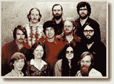

# 战略信一:本和杰里的 vs .亚马逊-乔尔的软件

> 原文：<http://www.joelonsoftware.com/articles/fog0000000056.html?utm_source=wanqu.co&utm_campaign=Wanqu+Daily&utm_medium=website>

建公司？你要做一个非常重要的决定，因为它会影响你做的其他事情。不管你还做什么，你绝对必须弄清楚你属于哪个阵营，并相应地调整你所做的一切，否则你将面临一场灾难。

决定？是缓慢地、有机地、有利可图地增长，还是用非常快的增长和大量的资本来进行一次大爆炸。

有机模式是从小处着手，设定有限的目标，然后在很长一段时间内慢慢建立一个企业。我将称之为[本和杰瑞的模型](http://www.amazon.com/exec/obidos/ASIN/0517883708/ref=nosim/joelonsoftware)，因为本和杰瑞的模型非常符合这个模型。

另一种模式，通常被称为“快速做大”(又名“土地掠夺”)，要求你筹集大量资本，尽可能快地做大，而不考虑盈利能力。我将称之为[亚马逊模式](http://www.amazon.com/exec/obidos/ASIN/0066620414/ref=nosim/joelonsoftware)，因为亚马逊的创始人杰夫·贝索斯实际上已经成为快速致富的名人代言人。

让我们来看看这些模型之间的一些差异。首先要问的是:你是否要进入一个有竞争的行业？

> |  | **亚马逊** |
> | 众多老牌竞争对手 | 新技术，起初没有竞争 |

如果你没有任何真正的竞争，像亚马逊一样，有机会在一次“抢地”中获得成功，即尽快获得尽可能多的客户，让后来的竞争对手有严重的进入壁垒。但是如果你要进入一个已经有一系列竞争对手的行业，抢占地盘的想法就没有意义了。你需要通过让客户从竞争对手那里转移过来来建立你的客户群。

总的来说，风险资本家对进入一个有讨厌竞争对手的市场不太感兴趣。就我个人而言，我并不害怕现有的竞争；也许是因为我在微软 Excel 工作的一段时间里，它几乎完全接管了 Lotus 123，后者实际上拥有了自己的市场。排名第一的文字处理器 word 取代了 WordPerfect，WordPerfect 取代了 WordStar，所有这些都曾一度近乎垄断。本和杰里的生意越来越好，尽管在他们出现之前你不可能买到冰淇淋。如果你想取代竞争对手，这并不是不可能的。(我会在未来的战略信中谈到如何做到这一点)。

关于取代竞争对手的另一个问题与网络效应和锁定有关:

> |  | **亚马逊** |
> | 无网络效应；弱客户锁定 | 强网络效应，强客户锁定 |

“网络效应”是指你拥有的顾客越多，你得到的顾客就越多。这是基于[梅特卡夫定律](http://www.mgt.smsu.edu/mgt487/mgtissue/newstrat/metcalfe.htm):网络的价值等于用户数量的平方。

一个很好的例子是易贝。如果你想卖掉你的旧百达翡丽手表，你会在易贝得到一个更好的价格，因为那里有更多的买家。如果你想买一块百达翡丽手表，你可以去易贝看看，因为那里的卖家更多。

另一个极其强大的网络效应是像 ICQ 或 AOL Instant Messenger 这样的专有聊天系统。如果你想和人聊天，你必须去他们在的地方，而 ICQ 和 AOL 目前拥有最多的人。很有可能，你的朋友正在使用这些服务中的一种，而不是像 MSN Instant Messenger 这样的较小的服务。凭借微软所有的实力、资金和营销技巧，他们不可能闯入拍卖或即时通讯领域，因为那里的网络效应太强了。

“锁定”是指企业的某些方面让人不想转换。没有人想换他们的网络提供商，即使服务不是很好，因为改变你的电子邮件地址和通知每个人新的电子邮件地址很麻烦。如果新的文字处理器无法读取旧文件，人们就不想更换文字处理器。

比锁定更好的是我称之为*隐形锁定*的偷偷摸摸的版本:在你没有意识到的情况下锁定你的服务。例如，所有像 PayMyBills.com 这样的新服务都可以帮你接收账单，扫描后在网上展示给你。他们通常提供三个月的免费服务。但是当三个月到期时，如果你不想继续这项服务，你别无选择，只能联系每一个账单提供商，要求他们将账单地址改回你家。这么做的苦差事可能会阻止你离开 PayMyBills.com——最好让他们每个月从你的银行账户里吸走 8.95 美元。抓住你了。

如果你要进入一个有自然网络效应和锁定的行业，并且没有既定的竞争对手，那么你最好*使用亚马逊的模式，否则别人会这样做，你根本就无法立足。*

快速案例分析。1998 年，AOL 斥巨资以每五周 100 万客户的速度增长。AOL 有很好的功能，如聊天室和即时消息，提供秘密锁定。一旦你找到了一群你喜欢聊天的朋友，你就不需要换网络供应商了。这就像试图结识所有新朋友。在我看来，这是 AOL 每月收费 22 美元的主要原因，而现在有很多每月收费 10 美元的互联网提供商。

当我在 Juno 工作时，管理层未能理解这一点，他们错过了在人人都上网的土地争夺战中超越 AOL 的最佳机会:他们没有在客户获取上投入足够多的资金，因为他们不想通过筹集更多资金来稀释现有股东，他们没有从战略上考虑聊天和 IM，所以他们从未开发任何软件功能来提供 AOL 拥有的那种隐形锁定。现在，Juno 有大约 300 万用户每月平均支付 5.50 美元，而 AOL 有大约 2100 万用户每月平均支付 17 美元。“哎呀。”

> 保本快
> 
> |  | **亚马逊** |
> | 需要的资本很少； | 需要惊人的资金量；获利能力可以用年 |

本和杰里的公司从某人的信用卡开始。在他们早期的几个月和几年里，他们不得不使用一种非常迅速地变得有利可图的商业模式，这可能不是他们想要实现的最终商业模式。例如，你可能*希望*成为一家年销售额为 2 亿美元的巨型冰淇淋公司，但现在，你不得不*满足于*在佛蒙特州开一家小小的冰淇淋店，希望它有利可图，如果有利可图，就将利润进行再投资，稳步扩大业务。Ben and Jerry 的公司历史表明他们从 12，000 美元的投资开始。 [ArsDigita](http://www.arsdigita.com/) 说他们一开始投资了 11000 美元。这些数字听起来像是典型的万事达信用卡限额。嗯。

亚马逊公司筹钱的速度几乎和任何人花钱的速度一样快。这是有原因的。他们非常匆忙。如果他们在一个没有竞争对手和网络效应的行业，他们最好超快做大。每天都很重要。而且有很多方法可以用金钱代替时间(见侧栏)。几乎所有的都很有趣。

| 用金钱代替时间的方法:

*   Replace the traditional office space with a pre-built and furnished administrative office. Cost: about 3 times. Time saved: a few months to a year, depending on the market.
*   Pay ridiculously high salaries or offer programmers BMW as a starting bonus. Cost: About 25% extra cost for technicians. Save time: You can fill the vacancy in 3 weeks instead of the more typical 6 months.
*   Hire consultants instead of employees. Cost: about 3 times. Save time: You can get the consultant to start work immediately. It's hard to get your consultant to give you the time and attention you need? Bribe them with cash until they only want to work for you.
*   Spend money lavishly and solve problems on the spot. If your new star programmer doesn't finish a lot of work because they are busy building their new house and relocating, hire a senior relocation service to do it for them. If it takes a long time to install telephones in your new office, buy dozens of mobile phones. Internet access problem makes people slow down? Only two redundant providers need to be obtained. Provide concierge services for all employees to collect dry cleaning, book rooms, arrange limousines to the airport, etc.

 |

本和杰里的公司就是负担不起这么做，所以他们只能满足于缓慢增长。

> |  | **亚马逊** |
> | 企业文化重要 | 企业文化不可能 |

当你的年增长率超过 100%时，导师就不可能向新员工传授企业价值观。如果一个程序员被提升为经理，突然有 5 个新的报告，就在昨天，根本不可能有太多的指导。网景公司是这方面最突出的例子，一年内从 5 名程序员增加到 2000 名。因此，他们的文化是一个大杂烩，不同的人对公司有不同的价值观，都朝着不同的方向发展。

对一些公司来说，这可能没问题。对其他公司来说，企业文化是公司存在的重要部分。Ben and Jerry 的*之所以存在*是因为创始人的价值观，他们不接受增长速度超过文化传播的速度。

让我们举一个假设的软件例子。假设你想打入文字处理机市场。现在，这个市场似乎被微软牢牢地控制住了，但是你看到了一个利基市场，因为无论什么原因，人们绝对不能让他们的文字处理器崩溃。你将制造一个超级健壮的、工业强度的文字处理器，它不会走下坡路，并以高价卖给那些仅仅依靠文字处理器生活的人。(好吧，有点牵强。我*说*这是一个假设的例子)。

现在，你的企业文化可能包括所有类型的编写高度健壮代码的技术:单元测试、正式的代码评审、编码约定、大型 QA 部门等等。这些技术不是微不足道的；它们必须经过一段时间才能学会。当一个新的程序员正在学习如何编写健壮的代码时，他们需要得到更有经验的人的指导和训练。

一旦你试图快速成长，以至于不可能进行指导和训练，你就会停止传播这些价值观。新员工不会更好地了解，并且会编写不可靠的代码。他们不会检查 malloc()的返回值，他们的代码会在一些他们从未想过的奇怪情况下失败，没有人会有时间审查他们的代码并教他们正确的方法，你相对于 Microsoft Word 的整个竞争优势都被浪费了。

> | **笨手笨脚的** | **亚马逊** |
> | 错误变成宝贵的教训 | 错误没有被真正注意到 |

一家发展过快的公司根本不会意识到自己犯了大错，尤其是那种花钱太多的错误。亚马逊以大约 1.8 亿美元的股票收购了比较购物服务 Junglee，然后突然意识到比较购物服务对他们的业务不是很好，所以他们就关闭了它。拥有成堆成堆的现金使得愚蠢的错误很容易被掩盖。

> | **本和杰里的** | **亚马逊** |
> | 需要很长时间才能做大 | 你做大得很快 |

快速做大给人一种成功的印象。当未来的员工看到你每周招聘 30 名新人时，他们会觉得自己是即将上市的令人兴奋和成功的大公司的一部分。他们可能不会对一个有 12 名员工和一只狗的“昏昏欲睡的小公司”印象深刻，即使这个昏昏欲睡的公司是盈利的，并且正在建立一个更好的长期公司。

 
阿尔伯克基的一个沉睡的小公司

根据经验，你可以创造一个良好的工作环境，或者你可以向人们承诺他们会很快致富。但是你必须做其中的一个，否则你将不能雇用。

你的一些员工会对一家首次公开募股机会很高的公司印象深刻，这家公司会发放大量的股票期权。这样的人会愿意在这样的公司里投入三四年，即使他们讨厌工作日的每一分钟，因为他们看到了彩虹尽头的锅。

如果你种植缓慢且有机，花盆可能离你更远。在这种情况下，你别无选择，只能创造一个旅程就是回报的工作环境。一周工作 80 个小时是不可能令人兴奋的。办公室不能是堆满折叠桌和硬木椅的嘈杂的大阁楼。你必须给人们体面的假期。人们必须和同事成为朋友，而不仅仅是同事。工作中的社会学和社区很重要。管理者必须开明，不要再纠缠于人们，他们不能成为迪尔伯特式的微观管理者。如果你做到了这一切，你将会吸引很多人，他们已经被下一次 IPO 成为百万富翁的梦想愚弄了太多次；现在他们只是在寻找一些可持续发展的东西。

> |  | **亚马逊** |
> | 你很可能会成功。你当然不会损失太多钱。你成为亿万富翁的可能性很小，但失败的可能性很大。 |

根据本和杰里的模型，如果你相当聪明，你就会成功。这可能会有点艰难，可能会有好年景和坏年景，但除非我们再次经历大萧条，否则你肯定不会损失太多钱，因为你一开始就没有投入太多。

亚马逊模式的问题在于，所有人都只想着亚马逊。而且只有一个亚马逊。你必须想想其他 95%的公司，他们花费了惊人的风险资本，然后因为没人想买他们的产品而失败了。至少，如果你遵循 Ben and Jerry 的模型，你会知道，在你花费超过一张万事达信用卡额度之前，没人想要你的产品。

#### 你能做的最糟糕的事

你所能做的最糟糕的事情就是无法决定你是要成为本和杰瑞的公司还是亚马逊的公司。

如果你要进入一个不存在竞争、锁定和网络效应的市场，你最好*使用亚马逊的模式，或者你要走 Wordsworth.com 的路，这比亚马逊早两年开始，没人听说过他们。或者更糟糕的是，你将成为一个像 [MSN 拍卖](http://auctions.msn.com/)一样的幽灵网站，几乎没有机会战胜 ebay。(阅读[华兹华斯的回复](https://www.joelonsoftware.com/articles/fog0000000044.html))*

如果你要进入一个成熟的市场，快速做大是浪费大量金钱的绝佳方式，BarnesandNoble.com 就是这样做的。你最大的希望是做一些**可持续**和**盈利**的事情，这样你就有时间慢慢接管你的竞争。

还是决定不了？还有其他事情要考虑。想想你的个人价值观。你愿意拥有亚马逊这样的公司，还是本和杰瑞这样的公司？先读几本公司的历史——[亚马逊](http://www.amazon.com/exec/obidos/ASIN/0066620414/ref=nosim/joelonsoftware)和[本和杰瑞的](http://www.amazon.com/exec/obidos/ASIN/0517883708/ref=nosim/joelonsoftware),尽管它们是赤裸裸的圣徒传记，看看哪一本更符合你的核心价值观。实际上，对于本和杰里的公司来说，更好的模式是微软，而且微软有很多历史。从某种意义上说，微软“幸运”地获得了 PC-DOS 交易，但该公司一直在盈利和增长，所以他们可以无限期地等待他们的重大突破。

想想你的风险/回报状况。你想尝试在 35 岁时成为亿万富翁吗，即使这样做的机会让彩票看起来像一笔好交易？本和杰瑞的公司不会为你这么做的。

可能你能做的最糟糕的事情就是决定你必须成为一家亚马逊公司，然后表现得像一家本和杰里的公司(同时一直否认)。亚马逊公司必须尽可能用现金代替时间。你可能认为自己聪明节俭，坚持寻找愿意以市场价格工作的程序员。但是你没有那么聪明，因为那将花费你六个月的时间，而不是两个月，这四个月可能意味着你错过了圣诞购物季，所以现在它花费了你一年的时间，并且可能使你的整个商业计划不可行。你可能认为拥有 Mac 版和 Windows 版的软件是明智之举，但如果你的程序员构建兼容层时，你要花两倍的时间发货，而你的客户只增加了 15%，那么，你看起来就不那么明智了，不是吗？

两种模式都有效，但你必须选择一种并坚持下去，否则你会发现事情神秘地出错，而且你也不知道为什么。

* * *

*延伸阅读:[杂色傻子](http://www.fool.com/news/foth/2000/foth000804.htm)回顾*