# 终极 iPhone 应用营销策略指南| Apptamin

> 原文：<http://www.apptamin.com/blog/app-marketing-strategy/?utm_source=wanqu.co&utm_campaign=Wanqu+Daily&utm_medium=website>

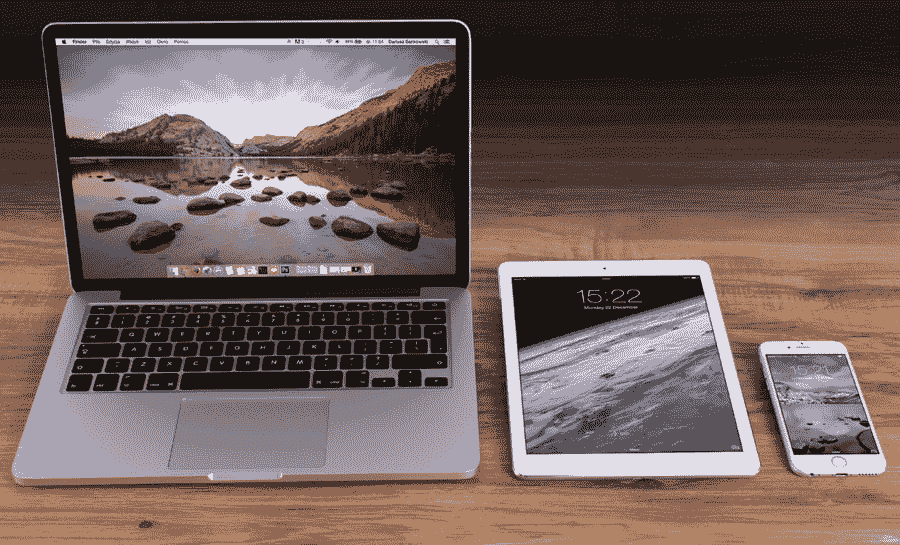

在我们自己发布了几个应用程序，观察了更多的应用程序，与几个应用程序开发人员交谈并测试了很酷的服务之后，我们对如何让 T2 的应用程序成功有了一个非常好的想法。

我们已经在[我们的博客](https://www.apptamin.com/blog/ "The Apptamin Mobile App Marketing Blog")和[推特](https://twitter.com/apptamin "Apptamin on Twitter")上分享了一些精彩的内容。

…现在是时候做更多了。我们希望回答读者提出的问题，例如:

*   我将如何着手推出一款新的 iOS 应用程序？
*   我能做些什么来确保人们下载我的应用程序？

这篇文章旨在教你我们所知道的关于发布和营销 iPad 或 iPhone 应用的一切。

这不是一个“秘方”，可能也不详尽(但我们正在尽最大努力做到这一点)。每个 app 都不一样，营销策略也应该不一样。但这是一个很好的起点，给了你可以尝试的选择，从[应用商店优化技巧](https://www.apptamin.com/app-store-optimization/ "Our best ASO resources")到[利用视频获取用户](https://www.apptamin.com/ "check out our video ad production services")。

这也不是一个循序渐进的过程，有些事情必须同时进行。以下是涵盖的内容:

## 建立你的个人在线形象

独立于你的应用程序，建立你的个人在线形象至关重要。让我们面对现实吧，你的大部分应用营销将在网上或手机上完成，所以你需要在这些媒介上吸引你的潜在客户和合作者。

在本节中，我们将向您展示为什么拥有强大的在线/移动业务至关重要，以及如何从现在开始打造。

建立你的个人在线形象也很重要，因为这有助于你建立一个独立于你的应用程序、职业甚至你创办的公司的追随者。例如，假设你在脸书、推特和 Instagram 上建立了一个健康的追随者。也许你总共有 30，000 名粉丝，加起来。

当你发布你的应用程序时，你现在有 30，000 个追随者，你可以向他们展示你的新应用程序。这可能会也可能不会导致大量下载，但无疑比从零开始要好。

现在……假设你的 app 做的不是很好。也许你想出去找份工作，开发另一个应用程序，或者在一个完全不同的行业开一家公司。

在未来的努力中，你可以利用你的个人追随者。

像加里·维纳查克这样的人已经建立了一个巨大的个人品牌，对他做的任何项目都有帮助。想想你怎样才能做到同样的事情。

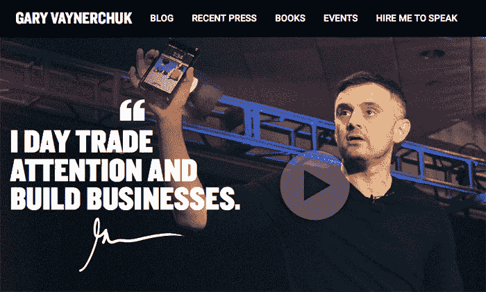

所以不管你对脸书、推特或任何其他社交媒体平台有什么看法，你都应该马上开始使用它。

### 开始建立追随者的地方

首先，考虑建立自己的网站。不一定要花里胡哨的，也许是一小段关于你的话，一个联系方式。当你花时间建立一个简单的网站时，这有助于提高你的可信度。

接下来，寻找与你想见的人互动的地方。

在脸书，你可以加入应用企业家和营销人员、移动营销专家、应用商业企业家或 BluecloudSelect 等团体，在那里你会遇到其他独立开发者和公司，并分享学到的经验教训。不断有新的团体出现，所以花些时间去了解那里有什么。

也可以考虑建立自己的脸书页面。是的，这看起来有点自恋，但是你可以保留这个页面，保持它的私密性。把它作为一个公共场所来分享你的想法，特别是如果你保持你的个人脸书帐户的私密性。

之后，Twitter 可能是下一个最好的去处。如果你还没有在 Twitter 上，可能有一个非常好的理由…大多数人要么喜欢它，要么讨厌它。

但它确实是与人互动的最佳场所之一。一些不会回复邮件的人会回复推特。所以暂时把你对 Twitter 的看法放在一边，诚实地尝试一下。

然后，看看其他你可以开始与人交谈并建立声誉的在线社区。向他人提供真正的价值，他们将更有可能追随你。

以下是让你开始的一些想法:

*   Reddit
*   Quora
*   产品搜索
*   照片墙
*   油管（国外视频网站）

这有点超出了大多数网站告诉你的应用程序营销的范围，但从长远来看，建立个人品牌可以带来巨大的回报。

## 验证你的想法

你认为你的 iPhone/iPad 应用程序的想法很棒。但是确认一下也无妨…对吧？

你将投入大量的时间、精力和金钱来构建你的应用。所以你要合理地确定人们正在寻找一个像你这样的应用。

因此，你要做的第一件事就是评估需求。你想知道这款应用的下载量和收入是多少。

**首先，在 App Store 上找到所有与你想要创建的应用相似的应用。**与许多人的想法相反，拥有成功的竞争对手通常是件好事。

你只是不想拥有太多。

说明你的 app 是有市场的。由你来决定你是否能做出比他们更好的应用，让它稍微有些不同，或者更好地营销你的应用。

如果没有像你这样的应用程序(或者现有的做得不好)，那么你应该重新考虑你的想法。它可能没有市场。

寻找竞争对手的一个简单方法是使用像 Mobile Action 这样的 ASO 平台。他们会给你一份你的应用的竞争对手名单，或者你想研究的任何其他应用。要获得 ASO 平台的完整列表，请务必参考我们的[营销工具箱](https://www.apptamin.com/blog/app-developer-tools/)。

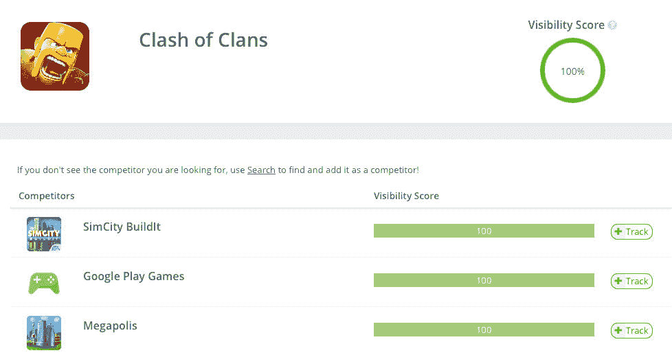

现在你已经有了一个应用程序列表，是时候弄清楚他们获得了多少下载量和他们获得了多少收入了。你可以使用像 Apptopia 这样的平台来获得评估。同样，这只是一个例子，参考我们的[工具箱](https://www.apptamin.com/blog/app-developer-tools/)去找其他的 **app 智能平台**。

请记住，你从这些平台获得的任何下载或收入数字都是基于它们的算法的估计。因此，比较几个平台会很有帮助。

但这只是初步检查。如果你想更深入地了解如何做市场调查，请阅读这篇关于[验证应用创意](https://www.apptamin.com/blog/how-to-validate-your-app-ideas/)的详细文章。

你的市场调查也可以通过直接交流你的应用想法，并创建一个登陆页面来测试你的想法。查看本文“[在线展示](#landing "Landing page for Kissmetrics' Analytics app")”部分中的 Kissmetrics 示例。

## 查看挖掘

不管你是在打造一款季节性应用，还是在追逐潮流，或是瞄准一个利基市场。分析你的竞争对手在做什么(是的，你有竞争对手)，然后**在 App Store** 上阅读他们的用户评论。

如果你已经发布了一个应用程序，你也应该仔细阅读你的应用程序的评论。检查评论基本上有三个好处(也称为**评论挖掘** )…

### 发现你的应用必须具备的特性

首先，看看人们是如何评价你的竞争对手的……有好有坏。

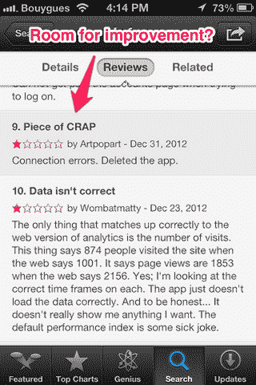

最好的开始方式是阅读一星和五星评论。这是一个信息的金矿，因为它确切地告诉你人们对其他应用程序的爱与恨。

在某些情况下，二星和四星的评价可能更好，因为这些人实际上是在提供高质量的反馈，而不是发泄他们的愤怒或简单地表达他们对应用程序的热爱。

如果你的应用在某些方面做得更好，那么你可以在你的营销中突出这一点。如果你还没有推出应用程序，那么这是你应该在应用程序中改进的地方。

也看看人们在其他应用程序中赞不绝口的是什么。这将是你必须包含在你的应用中的特性(假设它不是专有的)。

像 Sensor Tower 这样的平台使得这个过程比你自己手动阅读所有评论要容易得多。他们的工具允许你对评论进行分类，按关键词搜索，按类别标签查看评论。

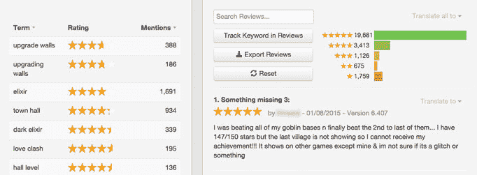

Image: Sensor Tower

正如你所看到的，仅仅通过检查你的竞争对手的评论，你就可以获得大量关于你的市场需要什么的信息。

但这还不是全部…

### 了解如何改进您的应用

接下来，如果你现有的应用有一些问题，现在是时候发现它们了。通读你所有的评论，看看人们在抱怨什么。

如果你已经这样做了，那么干得好！如果没有，那么我们完全明白…你很忙。

让它成为一种习惯，因为这是与用户保持联系的最简单的方式之一。

### 了解黑仔的新功能

最后，阅读你的评论可以帮助你发现别人还没有的新功能。想一想……

人们可能会要求一个特性，但是如果应用开发者不关注他们领域的评论，他们就会错过一个绝好的机会。你所在领域的下一个杀手级功能可能就在你的眼皮底下！

所以每个月花些时间通读评论。谁知道你会发现什么。

### 如何快速通读 iTunes 上的 App Store 评论

要开始挖掘评论，这里有一些快速浏览 iTunes 评论的技巧。使用现有的审查挖掘工具将加快这一过程，但它们通常需要钱。

这是你可以免费做的，但是这个过程需要更多的手动操作。这将需要更长的时间，但如果你没有太多的评论需要通读，这可能是好的。

iTunes 上有四类评论:

*   非常有帮助
*   最关键的
*   最近
*   最优惠的

您可以从屏幕右侧的“评论”部分的下拉菜单中选择您正在查看的类别。确保在顶部选择了*当前版本*，这样您就可以看到最近的评论。

在你看完最近的评论后，如果你需要更多信息，你可以看看所有版本的评论。

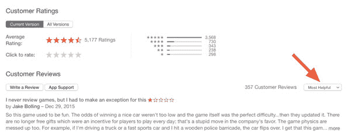

选择您想要检查的类别并开始滚动。记得在你发现的东西上做些笔记。

你的应用必须有人们想要的东西。回顾挖掘可以帮助你解决这个问题。

要深入了解 Review Mining，[阅读这篇文章](https://www.apptamin.com/blog/review-mining/)。

## 选择您的收入模式

选择正确的收入模式是一个让许多应用开发者夜不能寐的决定。

在我们深入探讨收入模式之前，并不是所有的应用都不赚钱。我认为在两种情况下你不一定需要一个收入模型:

*   你开发 iPhone 或 iPad 应用只是作为一种爱好
*   你只是想获得用户，与其他应用进行交叉推广

因此，当你研究其他应用程序时，请记住这一点。出于这些原因，一个成功的应用程序可能无法实现应有的盈利。因此，要警惕模仿一个有不同目标的应用程序。

现在我们已经解决了这个问题，让我们来看看您可以实施的不同收入模式。这些策略有不同的变化和组合，但本质上，有七种基本的赚钱方法。

*   **一次，预付费用**–最直接，但不是最理想的。原因是你要支持越来越多的用户，你必须让更多的用户来支付你未来的开发成本。
*   **预付费用+应用内购买**——这可能是最难的推销，因为你要求人们支付两次费用。它只在特定的领域有效。
*   **免费+应用内购买**——世界上大多数盈利高得离谱的游戏都采用这种模式。*这应该是你首先应该探索的收入模式之一。*
*   免费(“精简版”)+付费版–如果你有一个强大的价值主张，可以在你的应用程序的免费版本中展示，这可能是一个很好的模式。
*   **免费+广告**–广告通常是一个四个字母的词，但如果你没有其他选择，它可以是一个很好的收入模式。考虑提供移除广告的应用内购买。
*   **订阅**-这种模式越来越受欢迎，因为它提供了经常性收入来支付未来的开发成本。
*   **交叉推广**——正如我上面提到的，你可能想要创建一个完全免费的应用程序来获得大量用户。然后你可以在免费应用中交叉推广你的付费应用。

哪种收入模式最适合你的应用？这真的取决于你的应用程序的类型。

这就是市场调研发挥作用的地方。看看你所在类别中其他成功的应用都在做什么，这会给你一个最好的开始。

### 选择你的应用价格

如果你有一个付费应用，你可以尝试你的定价，但是要小心你给潜在用户的印象。从更高的价格开始并“降价”比突然收取两倍的价格更容易。

你可以向人们收取的价格取决于你的目标受众和你的应用。有些人会乐意花 9.99 美元买一个应用程序。但人们甚至不会为其他应用支付 0.99 美元。

### 拯救市场研究

就像应用程序营销中的大多数其他事情一样，市场研究将是你最好的顾问。看看你所在类别的成功出版商是如何为他们的应用程序定价的，这将为你提供重要线索，让你知道什么是有效的。

下面是 Sensor Tower 对前 50 名付费 iOS 应用的定价策略进行的一项研究的例子。正如你所看到的，在每一类中，什么是可以接受的，有很大的不同。

有些应用收费 200 美元甚至更多！

因此，在你匆忙做出定价决定之前，先做些功课。这可以带来巨大的不同。

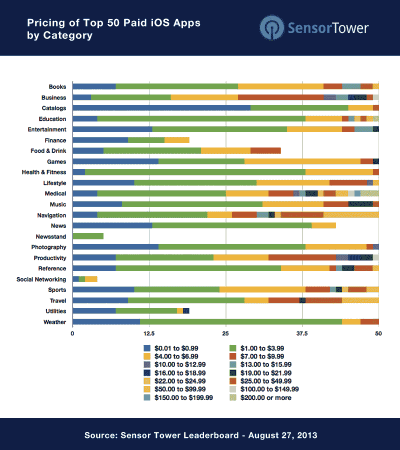

### 你的定价能支付账单吗？

在给你的应用定价时，考虑你的开发和营销成本也很重要。你的定价能覆盖你的成本吗？

如果你还没有发布应用，或者你仍在优化过程中，并期待在不久的将来会有更好的数字，那么你可以使用上面的[验证你的想法](#validate-idea)部分中的下载和收入估计。

记得在你的预测中保持保守。我们知道您热爱您的应用，但您的成功取决于合理的评估。

## 选择正确的名称

为产品选择正确的名字从来都不容易，应用程序也不例外。

苹果允许你的应用程序名称中有 255 个字符，但这并不意味着你应该全部使用它们。当然，一些应用程序已经成功做到了这一点…

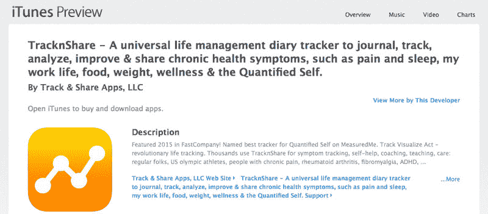

但在大多数情况下，你的名字越长，你的应用在审核过程中被拒绝的可能性就越大。事实上，目前大多数名字很长的应用程序通常已经有一段时间没有更新了。

从苹果公司允许这么长的名字开始，他们就有了自己的名字。现如今，最好做到以下几点…

我的建议是找一个名字，不仅听起来好听，而且**非常有描述性，并且包含一个主要关键字**。如果你有一个相机应用程序，你需要一个能暗示摄影和相机的名字。

提交您的 iOS 应用程序时，您还需要一个“扩展名称”你的应用名称和几个关键词(像一个浓缩的标语)来清楚地说明你的应用是关于什么的。

这很重要，这样用户可以查看你的应用页面，也可以找到它。我们关于[应用商店优化(ASO)和选择正确的应用名称](https://www.apptamin.com/blog/app-store-optimization-aso-app-name-and-keywords/ "App Store Optimization (ASO): App Name And Keywords")的文章应该会有所帮助。

在 Stewart Hall 对热门应用程序名称的研究中，他展示了一些有趣的结果。他发现大多数成功的应用程序都有一个 2-6 个单词长的名字，使用不到 30 个字符。绝大多数在应用名称和描述之间有一个连字符。

当然，这些只是指导方针，个人情况会有所不同。但是一般来说，你应该包括你的应用程序名称，后跟一个连字符，然后是 1 到 3 个非常有描述性的关键词。

### 其他应用命名注意事项

除此之外，你应该考虑你的应用名称的**未来营销潜力。这并不适用于所有的应用，只是取决于你的目标是什么。**

如果你做游戏是为了好玩，或者只是为了感受一下应用程序的构建过程，那么你可能不需要这么做。但是如果你正在为你的企业开发一个严肃的应用程序，那么你当然需要考虑这些事情。

**即使你不打算使用这些资产，你也应该保留它们，这样其他人就不能使用它们:**

*   是。com 域名可用？如果没有，该域上有什么吗？如果那里没有已经建立的站点，您可以考虑使用。co 或. io。
*   你的应用程序名称有社交媒体句柄吗？显然，获得简单的帐户名变得越来越困难，但是举个例子……如果我们不能获得@apptamin，那么我们可以尝试@ apptaminvideos 或类似的东西。使用 Knowem 这样的网站一次搜索多个网站。
*   最后，还有其他类似名字的 app 吗？你不想混淆视听，也不想因为侵犯版权而惹上麻烦。

如果你没有主意了，浏览应用商店，看看其他应用在做什么。

## 在你的应用中开始营销

应用营销不应该是事后的想法。

营销一个弱 app 是没有用的，有某些方面是一开始就不得不考虑的。以下是需要考虑的事项…

### 用户体验(UX)

你的应用程序的用户体验对其成功至关重要。你的应用应该从第一秒开始就易于使用(你不会得到比这更多的关注)。

有人认为，如果你的应用程序需要一个演练，你搞砸了。这可能不完全正确，但你明白了。人们可能不会像你预期的那样使用你的应用程序，但你仍然必须尽最大努力让他们容易使用核心功能。

创建模型，尝试不同的事情，向合适的人寻求反馈。对于你的模型，你可以使用像 Balsamiq、Evolus 的铅笔或非常方便的 POP iPhone 应用程序(用一些点状纸)这样的工具。

在我们的应用营销[工具箱](https://www.apptamin.com/blog/app-developer-tools/)中获得原型工具的完整列表。

一旦你有了第一份草稿，花上几美元，向 UX/用户界面专家寻求建议。如果你一个都不知道，试着通过 Clarity.fm 联系一些人。

不要指望他们为你做所有的工作(除非你有钱)，但是你会惊讶于一个 30 分钟的电话能给你多少洞察力。有时你需要的只是正确的联系。

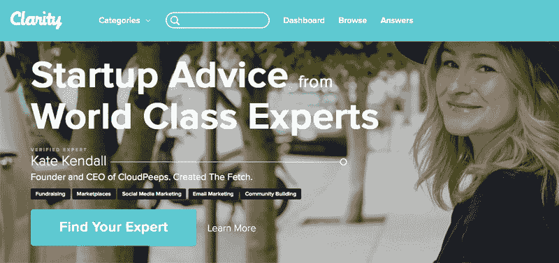

### 设计

你需要一个惊艳的设计。如果你不是设计师，请一个好的。在我看来，这是**你能做的最好投资之一**。

找一个很棒的设计师，可以用 Crew 这样的网站。这是一个只接受邀请的自由开发者和设计师的社区。

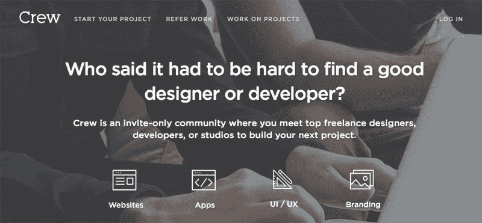

你的设计需要连贯一致。这意味着你的应用程序的不同部分应该有相同的感觉，并且你创建的任何视觉资产(包括你的应用程序图标)应该与你的应用程序设计保持一致。

**细节要紧**。像声音和事物如何运动这样的小事给用户一种总体上良好的感觉，并且可以产生影响。

这里有一篇关于旋转应用设计的[有趣文章，讨论了几个要点。了解他们如何从苹果公司获得一些伟大的想法，如何将他们的界面提升到一个新的水平。](http://mashable.com/2012/12/20/spun-ios-design/ "Designing a Killing App")

还要考虑你的应用在 Android 和 iOS 上的外观。虽然你的应用应该看起来非常相似，但你必须考虑一些微妙的差异，以及苹果和谷歌的指导方针(材料设计)。

无论是在用户体验、设计还是代码方面，当你在应用中使用最前沿的东西时，苹果都会很欣赏。率先为 iPhone 6 优化或使用 Passbook 让几款应用获得了额外的曝光率。

因此，请密切关注苹果公司的声明。

### 用户保持率

这是最难做对的部分。

如果你的 iPad 或 iPhone 应用程序很棒，而且你营销得很好，你应该会得到一些关注。你应该能够让它得到审查，获得一些下载，并把它放在人们的手中。

应用评论和高下载量很好。恭喜你，你让人们有足够的兴趣下载你的应用。

现在怎么办？

他们用了 30 秒就离开了吗？他们会回去两次，然后再也不打开吗？或者更糟，他们只是卸载它吗？

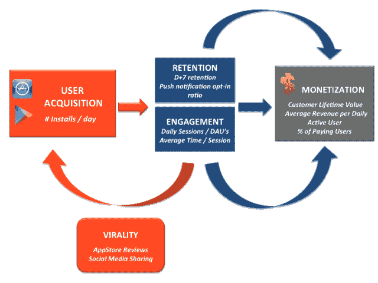

You want your users to come back and stay engaged (image source: AppLift)

推送通知是让人们继续使用你的应用的一种方式。但是不能只靠推送通知。你的应用程序的概念和用户体验必须让人们不断回到你的应用程序。

如果人们没有像你认为的那样经常使用你的应用，是时候找出原因了。第一步是检查你的分析，找出你的应用程序中用户流失的地方，以及导致这种情况的原因。

另外，通读你的评论，看看你是否能找到人们停止使用你的应用的原因。调查你的一些用户，了解他们对你的应用的看法也是有帮助的。

最后，你的保留指标对于你的类别来说可能是正常的。想知道你的应用与同类产品相比表现如何？看看这篇文章。

想了解更多关于 LTV 的信息，请阅读我们博客上的这篇文章。

### 共享机制/病毒方面

这是另一个棘手的问题(是的，有几个)。

问题是所有的下载高峰最终都会消失。

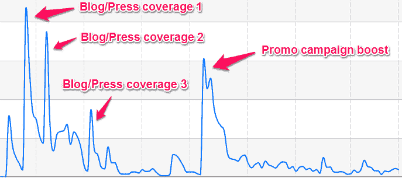

A lot of app download charts look like this. You need organic growth, too.

登上排行榜很难，但却是可行的。

待在那里要困难得多。

在任何情况下，你都必须继续推广你的应用，并给予它应有的关注。但这不可能是它传播的唯一方式…

*   你需要用户成为你的营销人员。
*   你需要用户和他们的朋友谈论它。
*   你需要用户自己分享内容。

这意味着你必须弄清楚你的应用程序有哪些可以“传播”,允许人们分享内容，通过脸书开放图等方式充分利用社交媒体。那些“可分享”的方面将取决于你的应用，并且是它成功的关键。

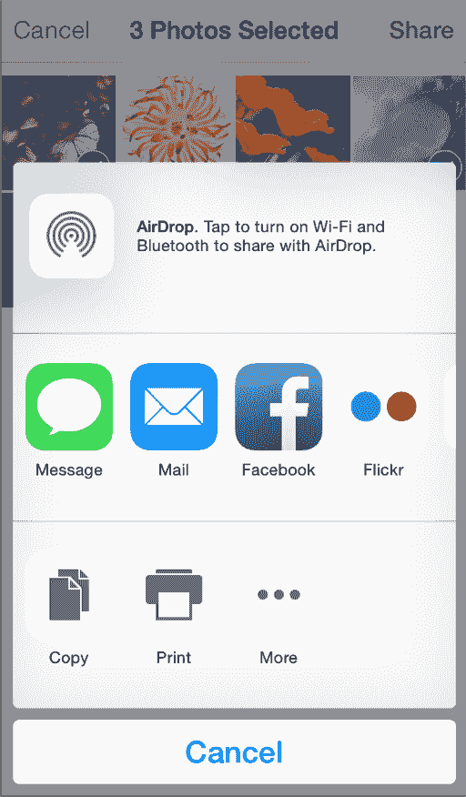

Image: Apple

一旦你想出你想让人们分享什么，你需要给他们这样做的能力。幸运的是，苹果让这很容易做到。

阅读苹果开发者图书馆的这一部分,获得实现社交分享的最佳实践。他们建议不要要求用户登录社交媒体账户来分享。您可以从支持单点登录的帐户框架获得身份验证。

### 反馈和客户参与

拥有快乐的用户对你的应用的成功至关重要。

拥有优秀的应用评分(4.0 以上)和用户评论会增加你的应用页面的转化率。越多的人看到其他人喜欢你的应用程序并对它感到满意，他们尝试它的机会就越大。

为了提高你的评分，你需要两样东西:

1.  一个伟大的应用程序
2.  一种将好评发送到 App Store 并将差评发送到您的支持的方法

要发现人们在使用你的应用时遇到的任何问题，你需要能够方便地联系到他们。不要等到负面的应用评论出现时才知道有 bug、需要的功能或应用崩溃。

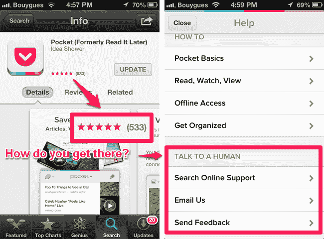

Be easy to reach (and have a great app).

**允许用户联系您。**

*   让他们在应用程序中从**联系您。**
*   让他们从 **App Store 页面**(支持 URL)联系您。
*   让他们从你的**网站**或通过**社交媒体**联系。

一旦他们联系你，你需要听他们的。回答他们。按照他们的建议去做(或者考虑一下)。

尽你所能把一个不开心或不满意的用户转变成一个理解应用程序背后有一个人的人，一个关心用户的人。

一旦你成功地处理了一个请求或问题，这些用户通常会很乐意给你留下一个很好的评价。

允许人们通过电子邮件或推文在应用程序中联系你。也可以使用 Apptentive 之类的应用内反馈 SDK。

An example of Feedback/Ratings SDK, here with [Apptentive](http://www.apptentive.com "Apptentive Feedback")

就像我们在[关于应用评级的帖子](https://www.apptamin.com/blog/app-store-optimization-app-ratings/ "App Store Optimization (ASO): Improve Your App Ratings")中详述的那样，像 Apptentive 这样的工具让你做的不仅仅是接收反馈。他们通常会邀请开心的用户对你的应用进行评分，同时为不开心的用户提供一种从应用内部联系你的方式。

这是巨大的，因为基本上有两种类型的客户:有声的和无声的。如果客户不说话，你永远不会知道哪里出了问题。他们将永远消失。

**客户反馈工具可以帮助你防止这种情况发生。**

一些工具允许您识别用户群，并通过推送通知或其他方法联系这些用户。这是让人们了解你的主要应用新闻(内容、功能等)的好方法。)并让他们回到你的应用程序。

但是不要滥用它，保持你的通知的相关性。

### 衡量用户留存率，了解人们如何使用你的应用

下载量很重要，也是衡量应用成功的一个关键指标。但是就像我们说的，这不仅仅是下载量的问题。

你还需要人们继续使用你的应用。这当然不是一件容易的事。

根据尼尔森的一项研究，人们在智能手机上使用的应用程序数量相对保持不变。因此，如果你不在这“前 26 名”，你的收入和关键词排名将受到影响。

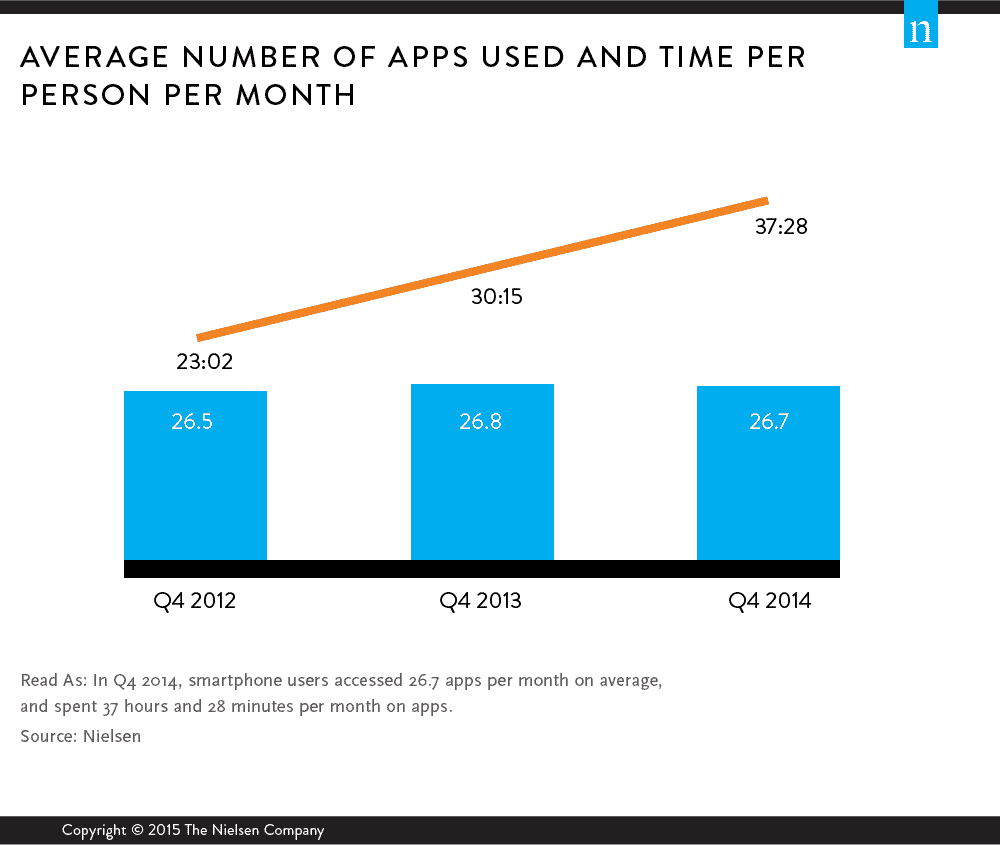

幸运的是，您可以在 iTunes Connect 仪表板中获得您的用户保留统计数据的摘要。这里有一个你将会看到的例子。

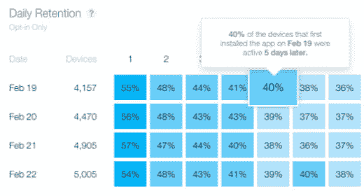

所以你认为你做了所有正确的事情，但是你的留存数字并没有显示出来。你下一步应该做什么？

人们可能不会像你预期的那样使用你的 iOS 应用。如果能知道他们使用了多少次，回来了多少次，如果他们分享了，他们使用了什么功能(以及你可以删除哪些功能)，这不是很好吗？

好消息是，有许多很棒的工具/SDK(其中一些是免费的)可以让你做到这一点。查看我们的[应用分析工具综述](https://www.apptamin.com/blog/app-analytics-tools/ "Learn How People Use Your App – An App Analytics Tools Round-Up")以了解更多信息，并选择最适合您应用的工具。

一旦您安装了分析解决方案，您还需要对您的用户进行群组分析。群组仅仅是一群拥有特定特征的用户。

例如，你可以有一群在同一天注册的用户。通过观察这些群体，你会注意到如果人们熬过了第三天，他们通常会成为好的长期客户。

因此，你可以设置特定的策略来确保人们在第三天使用你的应用程序，这样他们就有更好的机会留下来。

### 衡量你的应用营销渠道的有效性

为了推广你的应用，你要尝试各种各样的东西。

你将通过多种渠道让人们了解它。知道哪些是最有效的不是很好吗？

通过了解这一点，你可以决定什么是值得的，什么是不值得的。你可以关注什么能带来最多的下载，或者更好地关注什么能带来最高的收入。

但就像网络归属一样，追踪下载的来源并不总是那么容易。

像 Tune，AppsFlyer，Apsalar，Google Analytics 和 Optimizely 这样的公司都有解决方案，可以帮助你了解哪些推广渠道是最好的。对于他们如何处理归因，Tune 有一个特别好的解释。

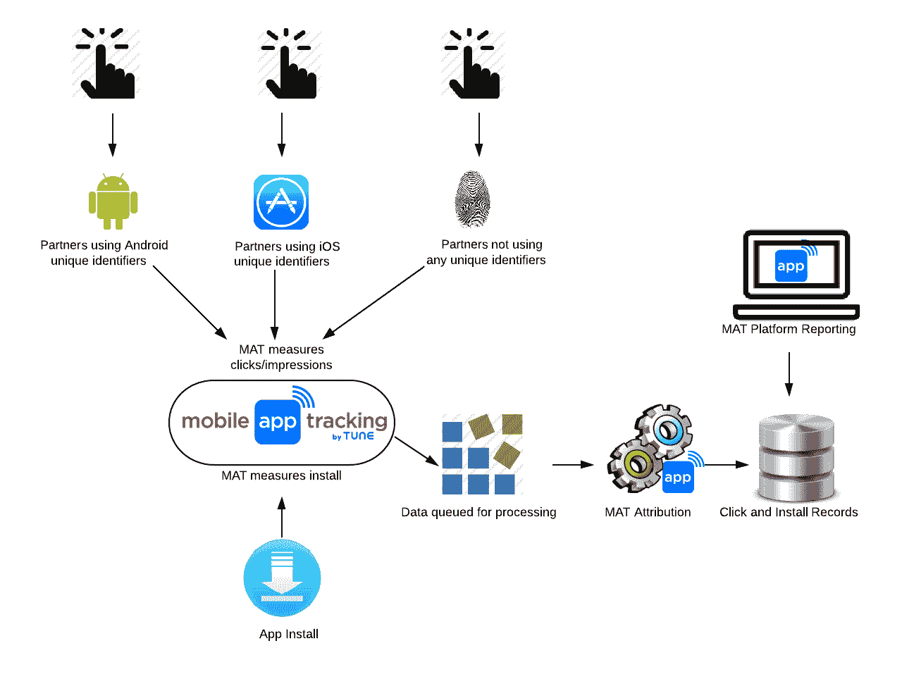

Image: Tune

### 广告交换

如果你是一名独立开发者或者一家初创公司，你可能预算有限。在这种情况下，付费广告通常是你最不愿意花钱购买的东西。

幸运的是，你仍然有一些选择。这里有几个你应该探索的选择。

像 TapForTap 这样的服务可以让你进行免费点击交换:你只需与其他应用开发者交换点击。你可以为其他应用程序显示广告，赚取积分，并将这些积分用于你自己的应用程序。

如果你不介意广告横幅(你可以在应用内购买，包括移除)，那么这可能是一个传播你的应用的好方法。你也可以通过在你的应用中显示付费广告来赚钱。

类似的平台是 Tapdaq。它允许你开始交易安装在 3 个步骤。

该平台确保您获得的安装数量与您帮助其他应用获得的数量相同。它非常适合在其他应用程序上推广您的应用程序，或者在您自己的应用程序组合中推广您自己的应用程序。

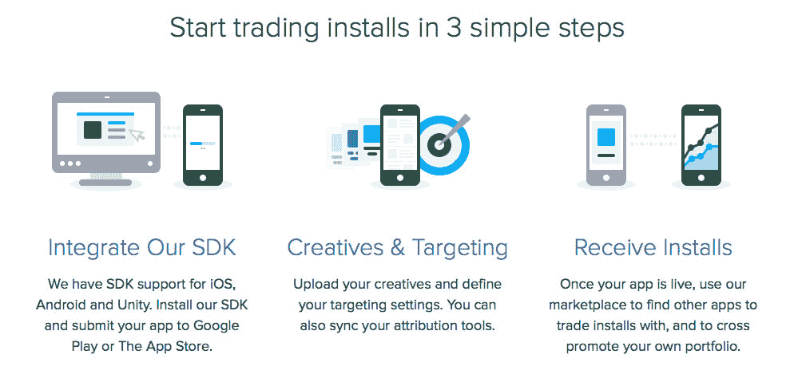

Tapdaq services

## 建立您的应用程序的在线状态

不能只靠 App Store 页面。你需要人们在网上找到你的 iPad 或 iPhone 应用。你需要一个地方来推荐人们(博客、记者、陌生人)，你需要围绕你的应用建立一个社区。

这意味着至少要有一个网站(可能还有一个博客)，并使用主要的社交媒体平台。这一部分将向您展示首先要做什么。

如你所见，有很多可能性，很容易迷路…

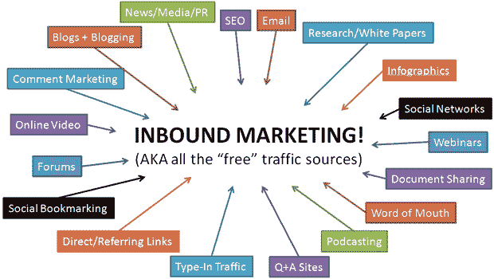

Your app needs more than a page on the App Store (image source: SEOMoz/Tapstream)

### 网站和博客

你应该什么时候推出你的网站？

**现在！**

你不仅需要为你的应用程序建立一个网站(或者至少一个页面)，而且[你需要尽快创建它](https://www.apptamin.com/blog/create-your-apps-website-before-your-first-line-of-code/ "Create Your App Website Before Your First Line Of Code")。

您最终会需要一个来获得支持和品牌推广，所以您最好在发布之前创建一个。设置一个基本页面不需要太多时间，也不需要很花哨。

你可以在一个周末建立一个简单的网站。更好的是，你可以雇人在一个周末把它弄起来。🙂

**你的应用程序网站会不断发展，所以不要担心在第一次**左右就让它变得完美。你可以从登陆页面和邮件列表订阅表单开始，然后添加博客，然后添加下载链接，最后添加推荐和优秀的用户评论。

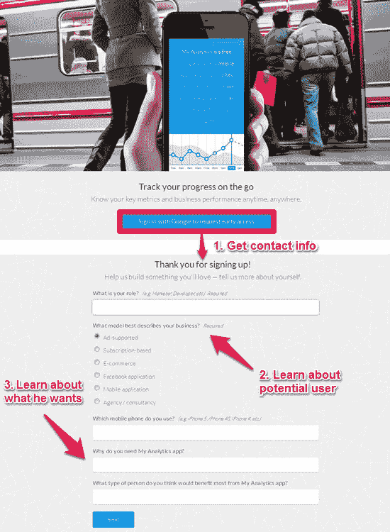

Kissmetrics gets potential users’ emails, learns about them and their needs (MyAnalytics).

所以一旦你有了你的应用程序名称，它的概念和一些截屏设计，你就应该着手[创建你的应用程序网站](https://www.apptamin.com/blog/app-landing-page-or-website/ "How To Create A Free App Landing Page Or App Website?")。以下是您应该考虑的事项…

#### 你的应用程序网站的关键要素

你的应用程序网站是你展示你的应用程序最好的一面并向访问者推销它的地方，也是你真正解释你正在解决的问题的地方。

你希望它性感、易于浏览和阅读。

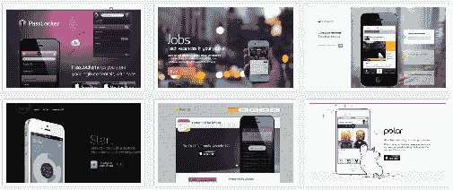

Need some inspiration? Check out [Appsites.com](http://www.appsites.com/ "App Sites")

有[几个元素你需要包括](https://www.apptamin.com/blog/key-elements-app-website/ "The Key Elements For Your App Website")(或者至少考虑):

*   应用名称和应用图标
*   应用程序可用的设备(内部有应用程序截图或应用程序的视频截图)
*   应用推介:一个简短的句子，解释你的应用是什么，为什么它是必须的
*   可以下载应用程序的移动应用程序商店的徽章(最新的)
*   [行动号召](https://www.apptamin.com/blog/app-download-button/ "Call To Action: Make Sure Your App Actually Gets Downloaded"):应用发布前的邮件列表订阅表单；以下时间后下载按钮
*   [应用推广视频](https://www.apptamin.com "App Demo Video and App Trailers"):人们初步评估你的应用的最快方式
*   社交证明元素(一旦应用发布):客户评价、用户评论、获得的奖项、苹果功能等。
*   关键优势和截图:应该更详细地解释你的应用程序带来的价值，并展示其主要截图
*   联系/支持信息:让博主和用户都能轻松联系到你
*   社交媒体信息:链接到您的社交媒体帐户，脸书喜欢按钮(到您的页面或应用程序)，推按钮。SumoMe 有一个很棒的免费 WordPress 插件，你可以用它来分享按钮。
*   你可能认为它已经过时了，但是你仍然需要它
*   链接到您的其他应用程序(如果您有其他应用程序，并且与您的应用程序受众相关)

以下是一些关于创建有效登录页面的博文:

#### 写博客还是不写博客？

一些人认为博客对一个应用程序或者任何商业都没有用。

我们完全不同意。我们围绕内容营销和在我们的博客上分享东西(以及考虑到性能而创建的[应用程序视频](https://www.apptamin.com/our-work))建立了我们的业务。

如果你不相信[写博客](https://www.apptamin.com/blog/)会有效，这里是我们目前网站流量的快照。图上的每一点都是一天的交通流量。它没有其他网站那么多，但它一直为我们工作。我们一直在扩大我们的流量，所以我们目前的数字可能比你在下面看到的要多得多。

但是这种稳定的网站访问者流为我们的视频制作服务提供了有价值的线索。想想这将如何提高你的应用下载量。

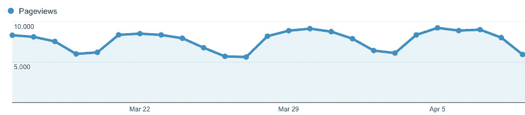

但是我们明白。写博客确实会占用你本可以做的其他事情的时间和资源，而且没有回报的保证。

很公平。

**但是这样想想…**

如果你有一项资产:

*   是你的 24/7/365 公关，几乎零维护(或成本)
*   通过回答有关您应用的常见问题，减少支持需求
*   充当几乎免费的销售人员，销售你的应用并获得下载
*   通过提供人们想要的有价值的信息，在你的领域创造良好的声誉
*   帮助人们与你的应用建立情感联系

这是每一篇博客文章能给你的。显然，并不是每篇博文都会做得很好，但如果你专注于创作有用且有趣的博文，有些博文会做得非常好。

这是古老的 80/20 法则。但是前 20%的帖子会让这一切变得有价值。

对于您的应用程序，博客也是一种很好的方式:

*   通过分享应用程序的构建流程和设计吸引(未来)用户。
*   让他们了解正在发生的事情:启动、[应用程序更新和新功能](https://www.apptamin.com/blog/updates-app-promotion/ "How to Use Updates To Promote Your App")。
*   分享关于你的应用所处的细分市场、你的使命的精彩内容，或者教给人们一些东西:一个生产力应用可以有一个博客，上面有提高生产力的技巧(就像 Buffer 做得非常好)，一个足球应用可以有关于主要足球新闻、球员等的内容。

你分享的内容越多，你的应用就越受关注。

如果你刚刚开始，这里的是一个资源，有几个指南可以帮助你。

#### 文案

你的应用有网站和博客是一件好事。

但是如果你的文案很烂，那就没什么用了。

如果你的应用程序推介只有 10 句话，人们就不会去读它。如果你的博客充满了错别字和无聊，你就不会吸引人，你也不会把访问者变成顾客。

同样，如果你的应用商店页面上的描述让人们望而却步，那么你的应用就不会成功。

你需要让人们想要你的应用。

你可能很擅长编码和设计应用程序。你还必须提高营销和文案能力。

从我们见过的大多数创业公司的创始人来看，大多数人都非常擅长其中的一项。很少有人两者都擅长。

因此，如果你还没有掌握这些技能，不要担心。你完全可以学习它们。

幸运的是，有几个很棒的网站可以帮助你做得更好，比如 Copyblogger。说到转换优化，我真的很喜欢读疯狂蛋博客。

一个常见的错误是试图在你的文案中涉及技术或细节。这在文案中很少起作用。

保持事情简洁和信息丰富。你可能也不得不打破一些传统的语法规则。

…像这样。

#### 集客营销/内容营销

是的，你需要做一些 [App Store 优化](https://www.apptamin.com/app-store-optimization/ "App Store Optimization 101")。

但是你也需要人们在网上找到你。你不能只依赖应用商店作为你唯一的营销渠道。

忘记网络目录和付费链接。你需要开始构建和分享有趣的内容，这样人们才能了解和找到你。

我知道，说起来容易做起来难。有时很难知道它是否有效(这需要时间)或者什么有效。还记得我之前说过的关于衡量营销效果的话吗？

这就是它的用途。

给它一些时间，它不会在一夜之间发生。

如果你计划为同一个细分市场开发几个应用，内容营销是一个很好的方法。您创建的所有内容都有可能使这些应用受益！而当苹果再次更换 App Store 的时候，即使事情不尽如人意，你也不会有那么大的痛苦。

通过创建和分享优秀的内容，你也展示了这个应用背后有一个人/团队，以及建立信任。

首先，这里有几个途径可供你选择:

*   社交媒体营销
*   客座博客
*   播客(或成为现有播客的嘉宾)
*   [YouTube 视频](https://www.apptamin.com/blog/youtube-app-marketing-guide/)

#### 利用苹果预购功能

苹果现在允许你[让你的应用可以预购](https://www.apptamin.com/blog/apple-pre-order-app/ "Everything you need to know on Apple Pre-Order"):一旦你的应用被批准，你可以选择 2 到 90 天后的发布日期。然后，您的应用程序的产品页面就会出现在 App Store 上。

对你的应用感兴趣的人可以点击“预购”按钮。在发布之日，他们会收到通知，让他们知道他们预先订购的应用程序可用，并且您的应用程序会自动下载到他们的设备上！

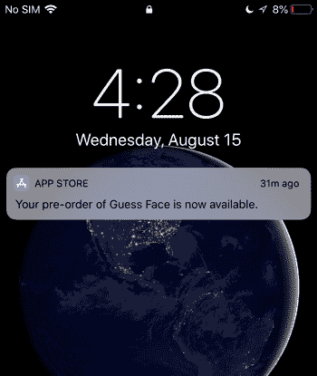

这很好，因为它让你能够**利用我们在这篇文章中讨论的应用程序的所有发布前营销**。你仍然应该建立一个电子邮件列表(见下文)，但这种预购选项可以让你在发布当天获得大量下载。

此外，因为你的列表是“实时”的，这意味着你的应用程序已经开始为一些关键词排名。非常适合应用商店优化！

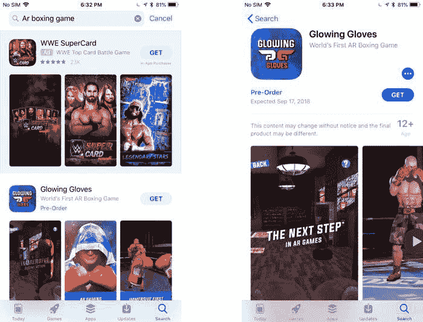

This boxing game is already ranked for some keywords!

这仍然是一个很容易被忽视的功能，它可以让你获得苹果的一个功能。把你的应用程序放在预购列表中后，立即通过[appstore.com/promote](http://appstore.com/promote "Pitch to get a feature")链接向苹果推销你的应用程序。

#### 正确的行动号召

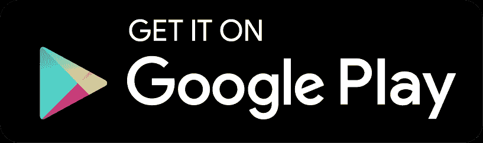

一旦你的应用程序发布，你希望你的应用程序网站的访问者下载它。

所以不要让他们寻找那些下载按钮！

**[显示可见的行动号召](https://www.apptamin.com/blog/app-download-button/ "Call To Action: Make Sure Your App Actually Gets Downloaded")** 。

以下是下载按钮的链接:

插入 app store 徽章，并考虑再添加一个。如果有意义的话，为什么不使用新的服务，比如通过短信分发应用程序或者直接把下载链接发送到人们的手机上呢？

如果你的应用还没有准备好，那么你的行动号召就是订阅你的应用邮件列表。

#### 钱在单子上

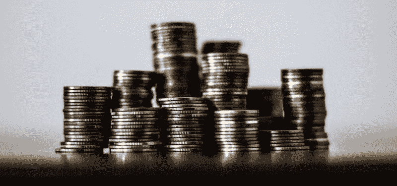

应用开发者仍然没有充分利用电子邮件列表。

订阅你的电子邮件简讯的人是你能够容易联系到并参与其中的人。只要他们仍然订阅，他们就给你权利**直接在他们的收件箱**中找到他们。

推文、脸书状态或任何其他社交媒体平台都是有用的。但是外面的噪音太多了。

有了电子邮件，你的竞争就少了很多。确保某人收到信息的最佳方式仍然是使用电子邮件。你的工作是选择正确的主题，告诉他们正确的事情，让他们不断打开它们。

虽然你的邮件列表在发布后仍然有用(在你的网站和博客上放一个表格)，但在你发布前它会更有用。

在你的预发布期间，在你的应用网站上放一个订阅表格，并使它成为页面上最明显的东西(见上面的行动号召)。

以下是使用电子邮件简讯的几种方式:

*   衡量人们对你的应用程序的兴趣(完全没有注册？可能出问题了)
*   让人们了解您的应用程序何时发布。不要忘记再次提及你的应用程序是做什么的，这样他们会记住你。
*   征求人们的反馈
*   让人们知道一个众筹活动
*   请人们为你的应用程序投票，以获得奖励或竞赛
*   让人们了解重大新闻和里程碑

一旦你开始发送电子邮件简讯，就要定期发送电子邮件(但不要太频繁)，这样人们就不会忘记你。使用 Mailchimp 和 Aweber 等服务来可靠地发送电子邮件。记住，密件抄送是给业余爱好者的，很有可能会把你的域名列入黑名单。

#### 在你的网站上最大化你的应用商店回报

众所周知，苹果(和谷歌)会从你销售的每一款应用或你产生的应用内购买中抽取 30%的份额。

这有点糟糕，但你对此无能为力。他们还允许你在他们的商店里销售你的产品。

无论你对此作何感想，我相信你都不想错过**获得额外 5%** 的机会。不仅是当有人购买你的应用程序时，而且是当他们在接下来的 72 小时内在 iTunes store 上购买任何东西时(只要他们没有点击另一个附属链接)。

现在的问题是，你不直接与苹果公司签约，而是与关联公司签约，主要是 LinkShare(美国、加拿大和墨西哥)、Tradedoubler(欧洲和巴西)和 APD(澳大利亚和新西兰)。

这意味着，如果你不想错过你的 5%，你必须与所有这些附属公司签约。幸运的是，Geniuslink 为你提供了一个解决方案(换取你 5%中的 15%)。

一旦你加入了这三家公司，你就可以在 Geniuslink 上创建一个账户。他们为每个应用程序提供一个 Geniuslink 链接，自动将用户重定向到正确的应用程序商店国家，这样你就可以拿到你的钱。这样，你就不必问自己应该使用哪个链接。

想了解更多？查看[这篇博文](http://reviewfordev.com/blog/app-store-affiliate-a-no-brainer-for-all-app-developers-tutorial/ "App Store Affiliate Program: a no brainer")和 [Geniuslink 网站](https://www.geni.us/ "Georiot")。你唯一要考虑的是，你是否能够将这与你追踪下载来源的方式结合起来。

另外:Geniuslink 也为亚马逊这样的国际联盟项目服务。得分！

### 推特

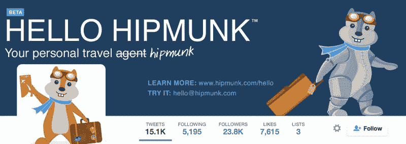

我之前在谈论建立你的个人在线形象时提到了 Twitter。

你的应用程序有一个 Twitter 账户也很有意义。许多早期用户使用 Twitter，这是一个与他们互动的好平台。

你可以使用 Twitter 来分享你的利基(无论是你的还是别人的)、你的应用新闻，甚至是支持。

你也可以使用 Twitter 联系记者和博客作者。这并不总是有效(尤其是如果他们不认识你的话)，有时最好用你的个人账户来做，但一条带有[宣传视频](https://www.apptamin.com)的推文可能会非常强大。

当你有其他开发者应该感兴趣的内容和重大新闻要宣布时，像 IDRTG(独立开发者转发推特小组)这样的推特小组可以帮助你接触到更多的人。

为了优化你在 Twitter(或脸书)上分享内容的时间，使用 Buffer 将你发出的推文排队，并在优化的时间自动发布。它甚至给你有用的分析。

你也可以使用 HootSuite 这样的工具来创建与搜索查询相对应的列表:这样你就可以通过了解别人何时在谈论你的应用程序或提到重要的关键词来找到可以进入的讨论。

时间不多了？我听到了。你可以使用 Edgar 自动回收你最好的内容…比如你的博客文章。

带来价值，互动，感谢人们的评论/分享，你可以快速建立稳固的追随者。

想找很酷的人和公司追随？查看我们的列表,看看我们在 Twitter 上关注了哪些人。

### 脸谱网

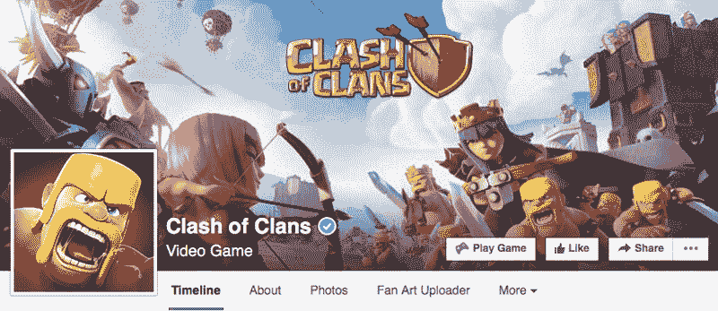

你的应用程序必须有一个脸书页面。即使你仍然对使用脸书进行营销犹豫不决，你也应该保留这个名字，这样你的竞争对手就不会盗用它。

脸书页面是吸引用户和潜在用户的好方法。你可以问他们对你的设计有什么看法，问他们想在你的应用中看到什么，你可以分享好消息，等等。如果你真的反对为你的应用程序建立一个网站，你也可以使用你的脸书页面来获得支持。

不过，不要只发布关于你的应用的帖子。那变得令人厌烦。

这就像在聚会上和一个只谈论自己的人交谈。

挖掘用户感兴趣的所有方面，并测试一些想法。例如，如果你有一个赛车应用程序，关于汽车调校的博客帖子可能会很有趣。或者 YouTube 上的赛车视频。让它变得有趣，人们会想看更多。

还要记住，脸书是一个很好的付费收购来源。你可以从脸书广告中获得的人口统计目标的水平是惊人的。

我将在本指南的后面详细讨论这一点，但现在请记住这一点…

### 谷歌+

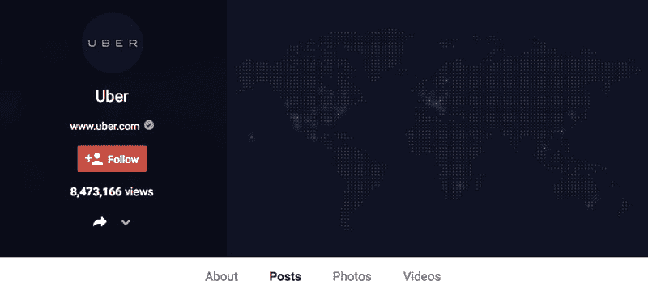

好吧，我感觉到有人在翻白眼…

但是说真的，如果内容营销是你获取用户策略的一部分，那么你应该把你的博客链接到你的 Google+账户。这是值得的，即使只是为了你在搜索结果中显示的那张照片。

如果你被视为你所在领域的专家，有时你可以出现在搜索结果中。分享你的网站链接只需要几秒钟的时间，为什么不马上完成呢？

## 获得反馈

你有一个很棒的想法，你已经做了[市场调查](https://www.apptamin.com/blog/how-to-validate-your-app-ideas/)，你知道你正在开发你的目标受众想要和需要的应用。

那很好。

但是如果你也向你的潜在用户征求反馈，你的应用不是更好吗？难道你不认为如果你询问你的开发者同行对你正在构建的东西的看法，你会创建一个更好的应用吗？

想法不值钱。最重要的是执行。

不要认为每个人都会窃取你的想法。

大多数人并不真的在乎，如果他们真的喜欢你的想法(或者以前有过),很有可能，因为你正在创建它，他们不会。一旦你的应用发布，任何人都可以窃取你的想法(他们甚至会知道人们喜欢或不喜欢你的执行)。

所以我的建议是:谈谈你的想法。

给所有愿意听你说话的人。听听他们要说什么，当涉及到他们的想法时，保持开放的心态(我知道，这很难)。这里有几种方法可以让你得到对你想法的反馈。

### 通过博客、电子邮件、调查和社交媒体获得反馈

正如我在上一节中提到的，你可以使用你的博客和社交媒体账户来吸引人们并开始对话。

如果你在网上有“个人”的存在，问问你在 Twitter 上的粉丝，他们对你的应用想法有什么看法。你可能会发现你不知道存在的竞争对手，并获得营销或新功能的有趣想法。

此外，不要在 Twitter 上害羞……随时联系手机专家，或者加入可能正在进行的对话。当然，你再怎么客气，也会有人不理你。只要不断尝试，你可能会惊讶，你得到的反馈类型。

在早期(一旦你致力于开发应用程序)，你应该询问你的博客访问者、粉丝和追随者他们对你的应用程序设计的看法:你的图标、你的主屏幕等等。你对你的图标有 4 个不同的概念？与他人分享，让他们帮助你做出选择。
/
既然你读了我们关于[建立邮件列表的博文](https://www.apptamin.com/blog/grow-app-marketing-email-list/)，你可能也有一个邮件列表。你可以用 Google Docs 或 Survey Monkey 发送一份调查列表。

记得让你的调查简短，特别是当你要求人们填写时，不要给任何报酬。要获得一些关于如何创建一个能揭示人们内心深处欲望的调查的好建议，请阅读这篇博文。

### 通过众筹活动获得反馈

一个[众筹活动](https://www.apptamin.com/blog/get-funding-mobile-app/ "How To Get Your App Funded Using Crowdfunding")可以帮你做几件事。

当然，这是一种为你的开发或 app 营销获取一些资金的方式。但这也是获得早期反馈和激发对你的应用的兴趣的一种方式。

绝对没人关心你的项目？嗯，可能出问题了。也许你的音调很弱，或者你没有选择正确的角度。

如果你能让人们追随你，他们对你的应用程序感到兴奋，并提出想法，那么你就在正确的轨道上。你的资助者很有可能是未来的用户，当你的应用准备好了，他们会和其他人分享你的应用。

别误会，众筹活动很难。尤其是对于一个 app 来说，因为有太多了。你需要一个良好的在线网络和一个伟大的演讲(和视频)。

…还有一剂很好的[麻利，](https://www.apptamin.com/blog/get-funding-mobile-app/ "Funding An App On Appbackr – Interview with Brad Mills")也是。

### 第三方网站上的发布前反馈

随着开发者越来越难以将他们的应用程序送到用户手中，一些“预发布”平台应运而生。

这些网站的目标是对即将发布的应用产生一些兴趣/关注，并让应用开发者从他们的用户那里获得对他们想法和设计的反馈。这对开发者来说优势明显。

*但是对于用户来说呢？*

有些人想成为第一个发现新应用的人，甚至是在它们向公众发布之前。就像有些人想成为第一个拥有最新手机或游戏机的人。其中一些人也可以成为投资者。

因此，这些网站将这两类人聚集在一起，以满足他们的需求。

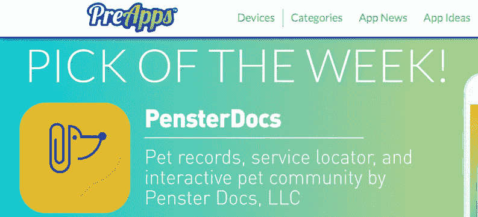

看看 LaunchSky 和 Preapps 这样的网站。这些网站在设计和功能方面已经走过了漫长的道路，甚至在你发布之前就有可能帮助你建立一个追随者。

如果你需要人们在你的应用发布前对其进行测试，可以使用 TestFlight 或 HockeyApp 这样的服务来让人们获得你的应用的预览版。

在你的应用发布后，你还可以发布推广代码，让人们试用你的应用。在 iOS 上，你可以给人们一个推广代码来预览一个应用，只要它处于*待售*或*等待开发者发布*状态。

### 来自其他开发者和移动行业人士的反馈

很明显，你需要目标受众的反馈。

但是获得其他开发者对你的应用的意见也很重要。

他们正在开发或已经开发了几个应用程序，他们尝试了很多应用程序，知道自己喜欢什么，不喜欢什么。他们可以分享哪些对他们有用，哪些没用，以及他们认为哪些对你有用。他们可以指出你的设计、推销或营销策略中的缺陷。他们可以帮助你发现一个伟大的博客，可以帮助你开始或改进(像我们的一样)。

与他们离线或在线共享您的项目:

*   **离线:**参加会议、开发者和技术会议
*   在线:在 Twitter 上互动，分享你正在做的事情(并帮助他人！)在 iPhoneDevSDK 论坛或 TouchArcade 论坛上，讨论开发人员的脸书群组，在 Clarity.fm 上获得专家的建议等。脸书的应用企业家和营销人员小组有#FeedbackFriday，你可以张贴你的图标、截图或任何其他与应用相关的内容，并从小组中获得反馈。

显然，不要把所有的时间都花在这上面，因为这会耗费大量的时间。但是偶尔这样做可以从你的开发伙伴那里获得有价值的反馈。

…请记住，你应该在得到之前努力给予，所以不要犹豫去帮助别人，努力为你所在的社区带来价值。要亲切，也要感谢帮助你的人。

### 来自你的目标受众和你所在领域的影响者的反馈

如果你已经为你的应用确定了一个特定的细分市场，你需要接触那些可能对它感兴趣的人。

如果你正在围绕你热爱的东西开发一个应用程序，那么你可能知道人们讨论你的爱好的论坛和其他在线场所。如果你是这个领域的新手，开始寻找你的目标受众并与之互动。

不要向人们兜售你的应用创意。尽早开始与他们建立关系。

最好的方法通常是先看看你是否能帮助他们。不求回报。

这可能是像转发他们的一条推文或分享他们的一篇博客帖子这样的小事。

如果你建立了真正的融洽关系，那么你的应用程序的主题将不可避免地出现。此时，您将能够询问您的应用程序。你也可能会得到更诚实的意见，因为这个人会真心实意地想帮你。

**确定影响者**。了解谁真正了解你的应用领域，谁写了一本书，或者谁在你的主题上有强大的追随者。**然后向他们伸出手**。

我也一样，不要把它变成垃圾邮件。保持你的邮件在 5 句话以内。他们不需要你的生活故事。

记住，他们很忙，一周可能会收到很多请求。大多数人更愿意帮助不浪费自己时间的人。

成为那个人。

### 竞赛和奖项的反馈(和宣传)

你以前可能没想过这个，但是竞赛是让你的应用广为人知的一个好方法。

因此，如果你正在寻找一种低成本的方式来宣传你的应用程序，提交你的应用程序参加你可以申请的每一个[比赛或奖项](https://www.apptamin.com/blog/awards-for-which-you-can-and-should-submit-your-apps/ "App Awards And Contests You Don’t Want To Miss")。

这些不仅是获得更多曝光率(和下载量)的绝佳机会，也是获得专家对你的应用反馈的好方法。很多时候，这些比赛的评委是市场营销、设计或开发专业人士，他们可以根据自己丰富的经验给你建议。

如果这是一个“现实生活”的竞赛，你必须亲自展示你的应用，这是一个与其他参赛者和业内人士会面并获得他们意见的好机会。充分利用这些活动，即使你没有应用程序可以展示。

像 Startup Weekend 这样的早期州创业竞赛也是一个很好的去处。通常会有一些经验丰富的创业公司创始人和天使投资人出席。

## 使局部化

如果英语不是你的母语，本地化是很容易的。

你可以开始用一种世界上几乎没有人会说的语言发布一个应用程序(比如……法语)，但最终如果你想让你的应用程序成功，你必须考虑本地化。

如果你的应用程序首先是英文的，那么本地化也是有意义的。

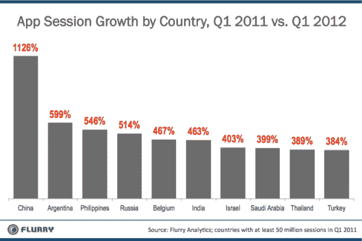

如果你的应用程序开始在其母语市场获得一些牵引力，请留意它在其他说不同语言的国家的表现。尤其是那些高增长的国家(如中国、阿根廷、俄罗斯、以色列等。).

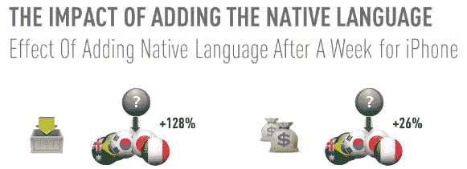

A 128% increased in download volumes during the next week following the introduction of the native language (source: Distimo)

将您的应用名称和应用商店页面翻译成其他语言可以在目标市场为您带来更多下载。这可能也会给你带来一些不高兴的用户，他们以为可以用他们的语言使用你的应用。

所以这种情况不会发生，你需要翻译应用程序本身(以及你的应用商店页面上的截图)。

[**汉化多于翻译**](https://www.apptamin.com/blog/localize-app/) ，虽然。

你可能需要更进一步，真正本地化你的应用程序，使其符合目标市场的文化，并被这些用户很好地理解。

《热门网球 3》的制作人马克·约翰逊在他的博客上列出了本地化[的几个潜在好处:](http://www.markj.net/iphone-game-translation/ "iOS app localization")

[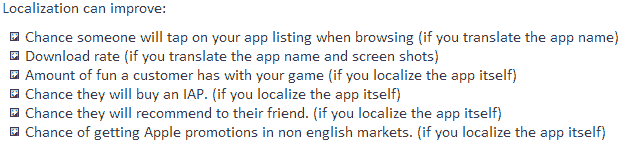T2】](https://apptamin.wpenginepowered.com/wp-content/uploads/2013/01/app-localization-benefits.png)

很诱人吧？那么你该如何着手呢？

第一种选择是自己动手，为每种语言创建一个字符串文件。

第二个选择，通常…是付钱给某人去做。像 iCanLocalize、Applingua、OneSky 和其他公司可以为你做到这一点，从 0.09 美元/字到更多。

苹果在国际化方面推荐了几样东西，你可以在这里查看[。](https://developer.apple.com/internationalization/ "Build Apps for the World")

## 做应用商店优化

好吧，所以你不能只指望你的应用商店页面和苹果给你带来下载。

但这是否意味着你不应该尽你所能让你的应用程序在应用商店上尽可能多的曝光呢？并且尽你所能把访客转化成用户？

不要！

App Store 优化( [ASO](https://www.apptamin.com/app-store-optimization/ "App Store Optimization 101") )可能有点被高估了，但是为了获得尽可能多的下载，你需要做一些事情和选择。有些是常识，但是检查一下也无妨。

你想确保你没有忘记应用商店优化的任何方面吗？查看我们的[基本 ASO 资源](https://www.apptamin.com/blog/aso-resources-list/)便捷列表。

### 追踪你的竞争对手

在我们结束这个话题之前，请确保您正在跟踪您的所有竞争对手。这里有几种方法可以做到这一点。

## 让您的应用获得审核

如果你没有大量的钱来投资广告，那么你的应用程序的成功将在很大程度上取决于你设法获得的覆盖率。

你需要人们了解你的应用程序。一个很好的方法就是在一个著名的网站上发表一篇博文或一篇文章。

然而这并不容易，因为博客和记者每天都被大量邀请，没有时间尝试每一个应用程序。这意味着你需要把它推销给正确的人。

### 关于付费评论的一句话

一些博客会向你要钱，以换取一篇博客文章，或者让你在评论队列中靠前。

如果你决定付费，确保它物有所值，并且确实会给你带来(忠诚的)用户。确保你的目标受众阅读该博客。因为也许你的钱用在别的地方会更好。

### 确定您的媒体和博客联系人

不要浪费自己和他人的时间:**向有机会对你的应用感兴趣的人推销你的应用**。

尽可能多地联系个人，避免群发邮件。这需要更多的时间，但增加了你的机会。

[确定谁写了关于你的应用的文章](/blog/press-blog-contacts/ "How To Find Press And Blog Contacts For Your App")和[谁是](http://www.quora.com/Where-are-the-major-blogs-for-reviewing-iPhone-apps "Quora: Best blogs to get your app reviewed")报道的最佳博客。

但是不要犹豫，一开始就瞄准较小的博客，以及非美国博客。你猜怎么着？美国之外有很多人拥有 iPhones 和 iPads。而且还在继续增长。

也试着找出可能会报道你的应用的报纸。查看最著名的网站，找到写移动应用的记者(提示:使用搜索栏)。当你联系“传统”记者时，有一份[新闻稿](/blog/write-press-release-app-launch/ "How To Write A Press Release For Your App Launch")是件好事。看看 Muck Rack 就知道哪个记者在说什么，找一些(美国)联系人。

查看谁在谈论和谈论(设置 Google Alerts)你要发布的应用类型。联系他们，向他们寻求反馈。

找出在你的应用领域中是否有任何关注你的应用的专业杂志，你可以联系他们。

### 完美的音调

知道该联系谁是第一步。

现在，你必须让这些人有足够的兴趣阅读你的邮件，尝试你的应用程序，并写下相关内容(有些人在尝试之前就写了)。

博客作者和记者会收到大量的电子邮件，但他们无法审查所有的内容。然而，他们总是在寻找很酷的新应用和故事来谈论(这是他们的工作)。

为此，你需要[正确的音高](/blog/get-app-reviewed/ "How To Pitch Your App And Get It Reviewed")。

你不仅需要完美的句子来解释你的应用程序是关于什么的，为什么他们的受众应该关心，你还需要确保在你的电子邮件中包含一些关键元素:

*   您在 App Store 上的应用名称
*   谁是你的受众，你的应用程序做什么，为什么它的方法是独特的
*   您的应用价格
*   指向您的产品页面(网站)和 App Store 产品页面的链接
*   一两张你最好的截图
*   [短片或演示视频](https://www.apptamin.com)
*   联系信息和 Skype/Twitter id

此外，称呼对方的名字也无妨，并且表明你确实知道他们写了些什么(或者他们正在做的其他事情)。

当(如果)他们回答你并有兴趣试用你的应用时，给他们发送一些[促销代码](/blog/app-promo-codes/ "Everything You Need To Know About Using Promo Codes")。

查看我们关于[如何推介你的应用并让它被评论的博客文章](/blog/get-app-reviewed/ "How To Pitch Your App And Get It Reviewed")以获得更多信息和电子邮件模板。读读埃里卡·萨敦和史蒂文·桑德的优秀著作《完美的沥青》。他们是 TUAW 的博客写手，所以你应该看看他们在说什么。

### 推销这个故事

一些应用程序背后有一些非常酷的故事。

以每天 1 秒应用程序及其 [Kickstarter 活动](http://www.kickstarter.com/projects/cesarkuriyama/1-second-everyday-app/ "1SE Kickstarter Campaign")为例。这是一个概念很酷的应用程序，但塞萨尔不只是说“我正在构建这个”。他实际上在一年的时间里每天记录 1 秒钟，这就是他一直在推销的故事(也是他为什么得到这么多报道的原因)。

如果你的应用背后有一个有趣的故事，不要犹豫，把它说出来。把它写下来，在你联系博客和记者时使用。

不仅仅是你的应用程序概念，一篇关于你的应用程序故事和你的体验的有趣的博客文章可以让你在技术社区获得一些好的知名度，当你把它提交给 Hacker News 时。

像 HARO(帮助记者)这样的网站会把记者和博客作者想写的话题直接发送到你的收件箱。检查一下你的故事和经历是否吻合，并联系他们！

### 不要拒绝机会

如果你的应用取得了某种成功，人们喜欢它，那么其他人就有可能会联系你。

尽可能多地向他们发送他们要求的促销代码，并接受他们的提问和采访。你永远不知道谁会读或听它。

## 通过视频营销您的应用

视频是传达应用信息的最有效方式之一。你可能认为我们有偏见，但我们绝对不是唯一这么说的人。

做得好的话，[你的应用程序的宣传视频](https://www.apptamin.com)可以给你带来一些营销上的好处。

它可以帮助您提高应用的可见性，增加用户参与度和留存率，并获得更多(合格的)下载。这还没有提到品牌和搜索引擎优化的好处。

现在人们被高度恳求，他们没有时间下载他们听到或读到的每个应用程序。智能手机用户和博客/记者都是如此。

一个宣传视频可以让你在很短的时间内展示你的应用是什么。这听起来很老套，但却是事实:如果一张图片胜过千言万语，想象一下一个视频能达到什么样的效果。以下是制作高效演示视频的一些技巧:

*   考虑你的听众。在创建你的脚本和视频时，要时刻牢记你的应用目标受众。
*   **写剧本**。这将节省你大量的时间，并让你确保你传达的信息是正确的。就像你的网站一样，不要犹豫获取对你的剧本的反馈(在开始制作你的视频之前)。如果可以的话，尽量给他带点情绪，带点故事。
*   **缩短**(20 秒到 1 分钟之间)。你可能很想展示你的应用程序的每个功能，但事实是人们不会花时间去看你的 3mn 视频。
*   **关注你的应用程序的优势和附加值。**关注让你的应用独一无二、值得下载的东西。避免枯燥，保持事物的动态。
*   **使之高效**。你的目标是展示你的应用程序是关于什么的，但是你也希望人们记住它并且能够下载它。请确保展示您的应用程序名称、图标和行动号召，邀请观众在移动应用程序商店下载应用程序。显示你的网址也有帮助。
*   **保持简单**。如果你不是视频专家，保持简单会更安全，所以不要使用疯狂廉价的效果或复杂的场景。像 intro->core feature->outro 这样的简单结构就足够了。

你制作了(或雇人制作了)一个又酷又高效的视频，现在[你可以在任何地方使用它来推广你的应用](https://www.apptamin.com/blog/ultimate-guide-video-marketing/ "How To Use Your App Demo Video or Trailer?")。

希望我们查看您的应用并发送给您

**a free script and our recommendations**

你的应用商店视频或视频广告单元？联系我们

[here](https://www.apptamin.com/get-free-video-script/?utm_source=blog)

。

一些移动应用商店(Google Play，Amazon)已经允许你在应用页面上添加视频有一段时间了。现在它也将随 iOS 8 一起登陆 App Store！

你也可以(也应该)在你的应用程序网站上使用你的视频，在你的公共关系工作中，在社交媒体上营销，甚至在活动和展会上。

在实际试用你的应用程序后，人们观看你的应用程序视频是下一个最好的事情。充分利用它。

## 付费广告

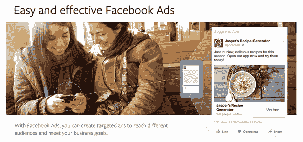

付费广告正成为在线和应用营销中越来越重要的一部分。好的一面是，像脸书这样的平台对大多数应用营销人员来说仍然是负担得起的。

即使你负担不起全职广告活动，你仍然可以花少量的钱获得一些非常有价值的数据。

例如，假设您有一个消息应用程序。在你的广告中，你可以测试在你的应用中推广不同功能的信息。

您可以突出显示广告:

*   免费电话
*   免费信息
*   最好的贴纸
*   比赛

…看看哪些表现最好。一旦你理解了什么能吸引你的目标受众，推广你的应用就变得更容易了。

首先，阅读[脸书的指南](https://www.facebook.com/business/learn/)或者阅读[脸书的营销博客](http://www.jonloomer.com/)。

## 深层链接

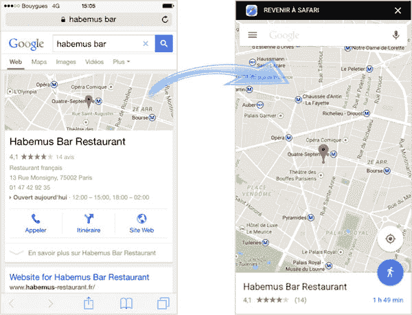

随着时间的推移，深度链接对 app 发行商来说会越来越重要。对于有大量内容的应用来说尤其如此。

深度链接在移动应用和网络之间架起了一座桥梁。当某人使用移动设备时，深度链接可以将用户从网页搜索直接发送到应用程序中的相应内容。

如果用户的设备上还没有该应用程序，系统会提示他们安装该应用程序。正如你所看到的，这使得应用发行商可以利用网络来获得下载，而不是依赖于应用商店内的机制。

要获得深度链接工具和资源的列表，[阅读这篇文章](/blog/mobile-deep-linking/)。

## 利用新的 iOS 功能

每次新版本的 iOS 出来，苹果都会包含一些新功能，让 iOS 设备更加方便、安全和有趣。

比如在 iOS 8 中，苹果推出了*应用捆绑*。对于可以利用它们的应用程序发行商来说，关键词提升和对客户价值的增加极大地推动了下载量。

最近，苹果电视的最新版本为应用发行商提供了将他们的 iOS 应用带入一个全新生态系统的机会。

因此，请留意新的机会，因为率先上市通常是一大优势。

## 客户的终身价值

如果你不知道客户的终身价值，你就不知道要花多少钱去获得新客户。但这可能是一件棘手的事情，因为用户的价值并不总是直截了当的。

我们关于[测量客户的 LTV](/blog/lifetime-value-mobile-customer/)的帖子将为您提供关于这一主题的更深入的信息。

## 病毒循环

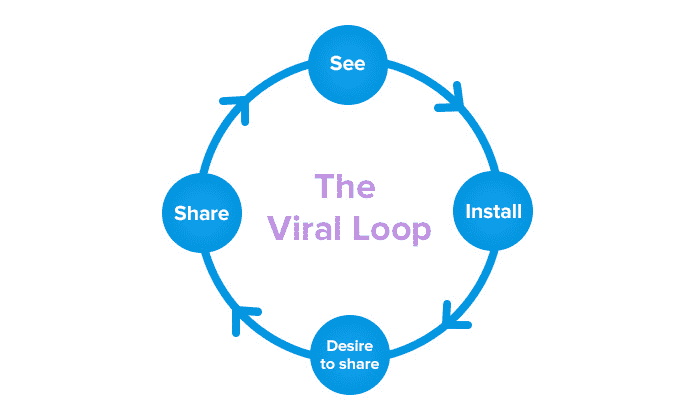

病毒循环是当你给你的用户一个与他们的朋友分享你的应用的愿望。一个常见的例子是，当一个应用程序给用户机会发布他们的高分，炫耀他们的朋友。

记住，病毒循环通常在第一次尝试时不起作用。它需要多次迭代才能得到正确的结果，所以坚持下去，完善过程的每个部分。

要查看更多示例，[阅读这篇文章](/blog/app-viral-loop/)。

## 做“现实生活”营销

说实话，这方面我没什么经验。

我确实尝试过传单和类似的东西，但没有取得多大成功。这并不意味着它不适合你:一些打破常规的想法可能会创造奇迹。

如果你尝试了，确保你测量了它(看看我们上面说的营销渠道)，这样你就知道它是否有效。

你应该去参加会议、展览和聚会，认识其他人。但在这些活动中，获得反馈比在你的应用上销售人员更重要。

如果你知道你的目标观众会在那里，展览摊位是值得的。

## 利用产品搜寻

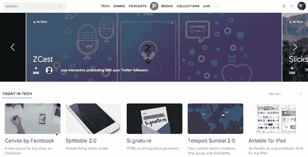

当推出一款新应用时，产品搜索是一个绝佳的宣传平台。

它是如何工作的？

人们提交他们喜欢的技术产品，社区中的人们根据他们喜欢的程度来投票支持或反对。

这个网站已经发展了很多年，现在是向世界介绍你的新创作的最好的地方之一。但这并不像在网站上发布你闪亮的新应用那么简单。

你需要被社区中一个值得信任的成员邀请。另一个让你的产品快速发布的方法是被列为制造商。

社区里必须有人列出你的应用，把你贴上制造者的标签。请务必使用您的个人帐户，因为公司帐户不能被列为制造商。

像任何其他营销策略一样，它可能不会给你带来大量的下载。但是在网站上列出产品的困难可以用来做其他的公关工作。

## 交叉推广你的应用

这是件大事。

如果你真的想建立一个应用业务，那么**你应该创建不止一个应用**。如果你的目标受众在所有这些不同的应用中都是相似的，那么你就有一个巨大的交叉推广的机会。

这意味着，即使是一个没有任何收入模式的免费应用程序(并不意味着有一个会有坏处)，也可以成为产生收入的第二个和第三个应用程序的良好开端。

你可以在你的应用程序网站(或你的应用程序开发公司网站上的应用程序页面)、你的博客、你的电子邮件列表、你的应用程序内、通过发送推送通知、在社交媒体等进行交叉推广。只要你发送的信息与接收它的人相关。

如果你刚刚起步，只有一个应用程序，你可以联系其他开发相同应用程序的开发者(但不是直接竞争对手)，邀请他们合作。你可以从很小的事情开始(推文、应用内信息等。)，看看它会走向何方。

## 在发布日干掉它！

你的应用程序发布日应该是你“营销高潮”的顶峰。

我们谈过的都导致了这个。除非你去试运行(或者先在另一个国家发布你的应用——比如加拿大——试水),这是你必须尽可能多地制造噪音的时候。

这时你应该让博主和记者写下你的应用程序(如果他们直接发布了应用程序商店的链接，那么要确保你的应用程序确实在那里——它在全球范围内可用需要时间)。

你需要让所有对你的应用感兴趣、给你反馈并帮助你的人知道你的应用已经准备好了:邮件列表、脸书的粉丝和朋友、推特粉丝、论坛好友、你博客的读者、现实生活中的朋友和开发者… **所有人**！

从 iOS 6 开始(从 iOS 11 开始更是如此)，类别就有点隐藏了。所以不幸的是，即使你做得很好，在你的分类表中排名很高，它也不会给你像以前一样多的知名度。

但这并不意味着你不需要尽可能地制造更多的“轰动”和下载量。

**将您的应用交到人们手中，获得极高的收视率并建立势头**。

## 通过推送通知提高参与度

推送通知是一个很好的工具，可以向你的用户发送重要信息，并让他们回到你的应用程序中:他们关心的新内容，特别优惠，一些交叉推广等。

你的用户不一定经常查看你的应用，但如果他们的手机上仍然有这个应用，这可能意味着他们认为它带来了足够的价值。你应该毫不犹豫地联系他们。

但是，不要滥用它，否则他们很快就会认为你给他们发了垃圾邮件，再也不想听你的应用了。

你可以[构建自己的推送通知服务](http://www.raywenderlich.com/3443/apple-push-notification-services-tutorial-part-12 "Push Notification Service Tutorial")。或者你可以使用第三方服务，如 Urban Airship、 [PushWoosh](https://www.pushwoosh.com/?utm_source=apptamin) 、Parse 或[其他替代服务](http://www.quora.com/What-are-some-alternatives-to-Urban-Airship-to-send-push-notifications-to-iOS-devices "Quora: Alternatives to Urban Airship")。一些应用内分析工具如 Localytics 或 Mixpanel 也允许你这样做，Appboy 也是如此(前面提到过)。

看看他们的产品，找到适合您的应用和预算的产品。

## 选择正确的促销活动

玩弄你的应用程序价格和进行促销是增加你的应用程序下载并有望增加你的收入的好方法。

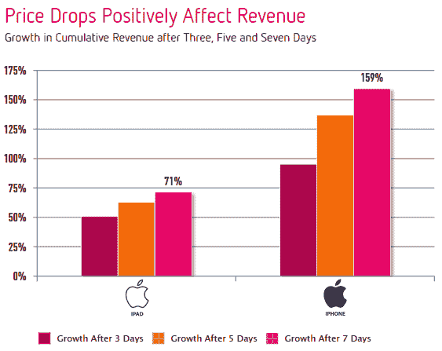

Check out the [report from Distimo on price changes](http://www.distimo.com/blog/2013_01_publication-the-impact-of-price-changes/ "Distimo on price changes")

你可以自己做一些事情，让人们注意到你的应用程序的价格变化(一些机器人会发现)，但更有效的提高下载量的方法是使用专门提高应用程序下载量的第三方。

**这将很少是免费的**(尽管它可能发生)。而且有时候会(疯狂)贵。

但是这些应用程序发现应用程序中的许多都有数百万用户，被推荐(对他们的用户的一种推动)可以极大地提高你的应用程序的可见性。

如果你的应用程序具备我们在这里讨论的所有内容，那么你可能不仅会登上排行榜(至少在某些国家)，而且还会在那里呆上一段时间。足以建立一个坚实的用户基础。

几个你可能想看看的服务:App Free、Appsfire、一天免费应用、FreeMyApps 等等。更多关于[本页](http://www.mobyaffiliates.com/blog/a-list-of-the-best-mobile-app-promotion-agencies-networks-and-tools/ "App promotion networks")。

## 衡量、改进和保持营销

在发布前，你有很多事情要做，但营销不会在你的应用发布几天后就停止。

你需要**衡量**什么有效并坚持做下去。你需要**改进**你的应用，让你的用户既开心又参与。

…你需要不断想办法**让人们谈论你的应用**并分享它。

## 最后的话

营销你的应用程序不能是事后的想法。也不是一朝一夕的努力。

它是关于:

*   **构建合适的应用程序并构建合适的应用程序**，牢记您的目标受众和用户体验，
*   **找到是什么让用户回到你的 app** ，是什么让他们分享，
*   **倾听用户和其他开发者的反馈**，了解人们如何使用你的应用，这样你就可以改进它，
*   **建立在线形象**，展示你的应用的最佳状态，
*   **吸引人们并激发兴趣**，
*   **优化你的应用商店页面**让尽可能多的人在那里找到你，
*   **以正确的方式接触对你的应用感兴趣的人，让他们谈论你的应用，**
*   **和你的其他 app 或者其他开发者的 app 做交叉推广**，
*   **选择合适的促销活动**在需要的时候提升你的应用，
*   **继续衡量**了解哪些可行，哪些不可行，改进你的应用并进行营销。

是的，不容易。

但是这是值得的，你会学到很多东西。

如果你从这本 9000 多字的指南中至少得到了一个好主意，那么和那些会从中受益的人分享吧。

现在轮到你了。我们很乐意在评论中听到你对什么可行，什么不可行的想法。

大家好，我是西尔万，是

[Apptamin](https://www.apptamin.com "Our video services")

。Apptamin 是一家专注于应用视频(视频广告、应用商店视频等)的创意机构。)在那里，我们找到了展示移动应用和游戏的吸引人的方式，这样我们的客户就可以提高他们的转化率或增加他们的用户获取量。

[Follow Apptamin on Twitter](https://twitter.com/apptamin)[Follow me on Twitter](https://twitter.com/sylvainww)

#### 西尔万·高歇的最新帖子 ( [查看全部](https://www.apptamin.com/blog/author/admin/) )

