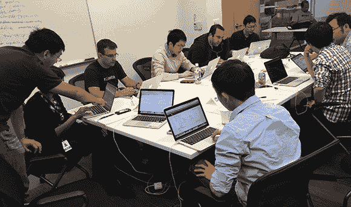
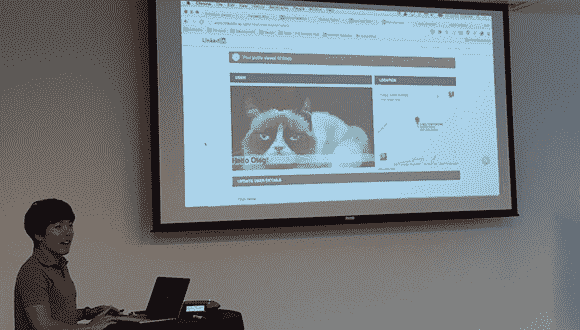
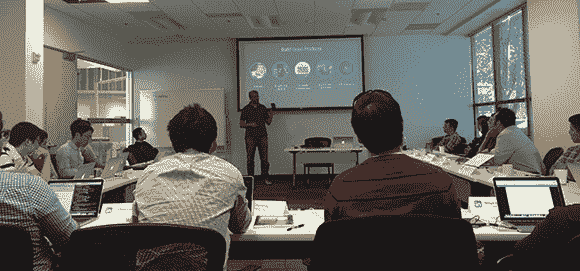
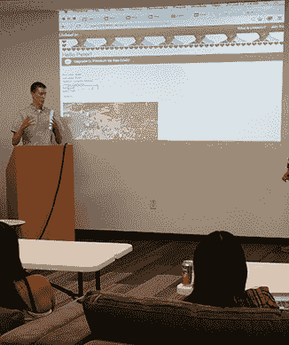
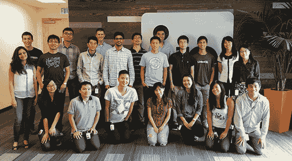

# 构建 LinkedIn 的新工程训练营| LinkedIn 工程

> 原文：<https://engineering.linkedin.com/engineering-culture/building-linkedins-new-engineering-bootcamp?utm_source=wanqu.co&utm_campaign=Wanqu+Daily&utm_medium=website>

杰夫·韦纳[将](https://www.linkedin.com/pulse/20121029044359-22330283-to-manage-hyper-growth-get-your-launch-trajectory-right)管理一家超高速发展的公司比作发射一枚火箭——“如果发射时你的轨道偏离了几英寸，你就可能偏离轨道几英里。”我们认为，对于在高速增长中加入公司的员工，也可以进行类似的比较。在为新的软件工程师提供了几年的入职课程后，我们决定是时候重新评估该计划的有效性，并设计出更适合 LinkedIn 现在和未来的东西。我们是这样做的。

 An Engineering Bootcamp cohort developing their first application using the LinkedIn technology stack.

## 衡量差距和分析学习需求

我们通过分析来自新软件工程师及其经理的反馈，以及评估标准工具、服务和最佳实践的准备情况或信心来开始我们的过程。一些事情变得非常清楚:

*   在讲座的形式下，我们之前的入职培训课感觉太像是在传递一大堆信息
*   我们的工程新员工需要将他们在课堂上学到的知识更多地应用到实际中
*   内容的广度感觉像是在没有任何暴露给我们实际代码库的情况下分散开来
*   一些新员工表示对使用我们内部构建的工具和部署工作流缺乏信心
*   有几次，基本服务和 API 被重新创建，而最佳实践没有被遵循

记录了其他指标并进行基准测试，包括新员工的人口统计数据、提交第一个和第十个代码所花费的时间，以及新员工第一周和第四周之后该类别的[净推广者分数](https://en.wikipedia.org/wiki/Net_Promoter) (NPS，我们的标准推荐和满意度指标)。

## 设计世界级的学习体验

基于我们的发现，我们挑战自己，建立一个新工程师可以在第一周完成的加速学习计划，以便他们可以在进入公司的第二周就做好工作准备，并有权将代码交付给生产。作为一个延伸目标，我们希望新员工能够使用我们的 [Rest.li](https://engineering.linkedin.com/architecture/restli-restful-service-architecture-scale) 框架开发和部署他们的第一个后端服务，并使用 [Play](http://engineering.linkedin.com/play/play-framework-linkedin) 开发和部署第一个前端应用。

为了实现这一点，我们做出了艰难的决定，将我们的关注点和受众缩小到软件工程师，他们构成了我们工程新员工的大多数。我们删除了为数据科学家、网站运营工程师、客户端 web 开发人员和 UX 设计师优化的内容。在界定内容范围时，我们关注如何大规模构建软件。

经过全面的内容分析，我们提出了一个包含以下学习目标的设计:

*   构建后端 web 服务和前端应用程序。将它们部署到我们的早期集成(EI)数据中心。
*   利用我们工具集的广度，包括 ide、版本控制软件、 [Play+Gradle](https://engineering.linkedin.com/play/developing-play-applications-using-gradle) 、 [inGraphs](http://engineering.linkedin.com/32/eric-intern-origin-ingraphs) 、我们的变更请求跟踪器、curli(我们对 curl 的定制)、[快速部署 EI (QEI)](https://engineering.linkedin.com/developer-productivity/quick-deploy-distributed-systems-approach-developer-productivity) 、 [Autometrics](https://engineering.linkedin.com/52/autometrics-self-service-metrics-collection) 、性能工具等等。
*   遵循最佳实践，例如将 Rest.li 用于 RESTful web 服务，对远程服务进行非阻塞调用，进行主干开发，使用我们的斜坡和 [A/B 测试工具](https://engineering.linkedin.com/ab-testing/xlnt-platform-driving-ab-testing-linkedin)，搜索和利用已经部署的代码，遵循强大的信息安全实践，遵循我们的标准测试协议，以及进行有意义的代码审查。
*   浏览我们的代码库，了解我们的微服务拓扑。
*   了解我们用来管理在线、离线和近线数据的系统，包括 [Kafka](https://engineering.linkedin.com/kafka/running-kafka-scale) 、Hadoop、 [Databus](https://engineering.linkedin.com/data-replication/open-sourcing-databus-linkedins-low-latency-change-data-capture-system) 、 [Espresso](https://engineering.linkedin.com/espresso/introducing-espresso-linkedins-hot-new-distributed-document-store) 和 [Voldemort](https://engineering.linkedin.com/voldemort/serving-large-scale-batch-computed-data-project-voldemort) 。

除了拥有合适的内容范围之外，为我们的新工程师设计引人入胜的学习体验也至关重要。我们坚信边做边学的哲学。我们希望挑战新工程师的技能，同时给他们创造的自由。为此，我们开发了一个 bootstrap [multiproduct](https://www.youtube.com/watch?v=OxpGLxHW93k) 代码库，新员工可以从中学习并开始开发。这些基本的多产品帮助教授如何使用 Rest.li 方法更新和返回一个简单的概要文件，以及如何使用 Play 和 [Dust.js](https://engineering.linkedin.com/frontend/leaving-jsps-dust-moving-linkedin-dustjs-client-side-templates) 将该概要文件显示给客户机。

 New hires work together as teams and led by mentors.

我们加入的一个重要组成部分是训练营指导计划，以便经验丰富的 LinkedIn 软件工程师可以参与进来，帮助我们的新员工取得成功。在课程的这一部分，热情的后端和前端工程师通过教授最佳实践、回答问题、提供反馈以及挑战他们的认知和技术局限性，帮助指导我们的新员工开发他们的第一个应用程序。

最后，我们将每节课的最后一天设计成一个机会，让我们的新工程师展示他们在这一周的工作成果。每个演示都遵循简单的结构:他们构建了什么，他们如何构建，以及他们学到了什么。演示之后是提问、反馈和表扬。

 Each class ends with demonstrations of what was built during class.

通过这些方法，我们希望实现以下入职目标:

*   为 LinkedIn 工程提供一个非常令人愉快和鼓舞的第一印象
*   更好地了解我们的工程文化，以及我们如何大规模生产优秀产品
*   向他们的团队介绍知识和技能水平更高的新员工
*   提高新员工的工作效率
*   让新员工能够利用已经开发的工具和软件
*   减少一些新员工在最初几个月可能经历的困惑、焦虑和恐惧
*   减少黑客的使用，增加最佳实践的使用

我们的最终设计产生了正式课堂演示、动手团队编码练习和挑战、工具探索和在线学习支持的混合学习体验。

## 授课

 Engineering leaders present keynotes that introduce each class to our culture. Here, Engineering VP Mohak Shroff is presenting five dimensions of building great products.

今年年底，我们在 Q1 交付了两个连续的试点班，大约有 40 名新工程师，包括来自 [Refresh](https://www.linkedin.com/company/refresh-inc-) 的新团队。虽然有点混乱，但我们最初的试点是成功的，净推广分数为 53，并吸取了很多经验教训。我们发现在 Linux 工作站上进行远程开发太费时间，而且存在后勤方面的挑战，所以我们不得不做出妥协，在笔记本电脑上进行本地开发。我们还对我们的自举代码库进行了必要的 bug 修复，并转移了一些对更难学习的工具的关注，如 [QEI](https://engineering.linkedin.com/developer-productivity/quick-deploy-distributed-systems-approach-developer-productivity) 。随着逻辑和基础限制的消除，我们有了尝试一些疯狂的事情的空间:我们使我们的编码练习更加困难，从而对我们新员工的技术期望提出了更大的挑战。

在 Q2，我们开始每周交付和测量我们的工程训练营。每周，我们的工程师都会来到课堂上学习、建立关系、相互挑战，并以他们可能认为不可能的速度开发出令人印象深刻的软件。迄今为止，我们已经有超过 170 名软件工程师，包括新老员工，包括来自[lynda.com](http://www.lynda.com/)、 [Slideshare](http://slideshare.com) 以及我们纽约和都柏林工程办公室的人员。课程反响热烈，60 多名经验丰富的 LinkedIn 工程师加入了等候名单。

## 结果呢

我们通过三种方式来衡量课程:对课程的初步印象(1 级评估)、30 天后的准备情况和信心(3 级评估)以及生产速度(4 级评估)。

基于这些衡量标准，与我们之前的入职计划(迄今为止)相比，我们能够得出以下结果:

*   第一周之后的净推广分数:增加 46.3%
*   第四周后的净推广分数:增加 158%
*   增加以下方面的知识和技能保留:
    *   代码库导航
    *   主干发展
    *   信息安全
    *   5 月
    *   构建管道和相关工具
    *   绩效工具
    *   A/B 测试工具
*   首次代码提交时间:减少 50%
*   第十次代码提交的时间:减少 50%(仅初步数据)

## 后续步骤

随着我们不断努力改善工程训练营的体验，我们正在探索扩大规模的方法。为了加强训练营后的体验，我们正在开发新员工加入各自团队时可以遵循的提升框架。我们还在制定更广泛的战略，通过[learn](http://blog.linkedin.com/2013/01/24/learnin-inday/)和 Tech Academy(我们新的工程师学习和教育计划)来满足全球技术学习需求。

 One of our recent Engineering Bootcamp cohort.

## 谢谢

我们要感谢所有超出其职责范围为我们的工程训练营的成功做出贡献的工程师。**供稿人:** [蒂姆·沃博斯](https://www.linkedin.com/in/tworboys)、[桑杰·杜贝](https://www.linkedin.com/in/sanjaysdubey)、[潘永祥](https://www.linkedin.com/profile/view?id=1321769)、[奥列格·阿纳什金](https://www.linkedin.com/in/oleganashkin)、[古鲁拉吉·西塔拉马](https://www.linkedin.com/in/gsmayya)、[哈迪克·巴蒂](https://www.linkedin.com/in/hardikbati)、[史蒂文·伊德](https://www.linkedin.com/in/stevenihde)、[布莱恩·巴克利](https://www.linkedin.com/in/bryanbarkley)、[克仁·金](https://www.linkedin.com/in/kerenjin)、[李若冰【T21**导师:**](https://www.linkedin.com/in/ruobingli) [朱燕青](https://www.linkedin.com/pub/yanqing-zhu/39/808/286)，[杰·拉马穆尔蒂](https://www.linkedin.com/in/jaaju)，[陈凡](https://www.linkedin.com/in/fchen1)，[斯里拉姆·帕拉查拉](https://www.linkedin.com/in/phanips)，[丹·邓](https://www.linkedin.com/in/dandeng)，[胡俊杰](https://www.linkedin.com/in/conanhjj)，[沙恩·希尔](https://www.linkedin.com/pub/shane-hill/23/598/232)，[尼尚·拉克什米坎思](https://www.linkedin.com/pub/nishant-satya-lakshmikanth/19/b0b/628)，[拉夫尼特·卡尔萨](https://www.linkedin.com/in/rkhalsa)，[亚当·里昂](https://www.linkedin.com/pub/adam-leon/9/723/884)