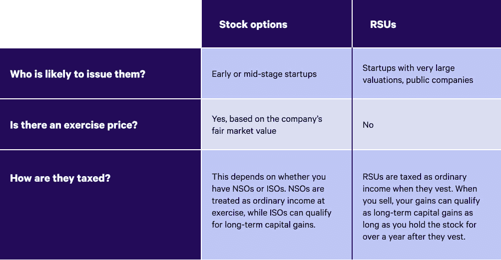
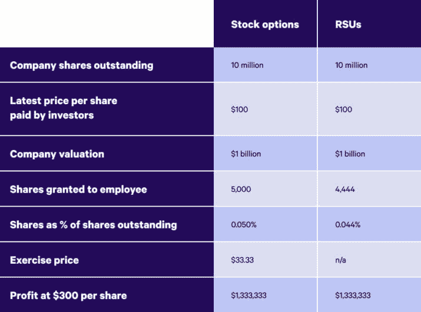

# rsu 与股票期权:有什么区别？财富前线

> 原文：<https://blog.wealthfront.com/stock-options-versus-rsu/?utm_source=wanqu.co&utm_campaign=Wanqu+Daily&utm_medium=website>

根据你供职的公司，你的薪酬可能包括某种形式的股权——比如股票期权或限制性股票单位(rsu)。在本帖中，我们将解释它们是什么，它们有什么不同，以及为什么你被授予的 rsu 比股票期权少(其他条件相同)。

## 什么是股票期权？

雇主授予的股票期权给你在特定时间以特定价格购买公司股票的权利。购买股票叫做[行使你的期权](https://www.wealthfront.com/blog/equity-ipo-guide/exercising-stock-options/)。你为此支付的价格被称为[行使价](https://www.investopedia.com/terms/e/exerciseprice.asp)或执行价——这个价格是在你被授予期权时设定的。雇主授予的股票期权可以是[激励性股票期权](https://www.investopedia.com/terms/i/iso.asp) (ISOs)或[非限定性股票期权](https://www.investopedia.com/terms/n/nso.asp) (NSOs)，并且[它们的税务处理各不相同](https://www.wealthfront.com/blog/employer-granted-stock-options-and-your-taxes/)(更多内容见下文)。股票期权往往受制于[授予](https://www.investopedia.com/terms/v/vesting.asp)，这意味着你可能需要在公司工作一段时间才能行使你的期权。

## 什么是 rsu？

rsu 是对作为一种补偿形式给予员工的公司股票的索偿权。与股票期权不同，你不必为行使限制性股票单位付费——一旦它们归属，它们就是你的了。从历史上看，对于上市公司的员工来说，rsu 远比那些在私企工作的员工更常见。但在过去 20 年中，限制性股票单位在私人公司中变得更加常见，这些公司以高估值(超过 10 亿美元)完成了几轮融资，而这一估值在几年内不太可能实现或证明合理。像股票期权一样，限制性股票单位通常也可以归属。

## 股票期权与限制性股票单位

以下是股票期权和限制性股票单位之间的主要区别:

## 限制性股票单位和股票期权的税务处理非常不同

股权补偿会让你的纳税情况变得更复杂，了解你可能欠了多少很重要。让我们仔细看看股票期权和限制性股票单位的税务处理。

### 如何对 rsu 征税

限制性股票单位一旦被授予并具有流动性就要被征税。在许多情况下，你的雇主会扣留你的一些限制性股票单位，作为在授予时应付的税款。您也可以选择用现金支付这些税款，以保留您所有的既得 rsu。无论哪种方式，你的限制性股票单位都将按普通所得税率征税，在联邦层面[可能高达 37%](https://www.irs.gov/newsroom/irs-provides-tax-inflation-adjustments-for-tax-year-2021)加上社会保障和医疗保险税，这取决于你的收入。根据你居住的地方，你可能在州一级欠额外的税。

### 股票期权如何征税

相比之下，当你行使和/或出售股票期权时，它们就要被征税。这意味着你可能希望在你预计税率相对较低的一年里行使你的期权(或者你有很多从 Wealthfront 这样的投资经理那里收获的损失可以利用)。如果你[在你的期权增值之前提前行使](https://www.investopedia.com/terms/e/earlyexercise.asp)，并且[在 30 天内提交 83(b)选择](https://www.wealthfront.com/blog/always-file-your-83b/)，那么在你卖出之前你不会欠任何税。

剩下的就看你是有 NSO(比较常见)还是 ISOs 了。对于 NSOs，您将按照普通收入税率对行使价格和行使时当前公平市场价值之间的差额征税。如果你持有股票超过一年，未来的任何收益或损失都将按照较低的[长期资本利得率](https://www.investopedia.com/articles/personal-finance/101515/comparing-longterm-vs-shortterm-capital-gain-tax-rates.asp)(范围从 0%到 20%)纳税。如果你有 ISOs，行使你的期权就常规税务目的而言不是应税事件。只要您满足以下两个条件，当您出售时，价值超过行使价的任何增加都将按照长期资本利得率纳税:

1.  在股票被授予后，你至少持有两年。
2.  行使这些股票后，你至少持有一年

如果你有 ISOs，你还应该知道[替代最低税](https://www.investopedia.com/terms/a/alternativeminimumtax.asp) (AMT)。AMT 是一个独立的税收系统，旨在确保高收入者至少缴纳最低(因此得名)税额。如果您行使您的 ISOs，并且在当年没有出售它们，则行使价格和行使时的公平市场价值之间的差额受 AMT 约束，即使您没有出售任何股份。AMT 可以让你的报税变得更加复杂，这就是为什么我们认为如果你认为你可能会受到 AMT 的影响，那么[考虑与税务专业人士](https://www.wealthfront.com/blog/9-instances-in-which-to-hire-a-tax-accountant/)合作是明智的。你是否缴纳 AMT 很大程度上取决于你的收入——在 2021 年，如果你是一个收入低于 73，600 美元的单身申报人，或者一对夫妇共同申报收入低于 114，600 美元，你就不需要担心这个问题。然而，如果你挣得比这多，你需要计算两种系统(AMT 和常规系统)下的税收，并支付金额较大的一个。好消息是，你的 AMT 付款可以抵减你出售期权所欠的税款。

## 为什么同样的工作，你得到的 rsu 比股票期权少

对于同样的工作，你应该期望得到比股票期权更少的限制性股票单位，因为限制性股票单位没有行使价。让我们看一个假设的私人公司的例子来说明这一点。想象一下，一家拥有 1000 万股流通股的公司刚刚以每股 100 美元的价格完成了融资，这相当于 10 亿美元的估值。如果你知道公司的最终价值是每股 300 美元，那么你需要比股票期权少发行 11%的限制性股票单位才能给员工带来同样的净值。

这里有一个图表可以帮助你想象这个例子:

你还应该记住，限制性股票单位的价值与公司的表现无关，而如果公司陷入困境，股票期权的价值可能会低于行使价。更简单地说:限制性股票单位的风险低于股票期权。

## 关键要点:限制性股票单位和股票期权

如果你的薪酬中包含股票，你需要记住以下关于 rsu 和股票期权的内容:

*   rsu 和股票期权都给你机会拥有你工作的公司的一部分。
*   限制性股票单位没有行权价，但股票期权有——这就是为什么同样的工作，你得到的限制性股票单位比股票期权少。
*   与股票期权相比，rsu 在税收(时间和税率)方面给你的灵活性更小。

希望这些信息能帮助你自信地把握你薪酬中的股权部分。关于如何处理 rsu 的更多指导，请查看[这篇博客文章，了解我们关于管理既得 rsu 的建议](https://www.wealthfront.com/blog/manage-vested-rsus/)——通常，我们认为出售部分 rsu 并以更多样化的方式投资是明智的( [Wealthfront 的投资账户使这变得容易](https://wealthfront.com/investing))。为了深入了解与股票相关的所有事情，我们鼓励你阅读 [Wealthfront 的股票指南&IPO](https://www.wealthfront.com/blog/stock-options-versus-rsu/)。