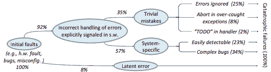
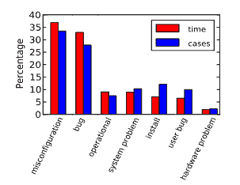
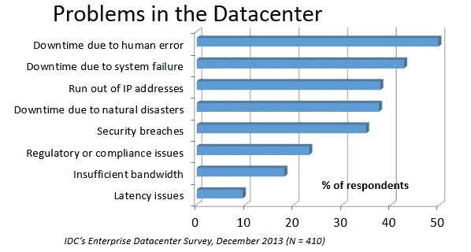

# 阅读验尸报告

> 原文：<https://danluu.com/postmortem-lessons/?utm_source=wanqu.co&utm_campaign=Wanqu+Daily&utm_medium=website>

<main>

我喜欢阅读验尸报告。它们很有教育意义，但与大多数教育博士不同，它们讲述了一个有趣的故事。我花了相当多的时间阅读谷歌和微软的调查报告。我还没有对最常见的失败原因做过任何形式的分析，但是有一些事后分析的模式我一直反复看到。

### 错误处理

正确的错误处理代码很难。错误处理代码中的错误是导致*糟糕的*问题的主要原因。这意味着出现顺序错误的概率，即错误导致错误处理代码运行的概率，不仅仅是单个错误的独立概率的乘积。级联故障导致严重停电是很常见的。从某种意义上说，这是显而易见的——错误处理通常被认为是困难的。如果我向人们提到这一点，他们会告诉我，不相称数量的严重事后分析是由糟糕的错误处理和错误反复得不到正确处理的级联故障造成的，这是多么明显。但是，尽管这是“显而易见的”，但是否投入了足够的测试和静态分析工作来确保错误处理正常工作就不那么明显了。

关于这方面的更多信息，丁远等人有一篇很棒的论文和演讲:[简单的测试可以防止大多数关键故障:分布式数据密集型系统中的生产故障分析](https://www.usenix.org/conference/osdi14/technical-sessions/presentation/yuan)。这张纸基本上和罐头上写的一样。作者将严重故障定义为可以关闭整个集群或导致数据损坏的东西，然后查看 Cassandra、HBase、HDFS、MapReduce 和 Redis 中的数百个错误，找到 48 个严重故障。然后他们查看这些失败的原因，发现大多数错误都是由于错误处理不当造成的。92%的失败实际上是由于错误处理不当造成的。

再往下钻，25%的错误来自于简单地忽略一个错误，8%的错误来自于捕捉错误的异常，2%的错误来自于不完整的待办事项，另外 23%的错误“很容易被发现”，这些错误被定义为“非致命错误的错误处理逻辑是如此错误，以至于开发人员的任何语句覆盖测试或更仔细的代码审查都可以发现这些错误”。顺便说一句，这是我不介意 Go 风格错误处理的一个原因，尽管常见的抱怨是错误检查代码弄乱了主代码路径。如果您关心构建健壮的系统，错误检查代码是主要代码！

[全文](https://www.usenix.org/system/files/conference/osdi14/osdi14-paper-yuan.pdf)有很多宝石，我大多不会在这里描述。例如，他们解释了 [Jepsen](https://aphyr.com/tags/jepsen) 的不合理效率(98%的关键故障可以在 3 节点集群中重现)。他们还深入研究了非确定性故障的百分比(占样本的 26%)，以及非确定性的原因，并创建了一个静态分析工具，可以捕捉许多常见的错误导致的故障。

### 配置

配置错误，而不是代码错误，是我见过的最常见的导致严重停机的原因。当我查看公开可用的事后分析时，搜索“全局停机事后分析”会返回大约 50%的由配置更改引起的停机。公开可用的事后分析并不是所有停机的代表性样本，但是对事后分析数据库的随机抽样也揭示了配置更改是造成极严重停机的主要原因。与错误处理一样，我经常被告知，配置更改显然是可怕的，但大多数公司像测试和准备代码更改一样测试和准备配置更改并不那么明显。

除非在极端紧急的情况下，有风险的代码更改基本上不会同时推送到所有的机器上，因为这有可能导致整个服务公司瘫痪。但是，似乎每个公司都必须痛苦地认识到，看似良性的配置更改也会导致公司范围的服务中断。例如，这就是臭名昭著的 2014 年 11 月 Azure 宕机的原因。我无意在这里挑 MS 的毛病；他们的主要竞争对手也因为类似的原因出现过严重的停机，他们都制定了相应的流程来降低此类停机再次发生的风险。

我也不想挑大型云公司的毛病。如果说有什么不同的话，那就是那里的情况比大多数初创公司都要好，甚至是那些资金非常充足的公司。我所知道的大多数“独角兽”创业公司都没有一个合适的测试/试运行环境来测试有风险的配置变更。我能理解为什么——通常很难建立一个良好的 QA 环境，它能很好地反映 prod，使配置更改可以被测试，就像开车不系安全带一样，大多数时候不会发生任何不好的事情。如果我必须在开车前自己系安全带，我可能也不会系安全带。话说回来，如果开车不系安全带和改变配置一样可怕，我可能会考虑。

[早在 1985 年，Jim Gray 就观察到](http://research.microsoft.com/en-us/um/people/gray/papers/TandemTR85.7_WhyDoComputersStop.pdf)“操作员行为、系统配置和系统维护是故障的主要来源——42%”。从那以后，有各种各样的研究发现了类似的结果。例如， [Rabkin 和 Katz](http://asrabkin.bitbucket.org/papers/software12.pdf) 发现了以下失败的原因:

### 五金器具

基本上机器的每个部分都可能出故障。许多组件也会导致数据损坏，损坏率通常比宣传的要高得多。例如， [Schroeder，Pinherio 和 Weber](http://research.google.com/pubs/pub35162.html) 发现 DRAM 的错误率比宣传的要差一个数量级以上。无声错误的数量是惊人的，这实际上给谷歌带来了问题，直到他们改用 ECC RAM。即使有错误检测硬件，事情也可能出错；依靠[以太网校验和来防止错误是不安全的](http://noahdavids.org/self_published/CRC_and_checksum.html)，我个人已经看到格式错误的数据包作为有效的数据包通过。在规模上，如果您希望硬件检查能够发现硬件数据损坏，那么您可能会遇到比预期更多的未检测到的错误。

故障组件的故障转移也可能失败。[这次 AWS 故障讲述了一个典型的故事](https://aws.amazon.com/message/67457/)。尽管采取了合理的探测措施来定期测试发电机电源故障转移过程，但当风暴切断电源，一组备用发电机在加载时无法正确供电时，AWS East 的很大一部分发生故障。

### 人类

这一部分可能应该被称为过程错误，而不是人为错误，因为我认为人处于一个位置，他们可能会意外地导致灾难性的失败，这是一个过程错误。人们普遍认为，如果你在运行大规模系统，你必须拥有对硬件故障具有鲁棒性的系统。如果你计算一下机器死亡的频率，很明显，对硬件故障不健壮的系统是不可靠的。但是人类比机器更容易出错。别误会，我喜欢人类。我的一些好朋友是人类。但是如果你反复地把一个人置于一个会导致灾难性失败的位置，你最终会得到一场灾难。然而，以下模式仍然很常见:

> 哦，我们要做一件冒险的事！好吧，让我们让人类非常小心地执行有风险的操作。哎呀！我们现在有一个全球性的中断。

以“因为这是一个高风险的操作，所以使用了 foobar 高风险协议”开始的验尸是无处不在的，以至于我现在认为额外的人为操作步骤是为了减轻作为操作气味的人类风险。一些常见的协议是让多人观看或确认操作，或者让操作人员在灾难发生时待命。这些都是合理的事情，它们在一定程度上降低了风险，但在我读过的许多事后分析中，自动化可以大大降低风险或完全消除风险。有很多情况下，停机之所以发生，是因为人们期望一个人完美地执行一系列指令，但却没有做到。这正是程序擅长的事情！在其他情况下，人们期望执行人工错误检查。这有时更难自动化，也是一个不太明显的胜利(因为人类可能会捕捉到程序错过的错误案例)，但在大多数情况下，我看到自动化这类事情仍然是一个净胜利。

在 IDC 的一项调查中，受访者认为人为错误是数据中心出现问题的最大原因。

我发现有趣的一件事是，在公共尸检中，人为错误似乎没有得到充分的体现。据我所知，谷歌和微软都比大多数公司有更多的自动化，所以我希望他们的事后数据库包含的人为错误导致的中断比我在公共事后报告中看到的要少，但事实上恰恰相反。我猜测，这是因为当根本原因是由危险的手动程序导致的人为错误时，公司不太可能写公开的事后分析。另一个表面上看似合理的原因是，改进的技术实际上增加了由人类引起的问题的比例，这在一些行业是真实的，比如飞行。我怀疑情况并非如此，因为许多公司都进行了大量的人工操作，但如果不访问多家公司的事后数据库，就无法确定。如果任何公司想让这项分析(和其他分析)得以进行(可能是匿名的)，请联系我们。

### 监控/警报

缺乏适当的监控从来不是问题的唯一原因，但它通常是一个严重的促成因素。就像人为错误一样，这些错误在公开的事后分析中似乎没有得到充分的体现。当我和其他公司的人谈论他们最糟糕的灾难时，很大一部分是因为没有设置正确的警报。他们经常在灾难严重到需要通过某种行动英雄主义进行公开验尸时获救，但英雄主义不是一个可扩展的解决方案。

有时候，那些近在咫尺的灾难，都是细微的编码 bug 造成的，这是可以理解的。但更常见的是，这是由于明显的流程错误，如没有一个清晰的故障升级路径，导致错误的团队花了半天时间来调试问题，或者没有备用的随叫随到服务，导致系统在几个小时内丢失或损坏数据，直到有人注意到(不可避免地)随叫随到的人没有注意到出现了问题。

2003 年的东北大停电就是一个很好的例子。这可能是一次小停电，甚至只是一次小的服务质量下降，但(除其他外)一系列错过的警报导致它成为有史以来最严重的停电之一。

### 不是结论

这是结论应该出现的地方，但我真的想在写下某种结论或呼吁行动之前做一些认真的数据分析。我应该寻找什么？我还应该考虑哪些主要类别的常见错误？这些不是反问，我真的很想听听我应该考虑的其他类别。[在这里随意 ping 我](https://twitter.com/danluu)。我也试图在这里收集[公众的尸检](https://github.com/danluu/post-mortems)。

总有一天，我会着手进行严肃的分析，但即使没有仔细检查和分类成千上万的尸体，我也可能会因为阅读了一堆这些东西而做一些不同的事情。在我的代码评审中，我会花相对更多的时间在错误和错误处理代码上，而花相对更少的时间在快乐的道路上。我还将花更多的时间检查并试图说服人们修复“明显的”过程错误。

我对这些故障模式感到好奇的一点是，当我和其他人谈论我的发现时，至少有一个人告诉我，我发现的每个过程问题都是显而易见的。但是这些“显而易见”的事情还是造成了很多失败。在一个案例中，有人告诉我，我告诉他们的事情是显而易见的，几乎与此同时，他们的公司正在经历一场价值数十亿美元的全球服务中断，原因正是我们正在谈论的事情。仅仅因为一些事情是显而易见的，并不意味着它正在被做。

### 在别处

理查德·库克的[复杂系统如何失败](http://web.mit.edu/2.75/resources/random/How%20Complex%20Systems%20Fail.pdf)采用了一种更普遍的方法；他的工作启发了[清单宣言](http://www.amazon.com/gp/product/0312430000/ref=as_li_qf_sp_asin_il_tl?ie=UTF8&camp=1789&creative=9325&creativeASIN=0312430000&linkCode=as2&tag=abroaview-20&linkId=2VKSNUT3M4W7KUMR)，拯救了生命。

Allspaw 和 Robbin 的[Web Operations:keep the Data on Time](http://www.amazon.com/gp/product/1449377440/ref=as_li_qf_sp_asin_il_tl?ie=UTF8&camp=1789&creative=9325&creativeASIN=1449377440&linkCode=as2&tag=abroaview-20&linkId=U7MG5A2J6OLQG627)在 Web 应用的背景下讨论了这类事情。Allspaw 也有一个关于[和其他领域相关文献的好帖子](http://www.kitchensoap.com/2011/04/07/resilience-engineering-part-i/)。

在我比较熟悉的领域，对失败原因的研究已经有很长时间了。一些亮点包括吉姆·格雷的《为什么电脑会停下来，我们能做些什么？ (1985)，[奥本海默等。为什么互联网服务会失败，对此能做些什么？](https://www.usenix.org/legacy/event/usits03/tech/full_papers/oppenheimer/oppenheimer_html/)(2003)[纳加拉贾等。al 对互联网服务中运营商失误的理解和处理](Understanding%20and%20Dealing%20with%20Operator%20Mistakes%20in%20Internet%20Services) (2004)，Barroso 等人[的一部分。al 的《作为计算机的数据中心》](http://www.morganclaypool.com/doi/abs/10.2200/S00516ED2V01Y201306CAC024) (2009)，Rabkin 和 Katz 的《Hadoop 集群如何突破》 (2013)，以及徐等人的[。al 不会因为配置错误而责怪用户。](http://cseweb.ucsd.edu/~tixu/papers/sosp13.pdf)

试图了解飞机可靠性也有很长的历史，几十年来过程如何变化的[故事很有趣，尽管我不确定如何概括这些经验。](https://en.wikipedia.org/wiki/Reliability-centered_maintenance)

顺便说一句，我发现延长额外的正常运行时间和可靠性有多难，这很有趣。1974 年， [Ritchie 和 Thompson](http://web.eecs.umich.edu/~prabal/teaching/eecs582-w13/readings/ritchie74unix.pdf) 写了一个系统,“成本低至 4 万美元”, 98%的正常运行时间。十年后，Jim Gray 将 99.6%的正常运行时间作为一个相当好的基准。我们现在可以做得更好，但是这样做的复杂程度是惊人的。

#### 承认

<small>感谢 Leah Hanson，Anonymous，Marek Majkowski，Nat Welch，Joe Wilder 和 Julia Hansbrough 对本文的草稿提供评论。匿名，如果你不想匿名，给我发一条关于 Zulip 的消息。对于任何人来说，这是三个来自谷歌的人，一个来自 Cloudflare 的人，还有一个匿名评论者。我总是乐于接受评论/批评，但我尤其感兴趣的是在规模较小的公司工作的人的评论。我的印象概括了吗？</small>

感谢 gwern 和 Dan Reif 让我参与进来，并在这篇文章中发现了一些错误。

</main>