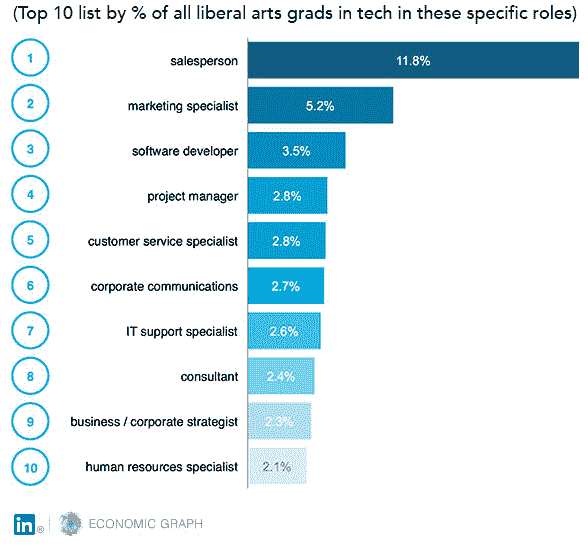
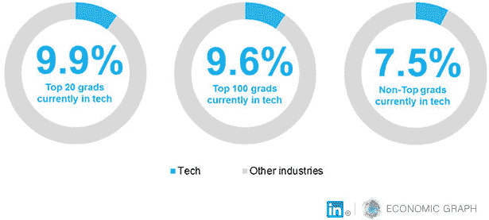
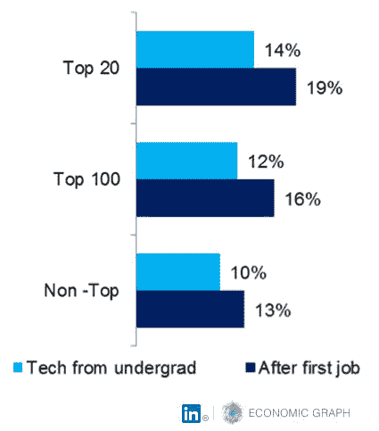

# 你不需要知道如何编码才能在硅谷成功

> 原文：<http://blog.linkedin.com/2015/08/25/you-dont-need-to-know-how-to-code-to-make-it-in-silicon-valley/?utm_source=wanqu.co&utm_campaign=Wanqu+Daily&utm_medium=website>

[T2】](/content/dam/blog/en-us/corporate/blog/2015/08/hbo_siliconvalley_jared.png)

本月的《福布斯》封面故事呼吁人们关注文科专业学生在科技行业的贡献和日益增长的需求，这个行业因其工程人才而被广泛认可。这个故事的作者[乔治·安德斯](https://www.linkedin.com/in/georgeanders/?trk=li_li_corp_alicema_you-dont-need-to-know-how-to-code-to-make-it-in-silicon-valley)写道，“大胆的编码员越是梦想改变世界，他们就越需要在公司里配备能够与客户沟通的社会炼金术士——让进步看起来令人愉快。”

考虑到这一点，我们查看了 LinkedIn 的数据，以了解这些拥有文科学位的“社会炼金术士”加入科技劳动力的流行程度。我们将“文科”定义为人文科学、社会科学、自然/物理科学和理论数学。

正如我们的数据显示的，文科毕业生比工科毕业生更快地加入科技行业。2010 年至 2013 年间，从本科进入科技行业的文科专业的增长速度比计算机科学和工程专业的增长速度快 10%。互联网或软件公司尤其受欢迎——38%的文科毕业生目前在这一领域工作。

鉴于这些增长趋势，我们研究了这些数据，发现了三个见解，可以帮助文科毕业生了解他们的专业知识在技术行业中的位置。

文科专业的学生承担着广泛的角色

如今，你会发现整个科技行业都有文科毕业生。虽然销售和市场营销仍然占技术领域文科学位持有者的大多数，但最近文科毕业生最受欢迎的第三个角色是软件开发。这些结果表明，文科背后的哲学，鼓励技能的多样性和灵活的批判性思维，以各种形式转移到工作场所。

[T2】](/content/dam/blog/en-us/corporate/blog/2015/08/linkedin_top10_tech_grads.jpg)

大学毕业后，血统很重要，但它不会成就或毁掉你的科技事业

你在哪里上的大学对你的文科学位能否让你在科技领域找到工作有一定影响。

平均来说，大约 10%的文科毕业生从本科直接进入了科技行业；但是对于从美国前 20 名学校毕业的学生来说，平均比例是 14%。

然而，从长远来看，你不需要去常春藤盟校才能让你的文科学位为你所用。当我们按前 20 名、[前 100 名](http://colleges.usnews.rankingsandreviews.com/best-colleges/rankings/national-universities?int=9ff208)(不在前 20 名的学校)和非前 100 名的学校来分解最近文科毕业生的百分比时，我们发现每个层次之间的差异约为 1%或更少。

[T2】](/content/dam/blog/en-us/corporate/blog/2015/08/linkedin_top_tech_grads.jpg)

先前的工作经验会让你有更好的机会进入科技行业

不管从事什么行业，拥有全职工作经验都会让文科毕业生更有机会找到技术工作。一份早期的经济图表分析显示，在行业外招聘员工的前十大行业中，有一半与科技相关。

与直接从大学毕业的文科专业学生相比，文科毕业生在完成一份工作后进入科技行业的平均比例已经高出 4%。虽然我们仍然看到与血统的细微差异，但对于所有有经验的文科专业学生来说，整体情况更好。

[T2】](/content/dam/blog/en-us/corporate/blog/2015/08/linkedin_tech_grads.jpg)

在我们的现代工作经济中，人们有更多的机会和资源来获得他们想要的工作；最重要的是人们如何获得这些工作。有了 LinkedIn，你可以[获得新技能](http://www.lynda.com/?trk=li_li_corp_alicema_you-dont-need-to-know-how-to-code-to-make-it-in-silicon-valley)，[寻找和申请工作](https://premium.linkedin.com/jobsearch/?trk=li_li_corp_alicema_you-dont-need-to-know-how-to-code-to-make-it-in-silicon-valley)，[建立新关系](https://www.linkedin.com/people/pymk?trk=li_li_corp_alicema_you-dont-need-to-know-how-to-code-to-make-it-in-silicon-valley)。

随着我们继续构建[经济图表](https://www.linkedin.com/company/linkedin-economic-graph/?trk=li_li_corp_alicema_you-dont-need-to-know-how-to-code-to-make-it-in-silicon-valley)，我们将密切关注教育和就业趋势，因为它们标志着职业性质的变化。了解我们的教育和工作机会之间的联系可以帮助我们理解我们在自己的职业生涯中所做的选择。

方法细节:本分析结果仅代表 LinkedIn 数据。因此，会员如何选择使用本网站会影响我们的结果，以及我们对数据的可访问性。分析中没有考虑到这些差异。

*当我们提到“应届毕业生”时，我们指的是 2010 年至 2013 年间毕业的文科专业，没有研究生学位或技术类双专业。在考虑学校时，排名前 20 的学校包括《美国新闻》排名前 20 的国立大学以及[排名前 20 的文理学院](http://www.usnews.com/education/best-colleges/slideshows/2015-best-colleges-top-20-national-liberal-arts-colleges)。排名前 100 的学校包括其他 80 所顶尖的国立大学，以及排名前 50 的文理学院的剩余学校。所有其他学校都被认为是“非前 100 名”。被认为是文科的专业是人文科学、自然和物理科学、社会科学和理论数学。请注意，因为我们调查了美国的所有学校，当我们查看整体数据时，自然会有更多的非前 100 名学校，即所有最近进入科技行业的文科毕业生中有 10%与所有最近从非前 100 名学校进入科技行业的文科毕业生中有 10%相似。*

工作类型，即销售人员，取决于 LinkedIn 对该角色的分类。“工作”也是成员选择包括在他们的简档中作为职位的任何内容。组成该数据的成员在 2010 年至 2013 年间毕业于一所美国学校，我们假设 6 月为该年的毕业日期(除非另有说明)。没有教育数据的成员被排除在分析之外。

被认为是技术的工作包括互联网、计算机软件、计算机硬件、生物技术、在线媒体、电子学习、计算机游戏、消费电子、计算机和网络安全、信息技术&服务、纳米技术、无线和医疗设备。

(图片鸣谢:来自 HBO 系列剧《硅谷》的贾里德。在这本书里，他毕业于瓦萨大学，拥有经济学学士学位，是 Pied Piper 公司的业务开发主管。)