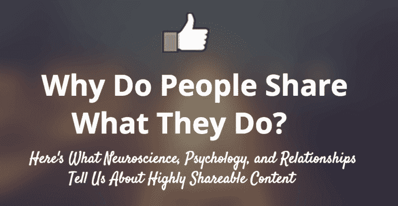
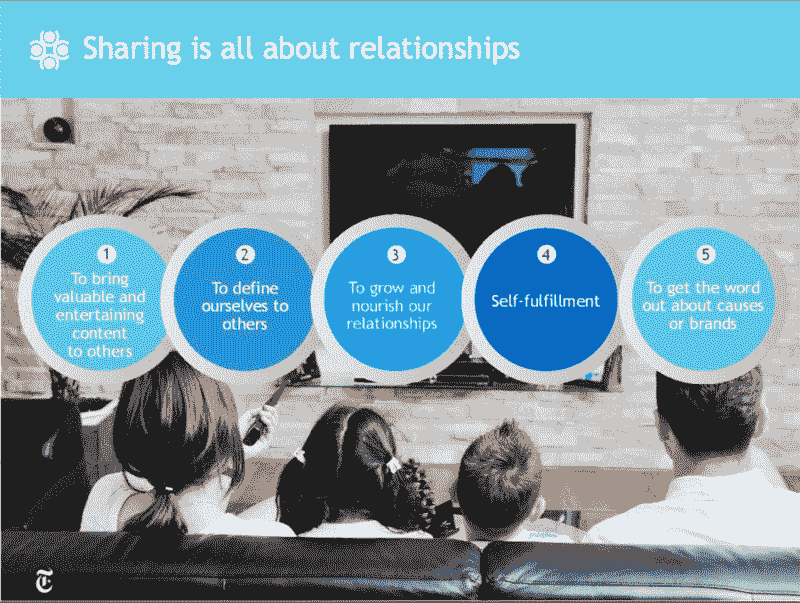
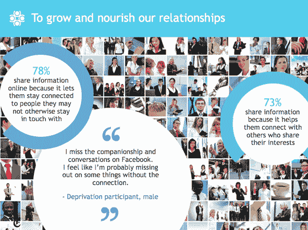
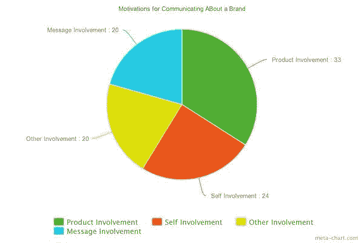
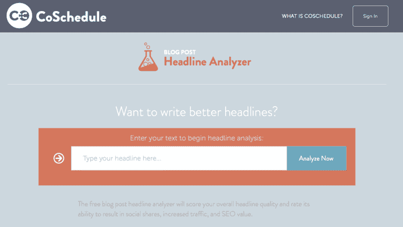

# 高度共享内容的科学和心理学内幕

> 原文：<https://blog.bufferapp.com/science-of-shareable-content?utm_source=wanqu.co&utm_campaign=Wanqu+Daily&utm_medium=website>

是什么让你停止滚动一篇文章，打开一个社交媒体应用程序，点击分享按钮？

是逻辑，[情感](https://buffer.com/resources/science-of-emotion-in-marketing/)，还是别的？

事实证明，社交分享不仅仅是衡量指标:心理学。

我们大脑与众不同的特性是我们激烈争论衣服的颜色的原因，或者是我们自由地、充满感情地分享一位在丈夫去世后悲伤的 T4 寡妇的帖子的原因，或者是我们迫切需要把吃冰淇淋的狗的视频传给我们热爱动物的岳父的原因。(有罪！)

引导那些股票的不是逻辑；是情感。你还能如何解释大多数人声称不喜欢的 [YouTube 音乐视频](https://www.youtube.com/watch?v=kfVsfOSbJY0)的 820 万点击率？

如果你[希望你的内容被分享](https://buffer.com/resources/shareable-content-social-media-research/)并定期分享，理解社交分享背后的“为什么”和“如何”可以大大有助于向你展示如何[为你的观众制作完美的帖子](https://buffer.com/resources/perfect-blog-post-research-data/)。为此，您可能需要:

1.  理解*为什么*人们分享内容
2.  知道他们更有可能分享什么样的内容
3.  着手*创造满足这些情感的内容*的任务

我们已经收集了一些关于如何理解你的观众想要什么，并开始向他们传递这些信息的便利技巧。

### **1。神经科学:我们分享是为了娱乐、启发和有用**

尽管社交媒体确实有让人们关注自己的趋势，但研究显示，人们在脸书页面或 Twitter 上分享东西的主要原因是对他人有用。

在 2013 年由加州大学洛杉矶分校的心理学家进行的一项研究中，研究人员首次能够确定大脑中哪些区域与具有传染性的想法有关，哪些区域与有效交流想法有关。

当人们第一次接触到他们后来会推荐的新想法时，TPJ 或颞顶结合部是大脑中在功能性磁共振成像(fMRI)大脑扫描中被点亮的区域。

加州大学洛杉矶分校心理学、精神病学和生物行为科学教授马修·利伯曼(Matthew Lieberman)是《社交:为什么我们的大脑会连接在一起》一书的作者，他指出:

> 我们的研究表明，人们经常会意识到他们所看到的东西是如何有用和有趣的，不仅对他们自己，对其他人也是如此。我们似乎总是在寻找还有谁会觉得这个**有帮助、有趣或有趣**，我们的大脑数据显示了这一点。在第一次接触信息时，人们已经在使用大脑网络来思考如何让其他人感兴趣。我们天生就想与他人分享信息。我认为这是关于我们思想的社会性的深刻陈述。

### **2。心理学:我们分享来表达我们到底是谁**

1986 年，心理学家 Hazel Markus 和 Paula Nurius 认识到我们的“现在的自己”和“可能的自己”之间存在差异。

在他们当时发表的一篇论文中，他们提出了我们可能的自我的概念:

1.  我们想要成为的理想自我
2.  我们可以成为的自我
3.  我们害怕成为的自我

这个第一自我，理想化的自我，是我们经常在社交媒体上分享的。

研究人员指出，这种对我们可能自我的描述是否真实并不重要。关键是，我们在脑海中描绘出我们是谁或者有一天可能是谁，并分享符合我们是谁这一概念的信息。

当我们以这种方式分享时，有时我们分享的是我们理想中的自己和我们渴望成为的人。这就是为什么有些人分享政治评论，对特定问题的愤怒，以及他们希望有一天能成为的人的成功故事。

正如作者自己雄辩地指出的那样:

> 可能自我有助于自我的流动性或可塑性，因为它们被社会情境不同地激活，并决定了工作自我概念的性质。与此同时，个人的希望和恐惧、目标和威胁，以及承载这些的认知结构是自我概念的定义特征:这些特征提供了一些最令人信服的证据，证明身份在时间上的连续性。

每当我看到关于拖延症的有趣漫画，我都会和我最亲密的朋友分享，他是一个骄傲的拖延者。每当我看到一个搞笑的狗狗视频，我就直接发给我的公公，那个动物爱好者。

每次我看到这些东西，我都感觉到和那些人有一种直接的联系。我想到他们，就想和他们分享我的发现。

我不是一个人。

在纽约时报客户洞察小组与 Latitude Research 联合开展的一项名为“[分享心理学:为什么人们会在网上分享？](https://web.archive.org/web/20161007212312/http://nytmarketing.whsites.net/mediakit/pos/)“78%的受访者表示，他们在网上分享信息是因为**让他们与那些原本可能不会联系的人保持联系。**

此外，73%的人说他们分享信息，因为这让他们能够与和他们有共同兴趣的人联系。

### **4。动机:更有参与感**

在我从事日常新闻工作的日子里，一家当地报纸的编辑曾经告诉我他对缓慢的新闻日的解决办法。

狗和婴儿。

“他们很可爱，”他会说。“它们拨动你的心弦。没有人能抗拒一只可爱的狗或一个可爱的婴儿。最好两者一起。”

媒介可能改变了，但信息没有变。人们仍然喜欢可爱的狗、可爱的婴儿，最好是两者兼而有之。

事实上，早在五十年前，人们就开始研究为什么人们谈论品牌并得出和我们今天一样的结论。1966 年，在《哈佛商业评论》报道的一项研究中，研究员欧内斯特·狄克特发现 64%的分享是关于分享者自己的。

他指出，一个人传播一个品牌有四个动机。

1.  第一个原因(大约 33%的情况)是因为产品参与，也就是说,**体验是如此的好、独特或新颖，以至于必须分享。**
2.  第二种(约 24%)是自我参与，也就是说，通过向人们展示你是买家专属俱乐部的一员或者拥有内幕消息来获得关注。
3.  第三种(约 20%)是他人参与，即**想要帮助他人并表达关心或友谊**。
4.  最后，第四个(也是 20%左右)是信息参与，也就是说，**信息是如此美妙、有趣或精彩，值得分享**。

### **5。利他主义:将具体原因公之于众**

在《纽约时报》客户洞察小组报告中，84%的受访者表示他们分享是因为“这是支持他们关心的事业或问题的一种方式。”

事实上，该报告进一步表明，85%的人说阅读他人的回复有助于他们理解和处理信息和事件。因此，我们不仅分享我们关心的事业的信息，而且如果其他人花时间通过社交媒体与我们分享这些信息，我们也会对他们关心的事业做出回应。

还记得 [ALS 冰桶挑战](http://www.bbc.co.uk/news/magazine-29013707)吗？

## **人们分享什么，如何让你的内容迅速传播**

在一项名为“[为什么内容会病毒式传播](https://katherinemilkman.squarespace.com/s/what-makes-online-content-viral.pdf)”的研究中，沃顿商学院营销学助理教授乔纳·伯杰(你可能也知道他是《T2》这本书的作者)和合著者凯蒂·米尔克曼查看了《纽约时报》*发表的 7000 篇文章，以了解哪些文章获得了最多的浏览量和社交分享以及原因。这项研究的目标是记录是什么使内容成为病毒，以及如何复制这些发现来创建病毒内容。*

这张来自 CoSchedule 的信息图很好地捕捉到了一些研究结果:

这项研究的研究人员根据他们的发现提出了三个关键想法:

### **1。积极的内容胜过消极的内容**

你可能不知道它从你的脸书饲料，但伯杰和牛奶人发现，积极的内容和故事更有可能被分享和传播比负面新闻故事。

你对这个发现感到惊讶吗？大多数人都是。但是坏消息比好消息更容易被我们记住的原因是因为我们大脑的“T0”消极偏见人类的大脑对坏消息和反馈的反应比任何积极的事情都更加敏感，所以你可能一天中看到或听到上百条积极的消息，但请记住一个关于生病孩子的新闻故事。这也解释了为什么在所有的赞美和称赞被遗忘几十年后，你还记得一次侮辱或攻击。

然而，研究表明，如果你想让你的内容像病毒一样传播，让更多的人看到，如果它有一个积极的包装，那么它就更有可能做到这一点。

***如何创造正面内容***

试着在积极的背景下构思事件。研究表明，最高级在标题中非常有效。例如:

正如 Courtney [在本帖](https://buffer.com/resources/headline-strategies-psychology/)中解释的那样，Buffer 对[积极和快乐](http://www.slideshare.net/Bufferapp/buffer-culture-04)的关注意味着我们要彻底改变这一技巧，发布像[这样有科学依据的帖子，让我们今天停止做 10 件事来变得更快乐。](https://buffer.com/resources/10-things-to-stop-doing-to-yourself-to-be-happier-backed-by-science/)

### 2.唤起高度兴奋情绪的内容做得更好

这可能并不令人惊讶，但伯杰和米尔克曼发现，一条内容越能唤起高度兴奋的情绪，如敬畏、愤怒、焦虑、恐惧、悲伤、幽默或好奇，它被重复分享和传播的机会就越大。

这就是为什么反直觉的观点如此成功，为什么让你生气的文章往往是你转发给朋友的文章。

事实上，这得到了我们在 Buffer 的研究的支持。在最近的一次实验中，我们发现[让图像迅速传播的关键因素之一是惊喜的元素](https://buffer.com/resources/viral-content-emotions-ages-genders/)。

在 NYT 的研究中，在不同维度上得分较高的文章有:

*情绪化:*

*   将抑郁症重新定义为单纯的悲伤
*   当其他方法都失败时，接下来往往是责备病人

*阳性:*

*   睁大眼睛的新来者爱上了这座城市
*   托尼奖慈善奖

(得分低)

*   网络谣言与韩国女演员自杀有关
*   德国:小北极熊的喂食器死亡

*敬畏:*

*   据报道罕见疗法治愈了艾滋病患者
*   RNA 的承诺和力量

*表示:T1*

*   什么红墨水？华尔街支付了巨额奖金
*   贷款巨头付给麦凯恩顾问近 200 万美元

*焦虑*

*   对于股票，这是 20 年来最大的单日跌幅
*   房价似乎远未触底

*悲伤*

*   在 911 事件中受伤，试图再次完整
*   奥巴马在祖母去世后向她致敬

***如何创造情感内容***

情感内容的驱动力之一是某人对你的内容的第一次接触:标题。

有一些非常有用的工具可以帮助确保你的标题包含正确的情感冲击。

*   这个神奇的工具将通过给你的单词选择打分，快速告诉你如何改进你的标题。它会查看标题中的单词，并将其分为四类:常见、不常见、情感和力量。越有情感和力量的词，你的标题就越好。
*   [高级营销学院标题分析器](http://www.aminstitute.com/headline/)——这个免费工具分析你的标题，以确定你的标题的*情感营销价值* (EMV)得分。该工具分析了 EMV 的总字数与标题中的总字数的关系，并得出一个分数。

### **3。实用有用的信息每次都会胜出**

最后，对于在 Buffer 阅读并分享我们自己内容的人来说，这并不奇怪(顺便谢谢你！)、**帮助你解决问题、给你可操作的提示、给你展示过日子的实用策略**的内容，只要能满足大量人的需求，并且以独特有趣的方式去做，就注定成功。

***如何创作实用、有用的内容***

博客作者阿曼达·加卢奇在她的文章[中将内容从无生命的转变为可操作的](http://www.iacquire.com/blog/transforming-content-from-lifeless-to-actionable)中，就如何有效地做到这一点提供了以下建议。她写道:

1.  让你的受众参与进来:这可能包括评论、调查或问题，但最重要的是，在内容本身中提及你的受众。加卢奇建议创建互动模块，读者可以在内容本身中使用。
2.  将你的研究与应用联系起来:研究和数字很重要，但是展示用户如何[将研究](https://buffer.com/resources/how-and-why-to-write-persuasive-research-backed-content/)应用到他们的生活中或者解决他们的问题是提供价值的好方法。
3.  **超越你的行业**:当谈到灵感时，不要让你的行业专家成为唯一指导你创造适合你的观众的有用内容的人。如果你的企业专注于财务和数字，考虑向有创造力的企业学习，反之亦然。
4.  **尽早陈述预期结果**:每当你创作一篇内容时，提前陈述访问者或读者在文章结尾会得到什么总是一个好主意。向你的读者许下教导或教育他们的承诺，然后遵守它。
5.  **提前思考**:你可以为你的内容做的最好的事情之一就是有一个编辑日历，指导你的日常内容决策，给你灵活性和空间来评论特定行业的事件和周年纪念日，并为读者提供对你所在领域出现的任何重大新闻的分析。

所以你有它。积极一点，触及一些情绪，有用的。创建可反复分享的内容的三个关键。再一次。

## **交给你了**

我很想听听你对病毒内容的体验。你有没有遇到过像病毒一样大规模传播的事情？你从经历中学到了什么？