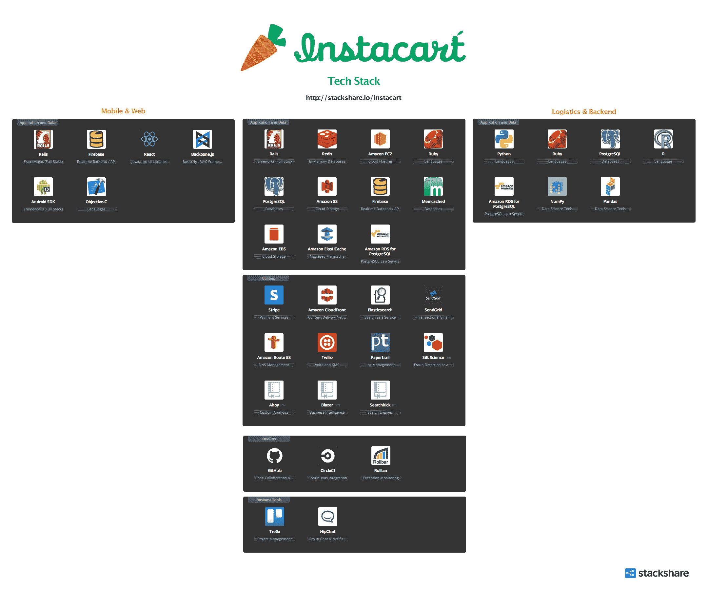

# Instacart 如何建立按需杂货配送服务| StackShare

> 原文：<http://stackshare.io/posts/the-tech-behind-instacarts-grocery-delivery-service?utm_source=wanqu.co&utm_campaign=Wanqu+Daily&utm_medium=website>

***编者按:** [布兰登·莱昂纳多](http://twitter.com/shiftb)是 [Instacart](https://www.instacart.com) 、[尼克·埃尔塞](https://github.com/nickelser)和[安德鲁·凯恩](https://github.com/ankane)都是 Instacart 的早期工程师。*

[T2】](https://img.stackshare.io/featured_posts/instacart_tech_stack.png)

在他们传言的 2B 估值达到 1000 万美元之后，我们和 Instacart 坐下来聊了聊他们广受欢迎的杂货递送服务背后的技术。我们发现他们是如何从一个只有 iOS 的 MVP(主要是手动流程)发展到目前的多平台自动化系统的。

内容

* * *

突出

[insta cart MVP](#mvp)

> 我们实际上首先推出了 iOS。iOS 应用程序看起来不错。成功了。你从 Instacart 订购食品杂货，网站上没有商店或零售商的概念。您刚刚从 Instacart 订购了香蕉和牛奶，我们从 Safeway 送货上门。
> 
> 那是公司的前三四个月。后端基础设施真的很糟糕。你下了订单，它做了大量的客户端检查，以确保它是正确的，然后通过系统推送。那个系统只是接受你给它的任何订单，不管我们是否能按时给你送到。这并不明智，当你只有几个订单时，这种做法还不错。然后，我们很快开始扩大规模，但有很多次，我、Max、Apoorva，那里的每个人都在周日出去送订单，直到凌晨两点，因为我们接了太多订单，我们没有足够的司机来完成。

[物流&后端](#logistics)

> 我们真正开始研究的最大工程挑战可能是延迟订单。我们开始建立一个系统，它可以预测在给定时间内我们可以接受多少订单，并且不会超出我们的能力，确保每个客户都获得真正令人惊叹的体验。我们真的只有一项工作，那就是帮你拿杂货，并准时送到你手上，如果我们做不到这一点，那还有什么意义呢？
> 
> 我们要看一个购物者能接多少单？这个订单有多少项？一个五件商品的订单与一个 60 件商品的订单有很大的不同，而且需要更长的时间。购物者有不同的工作速度。
> 
> 即使在不同的市场，我们也有不同类型的购物者，所以有些人有车，有些人没有，我们必须考虑到这一点。我们必须弄清楚如何安排所有这些订单，并以正确的方式将它们分配给人们，以便您总是在下午 3 点至 4 点之间收到您的货物，或者在一个小时或两个小时内到达，或者您选择的任何时间，我们一直都在这样做。

[手机&网络应用](#mobile-and-web)

> API 最酷的一点是 Brandon 最初构建它们的方式。主网络商店是一个 Backbone.js 单页网络应用程序，因此它使用 API 端点来完成所有调用，我们对消费者 iPhone 应用程序、消费者 Android 应用程序和消费者移动网络应用程序使用相同的 API 端点。它工作得非常好，我们只构建了一个 API，所有这些客户端，包括 web 客户端，都使用它。我们让所有这些购物者运行这些定制应用程序，这些应用程序具有所有这些功能，使他们能够更好地扫描商品，检查商品，获得如何挑选好的甜瓜的说明，检查这是正确的有机甜瓜，这是正确的部分，以什么顺序挑选哪些商品以便它们是新鲜的，什么时候检查哪些商品，扫描系统可以更快地通过收银通道。
> 
> 大约两周前，它曾经是主干视图和模型，一切都在我们的主商店应用程序和移动 web 应用程序上，但实际上，我们只是将移动 web 应用程序切换到使用 ReactJS 作为界面。所以它使用主干模型，但使用前端组件。实际上，这是因为主干模型-视图绑定的工作方式令人沮丧，而且它对大视图的性能不是特别好，我们必须做很多技巧来使它具有高性能。但是用 React 视图替换它意味着它可以更简单和更快，而不必在这上面花费太多时间。

[盘点&照片](#inventory)

> 以前，我们会抢走所有的商品，然后我们开始开新店，我们必须想办法获得库存。我们会做一些愚蠢的事情，比如买下一整岛的东西，然后在我们的办公室里建立一个摄影工作室，拍下所有的东西，因为产品数据根本不存在。
> 
> 早些时候，我们遇到了一些滑稽、可笑的事情发生...有一次，我们接到一个顾客非常生气的电话，他们说，“我该拿这些香蕉怎么办？”我们就像…“你什么意思？你在说什么？”我们调出了他们的订单。“你点了 10 个香蕉。我不明白这是怎么回事。”所以他给我们发了一张图片，他只是在香蕉上放了香蕉，就像一袋袋的香蕉流了出来。所以这个人订购了 10 个香蕉，但是香蕉的图像有一蒲式耳的香蕉，所以当他去那里的时候，购物者买了 10 蒲式耳的香蕉，这就是他交付给这个人的。像这样的小事只会让你措手不及。我们最后给他发了一份香蕉面包食谱，让他把它捐出来或者送给他的邻居之类的，结果成功了。

[基础设施工具&服务](#infrastructure)

> 我相信很多人都谈论过蓝绿色的部署周期，在这个周期中，你有这个版本的代码，它会慢慢地推广到其他所有的地方。我们做了一个小得多的版本，我们基本上有我们所谓的测试服务器，所以每当你发布代码时，它会立即进入一组测试服务器，你可以在你的代码中测试它，然后说，“如果我是测试服务器，以不同的方式做这件事。”现在，我认为有 10%的用户获得了测试体验。一旦他们登录，10%的用户被随机分配到这些测试服务器，他们将获得一些新功能或一些新的用户界面的东西改变或一个新的配色方案或什么的。这不是真正的 A/B 测试。这更多是为了推出新功能。我们有一个完全独立的方法来进行 A/B 测试。
> 
> 开拓者是较新的一种。我们开发了一个工具，任何人、城市管理者和运营人员都可以从我们的数据库中查询数据，出于隐私原因，我们将限制对他们有权访问的列的访问...您编写一个 SQL 查询，然后您可以与其他人一起使用该 SQL 查询。基本上是模板化的 SQL 查询，但是在我们自己的系统中，作为一个 gem，而不是一个外部服务。
> 
> 之前，我们遇到了……不是很大，但是我们遇到了欺诈问题，人们下了订单，尽管很明显他们使用的是偷来的信用卡，他们还是完成了订单。所以我们开始使用 Sift Science，基本上，我们向 Sift 发送来自用户的一系列信号，就像他们把这个商品添加到购物车一样。他们尝试添加信用卡，但失败了。他们添加了这个地址，然后提交了。因此，我们向他们发送信号集合，他们对这些信号进行机器学习，并向我们发回用户分类，我们将此作为我们决定是否应该履行订单的要素之一。

* * *

尤纳斯:我想我们可以从介绍开始。安德鲁，尼克，布兰登。你想简单谈谈你的背景吗？

布兰登:当然，我叫布兰登。我不知道你想让我追溯到多久以前，但大学毕业后，我在思科系统公司工作。这很好；我喜欢那里。后来我离开了，加入了一家创业公司。我只是没有回头。所以基本上，我职业生涯中所做的都是创业。

几年前，我是 AngelList 的第一个工程师，所以我帮助从邮件列表中，基本上是从 Naval 和 Nivi 的收件箱中，将它放到一个 Rails 应用程序中，并开始构建应用程序。现在是这个神奇的应用。一年后我离开了，去做我自己的事，但它的种子还在，那是一段很棒的时光。

然后，两年半前，我加入了 Apoorva 和 Max，我们开始了 Instacart。我是一名工程师，随着时间的推移，我做了大量的后端系统工作。

Nick:我叫 Nick Elser，我可能是 Brandon 来了之后雇佣的第二个工程师，我为 Instacart 做了几乎所有的工作。在我从另一家创业公司出来之前。我只知道初创公司。不幸的是，另一家初创公司被一家非常大的公司收购了，所以我也有大公司的经验，但那是一家大公司中的小初创公司。我个人致力于我们系统的每一个方面。整个堆栈。我真的对这里的机会感到兴奋，因为我们使用…我们所有的工程师基本上都被期望在堆栈的每一端工作。这就是我加入 Instacart 的原因，也是我喜欢 insta cart 的原因。

安德鲁:我叫安德鲁·凯恩，正如尼克所说，我也是 Instacart 的早期工程师。我在这里做的一些比较酷的东西，搜索是其中一个大的。现在我在我们的物流系统工作，确保客户准时收到订单。

Y:酷。可能会有许多不同的移动部分，我们可能没有时间深入架构的每个方面，但根据我的理解，至少有四个主要部分。有 iOS、Android、Web 和后端。但是在我们进入具体的方面之前，一般来说，对于你的产品的第一个版本，它看起来像什么？

Instacart MVP

铁轨

Heroku •

PostgreSQL

目标-C

*T2】*

 *太可怕了。真的很糟糕。虽然 iOS 应用看起来一直还可以。

Y:所以你推出了 iOS？

是的，我们首先推出了 iOS。iOS 应用程序看起来不错。成功了。你从 Instacart 订购食品杂货，网站上没有商店或零售商的概念。您刚刚从 Instacart 订购了香蕉和牛奶，我们从 Safeway 送货上门。

那是公司的前三四个月。后端基础设施真的很糟糕。你下了订单，它做了大量的客户端检查，以确保它是正确的，然后通过系统推送。那个系统只是接受你给它的任何订单，不管我们是否能按时给你送到。这并不明智，当你只有几个订单时，这种做法还不错。然后，我们很快开始扩大规模，但有很多次，我、Max、Apoorva 和那里的每个人都在周日出去送订单，直到凌晨两点，因为我们接了太多订单，没有足够的司机来完成。

Y:好吧，这是人的问题。

是的，我们的许多问题实际上是人的问题。

Y:明白了。顺便问一下，对于第一个版本，后端是用什么写的？

b:它从一开始就一直在 [Rails](/instacart/instacart-mvp/details#rails) 中，所以我们从一开始就使用 [Redis](/instacart/instacart-mvp/details#redis) 来缓存我们的项目。Rails 是我们所熟悉的，我们知道我们希望前端非常非常快，所以我们将所有的项目属性反规范化到 Redis 中，这就是它的工作方式。

我们有了 [Postgres](/instacart/instacart-mvp/details#postgresql) ，我们开始上 [Heroku](/instacart/instacart-mvp/details#heroku) 。当订单到来时，我们只需将订单发送给购物者。哪个购物者最后收到订单，这有点像购物者收到短信的旋转门，短信会把他们带到一个不是真正移动格式的网页，只是告诉他们要什么，然后他们会说“我知道了”，这就像是它的智能程度。我们刚刚迭代了。

所以总的来说，我想说这多少代表了我们的工作方式，那就是我们尽可能快地推进某样东西，不管它是什么，尽可能小的版本，然后不断重复，直到我们做对为止。

酷，这就是 V1，只有 iOS，没有网络，没有安卓，听起来好像很多功能都没有。你在早期遇到过任何重大的工程挑战吗，或者说都是人的方面？

b:我们从来没有遇到过我们无法解决的工程挑战，所以回过头来看，似乎从来没有真正的大问题，我们很幸运，因为我们有 Heroku，而且这个网站很小，我们可以很容易地扩展它。我们不必担心基础设施。我们不需要担心这些，我们所关注的只是编码和解决应用问题。早期的许多有趣的问题，或者我个人觉得有趣的事情，是像解决购物者日程安排和类似的系统这样的事情，这不仅是工程问题，也是人的问题。

我们真正开始研究的最大工程挑战可能是延迟订单。我们开始建立一个系统，它可以预测在给定时间内我们可以接受多少订单，并且不会超出我们的能力，确保每个客户都获得真正令人惊叹的体验。我们真的只有一个工作，那就是拿着你的杂货，按时送到你的手中，如果我们做不到这一点，那还有什么意义呢？

这是我们的第一个大挑战，但我们能够通过手动方式在前几个月进行批处理，并手动分配订单，直到我们对实际需要做什么有了一点点了解。

Y:明白了。所以你知道了你需要做一些需求预测，并且更聪明地去满足需求。

物流和后端

鲁比

蟒蛇

r

NumPy

熊猫

一种数据库系统

*T2】*

 *Y:就这样快进到现在。你现在面临的主要工程挑战是什么，你是如何应对的？

你们想聊点什么吗？

我可以从事物流行业。

是的，物流可能是最有趣的。

答:在物流方面，我们有一个车辆路径问题，这是一个 NP 难问题，所以很难解决，你不可能跑完所有不同的组合。

我想，只是退一步描述一下我们的物流系统——所以它本质上做的是我们需要抓住所有这些订单，我们有所有这些购物者，我们需要弄清楚哪些购物者应该得到哪些送货。

我们需要弄清楚我们什么时候需要开始这些交付，以及我们应该如何将它们组合在一起。因此，一个购物者可以同时处理多个交付，以提高效率，这样他们就可以去商店，购买商品，然后一次交给几个不同的客户，以提高效率。

b:购物者是个人购物者的一种。顾客是在 Instacart 上购买杂货的人。一批是购物者工作的单位，因此它可能是一个订单，或者一次交付可能是多个订单。

答:物流在那里是一个很大的挑战。随着公司的发展，组合的数量，我们工作的解决方案基础，继续膨胀，所以我们必须想出启发式的方法来找出哪些购物者应该得到哪些送货，所以很多工作要做。想出试探法，测试不同的试探法，并找出如何让事情变得非常快。

我们现在实际上有两个系统。一个在 [Ruby](/instacart/logistics-and-backend/details#ruby) 中，一个在 [Python](/instacart/logistics-and-backend/details#python) 中。

n:你们用哪些 Python 库？

答:我们使用典型的数据科学堆栈，即 [NumPy](/instacart/logistics-and-backend/details#numpy) 、 [Pandas](/instacart/logistics-and-backend/details#pandas) ，还有其他一些我一时想不出来的。

b:数据科学是 Python 的全部，应用基础设施仍然是 Ruby。

答:是的，所以我们有一个同时使用 Python 和 [R](/instacart/logistics-and-backend/details#r) 的数据科学团队，所以这些代码通常会从我们的生产数据库中读取数据，进行任何需要的计算，然后或者将数据放回生产数据库的另一个表中，或者放入另一个数据存储中，然后 Ruby 应用程序会从那里重新开始处理数据。因此，在需求预测的情况下，我们有 Python 或 R 代码来进行估计，读取所有数据，得出我们在接下来的一两周需要多少购物者，然后写下这些值，然后 Ruby 应用程序会显示这些值，并为我们的运营团队提供工具来安排购物者等等。

我们有四个人做数据科学，他们现在都在后勤团队，所以后勤团队是六个人。所以我自己，另一个软件工程师，然后四个数据科学家，我们将致力于物流引擎。我们做了大量的预测建模，比如计算出购物者将在商店停留多长时间，从地点 A 开车到地点 B 需要多长时间，这样这些估计就会进入物流系统，从而变得更加智能。

Y:明白了。就数据库而言，你还在用 Postgres 做任何事情吗？

是的。我们在 [AWS RDS](/instacart/logistics-and-backend/details#amazon-rds-for-postgresql) 上运行。

n:尽管我们确实使用了各种各样的 Redis 实例，既用于数据科学，也用于我们的生产项目。

答:我们也主要在网络上使用 [Memcache](/instacart/instacart/details#memcached) 。

b:你认为计划更新的速度有多快，如果你考虑某一天发生的事情，假设现在我们有当天剩余时间的现有订单。我们的顾客今天已经下了订单，然后我们一直在下新订单，所有这些都必须考虑进去……你有来自不同地点、来自不同商店的顾客。他们都在不同的批次上工作，所以我们只是不断更新今天和明天的计划。

答:每一分钟我们都有一个新计划，从头开始写的全新计划。

Y:当你说“计划”时，你指的是从物流角度来看需要发生的所有事情，对吗？

答:是的，所以我们会计划一整天的交付量，所以你可以去，你现在可以登录到一个管理页面，看看在哪里，如果我们最终没有改变计划，如果没有更多的交付进来，我们现在会在这一天的剩余时间里做什么，所以我们每分钟都会更新新的信息。这基本上就是说，哪些订单在什么时候发给了哪些顾客。

因此，新订单不断到来，所以我们昨天无法完成。我们不得不在今天余下的时间里一直这样做。但是，我们还得看看一个购物者能接受多少订单？这个订单有多少项？一个五件商品的订单与一个 60 件商品的订单有很大的不同，而且需要更长的时间。购物者有不同的工作速度。

即使在不同的市场，我们有不同类型的购物者，所以有些人有车，有些人没有，我们必须考虑到这一点。我们必须弄清楚如何安排所有这些订单，并以正确的方式将它们分配给人们，以便您总是在下午 3 点至 4 点之间收到您的货物，或者在一个小时或两个小时内到达，或者您选择的任何时间，我们一直都在这样做。

Y:这就是实现的过程。是你一个人在做吗，还是早期的样子？

所以布兰登做了这个系统的第一个版本。

b:我们在 Instacart 工作的方式之一是我们通常喜欢先有一个度量标准来衡量。所以 Apoorva 写了第一个版本，它只是一个即时发给购物者的短信，然后我写了第一个真正的版本，它试图匹配订单，并试图更智能地将订单发给哪个购物者，但它不做任何容量规划或任何事情，它只会找到一个购物者，然后如果没有可用的购物者，它仍然会找到一个购物者，所以它会发出订单。

然后我们会重复，但在某个时候我们开始增长，即使在那个页面上有一些手动批处理和手动帮助，在某个阈值，它只是太多要做，所以延迟订单的数量在上升，这又是非常可怕的。所以安德鲁的工作实际上是解决延迟订单。

就这样。这就是问题所在，对吧？你有一定比例的订单会在某一天或其他时间延迟。把它压下去，这就是安德鲁接手并开始做的事情，让它变得更加智能。

然后，他只是不断地迭代，好事情是你今天可以推动一个变化，并立即看到它是否有所不同。我们能够快速移动。

移动和网络应用

目标-C

做出反应

主干网

Firebase

Android SDK

*T2】*

 *Y:非常酷。你想谈谈你对尼克的关注吗？

n:我关注各种各样的事情。我想最有趣的可能是谈论我们在各种平台上的前端堆栈，目前，我为我们的内部团队开发了一系列工具，因此基本上是构建供我们的运营团队、客户支持团队以及各种管理工具等使用的工具。我们发展得如此之快，我们需要…我们要做的东西有很大的表面积，我们需要有能力控制和改变，以更好地服务于我们的客户。

但在此之前，我曾在我们的消费产品上做过大量的工作，这非常有趣。除了我们非常传统的 iOS 和 Android 应用程序，我不认为我们会做任何疯狂的事情。

b:我认为当我向候选人展示我们的购物应用程序时，人们总是会感到惊讶。这是你想都没想过的事情，但显然，购物者有一个应用程序。

Y:我正要问这个问题。

n:你提到了我们要关注的四个方面——后端、iOS、Android 和我们的网络界面。我们还为顾客提供 web、Android 和 iOS 应用程序，所以这是一个定制应用程序，功能齐全，事实上，它需要的开发时间与我们的消费产品一样多。然后，我们让所有这些购物者运行这些定制应用程序，这些应用程序具有所有这些功能，使他们能够更好地扫描商品，检查商品，获得如何挑选好的甜瓜的说明，检查这是正确的有机甜瓜，这是正确的部分，以何种顺序挑选哪些商品，以便它们是新鲜的，扫描系统可以更快地通过收银台通道。

我们通过所有这些方式来提高效率，改善购物者的体验，从而提供更好的顾客体验。有一段时间，我们有一个共享的 UI 套件，我们在购物者应用程序和消费者应用程序之间共享，它们有相似的美学和相似的背景功能集。

Y:你是说在 iOS 端？

n:在 iOS 方面，在某种程度上在 Android 方面，但我们远离了这一点，因为他们已经分化，因为我们的消费者应用程序变得更加全面，集成了所有这些更强大和现代的技术，如 Apple Pay 和所有其他东西，而我们的购物应用程序不需要这些东西，是一个更加传统的应用程序。但是看到它们的成长和分化，看到有多少人在日常生活中使用它们，这是很有趣的。

Y:是的，那么最初是不是一直都是两个独立的应用程序，购物者和消费者？

是的。我们过去只是将购物者发送到一个网络视图，基本上就是一个有商品清单的网站。

但实际情况是，假设你在一家没有信号的商店。到处都是混凝土。你收不到信号。如果有人给它添加了一个项目或发生了变化，他们需要标记“我找不到这个”，他们必须去找到一些信号，点击这个愚蠢的东西，然后回到商店，而现在，我们在应用程序中有一个内部排队系统，所以它可以处理网络活动丢失和感知，这样我们就知道他们在哪里，当他们轮班时，能够做所有这些其他事情。

你们很快就发现了吗？

恩，除了我们不断收到顾客的反馈，我们实际上每年都要去购物几次。Instacart 的所有工程师每年至少去一次或两次购物之旅，这意味着我们能够亲身体验，比如“哦，这真令人沮丧”或“这太棒了。”

当然，我们都是 Instacart 的消费者，所以我们可以看到它的两端。

n:我不知道还有什么可以补充的。

b:你可以谈谈这个应用程序是如何开始的。

是的，这确实是一个有趣的观点。基本上，我们有自己的 iOS 应用程序，它是从本地开始的，对吗？它开始是一个原生应用程序，然后我们意识到你必须经历一个审查过程，这很慢，在非常早期的阶段，它对我们来说是有意义的，让它成为一个包装的网络视图。基本上，应用程序将打开，它将是其中的一个 web 视图，我们可以快速迭代并快速更改，而不必等待应用程序商店视图流程来更改它。这不是一个完全的本地体验，但它实际上非常好，持续了很长时间，直到最近才成为我们当前移动网络体验的基础，这与我们的应用程序情况不同。

所以很长一段时间，基本上，我们的应用商店 iOS Instacart 应用程序只是我们商店的包装网页视图，我们商店的浓缩版本，这意味着我们可以添加东西。我们可以改变销售。我们可以改变格式。我们可以很快改变用户界面，而不必担心应用商店的审查过程。

我想说，这一切在大约一年前发生了变化，从那时起，它变成了一个完全原生的应用程序。我们对该产品和所有功能都感到非常满意，因此我们让它成为了一种本地体验，并成为了一款功能齐全的应用。

现在我们已经无数次出现在 app store 上了。

Y:非常酷，非常酷。要不要说说安卓这边？

n:我们从一开始就没有，我的意思是，我们有一个很长的时间，但当我们引入它时，它与我们将 iOS 应用程序本地化的时间框架相似，我们只是引入了一个等效的原生 Android 应用程序，从那以后他们一直保持功能对等。

**Y:Android 和 iOS 的体验有什么大的不同吗，或者你的目标是…**

n:它们遵循两者的范例，所以它不是一个等价的用户界面，但是在功能方面和交互方面以及其他方面，它都是由我们的 API 驱动的，所以它们显示相同的内容，并且它们以几乎完全相同的方式与之交互。

API 最酷的一点是 Brandon 最初构建它们的方式。主网络商店是一个 Backbone.js 单页网络应用程序，因此它使用 API 端点来完成所有调用，我们对消费者 iPhone 应用程序、消费者 Android 应用程序和消费者移动网络应用程序使用相同的 API 端点。它工作得非常好，我们只构建了一个 API，所有这些客户端，包括 web 客户端，都使用它。

b:每个人都和同一个端点通话，所以信息是一样的，只是客户不同而已。

答:即使是 iPhone 和 Android 开发者，也会用有限的 Ruby 知识添加自己的 API 端点。看到这些真的很酷。我猜，我认为很多人都是跨职能/跨学科的。

b:我们喜欢完全拥有东西，所以作为一个移动开发者，如果你不得不等待别人来构建你需要的 API，那就糟了，所以我们的第一个 iOS 开发者在学习 iOS 之前就知道 Rails。他只会写自己的东西，而我们的 Android 人员不会，他们来自 Java 背景，没有 Rails 经验。他们只是捡起来，开始编写自己的 API，现在他们已经完全自给自足了。因此，如果他们需要做什么，他们就去做，并把它做好。

Y:很好。

答:数据科学方面的情况也是如此，所以没有一个数据科学家知道 Ruby 进入公司，大约一两周之后，他们用 Ruby 编写自己的仪表板和功能等东西，以显示他们用 Python 或 R 生成的数据，因为他们想把它放在仪表板上，向公司的其他人展示。

n:我知道我们提到过它是一个主干应用，在网络方面。大约两周前，它曾经是[主干](/instacart/mobile-and-web-apps/details#backbone-js)视图和模型，一切都在我们的主商店应用程序和移动网络应用程序上，但实际上，我们只是将移动网络应用程序切换到使用 [ReactJS](/instacart/mobile-and-web-apps/details#react) 作为界面。因此，它使用主干模型，但使用前端组件。

拥有一个移动网站可以让我们的 Windows phone 用户或者黑莓用户订购。

Y:你们为什么从反应型转向骨干型？

n:真的，这是因为主干模型-视图绑定的工作方式令人沮丧，它对大视图的性能不是特别好，我们必须做很多技巧来使它具有性能。但是用 React 视图替换它意味着它可以更简单和更快，而不必在这上面花费太多时间。

b:另一件有趣的事情是，因为 React 实际上可以很好地与主干模型和主干路由器之类的东西一起工作，我们不必重写移动 web 应用程序并将其更新到 ReactJS。重写几乎总是一个坏主意。我们能够一次升级它的一部分，然后继续使用 React，现在整个系统都使用 React，并且只有我们已经拥有的主干路由器和模型等东西，所以速度快了很多。

Y:明白了。你只在移动网站上使用 React。

是的，但是我想在更多的事情上使用它。这是一次非常好的经历，但是总的来说，我们不喜欢为了重写而重写的想法。它总是在一些其他的目标方面。在这种情况下，它是我们的移动 web 应用程序的可维护性和性能。

Y:好的。酷毙了。你最初选择骨气有什么特别的原因吗？

你知道，这正是我所知道的。所以我们非常非常早期，我们只有 iOS，然后我们想，我们错过了一半的市场。我们需要添加 Android。因此，我们有一个朋友开始开发 Android 应用程序，我必须为他开发 API，但我真的很难做到这一点，因为我不知道他到底需要什么，所以我在周末建立了第一个版本的网络商店，因为我想有一个客户来消费我正在开发的 API。

这只是骨干，因为这是我们所知道的，那时候要稳定得多。React 不存在。Angular 是全新的。所以这就是我们要做的。

Y:你也可以只使用 Rails，对吗？

是的，但是……是的，我们本来可以的。但是我喜欢单页应用程序。他们感觉更有反应了。

Y:那么在网站上，购物者也有他们自己的体验？

b:实际上，购物者几乎只通过 iOS 应用程序和 Android 应用程序进行交互。

n:我们仍然在某种程度上使用网络视图。我们有一个主干单页应用程序，可以做很多这样的事情，比如允许他们管理自己的信息来安排自己的日程，更改他们的信息来查看他们的工资支票和其他一些事情，但在大多数情况下，这些都是本地的。

Y:明白了。所以我们主要关注的是 Rails、Backbone，当然还有移动设备、Postgres。

b:是的，我们想使用红移，或者我们认为红移在某些时候会很好，但我们还没有到那一步。

库存和照片

亚马逊 S3

亚马逊云锋

载波波

*T2】*

 *Y:非常酷。你想分享一下你们的衡量标准吗？你公开分享过吗？

我们真的没有，也不打算这样做。

Y:很公平。

我要说的一件事是，我在合作伙伴和目录团队工作。这是我的主要关注点，所以这是与我们的零售商合作伙伴和其他一些合作伙伴的接口，然后还要处理我们的目录数据，这是所有你会通过 Instacart 购买和订购的商品。真正有趣的是，它的规模急剧增加。

以前，我们会抢走所有的商品，然后我们开始开新店，我们必须想办法获得库存。

我们会做一些愚蠢的事情，比如买下一整岛的东西，然后在我们的办公室里建立一个摄影工作室，拍下所有的东西，因为产品数据根本不存在。

最后，我们，实际上是尼克，我想，在周末或一周左右的时间里，开发了一个扫描应用程序，允许购物者团队进入商店，非常快速地获取商店中的库存，然后现在我们与合作伙伴合作，我们有更好的系统来处理这些，但在过去几个月里，我们处理的商品数量已经从几十万增加到几百万或几百万，非常快。

因此，它的规模增长如此之快，但从事这项工作的团队基本上仍是一名工程师和几名数据编目人员。

Y:我很惊讶杂货店没有这些东西提供给你，即使你必须付钱或做些什么，因为他们有自己的库存系统，对吗？

b:你会对他们有的或没有的数据感到惊讶。

所以在某些情况下，在某些商店里，我们比他们更了解店里的东西。

是的，我确定。你说只有一个工程师在工作，对吗？

b:有一个工程师专注于库存。但是没有人拥有代码库的任何部分，所以根据你需要做的事情，你可能会做很多不同的事情。

有一个人主要关注这一点，我们有另一个团队专注于数据质量，确保，你知道，这表示水晶间歇泉矿泉水，大小是正确的，所有这些事情我们都有一个很好的图片，所以你知道当你在 Instacart 上看到这张图片时，你实际上是在购买该产品。

早些时候，我们发生了一些有趣的事情。实际上，在公司的早期阶段，我们接到了一个客户非常生气的电话，他们说，“我该拿这些香蕉怎么办？”

我们就像…“你什么意思？你在说什么？”

"我该拿这些香蕉怎么办？"

我们调出了他们的订单。“你点了 10 个香蕉。我不明白这是怎么回事。”

“我该怎么办？”所以他给我们发了一张图片，他只是在香蕉上放了香蕉，就像一袋袋的香蕉流了出来。这是怎么回事？所以这个人订购了 10 个香蕉，但是香蕉的图像有一蒲式耳的香蕉，所以当他去那里的时候，购物者买了 10 蒲式耳的香蕉，这就是他交付给这个人的。像这样的小事只会让你措手不及。

我们最后给他发了一份香蕉面包食谱，让他把它捐出来或者送给他的邻居之类的，结果成功了。但是有很多你想都没想过的奇怪的微妙之处，在这个团队中一直都在发生。

Y:真有趣。摄影方面听起来很有趣。Airbnb 摄影工作室现在非常出名，他们很早就有专业摄影师。但我想对你们来说，这可能同样重要，因为它影响到人们的购买方式。

b:是啊，一件没有图片的商品被购买的可能性要低一个数量级。所以你必须有图像。对顾客来说更舒适。购物者不知道挑选什么，有效地去得到他们从未听说过的随机物品，如格兰诺拉燕麦卷或其他东西，你可以永远搜索试图找到它，但如果你有一个图像，这就容易得多。你很快缩小范围，然后你只需要注意，就像哦，他们想要巧克力片牛奶的东西。

因此，它直接影响到我们业务的巨大效率。

Y:是的，所以我肯定你们现在有数百万张照片。你只是把它们扔在 S3 吗？

答:是的，我们使用[载波](/instacart/inventory-and-photos/details#carrierwave) gem 将它们同步到 [S3](/instacart/inventory-and-photos/details#amazon-s3) ，然后我们使用 [CloudFront](/instacart/inventory-and-photos/details#amazon-cloudfront) 将它们提供给所有应用。

基础设施工具和服务

铁轨

雷迪斯

亚马逊 EC2

滚动条

开源代码库

*T2】*

 *Y:让我们来谈谈实际的工具和你正在使用的一些服务。所以你从 Heroku 去了 AWS，对吗？

答:是啊。我们喜欢 Heroku 的很多东西。我们喜欢构建包，事实上我们仍然在使用 Heroku 构建包，但我们对许多事情缺乏控制感到沮丧。

拥有自己的命运真好。

答:拥有完整的堆栈很好，或者更确切地说，就 AWS 而言。它为我们提供了前所未有的灵活性和功能性。

Y:明白了。于是 [EC2](/instacart/instacart/details#amazon-ec2) ， [RDS](/instacart/instacart/details#amazon-rds-for-postgresql) ，[云锋](/instacart/instacart/details#amazon-cloudfront) …

是的，我们使用了很多亚马逊的技术。

[EBS](/instacart/instacart/details#amazon-ebs) 。我们使用[elastic cache](/instacart/instacart/details#amazon-elasticache)，Redis 和 Memcache 都有。[53 号公路。](/instacart/instacart/details#amazon-route-53) [S3](/instacart/instacart/details#amazon-s3) 。

b:基本上只有一件事是我们让另一家公司管理的，那就是我们的弹性搜索集群。

对于一些 Redis 实例，我们也使用其他人。但你仔细想想，这些都是在 AWS 上托管的。

搜索

Y:你想谈谈搜索吗？

是的，我们一直在搜索。最早的搜索版本只是一个 Postgres 数据库查询。它不是非常高效，然后在某个时候，我们转移到了 [ElasticSearch](/instacart/instacart/details#elasticsearch) ，然后从那以后，Andrew 就用它做了很多工作，所以 ElasticSearch 是惊人的，但开箱后，它并没有配置所有的好东西，但你花了很多时间想出如何把它们放在一起，以添加词干，自动建议，各种不同的东西， 就像拼写调整和番茄/番茄一样，这将返回不同的结果，所以 Andrew 做了大量的工作来使它变得非常非常好，并构建了一个非常简单的 Ruby gem，称为 [SearchKick](/instacart/instacart/details#searchkick) 。

Y:我正要说，是的，我见过。SearchKick 所以是你们干的。好的，非常酷。

答:是的，对我们来说，搜索方面的重大突破是我们一直以来都应该做的，但当我们开始跟踪用户在搜索什么，并真正研究这些数据时。因此，对任何做搜索的人来说，最大的建议就是跟踪用户在搜索什么，以及他们是否在转化。一旦我们开始这样做，我们就有了一个实时显示人们实时搜索内容的仪表盘。这就像，哇，这真的很酷，但你会看到没有人知道如何拼写 Sriracha 或 zucchini，所以你会在搜索结果中注意到这些东西，这是如此痛苦，因为你会看到有人只是挣扎于所有这些不同的拼写错误。一开始我们真的做不了什么来帮助他们，所以只是查看搜索数据，我们想出了一些不同的东西。拼写错误是帮助搜索的方法之一。

另一件大事是转换。所以默认情况下，ElasticSearch 会选择匹配的最短令牌，所以“香蕉”，如果你有一个产品叫做“香蕉”，“香蕉面包”和“有机香蕉”，它会按这个顺序排列。它会把它放在和香蕉匹配的最短的名字里。的，你不知道那是不是…也许你希望有机香蕉是第一个结果，但是因为它比较长，所以 ElasticSearch 默认不会这么做。

所以我们开始使用转换，这产生了巨大的差异，所以如果有人搜索“香蕉”，也许他们第一次搜索时，“有机香蕉”是第三位，但当他们加入购物车时，结果现在得到了一点点的提升，然后当足够多的人这样做时，很快好的结果就会出现在顶部。所以它可以自我训练，这真的很方便，因为这样我们就不用用它做那么多事情了。

Y:非常酷，非常酷。太棒了。然后，你只需通过 API 在所有应用中使用它。非常酷。你能谈谈你们是如何发布代码的吗，仅仅是你们的部署过程？

构建和部署

n:是的，所以我们使用 [GitHub](/instacart/instacart/details#github) ，我们基本上使用一种连续部署的变体，当任何人合并了他们已经完成的功能时，他们会立即发布它，我们将其打包成一个构建包，并发送给我们所有的 [EC2](/instacart/instacart/details#amazon-ec2) 服务器。

我们在测试中使用 [CircleCI](/instacart/instacart/details#circleci) ，但在构建中不使用。这些构建现在都是手动触发的。

b:团队中的任何开发人员都可以在任何时候触发构建和部署。因此，在某一天，我们可能会部署 20 或 30 次来生产。

Y:我假设你们有一些不同的环境。

n:我们有一个分级系统，显然规模较小，但完全反映了我们的生产信息，所以你可以在那里测试任何东西。例如，我们有一个临时数据库，其中包含我们生产数据库的净化版本，除了临时 Redis 和其他任何东西之外，每天都进行同步，所以基本上，我们有一个精确的副本，可以在其上测试任何东西，并查看运行负载测试或其他任何东西的含义。

你想谈谈贝塔吗？

是的，当然可以。在部署方面，我们做了一件其他人可能不会做的小事，那就是我们有…我肯定很多人都谈到了蓝绿部署周期，在这个周期中，你有这个版本的代码，它会慢慢地推广到其他所有东西。我们做了一个小得多的版本，我们基本上有我们所谓的测试服务器，所以每当你发布代码时，它会立即进入一组测试服务器，你可以在你的代码中测试它，然后说，“如果我是测试服务器，以不同的方式做这件事。”

现在，我认为 10%的用户得到了测试版的体验。一旦他们登录，10%的用户被随机分配到这些测试服务器，他们将获得一些新功能或一些新的用户界面的东西改变或一个新的配色方案或什么的。他们将首先得到它，我们可以看到测试服务器在负载、用户反馈和其他方面的影响。我们会知道，“嘿，这个用户点击了测试服务器，他们将获得测试体验。”如果是积极的，我们会推广给其他人。

Y:你们几乎已经建立了自己的 A/B 测试框架。

n:这不是真正的 A/B 测试。这更多是为了推出新功能。我们有一个完全独立的方法来进行 A/B 测试，因为对于某些事情来说，这不是一个很好的 A/B 测试。如果只有 10%的用户，也许我们需要进行 30%或 60%或 65%的测试。

我们有一个自己编写的更加健壮的 A/B 测试框架。现在还没有开源，但是以后会的。

Y:好的，你对所有的应用程序都这样做。

恩，特别是所有的 API。具体到应用程序，我不认为他们现在正在做任何 A/B 测试。我不确定他们通常做什么。

我们是在 API 级别上做的。我们将发送特征标志。例如，我们将这个用户设置为 on this test，通过 API 发送过来。

当然，还要测试实际生产流量中我们没有预见到的其他意外问题。我们仍在研究它的分支。

公用事业

Y:明白了。你们用任何服务发短信吗？

n:我们广泛使用 Twilio 来进行语音呼叫路由和发短信。事实上，我们最近用它来发送彩信。

我们做号码屏蔽。因此，私人购物者永远不会知道你的实际号码，你只要拨打 Twilio 号码，它就会智能地把你转到顾客那里。反之亦然。

我们使用 [SendGrid](/instacart/instacart/details#sendgrid) 发送电子邮件。

b:其他公司可能不会做的一件很酷的事情，或者我们使用的一项服务是 [Sift](/instacart/instacart/details#sift-science) ，用于欺诈保护。

n:所以之前，我们有…不是很大，但是我们有一个欺诈问题，人们下订单，他们得到满足，即使他们非常明显地使用了偷来的信用卡。所以我们开始使用 Sift，基本上，我们向 Sift 发送来自用户的信号集合，就像他们把这个商品添加到购物车一样。他们尝试添加信用卡，但失败了。他们添加了这个地址，然后提交了。因此，我们向他们发送信号集合，他们对这些信号进行机器学习，并向我们发回用户分类，我们将此作为我们决定是否应该履行订单的要素之一。

这一切都是实时发生的。没有人为干预，你就能看出来。如果他们的 Sift 得分非常高，你可以说，“这个人明显是欺诈性的。他们使用六个不同地方的信用卡，只点 Patrón。”

**Y:没错，所以这立即引发了一个标志，Patrón.**

是的，剃须刀和 Patrón。

Y:付款？

B: [条纹](/instacart/instacart/details#stripe)。他们的市场支出以及普通的旧信用卡。

Y:然后你用了 Firebase，对吗？你们用它做什么？

n:我们用它来做一些事情。我们在内部将它用于一些仪表板，因为通过 [Firebase](/instacart/instacart/details#firebase) 获得实时仪表板数据确实非常好。我们还广泛使用它进行实时订单更新。例如，当一个购物者挑选你的商品时，你可以进入你的订单屏幕。会有现场直播，比如找到或没找到之类的。您将在地图上实时更新购物者的位置。你会有订单状态的实时信息，比如“Nicole 现在正在取你的订单”，以及诸如此类的信息，所以你不必重新加载页面或进行任何操作。只是通过 Firebase API 本地进行实时更新，这很好。

b:我们使用[滚动条](/instacart/instacart/details#rollbar)进行异常跟踪。太棒了。我用过其他东西，但是 Rollbar 真的真的很快。他们的发展速度是惊人的。这些功能，你可以告诉它的开发者建立它。

Y:在测试或监控方面还有什么？

n:我们用 RSpec。我认为对于测试来说，拥有一个非常无聊的堆栈是有好处的，比如一些东西，这样测试本身就不是你必须要测试的东西。只是这很有效。

Y:我想，从工作流程的角度来看，你们有没有每天都在使用的工具？

B: [特雷罗](/instacart/instacart/details#trello)和 [HipChat](/instacart/instacart/details#hipchat) 进行配合。

没有 GitHub 问题？

b:不，它们不适合我们的开发过程。

特雷罗很擅长这个。实际上，在此基础上..Trello 允许整个公司了解开发人员在做什么，他们可以对事情做出贡献和评论，而如果我们使用 GitHub 问题，我们都需要有帐户，我们会有很多人不需要在我们的 GitHub 帐户上。没有理由在那里管理它们。

开放源码

Y:明白了。酷毙了。我在努力思考我们在这里没有谈到的其他事情。

是的，所以我们有几个开源项目。

[Ahoy](/instacart/instacart/details#ahoy) 是分析学。因此，您不必从头开始构建自己的分析框架。所以我们建立它是为了更好地理解用户行为。该 API 类似于 Mixpanel，所以你有访问，然后你有事件，这些事件有一个名称和不同的属性，你将数据发送到你的服务器，然后从那里，它支持许多不同的后端，所以如果你想把你的分析放入 Mongo，你可以开箱即用。您可以将它放入日志文件中。您可以将它放在您的生产数据库中，或者您可以编写自己的存储来放入它。其中的一个原因是，随着我们的发展，我们需要开始改变数据存储，这样就可以很容易地将其替换掉。

它还可以追踪电子邮件。它实际上有许多非常酷的功能，你不想构建这些功能，但喜欢将这些数据放在你的应用程序中，因为你可以用它做一些事情。

**Y:明白了，你们把数据发到哪里了？**

答:现在，我们将它发送到生产数据库，其中一些发送到我们的生产数据库，因此，我们需要实时查询的任何内容都将放入生产数据库，其余的内容我们只是跟踪，但现在并没有真正做太多工作，我们将放入日志文件。这样我们以后就可以分析这些日志文件了。

Y:说到日志，你有使用任何东西来管理日志吗？

n:我们使用 [PaperTrail](/instacart/instacart/details#papertrail) ，所以基本上我们所有的实例都写入转移到 PaperTrail 的 SysLog 条目。

Y:你还想接触其他开源的东西吗？

N: [西装外套](/instacart/instacart/details#blazer)是比较新的一款。我们开发了一个工具，允许任何人、城市管理者和运营人员从我们的数据库中查询数据，出于隐私原因，我们将限制他们对列的访问，但它本质上允许他们查询自己的数据，所以他们不必等待工程师，所以我们非常希望允许人们在这里自助。

您编写一个 SQL 查询，然后您可以与其他人共享该 SQL 查询，它比典型的 SQL 客户端更好的地方是它支持变量，所以如果您在一个城市，您可以编写一个带有 city 变量的查询，然后您会得到一个所有城市的下拉列表，来自另一个城市的任何人都可以对他们的城市运行完全相同的分析，这真的很好。

基本上是模板化的 SQL 查询，但是在我们自己的系统中，作为一个 gem，而不是一个外部服务。

Y:那真的很酷。有很多服务可以做到这一点，所以你开源这一点很酷。

答:是的，它也可以制作图表，所以我们将尝试从一些查询中自动生成图表。

Y:这真是太棒了，伙计们。非常感谢你这么做。

* * *

*注意:点击下面的链接，查看本次采访的精彩内容。*

铁轨

Heroku •

PostgreSQL

目标-C

*T2】*

 *鲁比

蟒蛇

r

NumPy

熊猫

一种数据库系统

*T2】*

 *目标-C

做出反应

主干网

Firebase

Android SDK

*T2】*

 *亚马逊 S3

亚马逊云锋

载波波

*T2】*

 *铁轨

雷迪斯

亚马逊 EC2

滚动条

开源代码库

*T2】*****  **** * *********