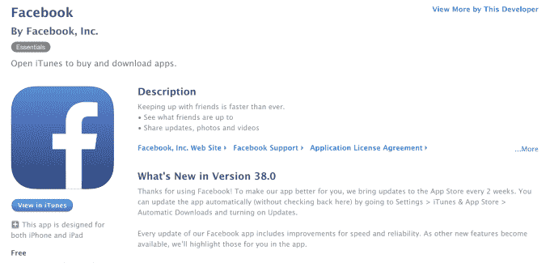

# 应用发行说明越来越愚蠢 TechCrunch

> 原文：<http://techcrunch.com/2015/09/04/app-release-notes-are-getting-stupid/?utm_source=wanqu.co&utm_campaign=Wanqu+Daily&utm_medium=website>

“错误修复”

“塞满了超级神奇的东西的果酱。”

“每隔 3 周，我们都会对 Pinterest 应用进行改进，使其比以往更快更好。”

*“为了让我们的应用程序更好地为您服务，我们每两周对 App Store 进行一次更新……我们脸书应用程序的每次更新都包括速度和可靠性方面的改进。随着其他新功能的推出，我们将在应用中为您重点介绍这些功能。”*

移动应用发行商已经开始反复无常地使用他们的发行说明，这是他们应该向最终用户传达最新应用更新所带来的变化的地方。这种对细节的忽视对用户来说是一种伤害，他们不再有机会了解更新后的应用程序现在会做什么，或者不会做什么。

没有详细信息，用户根本无法做出是否要安装该更新的明智决定。

他们不知道哪些功能发生了变化，也不知道用户体验受到了怎样的影响。他们不知道这些变化是好是坏。例如，用户不会知道一个最喜欢的功能是否正在被删除，或者应用程序是否已经做出了改进，现在可以更好地与某些设备配合使用…可能包括他们的设备。

如今，当有新版本可用时，许多人会自动更新应用。移动操作系统的增强使得用户行为的转变[成为可能，这可能会鼓励开发人员开始节省编写详细的发行说明，因为他们知道这些说明不会像以前那样经常被阅读。另外，他们不必使用这一部分来说明为什么应该安装更新。](http://9to5mac.com/2013/09/20/ios-7-how-to-set-up-automatic-app-updates/)

然而，即使在自动更新的情况下，用户似乎也应该有权知道，至少，更新是否只包括微小的调整或安全改进；应用程序是否在添加或删除功能；更新是否意味着应用程序正在改变其商业模式(如推出广告)；诸如此类。

知道有什么变化，大多数用户还会下载更新吗？*大概是*。但这意味着他们不值得一个解释吗？

## 脸书反对详细发行说明的理由

不披露应用程序更新内容的趋势越来越明显，这可以追溯到脸书去年决定加快更新速度。该公司当时表示，它将开始每月推出新版本，修改后的更新文本暗示用户将不再需要阅读这些发布说明，因为任何新功能都将在应用程序中标记出来。

然而，并不是每个人都同意这个策略。在一片反对声中，[一名脸书工程师甚至在博客上发表评论，解释](https://www.reddit.com/r/iphone/comments/2jcy4r/facebook_replies_to_outrage_over_lack_of_changelog/)脸书为何做出这一举动。

他们指出，许多变化是在引擎盖下的改进和错误修复；很多是琐碎的；而且，当脸书推出新功能时，他们不会一次发布给所有人。换句话说，如果脸书应用程序更新文本说它正在推出*新功能 X* ，当用户在更新后没有在自己的应用程序中看到它时，它实际上可能会让用户感到困惑。

也就是说,“全有或全无”的方法可能不是正确的解决方案。毕竟，在某个时候，这种缓慢推出的功能最终会冲击脸书的整个移动用户群——那时难道不能披露吗？

当然，编写发行说明可能是工程师们面临的最乏味的任务之一。也许它们看起来毫无意义，或者是浪费时间。也许当更新*是*真的只是一个小调整的集合时，详细描述它们会花费太长时间。也许这些调整超出了该应用的非技术用户群的理解。

而是选择完全不写相关的发行说明？你们真可耻，应用程序开发者。

## 许多大公司现在掩饰他们应用程序的更新文本

脸书可能开创了这一趋势，但它并不是最近唯一一家篡改发布说明的公司。

Pinterest 也紧随其后。上面这段关于“超级神奇的东西”的引用来自 Tinder，这可能是最近更令人震惊的例子之一。

此外，比以往任何时候都更常见的是，只需简单地说明:*“错误修复和性能改进”，*，就像雅虎、Hulu、谷歌、Flipboard、LinkedIn、微软和其他几家公司仅在过去一个月中所做的那样。

似乎一旦你成为了一家认证的“大公司”，你就不再需要详细说明哪些 bug 被消灭了。

更重要的是，发行说明中缺乏细节表明了一家公司对其用户群的看法——他们的用户不在乎微小的变化，所以何必呢？正是这种古老的精英主义行为——特别是在信息技术行业中很常见——将技术人员提升到了平民和无足轻重的用户之上。

*动起来！《T1》通过含糊不清的发行说明要求一个现代的[尼克·伯恩斯](http://www.nbc.com/saturday-night-live/video/nick-burns-your-companys-computer-guy/n11524)。*我会帮你更新那个应用，不要关心细节。**

## 作为行为艺术的发行说明

一些开发人员甚至已经开始使用发行说明作为写故事或画画的地方。

有时这很有效，因为它以一种巧妙的方式引起了人们对一个新特性或一系列修复的注意。例如，博客应用 Medium 实际上粘贴在七月发行说明中的[开发人员的松弛对话中。最新版本](http://thenextweb.com/shareables/2015/07/10/you-could-say-they-were-slack-ing-off/)[描述了一个虚构的与奶奶](https://itunes.apple.com/us/app/medium/id828256236?mt=8)的电话交谈，谈论应用程序主页的变化。

但其他时候，这种愚蠢可能会出错——比如 Medium 8 月 4 日发布的版本只包括一张错误的 ASCII 图片，并附有评论“修复”

与此同时，Tumblr 用户称赞 8 月 17 日发行说明中嵌入的幽默小故事[，称之为](http://www.businessinsider.com/tumblr-app-hidden-story-in-release-notes-2015-8)[有史以来最好的](https://uk.news.yahoo.com/tumblr-just-released-best-app-101356864.html#XpVf0vb)。虽然这个故事让人想起 Tumblr 网站上充斥的一些糟糕的同人小说，读起来很有趣，但发行说明忘了包括一个脚注，说明在 4.3.1 版本中*实际上改变了*什么。

## 平衡有趣和有用的信息

这并不是说任何拿发行说明“开心”的人都应该受到谴责。

例如，观星应用程序 [Pocket Universe](https://itunes.apple.com/us/app/pocket-universe-virtual-sky/id306916838?mt=8) 的开发者也经常在更新文本中包含一个小故事。但除了这个故事，他还列出了变化的信息要点，比如*、*或*、*等。

与此同时，团队沟通应用 [Slack](https://itunes.apple.com/us/app/slack-team-communication/id618783545?mt=8) 已经掌握了娱乐和为用户提供所需信息之间的平衡——这并不奇怪，因为该应用本身将使用消费者应用的乐趣与企业人群的需求融合得如此之好。

在 Slack 的发行说明中，每一行都用一点幽默来解释，例如

已修复:试图在反应仍在加载的情况下添加反应，对应用程序来说是一系列太激动人心的事件，会导致程序崩溃。现在平静多了。

修正:现在“切换团队”按钮将总是在 flexpane 的底部，而不是偶尔，令人困惑，令人恼火地与“邀请”按钮交换位置。对那个很抱歉。”

归根结底，如果开发人员想从发行说明中获得乐趣，那是他们自己的事。但无论如何，他们仍然应该感到有责任向客户传达终端用户的设备上安装了什么。

毕竟，如今手机和平板电脑通常是用户的主要电脑，也是人们拥有的最个人化的技术。用户可能仍然会被要求安装你的应用，但每个人都有权知道软件更新包括什么。