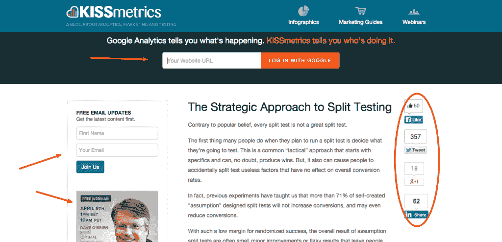
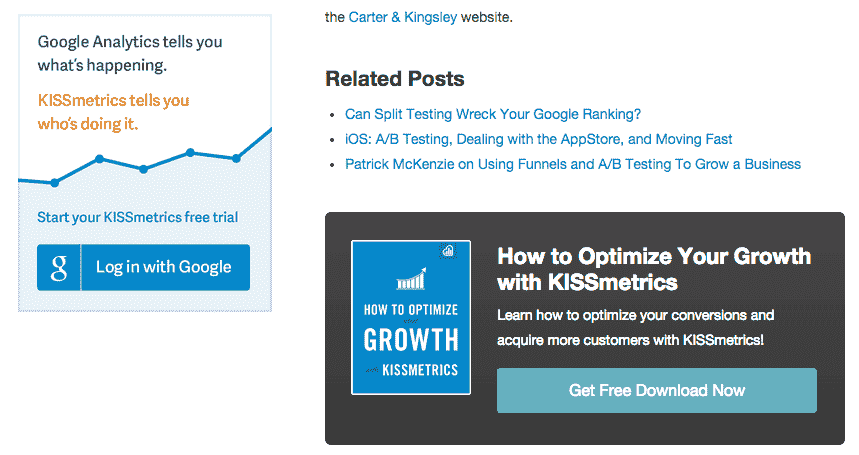
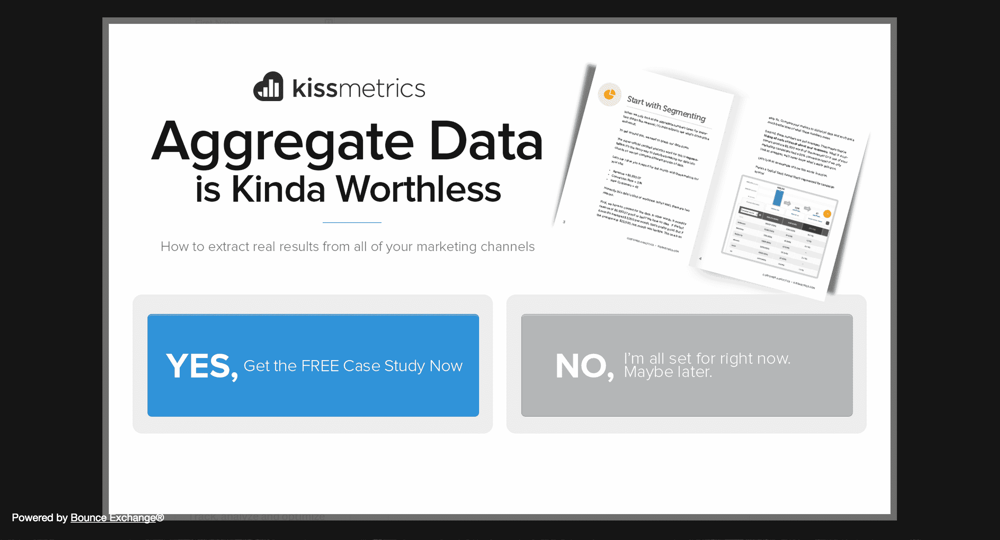
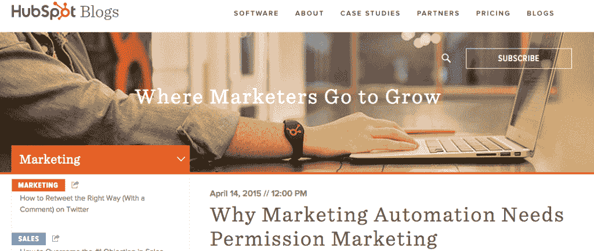
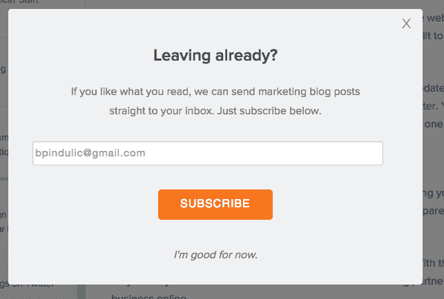
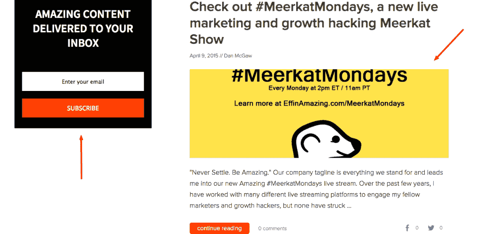
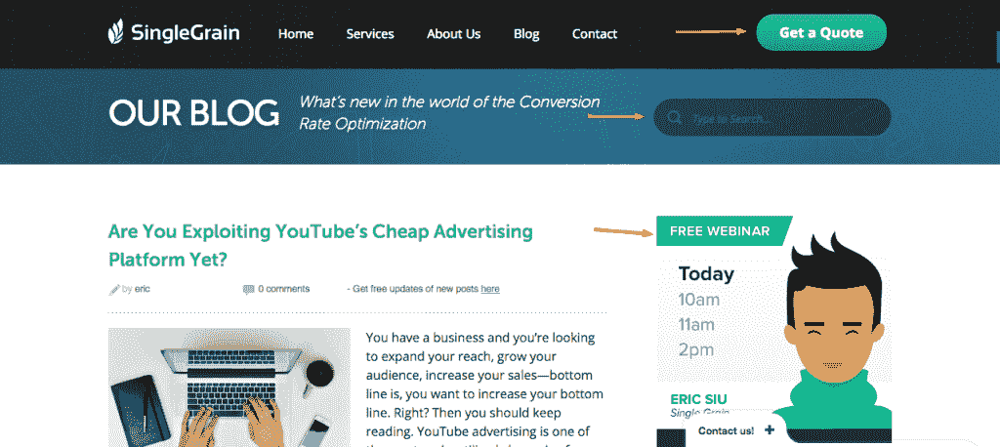
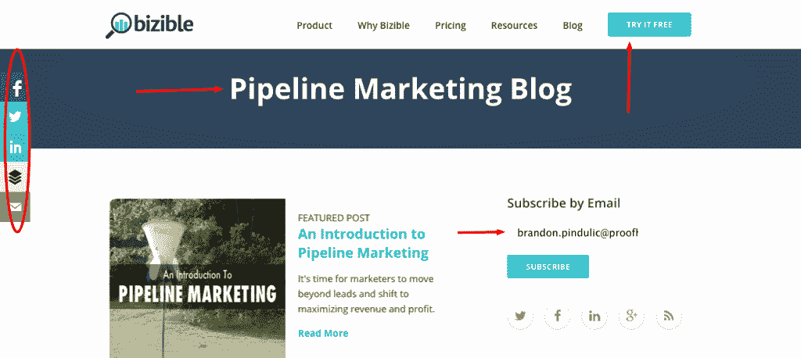
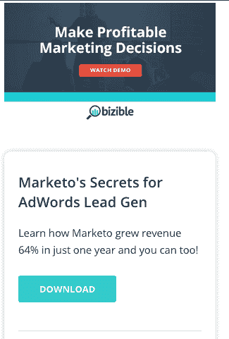

# 高转化率博客的组成部分[一致性是关键]

> 原文：<http://effinamazing.com/blog/the-anatomy-of-a-high-converting-blogs/?utm_source=wanqu.co&utm_campaign=Wanqu+Daily&utm_medium=website>

如果你在过去几年里读过任何关于数字营销的东西，你就会知道内容才是王道。每个人都在鼓噪一个构思良好的博客的积极作用，以及它如何推动你的业务增长或建立你的个人品牌。真正的问题是，是什么将高转化率的博客与那些创造了大量内容但转化率不高的博客区分开来？

我们在营销技术(MarTech)和数字营销领域解构了一些最成功的博客。我们非常关注博客，我们已经提出了一些主要的策略和技术，领先的博客正在成功地执行。

**kiss metrics——具有高度分析性博客的分析软件**

除了是一家领先的营销分析软件公司， [KISSmetrics](https://www.kissmetrics.com/) 还在互联网上建立了一个卓越的营销博客。它以数据驱动的方法为基础，专注于通过定量洞察揭示洞察。

[T2】](https://mcgaw.io/wp-content/uploads/2015/05/KM-Blog-example.png)

正如你在上面看到的，这里有很多东西需要分解。除了 KISS 已经确定的基本要素(大多数公司都没有)，他们的 UX 是一流的，结合了干净、易读的设计和适当的行动呼吁(CTA)。

更进一步，他们战略性地放置每个 CTA。Google Analytics 告诉你正在发生什么。KISSmetrics 告诉你谁在做”是向访问者解释 Google Analytics 和 KISSmetrics 之间区别的最简洁的方式。这里需要注意的重要一点是，KISSmetrics 正在利用他们的博客将访问者转化为产品的潜在客户。如果你从来没有打算让你的访问者成为领导者，为什么要花那么多时间去创造内容和吸引观众呢？事实是，大多数公司从未在博客上发出行动号召。

许多博客访问者不准备转化为付费用户，甚至不准备马上试用你的产品。你需要有几个服务于一个目的的 CTA:**建立你的邮件列表**。电子邮件列表仍然是与你的受众建立关系的最强大、最可扩展的方式。KISSmetrics 知道这一点，因此在他们博客的左侧*有他们的电子邮件 CTA 框。*

为什么这很重要？我们被训练从左向右阅读，这就是为什么他们把邮箱放在博客标题的左边。这样做可以很容易地扩大你的电子邮件列表，并帮助他们转化为付费客户。KISSmetrics 在他们的网上研讨会注册中也采用了这种策略，这有助于推动电子邮件和增加参与度。

为了最大限度地利用上述 CTA，KISSMetrics 知道他们需要增加网站的流量，而社交媒体是实现这一目标的核心支柱之一。

在内容旁边有一个社交分享栏可以让访问者看到文章被分享了多少次。它增加了许多社交证明，可以带来更多的份额和流量。当我们看到别人做某事时，我们也会做得更舒服。在某种程度上，我们都是社会动物和从众者。

然而，KISSmetrics 并没有就此止步。如果一个读者阅读了整篇文章，然后滚动到底部，那么你可以假设他们是一个积极的读者。并且他们喜欢该内容，并且现在或在不久的将来想要阅读更多类似的内容。KM 设置了几个东西来利用这一点，例如:

*   一个阅读更多的功能，超链接到类似的文章，以增加参与度
*   一个驱使访问者通过登录谷歌来测试 KISSmetrics 的 CTA
*   一段可下载的内容，与文章相似，并深入某一特定主题。在这种情况下，它是“如何利用 KISSMetrics 优化您的增长”

[T2】](https://mcgaw.io/wp-content/uploads/2015/05/Screen-Shot-2015-04-08-at-5.15.53-PM.png)

kiss metrics 现在完成了吗？

没有。

当你在 KISSMetrics 上决定离开网站时，他们会利用来自 [Bounce Exchange](http://www.bounceexchange.com/) 的优秀退出意图弹出窗口。这个工具使他们能够捕捉正在离开网站的访问者。

[T2】](https://www.evernote.com/l/ANZBym9YlHJIuo5AcyyijLJMEHQ4eLyVPtIB/image.png)

这种策略的价值令人难以置信:这是一种展示你的信息(以一种不令人讨厌的方式)并要求采取行动的方式。例如，下载白皮书或安排产品演示。

根据你的要求、设计或访问者，你可以获得大量的选择加入，而不是失去转换。我们强烈建议实现一个制作精良的退出意图弹出窗口，为您的访问者提供内容或特殊优惠，以换取电子邮件地址。

**HubSpot——集客营销的领导者**

[T2】](https://mcgaw.io/wp-content/uploads/2015/05/Screen-Shot-2015-04-16-at-10.54.39-AM.png)

HubSpot 是一个知名的营销自动化平台，被成千上万的营销人员使用。他们以优秀的产品和教育营销内容而闻名。他们在此基础上建立了自己的营销引擎。

HubSpot 创造了“集客营销”这个术语，他们从一开始就一直在实践他们所宣扬的东西。

HubSpot 在他们的博客上做了很多正确的事情，虽然他们在过去几年里改变了他们的布局几次，但他们总是为[转换](https://mcgaw.io/resources/how-to-get-started-with-conversion-rate-optimization/)优化他们的伟大内容。

从上到下开始，他们的英雄文本“营销人员在哪里学习成长”是恰当的，也是包容的。他们博客的这一部分专注于创建营销内容，他们的英雄文本确保所有希望成为更好的营销人员的访问者知道他们在正确的地方。

一旦他们吸引了读者，他们就有一个简单的“订阅”CTA 来推动电子邮件订阅。他们利用了一个伟大的形象，增加了内容的可读性*和*可分享性。

此外，他们为读者提供了从销售到代理内容的更多选择。这种深度有助于吸引读者。

像 KISSMetrics 一样，HubSpot 的博客也有一些关键的品质，比如:

*   博客边上的社交分享栏
*   文章底部的一段可下载内容
*   一个退出意向弹出窗口，推动电子邮件订阅

[T2】](https://mcgaw.io/wp-content/uploads/2015/05/Screen-Shot-2015-04-08-at-6.20.20-PM.png)

这些品质使得 HubSpot 能够推动转化率、份额和流量，并建立他们的电子邮件列表。他们增加了与访问者的接触和关系。

**mcgaw . io——全新的博客也可以令人惊叹**

这是一个有点元，但由于我们正在把一个博客从零到分析和增长黑客空间的利基领导者，我们想指出我们正在做的一些事情来建立我们的博客转换。我们的团队是几家高增长公司的重要组成部分，我们在博客上也采取了同样的方法。

由于我们是从零开始，我们决定首先关注基础，投资优质内容，从第一天开始建立我们的电子邮件列表，并创建富有美感的页面布局。

[T2】](https://mcgaw.io/wp-content/uploads/2015/05/EffinAmazing-Blog.png)

通过这样做，我们正在建立我们的博客作为一个权威的资源。随着我们继续发布优秀的内容，我们的覆盖范围将呈指数增长，我们可以设置更多的转换测试来进一步优化我们的博客。这一过程将使我们能够决定哪些领域最需要关注，以及我们的内容漏斗中的“漏洞”在哪里。

这也将允许我们向客户证明，我们可以从零开始建立一个观众群，创造惊人的内容，并表明我们正在实践我们所宣扬的。所有这些都是通过在 McGaw 做出数据驱动的决策来实现的。

顺便说一句，我们正在试验的活动之一是“猫鼬星期一”。作为营销人员，我们知道抓住趋势，生产出比别人更好、更吸引人的东西是游戏的名字。我们认为 Meerkat 是一个巨大的机会，这是一个新兴的 Twitter 直播应用程序。

你可以[在这里](https://mcgaw.io/blog/check-out-meerkatmondays-a-new-live-marketing-and-growth-hacking-meerkat-show/)了解更多，但是 TL；DR 版本很简单:美国东部时间每周一下午 2 点，我们将对各种主题的讨论进行直播。它们包括分析、营销、增长黑客、转化率优化、AB 测试等等。

**single grain——一家言行一致的数字营销机构**

SingleGrain (SG)是一家专注于内容营销和数字广告的数字营销机构。因为他们主要是一个内容商店，他们的博客是他们服务的一个巨大卖点，所以他们不断地生产惊人的内容并优化他们的博客帖子以进行转化是至关重要的。

[T2】](https://mcgaw.io/wp-content/uploads/2015/05/SingleGrain-blog.png)

正如你在上面看到的，SG 有两个主要的转化点:获取报价，旨在转化寻求数字营销服务的访客。一个免费的网上研讨会，这是建立他们的电子邮件列表的一种方式，但也允许他们与他们的访问者建立更深层次的参与和背景。这允许单一谷物培育潜在客户并创造福音传播者。

因为不是每个博客访问者都有相同的意图，或者都在你的漏斗的相同部分，所以你提供选项并战略性地这样做是很重要的。

除了 SG 确定的转换点，他们还有一个核心重点是 [UX 和为他们的读者设计](https://www.hotjar.com/ux-design/)，无论是在设计还是内容方面。

他们的搜索功能是大多数博客所忽略的——或者以一种不太有利的方式整合。事实上，允许你的读者搜索你的内容数据库是一个非常强大的工具。

SingleGrain 为读者提供了大量高质量、有深度的指南。对于正在寻找某个特定主题的更多信息的访问者来说，他们只需要一封电子邮件就可以获得他们需要的内容。

此外，SG 提供的所有指南也恰好围绕他们提供的服务，因此他们战略性地在每个指南中放置 CTA，首先告知读者，然后将读者转化为客户。

**Bizible——建立管道营销战略**

Bizible 允许营销人员通过跟踪客户和收入做出有利可图的营销和广告决策，而不仅仅是引导和获取成本。后者往往不能说明全部情况。

他们的理想客户是购买周期长、数据驱动型营销人员。他们创建注重分析的内容，不仅关注营销的收购方面，还关注潜在客户的培养和管道中的潜在客户，因此有了他们的管道营销博客。
[T3】](https://mcgaw.io/wp-content/uploads/2015/05/Bizible-blog.png)

考虑到 Bizible 是一家专注于转化的企业，他们相应地设计了他们的博客，并战略性地放置了“订阅”和“免费试用”CTA。这些元素充当他们的观众和管道建设者。

此外，他们更进一步，借鉴了 HubSpot 的剧本。Bizible 创造了术语*管道营销*并在他们的博客上彻底解释了它，就像 HubSpot 创造并推广了术语*集客营销*。

[T2】](https://mcgaw.io/wp-content/uploads/2015/05/Screen-Shot-2015-04-10-at-6.30.18-PM.png)

他们提供内容和演示 CTA，服务于不同但相同的目的:受众增长和销售机会。

Bizible 专注于针对数据驱动的 B2B 营销人员的设计良好、内容丰富的博客，这为他们提供了非常好的服务。这使他们能够将自己定位为行业中的思想领袖，并为他们的销售团队带来有知识的销售线索。

**外卖**

在分析了数字营销和 SaaS 公司拥有的几个成功的营销博客后，很清楚他们是如何推动业务增长的。

他们提供相关的教育内容。就设计、内容和 CTA 而言，他们超越了大多数博客，而且他们始终如一地这样做。

拥有一个优化的博客对那些投资于其内容的企业来说是一个巨大的优势，他们知道有机线索比广告产生的线索转化得更好，更便宜，并且保持得更久。

还有哪些博客优化得很好？这些博客还做了什么来建立和转化他们的读者？

如果你想把你的博客变成一个潜在客户和销售机器，[让我们知道](https://mcgaw.io/contact/)，我们会看看我们是否能发展你的业务。